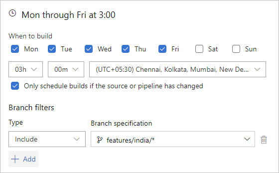
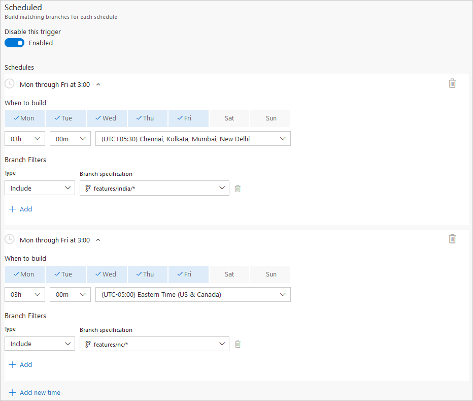
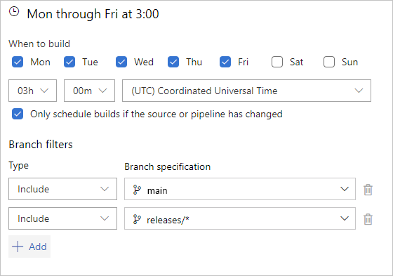
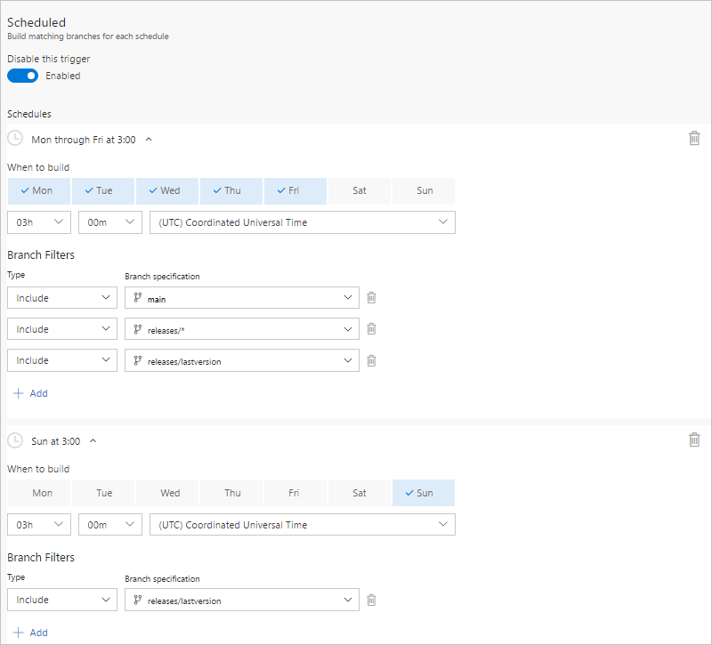
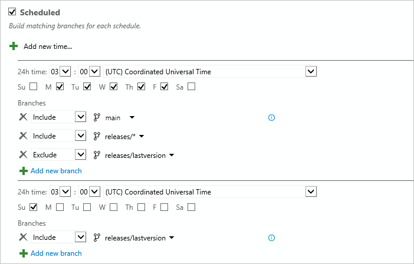
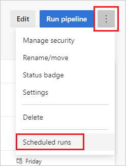
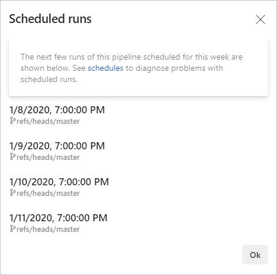

# Configure schedules for pipelines

::: moniker range="<= tfs-2018"
[!INCLUDE [temp](../includes/concept-rename-note.md)]
::: moniker-end

Azure Pipelines provides several types of triggers to configure how your pipeline starts.

* Scheduled triggers start your pipeline based on a schedule, such as a nightly build. This article provides guidance on using scheduled triggers to run your pipelines based on a schedule.
* Event-based triggers start your pipeline in response to events, such as creating a pull request or pushing to a branch. For information on using event-based triggers, see [Triggers in Azure Pipelines](../build/triggers.md).

You can combine scheduled and event-based triggers in your pipelines, for example to validate the build every time a push is made ([CI trigger](../build/triggers.md#ci-triggers)), when a pull request is made ([PR trigger](../build/triggers.md#pr-triggers)), and a nightly build (Scheduled trigger). If you want to build your pipeline only on a schedule, and not in response to event-based triggers, ensure that your pipeline does not have any other triggers enabled. For example, YAML pipelines in a GitHub repository have CI triggers and PR triggers enabled by default. For information on disabling default triggers, see [Triggers in Azure Pipelines](../build/triggers.md) and navigate to the section that covers your repository type.

## Scheduled triggers

#### [YAML](#tab/yaml/)

::: moniker range=">azure-devops-2019"

> [!IMPORTANT]
> Scheduled triggers defined using the pipeline settings UI take precedence over YAML scheduled triggers.
> 
> If your YAML pipeline has both YAML scheduled triggers and UI defined scheduled triggers, 
> only the UI defined scheduled triggers are run. 
> To run the YAML defined scheduled triggers in your YAML pipeline,
> you must remove the scheduled triggers defined in the pipeline settings UI.
> Once all UI scheduled triggers are removed, a push must be made in order for the YAML 
> scheduled triggers to start being evaluated.
>
> To delete UI scheduled triggers from a YAML pipeline, see [UI settings override YAML scheduled triggers](../troubleshooting/troubleshooting.md#ui-settings-override-yaml-scheduled-triggers).

Scheduled triggers configure a pipeline to run on a schedule defined using [cron syntax](#cron-syntax).

```yaml
schedules:
- cron: string # cron syntax defining a schedule
  displayName: string # friendly name given to a specific schedule
  branches:
    include: [ string ] # which branches the schedule applies to
    exclude: [ string ] # which branches to exclude from the schedule
  always: boolean # whether to always run the pipeline or only if there have been source code changes since the last successful scheduled run. The default is false.
```

Scheduled pipelines in YAML have the following constraints.

- The time zone for cron schedules is UTC.
- If you specify an `exclude` clause without an `include` clause for `branches`, it is equivalent to specifying `*` in the `include` clause.
- You cannot use pipeline variables when specifying schedules.
- If you use [templates in your YAML file](templates.md), then the schedules must be specified in the main YAML file and not in the template files.

### Branch considerations for scheduled triggers

Scheduled triggers are evaluated for a branch when the following events occur.

* A pipeline is created.
* A pipeline's YAML file is updated, either from a push, or by editing it in the pipeline editor.
* A pipeline's YAML file path is [updated to reference a different YAML file](../customize-pipeline.md#other-settings). This change only updates the default branch, and therefore only picks up schedules in the updated YAML file for the default branch. If any other branches subsequently merge the default branch, for example `git pull origin main`, the scheduled triggers from the newly referenced YAML file are evaluated for that branch.
* A new branch is created. 

After one of these events occurs in a branch, any scheduled runs for that branch are added, if that branch matches the branch filters for the scheduled triggers contained in the YAML file in that branch.

> [!IMPORTANT]
> Scheduled runs for a branch are added only if the branch matches the branch filters for the 
> scheduled triggers in the YAML file **in that particular branch**.

For example, a pipeline is created with the following schedule, and this version of the YAML file is checked into the `main` branch. This schedule builds the `main` branch on a daily basis.

```yaml
# YAML file in the main branch
schedules:
- cron: "0 0 * * *"
  displayName: Daily midnight build
  branches:
    include:
    - main
```

Next, a new branch is created based off of `main`, named `new-feature`. The scheduled triggers from the YAML file in the new branch are read, and since there is no match for the `new-feature` branch, no changes are made to the scheduled builds, and the `new-feature` branch is not built using a scheduled trigger.

If `new-feature` is added to the `branches` list and this change is pushed to the `new-feature` branch, the YAML file is read, and since `new-feature` is now in the branches list, a scheduled build is added for the `new-feature` branch.

```yaml
# YAML file in the new-feature-branch
schedules:
- cron: "0 0 * * *"
  displayName: Daily midnight build
  branches:
    include:
    - main
    - new-feature
```

Now consider that a branch named `release` is created based off `main`, and then `release` is added to the branch filters in the YAML file in the `main` branch, but not in the newly created `release` branch.

```yaml
# YAML file in the release branch
schedules:
- cron: "0 0 * * *"
  displayName: Daily midnight build
  branches:
    include:
    - main

# YAML file in the main branch with release added to the branches list
schedules:
- cron: "0 0 * * *"
  displayName: Daily midnight build
  branches:
    include:
    - main
    - release
```

Because `release` was added to the branch filters in the `main` branch, but **not** to the branch filters in the `release` branch, the `release` branch won't be built on that schedule. Only when the `feature` branch is added to the branch filters in the YAML file **in the feature branch** will the scheduled build be added to the scheduler.

::: moniker-end

::: moniker range="azure-devops-2019"

Scheduled builds are not supported in YAML syntax in Azure DevOps Server 2019.
After you create your YAML build pipeline, you can use pipeline settings to specify a scheduled trigger.

::: moniker-end

::: moniker range="< azure-devops-2019"

YAML pipelines are not available on TFS.

::: moniker-end

#### [Classic](#tab/classic/)

Select the days and times when you want to run the build using the classic editor.

If your repository is Azure Repos Git, GitHub, or Other Git, then you can also specify branches to include and exclude. If you want to use wildcard characters, then type the branch specification (for example, `features/modules/*`) and then press Enter.


::: moniker range=">= azure-devops-2019"



::: moniker-end

::: moniker range=">= tfs-2017 <= tfs-2018"



::: moniker-end

::: moniker range="<= tfs-2017"


::: moniker-end

* * *

## Examples

#### [YAML](#tab/yaml/)

::: moniker range=">azure-devops-2019"

The following example defines two schedules: 

```yaml
schedules:
- cron: "0 0 * * *"
  displayName: Daily midnight build
  branches:
    include:
    - main
    - releases/*
    exclude:
    - releases/ancient/*
- cron: "0 12 * * 0"
  displayName: Weekly Sunday build
  branches:
    include:
    - releases/*
  always: true
```

The first schedule, **Daily midnight build**, runs a pipeline at midnight every day, but only if the code has changed since the last successful scheduled run, for `main` and all `releases/*` branches, except those under `releases/ancient/*`.

The second schedule, **Weekly Sunday build**, runs a pipeline at noon on Sundays, whether the code has changed or not since the last run, for all `releases/*` branches.

> [!NOTE]
> The time zone for cron schedules is UTC, so in these examples, the midnight build and the noon build are at midnight and noon in UTC.

For more examples, see [Migrating from the classic editor](#migrating-from-the-classic-editor).

::: moniker-end

::: moniker range="azure-devops-2019"

Scheduled builds are not supported in YAML syntax in Azure DevOps Server 2019.
After you create your YAML build pipeline, you can use pipeline settings to specify a scheduled trigger.

::: moniker-end

::: moniker range="< azure-devops-2019"

YAML pipelines are not available on TFS.

::: moniker-end

#### [Classic](#tab/classic/)

#### Example: Nightly build of Git repo in multiple time zones

::: moniker range=">= azure-devops-2019"

In this example, the classic editor scheduled trigger has two entries, producing the following builds.

* Every Monday - Friday at 3:00 AM (UTC + 5:30 time zone), build branches that meet the `features/india/*` branch filter criteria

    

* Every Monday - Friday at 3:00 AM (UTC - 5:00 time zone), build branches that meet the `features/nc/*` branch filter criteria

    

::: moniker-end

::: moniker range=">= tfs-2017 <= tfs-2018"


::: moniker-end

::: moniker range="<= tfs-2017"


::: moniker-end

#### Example: Nightly build with different frequencies

::: moniker range=">=azure-devops-2019"

**Azure Pipelines and Azure DevOps 2019 Server**

In this example, the classic editor scheduled trigger has two entries, producing the following builds.

* Every Monday - Friday at 3:00 AM UTC, build branches that meet the `main` and `releases/*` branch filter criteria

    

* Every Sunday at 3:00 AM UTC, build the `releases/lastversion` branch, even if the source or pipeline hasn't changed

    

::: moniker-end

::: moniker range=">= tfs-2017 <= tfs-2018"

**TFS 2017.3 through TFS 2018**



::: moniker-end

::: moniker range="<= tfs-2017"

**TFS 2017.1 and older versions**



::: moniker-end

* * *

## Cron syntax

#### [YAML](#tab/yaml/)

::: moniker range=">azure-devops-2019"

Each Azure Pipelines scheduled trigger cron expression is a space-delimited expression with five entries in the following order.

```
mm HH DD MM DW
 \  \  \  \  \__ Days of week
  \  \  \  \____ Months
   \  \  \______ Days
    \  \________ Hours
     \__________ Minutes
```

Field        | Accepted values
-------------|----------------
Minutes      | 0 through 59
Hours        | 0 through 23
Days         | 1 through 31
Months       | 1 through 12, full English names, first three letters of English names
Days of week | 0 through 6 (starting with Sunday), full English names, first three letters of English names

Values can be in the following formats.

Format          | Example          | Description
----------------|------------------|------------
Wildcard        | `*`              | Matches all values for this field
Single value    | `5`              | Specifies a single value for this field
Comma delimited | `3,5,6`          | Specifies multiple values for this field. Multiple formats can be combined, like `1,3-6`
Ranges          | `1-3`            | The inclusive range of values for this field
Intervals       | `*/4` or `1-5/2` | Intervals to match for this field, such as every 4th value or the range 1-5 with a step interval of 2

Example | Cron expression
--------|----------------
Build every Monday, Wednesday, and Friday at 6:00 PM | `0 18 * * Mon,Wed,Fri`, `0 18 * * 1,3,5`, or `0 18 * * 1-5/2`
Build every 6 hours | `0 0,6,12,18 * * *`, `0 */6 * * *` or `0 0-18/6 * * *`
Build every 6 hours starting at 9:00 AM | `0 9,15,21 * * *` or `0 9-21/6 * * *`

For more information on supported formats, see [Crontab Expression](https://github.com/atifaziz/NCrontab/wiki/Crontab-Expression).


::: moniker-end

::: moniker range="azure-devops-2019"

Scheduled builds are not supported in YAML syntax in Azure DevOps Server 2019.
After you create your YAML build pipeline, you can use pipeline settings to specify a scheduled trigger.

::: moniker-end

::: moniker range="< azure-devops-2019"

YAML pipelines are not available on TFS.

::: moniker-end

#### [Classic](#tab/classic/)

Classic schedules are defined using a graphical editor instead of cron syntax. For information on defining classic schedules, see [Examples](#examples).

* * *

## Scheduled runs view

#### [YAML](#tab/yaml/)

::: moniker range=">azure-devops-2019"

You can view a preview of upcoming scheduled builds by choosing **Scheduled runs** from the context menu on the [pipeline details page](../get-started/multi-stage-pipelines-experience.md#view-pipeline-details) for your pipeline. 



After you create or update your scheduled triggers, you can verify them using this view.



This example displays the scheduled runs for the following schedule.

```yaml
schedules:
- cron: "0 0 * * *"
  displayName: Daily midnight build
  branches:
    include:
    - main
```

The **Scheduled runs** windows displays the times converted to the local time zone set on the computer used to browse to the Azure DevOps portal. This example displays a screenshot taken in the EST time zone.

::: moniker-end

::: moniker range="azure-devops-2019"

Scheduled builds are not supported in YAML syntax in Azure DevOps Server 2019.
After you create your YAML build pipeline, you can use pipeline settings to specify a scheduled trigger.

::: moniker-end

::: moniker range="< azure-devops-2019"

YAML pipelines are not available on TFS.

::: moniker-end

#### [Classic](#tab/classic/)

Classic scheduled pipelines don't have a **Scheduled runs** view, but you can can view the schedule for a pipeline in the classic schedule editor for your pipeline.

::: moniker range=">= azure-devops-2019"


::: moniker-end

::: moniker range=">= tfs-2017 <= tfs-2018"


::: moniker-end

::: moniker range="<= tfs-2017"


::: moniker-end

* * *

<a name="always"></a>
## Running even when there are no code changes

::: moniker range="<=tfs-2018"

> [!NOTE] 
> Scheduled builds always run on schedule regardless of code changes on TFS 2018.1 and lower.

::: moniker-end

::: moniker range=">=tfs-2018"

By default, your pipeline does not run as scheduled if there have been no code changes since the last successful scheduled run. For instance, consider that you have scheduled a pipeline to run every night at 9:00pm. During the weekdays, you push various changes to your code. The pipeline runs as per schedule. During the weekends, you do not make any changes to your code. If there have been no code changes since the scheduled run on Friday, then the pipeline does not run as scheduled during the weekend. 

::: moniker-end

#### [YAML](#tab/yaml/)

::: moniker range=">azure-devops-2019"

To force a pipeline to run even when there are no code changes, you can use the `always` keyword.

```yaml
schedules:
- cron: ...
  ...
  always: true
```

::: moniker-end

::: moniker range="azure-devops-2019"

Scheduled builds are not supported in YAML syntax in this version of Azure DevOps Server.
After you create your YAML build pipeline, you can use pipeline settings to specify a scheduled trigger.

::: moniker-end

::: moniker range="< azure-devops-2019"

YAML pipelines are not available on TFS.

::: moniker-end

#### [Classic](#tab/classic/)

::: moniker range="<=tfs-2018"

> [!NOTE] 
> Scheduled builds always run on schedule regardless of code changes on TFS 2018.1 and lower.

::: moniker-end

::: moniker range="tfs-2018"

> [!NOTE]
> The [Skip scheduled builds if nothing has changed in the repo](/azure/devops/release-notes/2017/dec-11-vsts#skip-scheduled-builds-if-nothing-has-changed-in-the-repo) support described in this section is supported in TFS 2018.2 and higher.

::: moniker-end

::: moniker range=">=tfs-2018"

To configure the scheduled pipeline to build only if there has been a change since the last build, check **Only schedule builds if the source or pipeline has changed**.


::: moniker-end

* * *

<a name="limits"></a>
## Limits on the number of scheduled runs

There are certain limits on how often you can schedule a pipeline to run. These limits have been put in place to prevent misuse of Azure Pipelines resources - particularly the Microsoft-hosted agents. This limit is around 1000 runs per pipeline per week.

::: moniker range=">azure-devops-2019"
## Migrating from the classic editor

The following examples show you how to migrate your schedules from the classic editor to YAML.

* [Example: Nightly build of Git repo in multiple time zones](#example-nightly-build-of-git-repo-in-multiple-time-zones)
* [Example: Nightly build with different frequencies](#example-nightly-build-with-different-frequencies)

### Example: Nightly build of Git repo in multiple time zones

In this example, the classic editor scheduled trigger has two entries, producing the following builds.

* Every Monday - Friday at 3:00 AM (UTC + 5:30 time zone), build branches that meet the `features/india/*` branch filter criteria

    

* Every Monday - Friday at 3:00 AM (UTC - 5:00 time zone), build branches that meet the `features/nc/*` branch filter criteria

    

The equivalent YAML scheduled trigger is:

```yaml
schedules:
- cron: "30 21 * * Sun-Thu"
  displayName: M-F 3:00 AM (UTC + 5:30) India daily build
  branches:
    include:
    - /features/india/*
- cron: "0 8 * * Mon-Fri"
  displayName: M-F 3:00 AM (UTC - 5) NC daily build
  branches:
    include:
    - /features/nc/*
```

In the first schedule, **M-F 3:00 AM (UTC + 5:30) India daily build**, the cron syntax (`mm HH DD MM DW`) is `30 21 * * Sun-Thu`.

* Minutes and Hours - `30 21` - This maps to `21:30 UTC` (`9:30 PM UTC`). Since the specified time zone in the classic editor is **UTC + 5:30**, we need to subtract 5 hours and 30 minutes from the desired build time of 3:00 AM to arrive at the desired UTC time to specify for the YAML trigger.
* Days and Months are specified as wildcards since this schedule doesn't specify to run only on certain days of the month or on a specific month. 
* Days of the week - `Sun-Thu` - because of the timezone conversion, for our builds to run at 3:00 AM in the UTC + 5:30 India time zone, we need to specify starting them the previous day in UTC time. We could also specify the days of the week as `0-4` or `0,1,2,3,4`.

In the second schedule, **M-F 3:00 AM (UTC - 5) NC daily build**, the cron syntax is `0 8 * * Mon-Fri`.

* Minutes and Hours - `0 8` - This maps to `8:00 AM UTC`. Since the specified time zone in the classic editor is **UTC - 5:00**, we need to add 5 hours from the desired build time of 3:00 AM to arrive at the desired UTC time to specify for the YAML trigger.
* Days and Months are specified as wildcards since this schedule doesn't specify to run only on certain days of the month or on a specific month. 
* Days of the week - `Mon-Fri` - Because our timezone conversions don't span multiple days of the week for our desired schedule, we don't need to do any conversion here. We could also specify the days of the week as `1-5` or `1,2,3,4,5`.

> [!IMPORTANT]
> The UTC time zones in YAML scheduled triggers don't account for daylight savings time.

> [!TIP]
> When using 3 letter days of the week and wanting a span of multiple days through Sun, Sun should be considered the first day of the week e.g. For a schedule of midnight EST, Thursday to Sunday, the cron syntax is `0 5 * * Sun,Thu-Sat`

### Example: Nightly build with different frequencies

In this example, the classic editor scheduled trigger has two entries, producing the following builds.

* Every Monday - Friday at 3:00 AM UTC, build branches that meet the `main` and `releases/*` branch filter criteria

    

* Every Sunday at 3:00 AM UTC, build the `releases/lastversion` branch, even if the source or pipeline hasn't changed

    

The equivalent YAML scheduled trigger is:

```yaml
schedules:
- cron: "0 3 * * Mon-Fri"
  displayName: M-F 3:00 AM (UTC) daily build
  branches:
    include:
    - main
    - /releases/*
- cron: "0 3 * * Sun"
  displayName: Sunday 3:00 AM (UTC) weekly latest version build
  branches:
    include:
    - /releases/lastversion
  always: true
```

In the first schedule, **M-F 3:00 AM (UTC) daily build**, the cron syntax is `0 3 * * Mon-Fri`.

* Minutes and Hours - `0 3` - This maps to `3:00 AM UTC`. Since the specified time zone in the classic editor is **UTC**, we don't need to do any time zone conversions.
* Days and Months are specified as wildcards since this schedule doesn't specify to run only on certain days of the month or on a specific month. 
* Days of the week - `Mon-Fri` - because there is no timezone conversion, the days of the week map directly from the classic editor schedule. We could also specify the days of the week as `1,2,3,4,5`.

In the second schedule, **Sunday 3:00 AM (UTC) weekly latest version build**, the cron syntax is `0 3 * * Sun`.

* Minutes and Hours - `0 3` - This maps to `3:00 AM UTC`. Since the specified time zone in the classic editor is **UTC**, we don't need to do any time zone conversions.
* Days and Months are specified as wildcards since this schedule doesn't specify to run only on certain days of the month or on a specific month. 
* Days of the week - `Sun` - Because our timezone conversions don't span multiple days of the week for our desired schedule, we don't need to do any conversion here. We could also specify the days of the week as `0`.
* We also specify `always: true` since this build is scheduled to run whether or not the source code has been updated.

::: moniker-end

::: moniker range=">=azure-devops-2020"

## FAQ

* [I defined a schedule in the YAML file. But it didn't run. What happened?](#i-defined-a-schedule-in-the-yaml-file-but-it-didnt-run-what-happened)
* [My YAML schedules were working fine. But, they stopped working now. How do I debug this?](#my-yaml-schedules-were-working-fine-but-they-stopped-working-now-how-do-i-debug-this)
* [My code hasn't changed, yet a scheduled build is triggered. Why?](#my-code-hasnt-changed-yet-a-scheduled-build-is-triggered-why)
* [I see the planned run in the Scheduled runs panel. However, it does not run at that time. Why?](#i-see-the-planned-run-in-the-scheduled-runs-panel-however-it-does-not-run-at-that-time-why)
* [Schedules defined in YAML pipeline work for one branch but not the other. How do I fix this?](#schedules-defined-in-yaml-pipeline-work-for-one-branch-but-not-the-other-how-do-i-fix-this)

### I defined a schedule in the YAML file. But it didn't run. What happened?

* Check the next few runs that Azure Pipelines has scheduled for your pipeline. You can find these by selecting the **Scheduled runs** action in your pipeline. The list is filtered down to only show you the upcoming few runs over the next few days. If this does not meet your expectation, it is probably the case that you have mistyped your cron schedule, or you do not have the schedule defined in the correct branch. Read the topic above to understand how to configure schedules. Reevaluate your cron syntax. All the times for cron schedules are in UTC.

* Make a small trivial change to your YAML file and push that update into your repository. If there was any problem in reading the schedules from the YAML file earlier, it should be fixed now.

* If you have any schedules defined in the UI, then your YAML schedules are not honored. Ensure that you do not have any UI schedules by navigating to the editor for your pipeline and then selecting **Triggers**.

* There is a limit on the number of runs you can schedule for a pipeline. Read more about [limits](#limits).

* If there are no changes to your code, they Azure Pipelines may not start new runs. Learn how to [override](#always) this behavior.

### My YAML schedules were working fine. But, they stopped working now. How do I debug this?

* If you did not specify `always:true`, your pipeline won't be scheduled unless there are any updates made to your code. Check whether there have been any code changes and how you [configured the schedules](#always).

* There is a [limit](#limits) on how many times you can schedule your pipeline. Check if you have exceeded those limits.

* Check if someone enabled additional schedules in the UI. Open the editor for your pipeline, and select **Triggers**. If they defined schedules in the UI, then your YAML schedules won't be honored.

* Check if your pipeline is paused or disabled. Select **Settings** for your pipeline.

* Check the next few runs that Azure Pipelines has scheduled for your pipeline. You can find these by selecting the **Scheduled runs** action in your pipeline. If you do not see the schedules that you expected, make a small trivial change to you YAML file, and push the update to your repository. This should re-sync the schedules.

* If you use GitHub for storing your code, it is possible that Azure Pipelines may have been throttled by GitHub when it tried to start a new run. Check if you can start a new run manually.

### My code hasn't changed, yet a scheduled build is triggered. Why?

* You might have enabled an option to **always** run a scheduled build even if there are no code changes. If you use a YAML file, verify the syntax for the schedule in the YAML file. If you use classic pipelines, verify if you checked this option in the scheduled triggers.

* You might have updated the build pipeline or some property of the pipeline. This will cause a new run to be scheduled even if you have not updated your source code. Verify the **History** of changes in the pipeline using the classic editor.

* You might have updated the service connection used to connect to the repository. This will cause a new run to be scheduled even if you have not updated your source code.

* Azure Pipelines first checks if there are any updates to your code. If Azure Pipelines is unable to reach your repository or get this information, it will either start a scheduled run anyway or it will create a failed run to indicate that it is unable to reach the repository. If you notice that a run was created and that failed immediately, this is likely the reason. It is a dummy build to let you know that Azure Pipelines is unable to reach your repository.

### I see the planned run in the Scheduled runs panel. However, it does not run at that time. Why?

* The **Scheduled runs** panel shows all potential schedules. However, it may not actually run unless you have made real updates to the code. To force a schedule to always run, ensure that you have set the **always** property in the YAML pipeline, or checked the option to always run in a classic pipeline.

### Schedules defined in YAML pipeline work for one branch but not the other. How do I fix this?

Schedules are defined in YAML files, and these files are associated with branches. If you want a pipeline to be scheduled for a particular branch, say `features/X`, then make sure that the YAML file **in that branch** has the cron schedule defined in it, and that it has the correct branch inclusions for the schedule. The YAML file in the `features/X` branch should have the following in this example: 
 
```yaml
schedules: 
- cron: "0 12 * * 0"   # replace with your schedule 
  branches: 
    include: 
    - features/X  
```

For more information, see [Branch considerations for scheduled triggers](#branch-considerations-for-scheduled-triggers).

::: moniker-end
