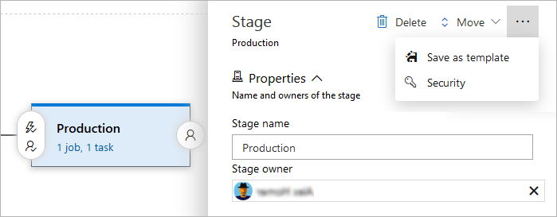
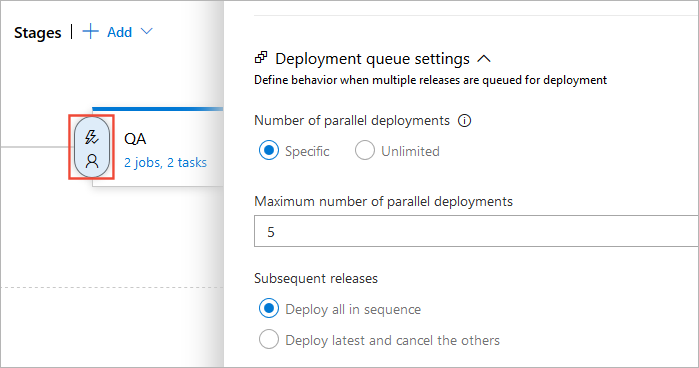

# Stages

[!INCLUDE [version-tfs-2015-rtm](../_shared/version-tfs-2015-rtm.md)]

::: moniker range="<= tfs-2018"
[!INCLUDE [temp](../_shared/concept-rename-note.md)]
::: moniker-end

The concept of stages varies depending on whether you use YAML pipelines or classic release pipelines.

# [YAML](#tab/yaml)

::: moniker range="azure-devops"

> [!NOTE]
>
> To use stages in YAML, [make sure the Multi-stage pipelines experience is turned on](../../project/navigation/preview-features.md).

You can organize the jobs in your pipeline into stages. Stages are the major divisions in a pipeline: "build this app", "run these tests", and "deploy to pre-production" are good examples of stages. They are a logical boundary in your pipeline at which you can pause the pipeline and perform various checks.

Every pipeline has at least one stage even if you do not explicitly define it. Stages may be arranged into a dependency graph: "run this stage before that one".

::: moniker-end

::: moniker range="azure-devops-2019"
Stages are not supported in this version of Azure DevOps Server.
::: moniker-end

::: moniker range="< azure-devops-2019"
YAML is not supported in this version of TFS.
::: moniker-end

# [Classic](#tab/classic)

You can organize the deployment jobs in your release pipeline into stages.
Stages are the major divisions in your release pipeline: "run functional tests", "deploy to pre-production",
and "deploy to production" are good examples of release stages.

<a name="approvals"></a><a name="conditions"></a>
A stage in a release pipeline consists of [jobs](../process/phases.md) and [tasks](../process/tasks.md).
The deployment of a release to a stage is controlled through  
[approvals and gates](../release/approvals/index.md), [deployment conditions and triggers](../release/triggers.md#env-triggers),
and [queuing policies](#queuing-policies).


---

## Specifying stages

# [YAML](#tab/yaml)

::: moniker range="azure-devops"

In the simplest case, you do not need any logical boundaries in your pipeline. In that case, you do not have to explicitly use the `stage` keyword. You can directly specify the jobs in your YAML file.

```yaml
# this has one implicit stage and one implicit job
pool:
  vmImage: 'ubuntu-16.04'
steps:
- bash: echo "Hello world"
```

```yaml
# this pipeline has one implicit stage
jobs:
- job: A
  steps:
  - bash: echo "A"

- job: B
  steps:
  - bash: echo "B"
```

If you organize your pipeline into multiple stages, you use the `stages` keyword.

```yaml
stages:
- stage: A
  jobs:
  - job: A1
  - job: A2

- stage: B
  jobs:
  - job: B1
  - job: B2
```

The full syntax to specify a stage is:

```yaml
stages:
- stage: string  # name of the stage, A-Z, a-z, 0-9, and underscore
  displayName: string  # friendly name to display in the UI
  dependsOn: string | [ string ]
  condition: string
  variables: { string: string } | [ variable | variableReference ] 
  jobs: [ job | templateReference]
```

::: moniker-end

::: moniker range="azure-devops-2019"
Stages are not supported in this version of Azure DevOps Server.
::: moniker-end

::: moniker range="< azure-devops-2019"
YAML is not supported in this version of TFS.
::: moniker-end

# [Classic](#tab/classic)

To add a stage to your release pipeline, select the release pipeline in **Releases** page, select the action to **Edit** it, and then select the **Pipeline** tab.
While the most important part of defining a stage is the
automation tasks, you can also configure several properties and options
for a stage in a release pipeline. You can:

* Edit the name of the stage here if required.
* Designate a single user or a single
  group to be the stage owner. Stage owners are
  notified whenever a deployment of a release is completed to that
  stage. Stage owners are not automatically assigned
  any additional permissions.
* Delete the stage from the pipeline.
* Change the order of stages.
* Save a copy of the stage as a template.
* Manage the security settings for the stage.



---

## Dependencies

# [YAML](#tab/yaml)

::: moniker range="azure-devops"

When you define multiple stages in a pipeline, by default, they run one after the other in the order in which you define them in the YAML file.

The syntax for defining multiple stages and their dependencies is:

```yaml
stages:
- stage: string
  dependsOn: string
  condition: string
```

Example stages that run sequentially:

```yaml
# if you do not use a dependsOn keyword, stages run in the order they are defined
stages:
- stage: QA
  jobs:
  - job:
    ...

- stage: Prod
  jobs:
  - job:
    ...
```

Example stages that run in parallel:

```yaml
stages:
- stage: FunctionalTest
  jobs:
  - job:
    ...

- stage: AcceptanceTest
  dependsOn: []    # this removes the implicit dependency on previous stage and causes this to run in parallel
  jobs:
  - job:
    ...
```

Example of fan-out and fan-in:

```yaml
stages:
- stage: Test

- stage: DeployUS1
  dependsOn: Test    # this stage runs after Test

- stage: DeployUS2
  dependsOn: Test    # this stage runs in parallel with DeployUS1, after Test

- stage: DeployEurope
  dependsOn:         # this stage runs after DeployUS1 and DeployUS2
  - DeployUS1
  - DeployUS2
```

::: moniker-end

::: moniker range="azure-devops-2019"
Stages are not supported in this version of Azure DevOps Server.
::: moniker-end

::: moniker range="< azure-devops-2019"
YAML is not supported in this version of TFS.
::: moniker-end

# [Classic](#tab/classic)

You control the dependencies by setting the triggers on each stage of the release pipeline:

* Without a trigger, a stage will not start unless it is started manually.
* With a **After release** trigger, a stage will start as soon as the release is started, in parallel with other stages that have **After release** trigger.
* With a **After stage** trigger, a stage will start after all the dependent stages are completed. Using this, you can model fan-out and fan-in behavior for stages.

---

<h2 id="conditions">Conditions</h2>

You can specify the conditions under which each stage runs. By default, a stage runs if it does not depend on any other stage, or if all of the stages that it depends on have completed and succeeded. You can customize this behavior by forcing a stage to run even if a previous stage fails or by specifying a custom condition.

# [YAML](#tab/yaml)

::: moniker range="azure-devops"

Example to run a stage based upon the status of running a previous stage:

```yaml
stages:
- stage: A

# stage B runs if A fails
- stage: B
  condition: failed()

# stage C runs if B succeeds
- stage: C
  dependsOn:
  - A
  - B
  condition: succeeded('B')
```

Example of using a [custom condition](conditions.md):

```yaml
stages:
- stage: A

- stage: B
  condition: and(succeeded(), eq(variables['build.sourceBranch'], 'refs/heads/master'))
```

You cannot currently specify that a stage run based on the value of an output variable set in a previous stage.

::: moniker-end

::: moniker range="azure-devops-2019"
Stages are not supported in this version of Azure DevOps Server.
::: moniker-end

::: moniker range="< azure-devops-2019"
YAML is not supported in this version of TFS.
::: moniker-end


# [Classic](#tab/classic)

When you specify **After release** or **After stage** triggers, you can also specify the branch filters for the artifacts that are consumed in the release. Only when the branch filters are satisfied will the release be deployed to the given stage.

---
<a name="queuing-policies"></a>
## Queuing policies

# [YAML](#tab/yaml)

::: moniker range=">= azure-devops-2019"
Queuing policies are not yet supported in YAML pipelines.
::: moniker-end

::: moniker range="< azure-devops-2019"
YAML is not supported in this version of TFS.
::: moniker-end

# [Classic](#tab/classic)

In some cases, you may be generating builds more quickly than
they can be deployed. Alternatively, you may configure multiple
[agents](../agents/agents.md) and, for example, be creating releases from the same release pipeline
for deployment of different artifacts. In such cases, it's useful to
be able to control how multiple releases are queued into a
stage. **Queuing policies** give you that control.



The options you can choose for a queuing policy are:

* **Number of parallel deployments**:
  Use this option if you dynamically provision new resources
  in your stage and it is physically capable of handling
  the deployment of multiple releases in parallel, but you want
  to limit the number of parallel deployments.

* If you specify a maximum number of deployments, two more options appear:

  - **Deploy all in sequence**:
    Use this option if you want to deploy all the releases
    sequentially into the same shared physical resources.
    By deploying them in turn, one after the other, you
    ensure that two deployment jobs do not target the same
    physical resources concurrently, even if there are
    multiple build and release agents available. You
    also ensure that pre-deployment approval requests for the
    stage are sent out in sequence.

  - **Deploy latest and cancel the others**:
    Use this option if you are producing releases faster
    than builds, and you only want to deploy the latest build.

To understand how these options work, consider a scenario
where releases **R1**, **R2**, **...**, **R5** of a
single release pipeline are created in quick succession
due to new builds being produced rapidly. Assume that
the first stage in this pipeline is named **QA**
and has both pre-deployment and post-deployment approvers
defined.

* If you do not specify a limit for the number of parallel deployments,
  all five approval requests will be sent out as soon as
  the releases are created. If the approvers grant approval for all of the
  releases, they will all be deployed to the **QA** stage in parallel.
  (if the **QA** stage did not have any pre-deployment
  approvers defined, all the five releases will automatically
  be deployed in parallel to this stage).

* If you specify a limit and **Deploy all in sequence**,
  and the limit has already been reached, the pre-deployment approval for
  release **R1** will be sent out first. After this
  approval is completed, the deployment of release **R1** to the
  **QA** stage begins. Next, a request for
  post-deployment approval is sent out for release **R1**. It is
  only after this post-deployment approval is completed that
  execution of release **R2** begins and its pre-deployment
  approval is sent out. The process continues like this for
  all of the releases in turn.

* If you specify a limit and **Deploy latest and cancel the others**,
  and the limit has already been reached, releases **R2**, **R3**, and **R4** will be
  skipped, and the pre-deployment approval for **R5** in
  the **QA** stage will be sent out immediately
  after the post-deployment approval for release **R1** is completed.

---