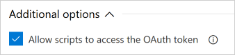

# Build variables

**Azure Pipelines | TFS 2018 | TFS 2017 | TFS 2015**

[!INCLUDE [temp](../_shared/concept-rename-note.md)]

Variables give you a convenient way to get key bits of data into various parts of the pipeline.
As the name suggests, the contents of a variable may change from run to run or job to job of your pipeline.
Some variables are predefined by the system, and you are free to add your own as well.

## Working with variables

Variables add a layer of indirection to your pipeline.
Almost any place where a pipeline requires a text string or a number, you can use a variable instead of hard-coding a value.
The system will replace the variable with its current value during the pipeline's execution.

Variable names consist of letters, numbers, `.`, and `_` characters.
How you reference a variable depends on context.
The following table indicates how you can reference a variable called `Build.DefinitionName` in each context.

<table>
<tbody>
<tr><th> Context </th><th> Syntax </th><th> Notes </th></tr>
<tr><td> Version control tag applied by the build </td><td> `$(Build.DefinitionName)` </td><td> [Learn about repository version control tagging](../repos/index.md). </td></tr>
<tr><td> Custom build number </td><td> `$(Build.DefinitionName)` </td><td>[Learn about build number format options](../build/options.md).</td></tr>
<tr><td> Designer input fields </td><td> `$(Build.DefinitionName)` </td><td></td></tr>
<tr><td> YAML input fields </td><td>  `$(Build.DefinitionName)` </td><td></td></tr>
<tr><td> Windows batch script </td><td> `%BUILD_DEFINITIONNAME%` </td><td rowspan="3"> Name is upper-cased, `.` replaced with `_`, and automatically inserted into the process environment. For more information and examples, see: [Batch script](../tasks/utility/batch-script.md#example), [PowerShell script](../scripts/powershell.md), or [Shell script](../tasks/utility/shell-script.md#example).</td></tr>
<tr><td> PowerShell script </td><td> `$env:BUILD_DEFINITIONNAME` </td></tr>
<tr><td> Bash script </td><td> `$BUILD_DEFINITIONNAME` </td></tr>
</tbody>
</table>

## System-defined variables

Some variables are automatically inserted by the system.
As a pipeline author or end user, you cannot set the contents of such variables.
See the comprehensive lists of [build variables](../build/variables.md) and [release variables](../release/variables.md) to learn which ones are available.

### System.AccessToken

One variable, System.AccessToken, has special behavior. Because it contains a
credential, it's not available to scripts and tasks by default. This reduces the
chances for a rogue script or task to steal the credential. You must explicitly
allow this variable on a pipeline-by-pipeline basis.

# [YAML](#tab/yaml)

In YAML, you must explicitly map System.AccessToken into the pipeline using a
variable. You can do this at the pipeline level:

```yaml
variables:
  the_token: $(System.AccessToken)

jobs:
- job: Test
  steps:
  - script: echo Now I can use $(the_token)
```

Or at the step level:

```yaml
steps:
  - bash: echo This is a script that could use $SYSTEM_ACCESSTOKEN
    env:
      SYSTEM_ACCESSTOKEN: $(System.AccessToken)
  - powershell: Write-Host "This is a script that could use $env:SYSTEM_ACCESSTOKEN"
    env:
      SYSTEM_ACCESSTOKEN: $(System.AccessToken)
```

# [Designer](#tab/designer)

You can allow scripts and tasks to access System.AccessToken at the job level.

1. Navigate to the job

1. Under **Additional options**, check the **Allow scripts to access the OAuth token** box.



Checking this box also leaves the credential set in Git so that you can run
pushes and pulls in your scripts.

---

## User-defined variables

Some build templates automatically create variables for you.
For example, when you [create a new .NET app build](../apps/windows/dot-net.md), `BuildConfiguration` and `BuildPlatform` are automatically defined for you.
You are free to define additional variables in your pipelines.
Both of these are considered user-defined variables.

# [YAML](#tab/yaml)

::: moniker range="vsts"

YAML builds can have variables defined at the pipeline or [job](../process/phases.md) level.
They can also access variables defined when the build is queued.

```yaml
# Set variables once
variables:
  configuration: debug
  platform: x64

steps:

# Build solution 1
- task: MSBuild@1
  inputs:
    solution: solution1.sln
    configuration: $(configuration) # Use the variable
    platform: $(platform)

# Build solution 2
- task: MSBuild@1
  inputs:
    solution: solution2.sln
    configuration: $(configuration) # Use the variable
    platform: $(platform)
```

### Parameters to YAML statements

To use a variable in a YAML statement, wrap it in `$()`. For example:

```yaml
pool:
  vmImage: 'ubuntu-16.04'
steps:
- script: ls
  workingDirectory: $(agent.homeDirectory)
```

### Scripts

To use a variables in a script, use environment variable syntax. Replace `.` and
space with `_`, capitalize the letters, and then use your platform's syntax for
referencing environment variables.

```yaml
jobs:
- job: LinuxOrMacOS
  pool:
    vmImage: 'ubuntu-16.04'
  steps:
  - bash: echo $AGENT_HOMEDIRECTORY

- job: Windows
  pool:
    vmImage: 'vs2017-win2016'
  steps:
  - script: echo %AGENT_HOMEDIRECTORY%
  - powershell: Write-Host $env:AGENT_HOMEDIRECTORY
```

### Counters

You can create a counter that is automatically incremented by one in each execution of your pipeline.  You can optionally provide a seed value for the counter if you need to start at a specific number.  The counter can be assigned to a variable and then referenced in task inputs or scripts as you would any other variable.

```yaml
variables:
  major: 2
  minor: 1
  # creates a counter called versioncounter and seeds it at 100 and then assigns the value to a variable named patch.
  patch: $[counter('versioncounter', 100)]

# use the patch variable as part of your pipeline naming scheme
name: $(Date:yyyyMMdd).$(patch)
pool:
  vmImage: 'ubuntu-16.04'

steps:

# use the variables as part of your versioning for your nuget package
- script: |
    dotnet pack /p:PackageVersion=$(major).$(minor).$(patch)
```

### Set a job-scoped variable from a script

To set a variable from a script, you use a command syntax and print to stdout.
This does not update the environment variables, but it does make the new
variable available to downstream steps within the same job.

```yaml
pool:
  vmImage: 'ubuntu-16.04'

steps:

# Create a variable
- script: |
    echo '##vso[task.setvariable variable=myVariable]abc123'

# Print the variable
- script: |
    echo my variable is $(myVariable)
```

### Set an output (multi-job) variable

If you want to make a variable available to future jobs, you must mark it as
an output variable using `isOutput=true`. Then you can map it into future
jobs using `$[]` syntax and including the step name which set the variable.

```yaml
jobs:

# Set an output variable from job A
- job: A
  pool:
    vmImage: 'vs2017-win2016'
  steps:
  - powershell: echo "##vso[task.setvariable variable=myOutputVar;isOutput=true]this is the value"
    name: setvarStep
  - script: echo $(setvarStep.myOutputVar)
    name: echovar

# Map the variable into job B
- job: B
  dependsOn: A
  pool:
    vmImage: 'ubuntu-16.04'
  variables:
    myVarFromJobA: $[ dependencies.A.outputs['setvarStep.myOutputVar'] ]  # map in the variable
  steps:
  - script: echo $(myVarFromJobA)
    name: echovar
```

If you're setting a variable from a [matrix](phases.md?tab=yaml#parallelexec)
or [slice](phases.md?tab=yaml#slicing), then to reference the variable,
you have to include the name
of the job as well as the step when you access it from a downstream job.

```yaml
jobs:

# Set an output variable from a job with a matrix
- job: A
  pool:
    vmImage: 'ubuntu-16.04'
  strategy:
    maxParallel: 2
    matrix:
      debugJob:
        configuration: debug
        platform: x64
      releaseJob:
        configuration: release
        platform: x64
  steps:
  - script: echo "##vso[task.setvariable variable=myOutputVar;isOutput=true]this is the $(configuration) value"
    name: setvarStep
  - script: echo $(setvarStep.myOutputVar)
    name: echovar

# Map the variable from the debug job
- job: B
  dependsOn: A
  pool:
    vmImage: 'ubuntu-16.04'
  variables:
    myVarFromJobADebug: $[ dependencies.A.outputs['debugJob.setvarStep.myOutputVar'] ]
  steps:
  - script: echo $(myVarFromJobADebug)
    name: echovar
```

```yaml
jobs:

# Set an output variable from a job with slicing
- job: A
  pool:
    vmImage: 'ubuntu-16.04'
    parallel: 2 # Two slices
  steps:
  - script: echo "##vso[task.setvariable variable=myOutputVar;isOutput=true]this is the slice $(system.jobPositionInPhase) value"
    name: setvarStep
  - script: echo $(setvarStep.myOutputVar)
    name: echovar

# Map the variable from the job for the first slice
- job: B
  dependsOn: A
  pool:
    vmImage: 'ubuntu-16.04'
  variables:
    myVarFromJobsA1: $[ dependencies.A.outputs['job1.setvarStep.myOutputVar'] ]
  steps:
  - script: "echo $(myVarFromJobsA1)"
    name: echovar
```

::: moniker-end

::: moniker range="< vsts"
YAML builds are not yet supported on TFS.
::: moniker-end

# [Designer](#tab/designer)

On the **Variables** tab in the pipeline designer, you can create, set, and delete variables.
Variables defined here are available to all jobs in the pipeline.

---

### Secret variables

We recommend that you make the variable 
**Secret** if it contains a password, keys, or some other kind of data that you need to avoid exposing.

::: moniker range="tfs-2017"
**TFS 2017.2, TFS 2017.3**
::: moniker-end

::: moniker range=">= tfs-2017"

::: moniker-end

::: moniker range="tfs-2017"
**TFS 2017 RTM**
::: moniker-end

::: moniker range=">= tfs-2015 <= tfs-2017"

::: moniker-end

# [YAML](#tab/yaml)

::: moniker range="vsts"

**Important:** By default with GitHub repositories, secret variables associated with your build pipeline are not made available to pull request builds of forks. See [Validate contributions from forks](../repos/github.md#validate-contributions-from-forks).

Secret variables are encrypted at rest with a 2048-bit RSA key.
They are automatically masked out of any log output from the pipeline.
Unlike a normal variable, they are not automatically decrypted into environment variables for scripts.
You can explicitly map them in, though:

```yaml
steps:

# Create a secret variable
- powershell: |
    Write-Host '##vso[task.setvariable variable=mySecret;issecret=true]abc'

# Attempt to output the value in various ways
- powershell: |
    # Using an input-macro:
    Write-Host "This works: $(mySecret)"

    # Using the env var directly:
    Write-Host "This does not work: $env:MYSECRET"

    # Using the mapped env var:
    Write-Host "This works: $env:MY_MAPPED_ENV_VAR"
  env:
    MY_MAPPED_ENV_VAR: $(mySecret)
```

The output from the above script would look like this:

```text
This works: ***
This does not work:
This works: ***
```

::: moniker-end

::: moniker range="< vsts"
YAML builds are not yet available on TFS.
::: moniker-end

# [Designer](#tab/designer)

**Important:** By default with GitHub repositories, secret variables associated with your build pipeline are not made available to pull request builds of forks. See [Validate contributions from forks](../repos/github.md#validate-contributions-from-forks).

Secret variables are encrypted at rest with a 2048-bit RSA key.
They are automatically masked out of any log output from the pipeline.
Unlike a normal variable, they are not automatically decrypted into environment variables for scripts.
They *are* automatically decrypted for use as inputs to your build tasks.
You can also pass them explicitly into a script from your build task (for example as `$(password)`).

---

### Allow at queue time

You can choose which variables are allowed to be set at queue time and which are fixed by the pipeline author.
Continuing the .NET example from above, `BuildConfiguration` can be settable at queue time for CI builds.
This way, developers can choose whether to create Debug or Release builds depending on their needs.
However, on your official builds, `BuildConfiguration` should not be settable at queue time so that you don't accidentally ship Debug binaries.

[!INCLUDE [include](../_shared/set-variables-in-scripts.md)]

## Environment variables

You can also pass environment variables from the agent host into build tasks.
For example, on the [Build tab](../tasks/index.md) of a build pipeline, add this task:

| Task | Arguments |
| ---- | --------- |
|  **Utility: Command Line** | Tool: `echo`<br />Arguments: `$(PATH)` |

> [!NOTE]
> If you have defined a pipeline variable of the same name as an environment variable (for example, `PATH`), your pipeline variable value overrides the agent host's environment variable.

## Q & A
<!-- BEGINSECTION class="md-qanda" -->


### What are the predefined release variables?

[Default release variables](../release/variables.md#default-variables)

[!INCLUDE [temp](../_shared/qa-agents.md)]

::: moniker range="< vsts"
[!INCLUDE [temp](../_shared/qa-versions.md)]
::: moniker-end

<!-- ENDSECTION -->
