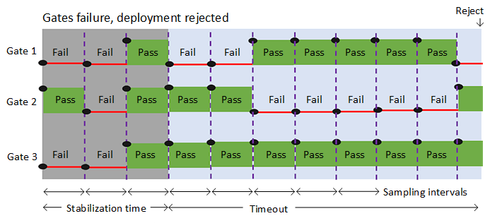

# Release deployment control using gates

**Azure Pipelines**

Gates allow automatic collection of health signals from external services, and then
promote the release when all the signals are successful at the same time or stop the
deployment on timeout.
Typically, gates are used in connection with incident management, problem management,
change management, monitoring, and external approval systems.

## Scenarios for gates

Some scenarios and use cases for gates are:

  * **Incident and issues management**. Ensure the required status for work items, incidents, and issues. For example, ensure deployment occurs only if no priority zero bugs exist, and validation that there are no active incidents takes place after deployment.
  * **Seek approvals outside Azure Pipelines**. Notify non-Azure Pipelines users such as legal approval departments, auditors, or IT managers about a deployment by integrating with approval collaboration systems such as Microsoft Teams or Slack, and waiting for the approval to complete.
  * **Quality validation**. Query metrics from tests on the build artifacts such as pass rate or code coverage and deploy only if they are within required thresholds.
  * **Security scan on artifacts**. Ensure security scans such as anti-virus checking, code signing, and policy checking for build artifacts have completed. A gate might initiate the scan and wait for it to complete, or just check for completion.
  * **User experience relative to baseline**. Using product telemetry, ensure the user experience hasn't regressed from the baseline state. The experience level before the deployment could be considered a baseline.
  * **Change management**. Wait for change management procedures in a system such as ServiceNow complete before the deployment occurs.
  * **Infrastructure health**. Execute monitoring and validate the infrastructure against compliance rules after deployment, or wait for healthy resource utilization and a positive security report.

Most of the health parameters vary over time, regularly changing their status from healthy to unhealthy and back to healthy.
To account for such variations, all the gates are periodically re-evaluated until all of them are successful at the same time.
The release execution and deployment does not proceed if all gates do not succeed in the same interval and before the configured timeout.

## Define a gate for a stage

You can enable gates at the start of a stage (in the **Pre-deployment conditions**)
or at the end of a stage (**Post-deployment conditions**), or both.
For details of how to enable gates, see [Configure a gate](../deploy-using-approvals.md#configure-gate).

The **Delay before evaluation** is a time delay at the beginning of the gate evaluation 
process that allows the gates to initialize, stabilize, and begin providing accurate results
for the current deployment (see [Gate evaluation flows](#eval-examples)). For example:

* For **pre-deployment gates**, the delay would be the time required for all bugs to be logged
  against the artifacts being deployed.  
* For **post-deployment gates**, the delay would be the maximum of the time taken for the deployed app
  to reach a steady operational state, the time taken for execution of all the required tests on
  the deployed stage, and the time it takes for incidents to be logged after the deployment.

The following gates are available by default:

* **Invoke Azure function**: Trigger execution of an Azure function and ensure a successful completion.
  For more details, see [Azure function task](../../tasks/utility/azure-function.md).
* **Query Azure monitor alerts**: Observe the configured Azure monitor alert rules for active alerts.
  For more details, see [Azure monitor task](../../tasks/utility/azure-monitor.md).
* **Invoke REST API**: Make a call to a REST API and continue if it returns a successful response.
  For more details, see [HTTP REST API task](../../tasks/utility/http-rest-api.md).
* **Query Work items**: Ensure the number of matching work items returned from a query is within a threshold.
  For more details, see [Work item query task](../../tasks/utility/work-item-query.md).
* **Security and compliance assessment**: Assess Azure Policy compliance on resources within the scope of a
  given subscription and resource group, and optionally at a specific resource level. For more details, see
  [Security Compliance and Assessment task](../../tasks/utility/azure-policy.md).

You can [create your own gates](https://github.com/Microsoft/azure-pipelines-tasks/blob/master/docs/authoring/gates.md) with Marketplace extensions.
   
The evaluation options that apply to all the gates you've added are:

* **Time between re-evaluation of gates**. The time interval between successive evaluations of 
  the gates. At each sampling interval, new requests are sent concurrently to each gate
  and the new results are evaluated. It is recommended that the sampling interval is greater than the longest
  typical response time of the configured gates to allow time for all responses to be received for evaluation.     
* **Timeout after which gates fail**. The maximum evaluation period for all gates.
  The deployment will be rejected if the timeout is reached before all gates succeed during the same sampling interval.
* **Gates and approvals**. Select the required order of execution for gates and approvals if you have configured both.
  For pre-deployment conditions, the default is to prompt for manual (user) approvals first, then evaluate gates afterwards.
  This saves the system from evaluating the gate functions if the release is rejected by the user.
  For post-deployment conditions, the default is to evaluate gates and prompt for manual approvals only when all gates are successful.
 This ensures the approvers have all the information required for a sign-off.
   
For information about viewing gate results and logs, see
[View the logs for approvals](../deploy-using-approvals.md#view-approvals) and
[Monitor and track deployments](../define-multistage-release-process.md#monitor-track).

### Gate evaluation flow examples

The following diagram illustrates the flow of gate evaluation where, after the
initial stabilization delay period and three sampling intervals, the deployment is approved.

The following diagram illustrates the flow of gate evaluation where, after the
initial stabilization delay period, not all gates have succeeded at each sampling interval. In
this case, after the timeout period expires, the deployment is rejected.

## Related topics

* [Approvals and gates overview](index.md)
* [Manual intervention](../deploy-using-approvals.md#configure-maninter)
* [Use approvals and gates to control your deployment](../../release/deploy-using-approvals.md)
* [Security Compliance and Assessment task](../../tasks/utility/azure-policy.md)
* [Stages](../environments.md)
* [Triggers](../triggers.md)

## See also

* [Video: Deploy quicker and safer with gates in Azure Pipelines](https://channel9.msdn.com/Events/Connect/2017/T181)
* [Configure your release pipelines for safe deployments](https://blogs.msdn.microsoft.com/visualstudioalm/2017/04/24/configuring-your-release-pipelines-for-safe-deployments/)
* [Tutorial: Use approvals and gates to control your deployment](../deploy-using-approvals.md)
* [Twitter sentiment as a release gate](https://blogs.msdn.microsoft.com/bharry/2017/12/15/twitter-sentiment-as-a-release-gate/)
* [GitHub issues as a release gate](https://www.visualstudiogeeks.com/DevOps/github-issues-as-deployment-gate-in-vsts-rm)
* [Author custom gates](https://github.com/Microsoft/azure-pipelines-tasks/blob/master/docs/authoring/gates.md). [Library with examples](https://github.com/Microsoft/vsts-rm-extensions/tree/master/ServerTaskHelper/DistributedTask.ServerTask.Remote.Common) 

[!INCLUDE [rm-help-support-shared](../../_shared/rm-help-support-shared.md)]

## Videos 

> [!VIDEO https://www.youtube.com/embed/7WLcqwhTZ_4?start=0]
