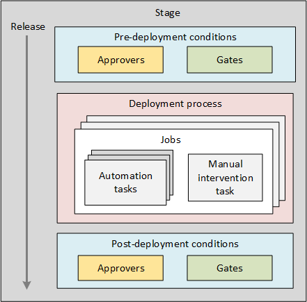

# Release approvals and gates overview

[!INCLUDE [version-tfs-2015-rtm](../../includes/version-tfs-2015-rtm.md)]

::: moniker range="<= tfs-2018"
[!INCLUDE [temp](../../includes/concept-rename-note.md)]
::: moniker-end

A release pipeline specifies the end-to-end release pipeline for an app to be deployed across a range of stages.
Deployments to each stage are fully automated by using 
[jobs](../../process/phases.md) and [tasks](../../process/tasks.md).

**Approvals** and **gates** give you additional control over the start and completion of the deployment pipeline.
Each stage in a release pipeline can be configured with pre-deployment and post-deployment conditions
that can include waiting for users to manually approve or reject deployments, and checking with other automated
systems until specific conditions are verified. In addition, you can configure a manual intervention to pause the
deployment pipeline and prompt users to carry out manual tasks, then resume or reject the deployment.

> At present, gates are available only in Azure Pipelines.

The following diagram shows how these features are combined in a stage of a release pipeline.



By using approvals, gates, and manual intervention you can take full control of your releases
to meet a wide range of deployment requirements. Typical scenarios where approvals, gates, and manual intervention
are useful include the following.

<a name="scenarios"></a>

| Scenario | Feature(s) to use |
| --- | --- |
| Some users must manually validate the change request and approve the deployment to a stage. | [Pre-deployment approvals](approvals.md) |
| Some users must manually sign out from the app after deployment before the release is promoted to other stages. | [Post-deployment approvals](approvals.md) |
| You want to ensure there are no active issues in the work item or problem management system before deploying a build to a stage.  | [Pre-deployment gates](gates.md) |
| You want to ensure there are no incidents from the monitoring or incident management system for the app after it's been deployed, before promoting the release. | [Post-deployment gates](gates.md) |
| After deployment, you want to wait for a specified time before prompting some users for a manual sign out.  | [Post-deployment gates](gates.md) and [post-deployment approvals](approvals.md) |
| During the deployment pipeline, a user must manually follow specific instructions and then resume the deployment. | [Manual Intervention](../deploy-using-approvals.md#configure-maninter) | 
| During the deployment pipeline, you want to prompt the user to enter a value for a parameter used by the deployment tasks, or allow the user to edit the details of this release. | [Manual Intervention](../deploy-using-approvals.md#configure-a-manual-intervention) | 
| During the deployment pipeline, you want to wait for monitoring or information portals to detect any active incidents, before continuing with other deployment jobs.  | Planned | 

You can combine all three techniques within a release pipeline to fully achieve your own deployment requirements.

In addition, you can install an extension that integrates with **ServiceNow** to help you control and manage your deployments
though Service Management methodologies such as ITIL. For more information, see [Release deployment control using ServiceNow](servicenow.md).

> [!NOTE]
> The time delay before the pre-deployment gates are executed is capped at 48 hours. If you need to delay the overall launch of your gates instead, it is recommended to use a [delay task](../../tasks/utility/delay.md) in your release pipeline.

```YAML
# Delay
# Delay further execution of a workflow by a fixed time
jobs:
- job: RunsOnServer
  pool: Server
  steps:
  - task: Delay@1
    inputs:
      delayForMinutes: '0'
```

## Related articles

* [Approvals](approvals.md)
* [Gates](gates.md)
* [Manual intervention](../deploy-using-approvals.md#configure-maninter)
* [ServiceNow release and deployment control](servicenow.md)
* [Stages](../../process/stages.md)
* [Triggers](../triggers.md)
* [Release pipelines and releases](../releases.md)

## Additional resources

* [Video: Deploy quicker and safer with gates in Azure Pipelines](https://channel9.msdn.com/Events/Connect/2017/T181)
* [Configure your release pipelines for safe deployments](https://devblogs.microsoft.com/devops/configuring-your-release-pipelines-for-safe-deployments/)

[!INCLUDE [rm-help-support-shared](../../includes/rm-help-support-shared.md)]
