# Integrate with ServiceNow change management

[!INCLUDE [version-team-services](../../_shared/version-team-services.md)]

Azure Pipelines and ServiceNow bring an integration of Azure Pipelines with
ServiceNow Change Management to enhance collaboration between development and IT teams.
By including change management in CI/CD pipelines, teams can reduce the risks associated
with changes and follow service management methodologies such as ITIL,
while gaining all DevOps benefits from Azure Pipelines.

This topic covers:

* Configuring ServiceNow for integrating with Azure Pipelines
* Including ServiceNow change management process as a release gate
* Monitoring change management process from releases
* Keeping ServiceNow change requests updated with deployment result

## Prerequisites 

This tutorial extends the tutorial [Use approvals and gates](../deploy-using-approvals.md).
**You must have completed that tutorial first**.

You'll also need a non-developer instance
of [ServiceNow](https://www.servicenow.com/) to which applications can be installed from the store.

## Configure the ServiceNow instance

1. Install the [Azure Pipelines](https://store.servicenow.com/sn_appstore_store.do#!/store/application/fa788cb5dbb5630040669c27db961940)
   application on your ServiceNow instance. You'll require **Hi** credentials to complete the installation.
   Refer to the [documentation](https://store.servicenow.com/sn_appstore_store.do#!/store/help?article=KB0010019)
   for more details on getting and installing applications from the ServiceNow store.

1. Create a new user in ServiceNow and grant it the `x_mioms_azpipeline.pipelinesExecution` role.

   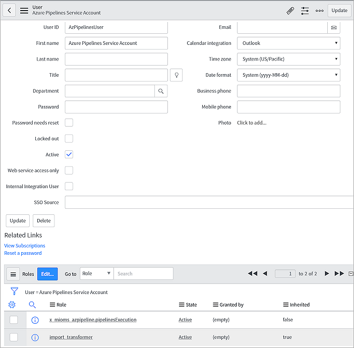

## Set up the Azure DevOps organization

1. Install the [ServiceNow Change Management extension](https://marketplace.visualstudio.com/items?itemName=ms-vscs-rm.vss-services-servicenowchangerequestmanagement)
   on your Azure DevOps organization.

   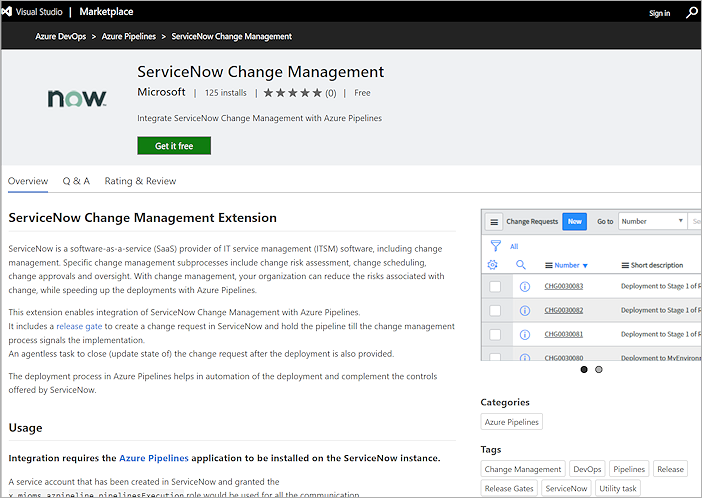

   Follow the instructions to "Get it Free"

1. Create a new ServiceNow [service connection](../../library/service-endpoints.md)
   in the Azure DevOps project used for managing your releases.
   Enter the user name and password for the service account created in ServiceNow.

   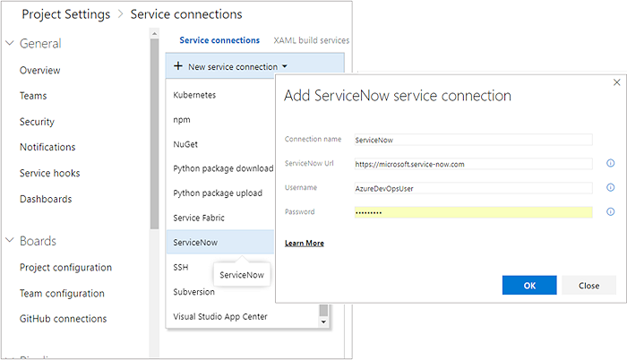

## Configure a release pipeline

1. In your release pipeline, add a pre-deployment gate for ServiceNow Change Management.
 
   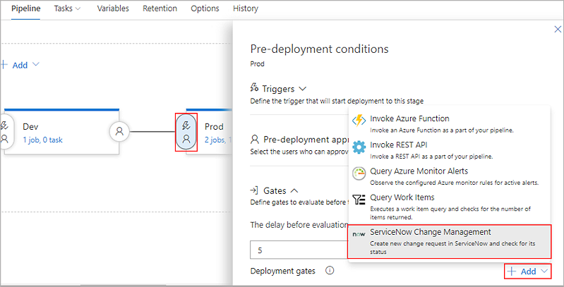

1. Select the ServiceNow service connection you created earlier and enter the values for the properties of the change request. 

   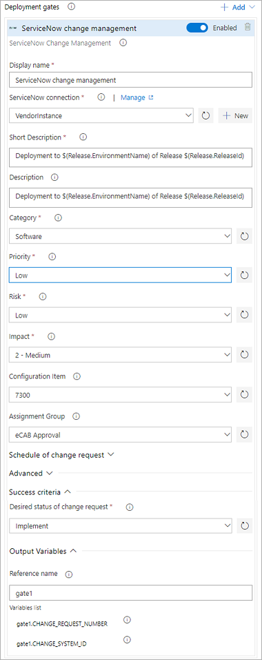

   **Inputs for the gate:**

   * Short description: A summary of the change.
   * Description: A detailed description of the change.
   * Category: The category of the change. For example, `Hardware`, `Network`, `Software`.
   * Priority: The priority of the change.
   * Risk: The risk level for the change.
   * Impact: The effect that the change has on the business.
   * Configuration Item: The configuration item (CI) that the change applies to.
   * Assignment group: The group that the change is assigned to.
   * Schedule of change request: The schedule of the change.
     The date and time should be in the UTC format **yyyy-MM-ddTHH:mm:ssZ**. For example, `2018-01-31T07:56:59Z`
   * Additional change request parameters: Additional properties of the change request you want set.
     Name must be the field name (not the label) prefixed with `u_`. For example, `u_backout_plan`.
     The value must be a valid to be accepted value in ServiceNow. Invalid entries are ignored.

   **Gate success criteria:**

   * Desired state: The gate will succeed, and the pipeline continues when the change request status is the same as the value you specify.

   **Gate output variables:**
   
   * CHANGE_REQUEST_NUMBER : Number of the change request created in ServiceNow.
   * CHANGE_SYSTEM_ID : System ID of the change request created in ServiceNow.

   The ServiceNow gate produces output variables. 
   You must specify the reference name to be able to use these output variables in the deployment workflow.
   Gate variables can be accessed by using **PREDEPLOYGATE** as a prefix. For example, when the reference name is set to `gate1`,
   the change number can be obtained as `$(PREDEPLOYGATE.gate1.CHANGE_REQUEST_NUMBER)`.

1. At the end of your deployment process, add an agentless phase with a task to update the status of the change after deployment.

   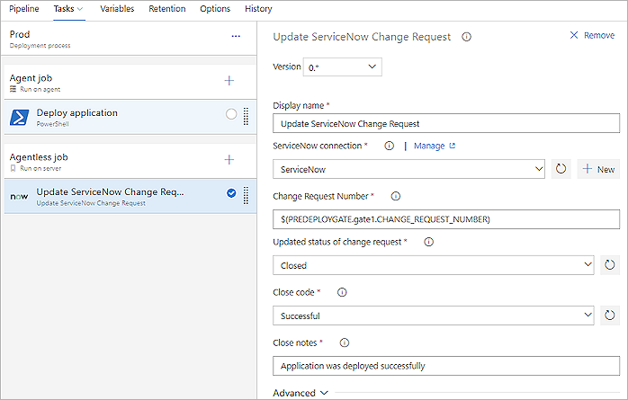

   **Inputs for Update change request task:**

   * Change request number: The number of the change request that you want to update.
   * Updated status of change request : The status of the change request that you want to update.
   * Close code and notes: Closure information for the change request.
   * Additional change request parameters: Additional properties of the change request you want to set.

## Execute a release

1. Create a new release from the configured release pipeline in Azure DevOps

1. After completing the Dev stage, the pipeline creates a new change request in ServiceNow
   for the release and waits for it to reach the desired state. 

   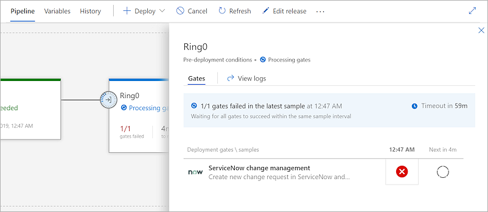

1. The values defined as gate parameters will be used. You can get the change number that was created from the logs.

   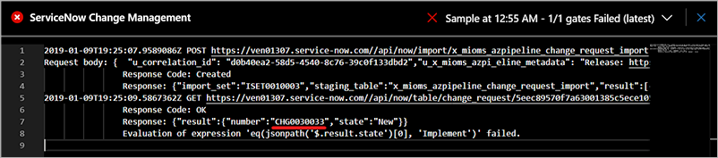

1. The ServiceNow change owner will see the release in the queue as a new change. 

   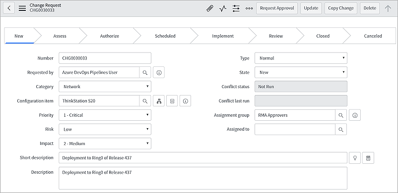

1. The release that caused the change to be requested can be tracked from the **Azure DevOps Pipeline metadata** section of the change.

   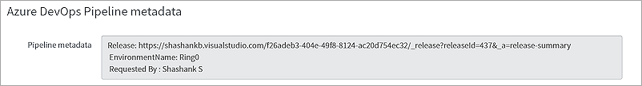
 
1. The change goes through its normal life cycle: Approval, Scheduled, and more until it is ready for implementation. 

1. When the change is ready for implementation (it is in the Implement state), the release in Azure DevOps proceeds.
   The gates status will be as shown here:

   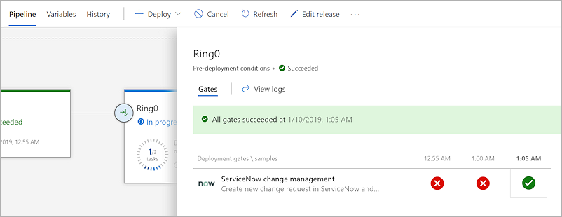

1. After the deployment, the change request is closed automatically. 

## FAQs

### Q: What versions of ServiceNow are supported?

**A**: The integration is compatible with Kingston and London versions of ServiceNow.

### Q: What types of change request can be managed with the integration?

**A**: Only normal change requests are currently supported with this integration.

### Q: How do I set additional change properties?

**A**: You can specify additional change properties of the change request in the **Additional change request parameters** field.
The properties are specified as key-value pairs in JSON format, the name being the field name (not the label)
prefixed with `u_` in ServiceNow and a valid value.

### Q: Can I update custom fields in the change request with additional change request parameters?

**A**: If custom fields are defined in ServiceNow for the change requests, mapping of the custom fields in import set
transform map must be added. See [ServiceNow Change Management Extension](https://github.com/Microsoft/azure-pipelines-extensions/tree/master/Extensions/ServiceNow/Src) for details.

### Q: I don't see drop-down values populated for Category, Status, and others. What should I do?

**A**: Change Management Core and Change Management - State Model plugins must be active on your ServiceNow instance for the drop-downs to work.
See [Upgrade change management](https://docs.servicenow.com/bundle/istanbul-it-service-management/page/product/change-management/task/migrate-change-mgmt-pre-geneva.html)
and [Update change request states](https://docs.servicenow.com/bundle/istanbul-it-service-management/page/product/change-management/task/state-model-activate-tasks.html) for more details.

## Related topics

* [Approvals and gates overview](index.md)
* [Manual intervention](../deploy-using-approvals.md#configure-maninter)
* [Use approvals and gates to control your deployment](../../release/deploy-using-approvals.md)
* [Stages](../environments.md)
* [Triggers](../triggers.md)

## See also

* [Video: Deploy quicker and safer with gates in Azure Pipelines](https://channel9.msdn.com/Events/Connect/2017/T181)
* [Configure your release pipelines for safe deployments](https://blogs.msdn.microsoft.com/visualstudioalm/2017/04/24/configuring-your-release-pipelines-for-safe-deployments/)
* [Tutorial: Use approvals and gates to control your deployment](../deploy-using-approvals.md)
* [Twitter sentiment as a release gate](https://blogs.msdn.microsoft.com/bharry/2017/12/15/twitter-sentiment-as-a-release-gate/)
* [GitHub issues as a release gate](https://www.visualstudiogeeks.com/DevOps/github-issues-as-deployment-gate-in-vsts-rm)
* [Author custom gates](https://github.com/Microsoft/azure-pipelines-tasks/blob/master/docs/authoring/gates.md). [Library with examples](https://github.com/Microsoft/vsts-rm-extensions/tree/master/ServerTaskHelper/DistributedTask.ServerTask.Remote.Common) 

[!INCLUDE [rm-help-support-shared](../../_shared/rm-help-support-shared.md)]
