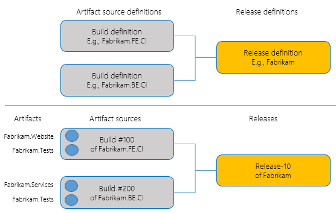
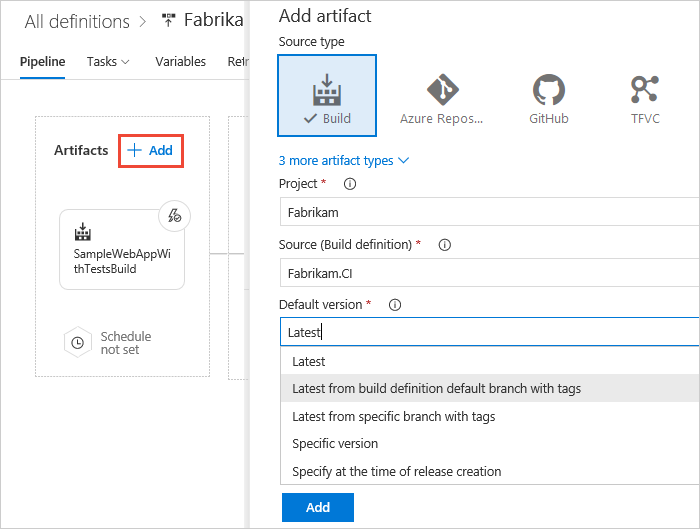
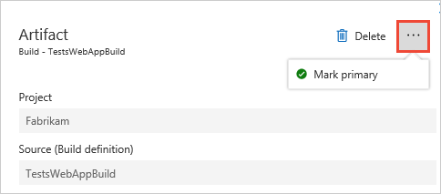

# Release artifacts and artifact sources

[!INCLUDE [version-tfs-2015-rtm](../_shared/version-tfs-2015-rtm.md)]

::: moniker range="<= tfs-2018"
[!INCLUDE [temp](../_shared/concept-rename-note.md)]
::: moniker-end

A release is a collection of artifacts in your DevOps CI/CD processes. An **artifact** is a deployable
component of your application. Azure Pipelines can
deploy artifacts that are produced by a
[wide range of artifact sources](#sources),
and stored in different types of artifact repositories.

When **authoring a release pipeline**, you link the
appropriate **artifact sources** to your release pipeline.
For example, you might link an Azure Pipelines build pipeline or
a Jenkins project to your release pipeline.

When **creating a release**, you specify the exact
version of these artifact sources; for example, the number of a
build coming from Azure Pipelines, or the version of a
build coming from a Jenkins project.

After a release is created, you cannot change these versions. A release is
fundamentally defined by the versioned artifacts that make up the release.
As you deploy the release to various stages, you will be deploying
and validating the same artifacts in all stages.

A single release pipeline can be linked to
**multiple artifact sources**, of which one is the [primary source](#art-primary).
In this case, when you create a release, you specify individual versions for each of
these sources.

Artifacts are central to a number of features in
Azure Pipelines. Some of the features that depend
on the linking of artifacts to a release pipeline are:

* **Auto-trigger releases**. You can configure new
  releases to be automatically created whenever a new
  version of an artifact is produced.  For more details, see
  [Continuous deployment triggers](triggers.md#release-triggers).
  Note that the ability to automatically create releases
  is available for only some artifact sources.

* **Trigger conditions**. You can configure a release to be created
  automatically, or the deployment of a release to a stage
  to be triggered automatically, when only specific conditions on the
  artifacts are met. For example, you can configure releases to be
  automatically created only when a new build is produced from a certain branch.

* **Artifact versions**. You can configure a release to automatically use a specific
  version of the build artifacts, to always use the latest version, or to allow you 
  to specify the version when the release is created.

* **Artifact variables**. Every artifact that is part
  of a release has metadata associated with it, exposed to [tasks](../tasks/index.md) through [variables](#art-vars).
  This metadata includes the version number of the artifact,
  the branch of code from which the artifact was produced
  (in the case of build or source code artifacts), the
  pipeline that produced the artifact (in the case of
  build artifacts), and more. This information is accessible
  in the deployment tasks. For more details, see
  [Artifact variables](variables.md#artifact-variables).

* **Work items and commits**. The work items or commits
  that are part of a release are computed from the
  versions of artifacts. For example, each build in
  Azure Pipelines is associated with a set of work items and
  commits. The work items or commits in a release are
  computed as the union of all work items and commits of
  all builds between the current release and the
  previous release.
  Note that Azure Pipelines is currently
  able to compute work items and commits for only
  certain artifact sources.

* **Artifact download**. Whenever a release is
  deployed to a stage, by default Azure Pipelines
  automatically downloads all the artifacts in that
  release to the [agent](../agents/agents.md) where the deployment job runs.
  The procedure to download artifacts depends on the
  type of artifact. For example, Azure Pipelines artifacts
  are downloaded using an algorithm that downloads
  multiple files in parallel. Git artifacts are
  downloaded using Git library functionality. For more details, see
  [Artifact download](#download).

<h2 id="sources">Artifact sources</h2>

There are several types of tools you might use in your
application lifecycle process to produce or store
artifacts. For example, you might use continuous
integration systems such as Azure Pipelines, Jenkins, or
TeamCity to produce artifacts. You might also use version control systems such as Git or
TFVC to store your artifacts. Or you can use
repositories such as Package Management in Visual Studio Team
Services or a NuGet repository to store your artifacts.
You can configure Azure Pipelines to deploy
artifacts from all these sources.

By default, a release created from the release pipeline will use the
latest version of the artifacts. At the time of linking an artifact source to a release pipeline,
you can change this behavior by selecting one of the options to use the latest build from a specific
branch by specifying the tags, a specific version, or allow the user to specify the version when the
release is created from the pipeline.

If you link more than one set of artifacts, you can specify which is the primary
(default).

 
The following sections describe how to work with the different types of artifact
sources.

* [Azure Pipelines](#teambuild)
* [TFVC, Git, and GitHub](#tfvc)
* [Jenkins](#jenkins)
* [Azure Container Registry, Docker, and Kubernetes](#container)
* [Azure Artifacts (NuGet, Maven, and npm)](#nuget)
* [External or on-premises TFS](#externaltfs)
* [TeamCity](#teamcity)
* [Other sources](#others)

----

### Azure Pipelines

You can link a release pipeline to any of
the build pipelines in Azure Pipelines or TFS project collection.

> [!NOTE]
> You must include a **Publish Artifacts** task in your build
pipeline. For XAML build pipelines, an artifact with the name **drop**
is published implicitly.

Some of the differences in capabilities between different versions of TFS and Azure Pipelines are:

* **TFS 2015**: You can link build pipelines only from the same project of your collection.
  You can link multiple definitions, but you cannot specify default versions. You can set up a continuous deployment trigger on only one of the definitions.
  When multiple build pipelines are linked, the latest builds of all the other definitions are used, along with the build that triggered the release creation.

* **TFS 2017 and newer** and **Azure Pipelines**: You can link build pipelines from any of the projects in Azure Pipelines or TFS.
  You can link multiple build pipelines and specify default values for each of them. You can set up continuous deployment triggers on
  multiple build sources. When any of the builds completes, it will trigger the creation of a release.

The following features are available when using Azure Pipelines sources:

| Feature | Behavior with Azure Pipelines sources |
|---------|----------------------------------|
| Auto-trigger releases | New releases can be created automatically when new builds (including XAML builds) are produced. See [Continuous Deployment](triggers.md) for details. You do not need to configure anything within the build pipeline. See the notes above for differences between version of TFS.|
| Artifact variables | A number of [artifact variables](variables.md#artifact-variables) are supported for builds from Azure Pipelines. |
| Work items and commits | Azure Pipelines integrates with work items in TFS and Azure Pipelines. These work items are also shown in the details of releases. Azure Pipelines integrates with a number of version control systems such as TFVC and Git, GitHub, Subversion, and Other Git repositories. Azure Pipelines shows the commits only when the build is produced from source code in TFVC or Git.|
| Artifact download | By default, build artifacts are downloaded to the agent. You can configure an option in the stage to [skip the download](../process/phases.md#agent-phase) of artifacts. |
| Deployment section in build | The build summary includes a **Deployment** section, which lists all the stages to which the build was deployed. |

----

<h3 id="tfvcsource">TFVC, Git, and GitHub</h3>

There are scenarios in which you may want to
consume artifacts stored in a version control system
directly, without passing them through a build pipeline.
For example:

* You are developing a PHP or a JavaScript application
  that does not require an explicit build pipeline.

* You manage configurations for various stages
  in different version control repositories, and you want
  to consume these configuration files directly from version control as part of the deployment pipeline.

* You manage your infrastructure and configuration as
  code (such as Azure Resource Manager templates) and
  you want to manage these files in a version control
  repository.

Because you can configure multiple artifact sources
in a single release pipeline, you can link both a build
pipeline that produces the binaries of the
application as well as a version control repository
that stores the configuration files into the same
pipeline, and use the two sets of artifacts together
while deploying.

Azure Pipelines integrates with Team Foundation
Version Control (TFVC) repositories, Git repositories, and GitHub repositories.

You can link a release pipeline to any of the Git or TFVC
repositories in any of the projects in your
collection (you will need read access to these
repositories). No additional setup is required when
deploying version control artifacts within the same collection.

When you link a **Git** or **GitHub** repository and select a branch,
you can edit the default properties of the artifact types after the artifact has been saved.
This is particularly useful in scenarios where the branch for the stable
version of the artifact changes, and continuous delivery releases should use
this branch to obtain newer versions of the artifact. You can also specify details
of the checkout, such as whether check out submodules and LFS-tracked files, and the
shallow fetch depth.

When you link a **TFVC branch**, you can specify the changeset to be deployed
when creating a release.

The following features are available when using TFVC, Git, and GitHub sources:

| Feature | Behavior with TFVC, Git, and GitHub sources |
|---------|----------------------------------------|
| Auto-trigger releases | You can configure a continuous deployment trigger for pushes into the repository in a release pipeline. This can automatically trigger a release when a new commit is made to a repository. See [Triggers](triggers.md). |
| Artifact variables | A number of [artifact variables](variables.md) are supported for version control sources. |
| Work items and commits | Azure Pipelines cannot show work items or commits associated with releases when using version control artifacts.|
| Artifact download | By default, version control artifacts are downloaded to the agent. You can configure an option in the stage to [skip the download](../process/phases.md#agent-phase) of artifacts. |

----

<h3 id="jenkinssource">Jenkins</h3>

To consume Jenkins artifacts, you must create a
service connection with credentials to connect to
your Jenkins server. For more details, see
[service connections](../library/service-endpoints.md)
and [Jenkins service connection](../library/service-endpoints.md#sep-jenkins).
You can then link a Jenkins project to a release
pipeline. The Jenkins project must be configured
with a post build action to publish the artifacts.

The following features are available when using Jenkins sources:

| Feature | Behavior with Jenkins sources |
|---------|-------------------------------|
| Auto-trigger releases | You can configure a continuous deployment trigger for pushes into the repository in a release pipeline. This can automatically trigger a release when a new commit is made to a repository. See [Triggers](triggers.md). |
| Artifact variables | A number of [artifact variables](variables.md#artifact-variables) are supported for builds from Jenkins. |
| Work items and commits | Azure Pipelines cannot show work items or commits for Jenkins builds. |
| Artifact download | By default, Jenkins builds are downloaded to the agent. You can configure an option in the stage to [skip the download](../process/phases.md#agent-phase) of artifacts. |

Artifacts generated by Jenkins builds are typically propagated to storage repositories for archiving and sharing.
Azure blob storage is one of the supported repositories, allowing you to consume Jenkins projects that publish to
Azure storage as artifact sources in a release pipeline. Deployments download the artifacts automatically from
Azure to the agents. In this configuration, connectivity between the agent and the Jenkins server is not required.
Microsoft-hosted agents can be used without exposing the server to internet.

> [!NOTE]
> Azure Pipelines may
not be able to contact your Jenkins server if,
for example, it is within your enterprise network.
In this case you can integrate
Azure Pipelines with Jenkins by setting up an
on-premises agent that can access the Jenkins server.
You will not be able to see the name of your Jenkins
projects when linking to a build, but you can type
this into the link dialog field.

For more information about Jenkins integration capabilities, see
[Azure Pipelines Integration with Jenkins Jobs, Pipelines, and Artifacts](https://blogs.msdn.microsoft.com/visualstudioalm/2016/08/18/tfs-integration-jenkins-jobs-pipelines-artifacts/).

----

<h3 id="dockersource">Azure Container Registry, Docker, Kubernetes</h3>

When deploying containerized apps, the container image is first pushed to a container registry.
After the push is complete, the container image can be deployed to the Web App for Containers service or a Docker/Kubernetes cluster.
You must create a service connection with credentials to connect to 
your service to deploy images located there, or to Azure. For more details, see
[service connections](../library/service-endpoints.md).

The following features are available when using Azure Container Registry, Docker, Kubernetes sources:

| Feature | Behavior with Docker sources |
|---------|-------------------------------|
| Auto-trigger releases | You can configure a continuous deployment trigger for images. This can automatically trigger a release when a new commit is made to a repository. See [Triggers](triggers.md). |
| Artifact variables | A number of [artifact variables](variables.md#artifact-variables) are supported for builds. |
| Work items and commits | Azure Pipelines cannot show work items or commits. |
| Artifact download | By default, builds are downloaded to the agent. You can configure an option in the stage to [skip the download](../process/phases.md#agent-phase) of artifacts. |

----

<h3 id="nugetsource">Azure Artifacts (NuGet packages only)</h3>

To use NuGet packages from Azure Artifacts in your deployment, you must first [assign licenses for the Azure Artifacts](../../artifacts/license-azure-artifacts.md). For more information, see the [Azure Artifacts](../../artifacts/overview.md) overview.

Scenarios where you may want to consume these artifacts are:

1.	You have your application build (such as TFS, Azure Pipelines, TeamCity, Jenkins) published as a package to Azure Artifacts and you want to consume the artifact in a release.
2.	As part of your application deployment, you need additional packages stored in Azure Artifacts.

When you link such an artifact to your release pipeline, you must select the Feed, Package, and the Default version for the package.
You can choose to pick up the latest version of the package, use a specific version, or select the version at the time of release creation.
During deployment, the package is downloaded to the agent folder and the contents are extracted as part of the job execution.

The following features are available when using Azure Artifacts sources:

| Feature | Behavior with Azure Artifacts sources |
|---------|-------------------------------|
| Auto-trigger releases | You can configure a continuous deployment trigger for packages. This can automatically trigger a release when a package is updated. See [Triggers](triggers.md). |
| Artifact variables | A number of [artifact variables](variables.md#artifact-variables) are supported for packages. |
| Work items and commits | Azure Pipelines cannot show work items or commits. |
| Artifact download | By default, packages are downloaded to the agent. You can configure an option in the stage to [skip the download](../process/phases.md#agent-phase) of artifacts. |

> [!NOTE]
> Only NuGet packages are currently supported in the Azure Artifacts release artifact type. Support for the other package types supported in Azure Artifacts is coming soon.

----

<h3 id="onpremtfssource">External or on-premises TFS</h3>

You can use Azure Pipelines to deploy artifacts
published by an on-premises TFS server. You don't need to make the TFS
server visible on the Internet; you just set up an on-premises
automation agent. Builds from an on-premises TFS server are downloaded directly into the
on-premises agent, and then deployed to the specified target servers. They
will not leave your enterprise network. This allows you to leverage all of
your investments in your on-premises TFS server, and take advantage of the
release capabilities in Azure Pipelines.

>Using this mechanism, you can also deploy artifacts published in one
Azure Pipelines subscription in another Azure Pipelines, or deploy artifacts
published in one Team Foundation Server from another Team Foundation Server.

To enable these scenarios, you must install the
[TFS artifacts for Azure Pipelines](https://marketplace.visualstudio.com/items?itemName=ms-vscs-rm.vss-services-externaltfs)
extension from Visual Studio Marketplace. Then create a
service connection with credentials to connect to your
TFS server (see [service connections](../library/service-endpoints.md)
for details).

You can then link a TFS build pipeline to your release pipeline. Choose
**External TFS Build** in the **Type** list.

The following features are available when using external TFS sources:

| Feature | Behavior with external TFS sources |
|---------|------------------------------------|
| Auto-trigger releases | You cannot configure a continuous deployment trigger for external TFS sources in a release pipeline. To automatically create a new release when a build is complete, you would need to add a script to your build pipeline in the external TFS server to invoke Azure Pipelines REST APIs and to create a new release.|
| Artifact variables | A number of [artifact variables](variables.md) are supported for external TFS sources. |
| Work items and commits | Azure Pipelines cannot show work items or commits for external TFS sources.|
| Artifact download | By default, External TFS artifacts are downloaded to the agent. You can configure an option in the stage to [skip the download](../process/phases.md#agent-phase) of artifacts. |

> [!NOTE]
> Azure Pipelines may
> not be able to contact an on-premises TFS server if,
> for example, it is within your
> enterprise network. In this case you can integrate
> Azure Pipelines with TFS by setting up an
> on-premises agent that can access the TFS server.
> You will not be able to see the name of your TFS
> projects or build pipelines when linking to a build, but you can type
> these into the link dialog fields. In addition, when you
> create a release, Azure Pipelines may not be able to
> query the TFS server for the build numbers. Instead,
> type the **Build ID** (not the build number) of the
> desired build into the appropriate field, or select
> the **Latest** build.

----

<h3 id="teamcitysource">TeamCity</h3>

To integrate with TeamCity, you must first install the
[TeamCity artifacts for Azure Pipelines](https://marketplace.visualstudio.com/items?itemName=ms-devlabs.vss-services-teamcity)
extension from Marketplace.

To consume TeamCity artifacts, start by creating a
service connection with credentials to connect to your
TeamCity server (see [service connections](../library/service-endpoints.md)
for details).

You can then link a TeamCity build configuration to a
release pipeline. The TeamCity build configuration
must be configured with an action to publish the artifacts.

The following features are available when using TeamCity sources:

| Feature | Behavior with TeamCity sources |
|---------|--------------------------------|
| Auto-trigger releases | You cannot configure a continuous deployment trigger for TeamCity sources in a release pipeline. To create a new release automatically when a build is complete, add a script to your TeamCity project that invokes the Azure Pipelines REST APIs to create a new release. |
| Artifact variables | A number of [artifact variables](variables.md) are supported for builds from TeamCity. |
| Work items and commits | Azure Pipelines cannot show work items or commits for TeamCity builds. |
| Artifact download | By default, TeamCity builds are downloaded to the agent. You can configure an option in the stage to [skip the download](../process/phases.md#agent-phase) of artifacts. |

> [!NOTE]
> Azure Pipelines may
> not be able to contact your TeamCity server if,
> for example, it is within your
> enterprise network. In this case you can integrate
> Azure Pipelines with TeamCity by setting up an
> on-premises agent that can access the TeamCity server.
> You will not be able to see the name of your TeamCity
> projects when linking to a build, but you can type
> this into the link dialog field.

----

### Custom artifacts

In addition to built-in artifact sources, Azure DevOps Pipelines supports integrating any custom artifact source with the artifact extensibility model. You can plug in any custom artifact source, and Azure DevOps will provide a first-class user experience and seamless integration.

For more details, see [Azure DevOps artifact extensibility model](https://aka.ms/artifactextensibility).

----

### Other sources

Your artifacts may be created and exposed by other
types of sources such as a NuGet repository. While we
continue to expand the types of artifact sources
supported in Azure Pipelines, you can start using
it without waiting for support for a specific source
type. Simply skip the linking of artifact sources in
a release pipeline, and add custom tasks to your
stages that download the artifacts directly
from your source.

----

<h2 id="download">Artifact download</h2>

When you deploy a release to a stage, the versioned artifacts from
each of the sources are, by default, downloaded to the automation agent
so that tasks running within that stage can deploy these artifacts.
The artifacts downloaded to the agent are not deleted when a release is
completed. However, when you initiate the next release, the downloaded artifacts are
deleted and replaced with the new set of artifacts.

A new unique folder in the agent is created for every release pipeline when you
initiate a release, and the artifacts are downloaded into that folder.
The `$(System.DefaultWorkingDirectory)` variable maps to this folder.

Note that, at present, Azure Pipelines does not perform any optimization
to avoid downloading the unchanged artifacts if the same release is
deployed again. In addition, because the previously downloaded contents are
always deleted when you initiate a new release, Azure Pipelines cannot
perform incremental downloads to the agent.

::: moniker range="<= tfs-2018"

You can, however, instruct Azure Pipelines to [skip the automatic download](../process/phases.md#artifact-download)
of artifacts to the agent for a specific job and stage of the deployment if you
wish. Typically, you will do this when the tasks in that job do not
require any artifacts, or if you implement custom code in a task to
download the artifacts you require.

::: moniker-end

::: moniker range="> tfs-2018"

In Azure Pipelines, you can, however, [select which artifacts you want to download](../process/phases.md#artifact-download)
to the agent for a specific job and stage of the deployment.
Typically, you will do this to improve the efficiency of the deployment
pipeline when the tasks in that job do not
require all or any of the artifacts, or if you implement custom code
in a task to download the artifacts you require.

::: moniker-end

<h2 id="source-alias">Artifact source alias</h2>

To ensure the uniqueness of every artifact download, each artifact source
linked to a release pipeline is automatically provided with a specific
download location known as the _source alias_. This location
can be accessed through the variable:

`$(System.DefaultWorkingDirectory)\[source alias]`

This uniqueness also ensures that, if you later rename a linked
artifact source in its original location (for example,
rename a build pipeline in Azure Pipelines or a project
in Jenkins), you don't need to edit the task
properties because the download location defined in
the agent does not change.

The source alias is, by default, the name of the source
selected when you linked the artifact source, prefixed with an underscore; depending on the
type of the artifact source this will be the name of the
build pipeline, job, project, or repository. You can edit
the source alias from the artifacts tab of a release pipeline; for example, when you change
the name of the build pipeline and you want to use a
source alias that reflects the name of the build pipeline.

<h2 id="primary-source">Primary source</h2>

When you link multiple artifact sources to a release pipeline, one of them
is designated as the primary artifact source. The primary artifact source is used
to set a number of pre-defined [variables](variables.md#artifact-variables). It can also
be used in [naming releases](index.md#numbering).

## Artifact variables

Azure Pipelines exposes a set of pre-defined variables that you
can access and use in tasks and scripts; for example, when
executing PowerShell scripts in deployment jobs. When there are multiple
artifact sources linked to a release pipeline, you can access
information about each of these. For a list of all pre-defined artifact variables, see [variables](variables.md#artifact-variables).

## Contributed links and additional information

* [Code repo sources in Azure Pipelines](https://www.youtube.com/watch?v=-JDlE_MHl1s)
* [TeamCity extension for Azure Pipelines](https://www.youtube.com/watch?v=zDZRvc_6UiU)
* [Jenkins artifacts in Azure Pipelines](https://www.youtube.com/watch?v=ZC4hWYqdP_o)
* [External TFS artifacts for Azure Pipelines](https://www.youtube.com/watch?v=cR8NzcEmstw)

## Related topics

* [Release pipelines](index.md)
* [Stages](environments.md)

[!INCLUDE [rm-help-support-shared](../_shared/rm-help-support-shared.md)]
