# Use Terraform to manage infrastructure deployment

[!INCLUDE [version-tfs-2018](../includes/version-tfs-2018.md)]

::: moniker range="<= tfs-2018"
[!INCLUDE [temp](../includes/concept-rename-note.md)]
::: moniker-end

[Terraform](https://www.terraform.io/intro/index.html) is a tool for building, changing and versioning infrastructure safely and efficiently. Terraform can manage existing and popular cloud service providers as well as custom in-house solutions.

Configuration files describe to **Terraform** the components needed to run a single application or your entire datacenter. Terraform generates an execution plan describing what it will do to reach the desired state, and then executes it to build the described infrastructure. As the configuration changes, Terraform is able to determine what changed and create incremental execution plans which can be applied.

In this tutorial, you learn about:

> [!div class="checklist"]
> * The structure of a Terraform file
> * Building an application using an Azure CI pipeline
> * Deploying resources using Terraform in an Azure CD pipeline

## Prerequisites

1. A Microsoft Azure account.
1. An Azure DevOps account.
1. Use the [Azure DevOps Demo Generator](https://azuredevopsdemogenerator.azurewebsites.net/?TemplateId=77382&Name=Terraform) to provision the tutorial project on your Azure DevOps organization. This URL automatically selects the Terraform template in the demo generator.

<a name="examine-terraform-file"></a>

## Examine the Terraform file in your source code

This tutorial uses the PartsUnlimited project, which is a sample eCommerce website developed using .NET Core. You will examine the Terraform file that defines the Azure resources required to deploy PartsUnlimited website.

1. Navigate to the project created earlier using the Azure DevOps Demo Generator.

1. In the **Repos** tab of **Azure Pipelines**, select the **terraform** branch. 

    

    Make sure that you are now on the terraform branch and Terraform folder is there in the repo.

1. Select the **webapp.tf** file under the **Terraform** folder. Review the code.

	```
	 terraform {
	  required_version = ">= 0.11" 
	 backend "azurerm" {
	  storage_account_name = "__terraformstorageaccount__"
	    container_name       = "terraform"
	    key                  = "terraform.tfstate"
		access_key  ="__storagekey__"
	  features{}
		}
		}
	  provider "azurerm" {
	    version = "=2.0.0"
	features {}
	}
	resource "azurerm_resource_group" "dev" {
	  name     = "PULTerraform"
	  location = "West Europe"
	}
	
	resource "azurerm_app_service_plan" "dev" {
	  name                = "__appserviceplan__"
	  location            = "${azurerm_resource_group.dev.location}"
	  resource_group_name = "${azurerm_resource_group.dev.name}"
	
	  sku {
	    tier = "Free"
	    size = "F1"
	  }
	}
	
	resource "azurerm_app_service" "dev" {
	  name                = "__appservicename__"
	  location            = "${azurerm_resource_group.dev.location}"
	  resource_group_name = "${azurerm_resource_group.dev.name}"
	  app_service_plan_id = "${azurerm_app_service_plan.dev.id}"
	
	}
	```

    **webapp.tf** is a terraform configuration file. Terraform uses its own file format, called HCL (Hashicorp Configuration Language). The structure is similar to YAML. In this example, Terraform will deploy the Azure resource group, app service plan, and app service required to deploy the website. However, since the names of those resources are not yet known, they are marked with tokens that will be replaced with real values during the release pipeline.

    As an added benefit, this Infrastructure-as-Code (IaC) file can be managed as part of source control. You may learn more about working with Terraform and Azure in [this Terraform Basics lab](https://azurecitadel.com/automation/terraform/lab1/).

<a name="build-application"></a>

## Build the application using an Azure CI Pipeline

This DevOps project includes two separate pipelines for CI and CD. The CI pipeline produces the artifacts that will be released via the CD pipeline at a later point.

1. Navigate to **Pipelines** and select the **Terraform-CI** pipeline.

    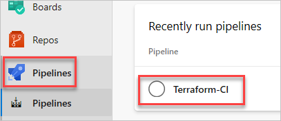

1. Select **Edit**. This CI pipeline has tasks to compile the .NET Core project. These tasks restore dependencies, build, test, and publish the output as a zip file which can be deployed to an app service.

    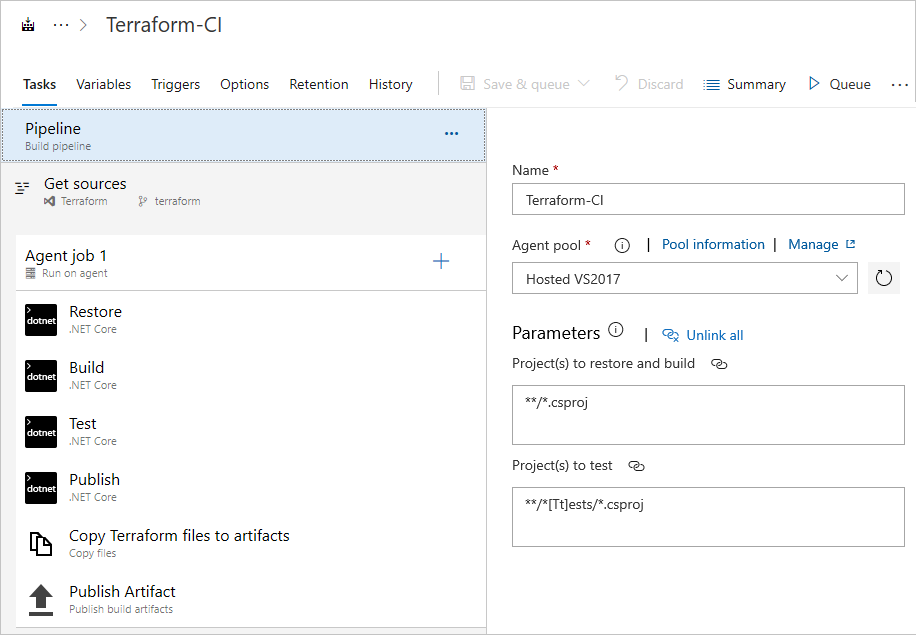

1. In addition to the application build, the pipeline publishes Terraform files as build artifacts so that they will be available to other pipelines, such as the CD pipeline to be used later. This is done via the **Copy files** task, which copies the Terraform folder to the Artifacts directory.

    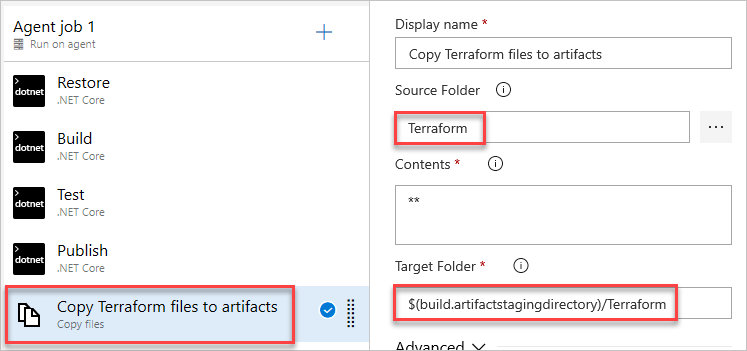

1. Select **Queue** to queue a new build. Select **Run** to use the default options. When the build page appears, select **Agent job 1**. The build may take a few minutes to complete.

    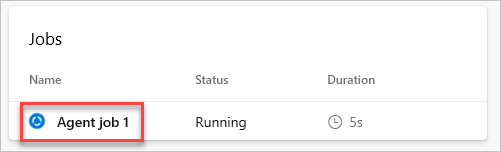

<a name="release-application"></a>

## Release the application to Azure resources provisioned by Terraform

Now that the application has been built, it's time to release it. However, no deployment infrastructure has been created yet. This is where Terraform comes in. By following the definition file reviewed earlier, Terraform will be able to ensure the expected state of the Azure infrastructure meets the application's needs before it is published.

1. Navigate to **Releases** under **Pipelines** and select the **Terraform-CD** pipeline. Select **Edit**.

    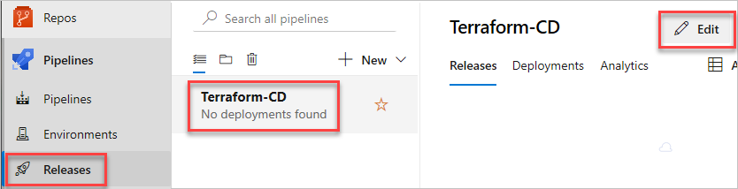

1. The CD pipeline has been configured to accept the artifacts published by the CI pipeline. There is only one stage, which is the **Dev** stage that performs the deployment. Select it to review its tasks.

    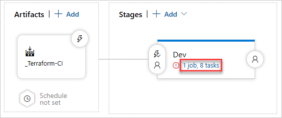

1. There are eight tasks defined in the release stage. Most of them require some configuration to work with the target Azure account.

    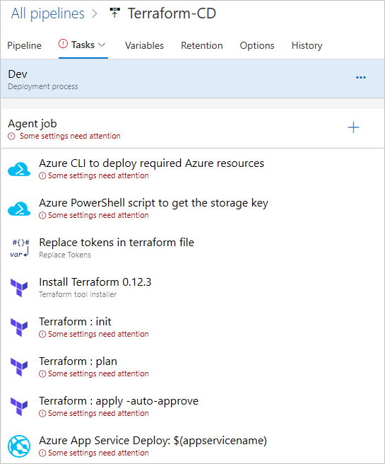

1. Select the **Agent job** and configure it to use the **Azure Pipelines** agent pool and **vs2017-win2016** specification.

    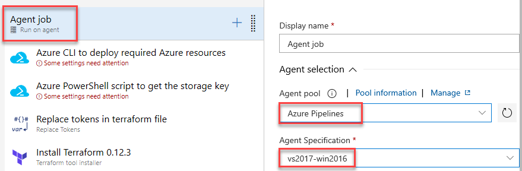

1. Select the **Azure CLI** task and configure it to use a service connection to the target Azure account. If the target Azure account is under the same user logged in to Azure DevOps, then available subscriptions can be selected and authorized from the dropdown. Otherwise, use the **Manage** link to manually create a service connection. Once created, this connection can be reused for future tasks.

    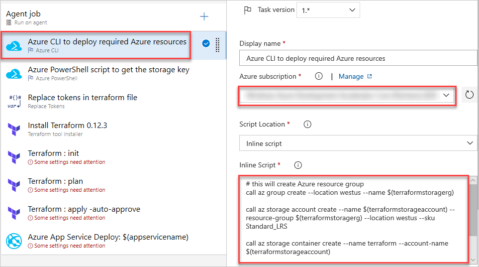

    This task executes a series of Azure CLI commands to set up some basic infrastructure required to use Terraform.

    ```azurecli
	# this will create Azure resource group
	call az group create --location westus --name $(terraformstoragerg)
	
	call az storage account create --name $(terraformstorageaccount) --resource-group $(terraformstoragerg) --location westus --sku Standard_LRS
	
	call az storage container create --name terraform --account-name $(terraformstorageaccount)
	
	call az storage account keys list -g $(terraformstoragerg) -n $(terraformstorageaccount)

    ```

    By default, Terraform stores state locally in a file named **terraform.tfstate**. When working with Terraform in a team, use of a local file makes Terraform implementation complicated. With remote state, Terraform writes the state data to a remote data store. Here the pipeline uses an Azure CLI task to create an Azure storage account and storage container to store the Terraform state. For more information on Terraform remote state, see Terraform's docs for working with [Remote State](https://www.terraform.io/docs/state/remote.html).

1. Select the **Azure PowerShell** task and configure it to use the **Azure Resource Manager** connection type and use the service connection created earlier. 

    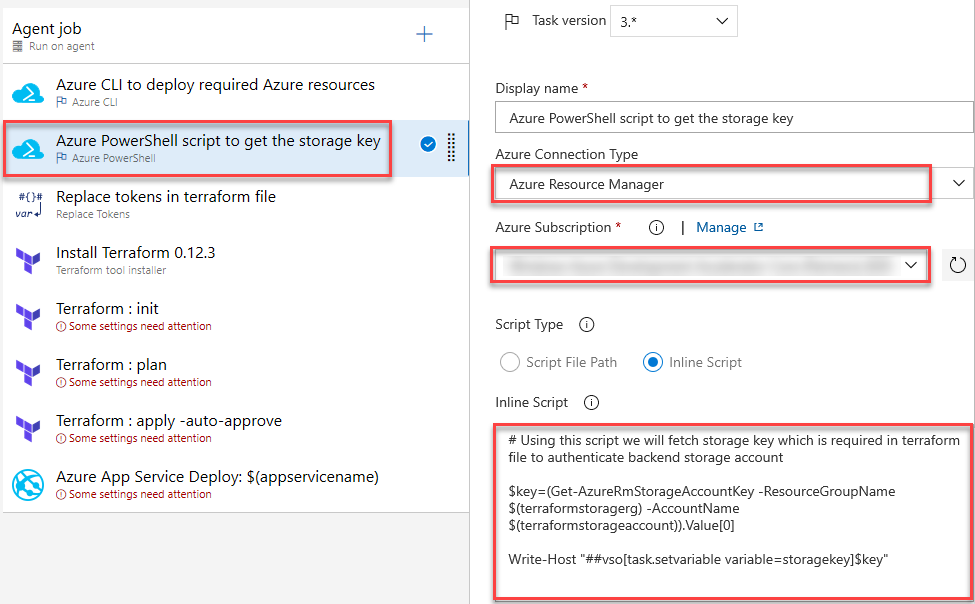

    This task uses PowerShell commands to retrieve the storage account key needed for the Terraform provisioning.

	```azurepowershell
	# Using this script we will fetch storage key which is required in terraform file to authenticate backend storage account
	
	$key=(Get-AzureRmStorageAccountKey -ResourceGroupName $(terraformstoragerg) -AccountName $(terraformstorageaccount)).Value[0]
	
	Write-Host "##vso[task.setvariable variable=storagekey]$key"
	```

1. Select the **Replace tokens** task. If you recall the **webapp.tf** file reviewed earlier, there were several resources that were unknown at the time and marked with token placeholders, such as **__terraformstorageaccount__**. This task replaces those tokens with variable values relevant to the deployment, including those from the pipeline's **Variables**. You may review those under **Variables** if you like, but return to **Tasks** afterwards.

    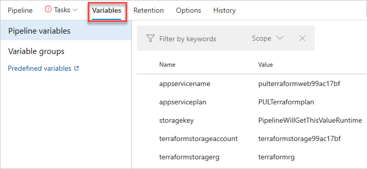

1. Select the **Install Terraform** task. This installs and configures the specified version of Terraform on the agent for the remaining tasks.

    When running Terraform in automation, the focus is usually on the core plan/apply cycle. The next three tasks follow these stages.

    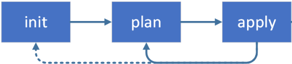

1. Select the **Terraform init** task. This task runs the **terraform init** command. This command looks through all of the *.tf files in the current working directory and automatically downloads any of the providers required for them. In this example, it will download Azure provider as it is going to deploy Azure resources. For more information, see Terraform's documentation for the [init command](https://www.terraform.io/docs/commands/init.html). 

    Select the **Azure subscription** created earlier and enter **terraform** as the container. Note that the key is set to **terraform.tfstate**.

    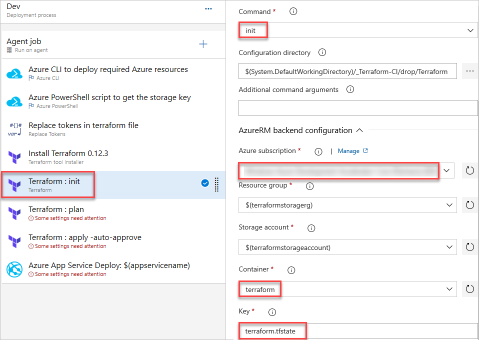

1. Select the **Terraform plan** task. This task runs the **terraform plan** command. This command is used to create an execution plan by determining what actions are necessary to achieve the desired state specified in the configuration files. This is just a dry run and shows which actions will be performed. For more information, see Terraform's documentation for the [plan command](https://www.terraform.io/docs/commands/plan.html).

    Select the **Azure subscription** created earlier.

    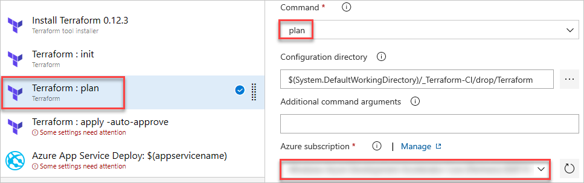

1. Select the **Terraform apply** task. This task runs the **terraform validate and apply** command. This command deploys the resources. By default, it will also prompt for confirmation before applying. Since this is an automated deployment, the **auto-approve** argument is included. For more information, see Terraform's documentation for the [plan command](https://www.terraform.io/docs/commands/apply.html).

    Select the **Azure subscription** created earlier.

    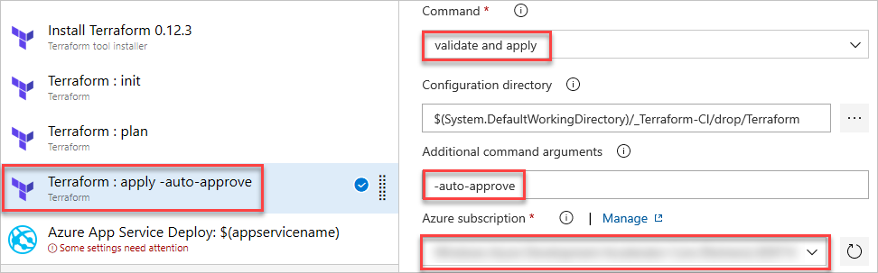

1. Select the **Azure App Service Deploy** task. Select the **Azure subscription** created earlier. By the time this task runs, Terraform has ensured that the deployment environment has been configured to meet the app's requirements. It will use the created app service name set in the **Variables** section.

    

1. From the top of the page, select **Save** and confirm.

1. Select **Create release**. Specify the recent build and select **Create**. Your build number will most likely be different than this example.

    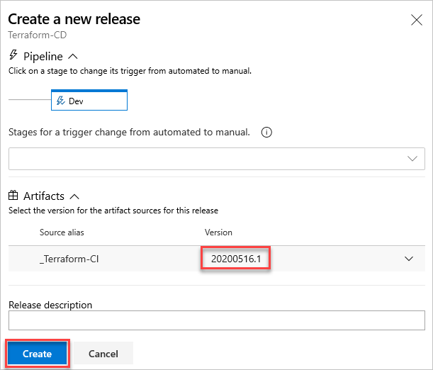

1. Select the new release to track the pipeline.

    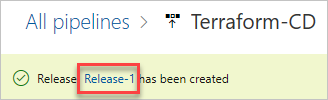

1. Click through to track task progress.

    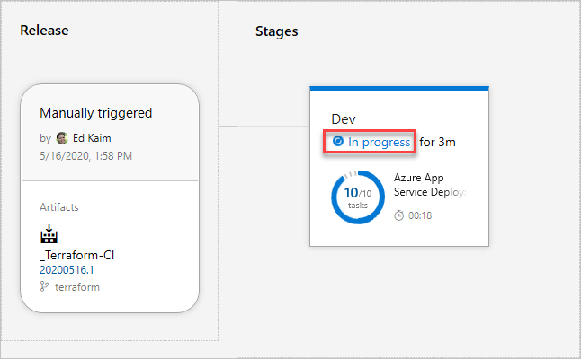

1. Once the release has completed, select the **Azure App Service Deploy** task.

    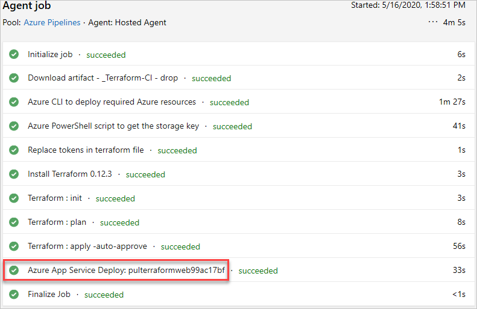

1. Copy the name of the app service from the task title. Note that the name you see will vary slightly.

    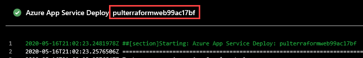

1. Open a new browser tab and navigate to the app service. The domain format is **[app service name].azurewebsites.net**, so the final URL will be something like:
 
    ```
    https://pulterraformweb99ac17bf.azurewebsites.net.
    ```

    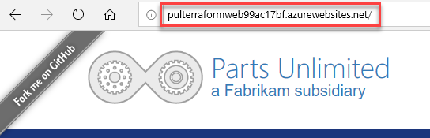

## Summary

In this tutorial, you learned how to automate repeatable deployments with Terraform on Azure using Azure Pipelines.

## Clean up resources

This tutorial created an Azure DevOps project and some resources in Azure. If you're not going to continue to use these resources, delete them with the following steps:

1. [Delete the Azure DevOps project](../../organizations/projects/delete-project.md) created by the Azure DevOps Demo Generator.

1. All Azure resources created during this tutorial were assigned to either the **PULTerraform** or **terraformrg** resource groups. Deleting those two groups will delete the resources they contain. This can be done via the CLI or portal. The following example shows you how to delete the resource groups using Azure CLI.

    ```azurecli-interactive
    az group delete --name PULTerraform
    az group delete --name terraformrg
	```

## Next steps

> [!div class="nextstepaction"]
> [Terraform with Azure](https://docs.microsoft.com/azure/developer/terraform/overview)
