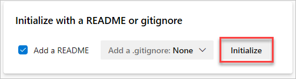
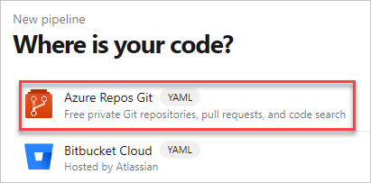
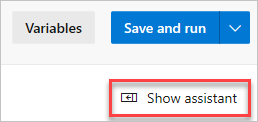
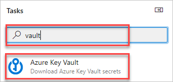
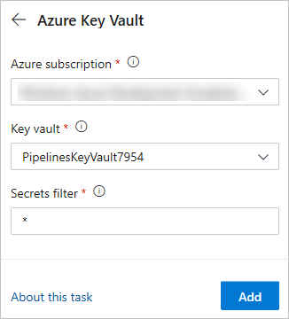
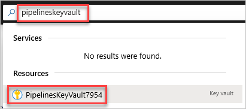
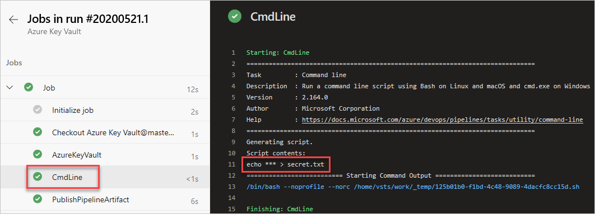
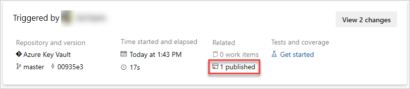
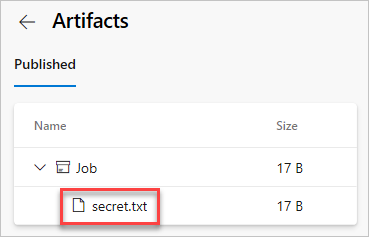

# Use secrets from Azure Key Vault in Azure Pipelines

[!INCLUDE [version-server-2019-rtm](../includes/version-server-2019-rtm.md)]

> [!NOTE]
> This tutorial will guide you through working with Azure key vault in your pipeline. Another way of working with secrets is using [Secret variables](../process/variables.md#secret-variables) in your Azure Pipeline or referencing [secrets in a variable group](../process/variables.md#reference-secret-variables-in-variable-groups).

[Azure Key Vault](/azure/key-vault/general/basic-concepts) helps teams to securely store and manage sensitive information such as API keys, passwords, certificates, etc.
 
In this tutorial, you will learn about:

> [!div class="checklist"]
> * Creating an Azure Key Vault using the Azure CLI
> * Adding a secret and configuring access to Azure key vault 
> * Using secrets in your pipeline

## Prerequisites

* An Azure DevOps organization. If you don't have one, you can [create one for free](../get-started/pipelines-sign-up.md). 

<a name="creating-azure-key-vault"></a>

## Create an Azure Key Vault

Azure key vaults can be created and managed through the Azure portal or Azure CLI. We will use Azure CLI in this tutorial

[!INCLUDE [include](../ecosystems/includes/sign-in-azure-cli.md)]


1. If you have more than one Azure subscription associated with your account, use the command below to specify a default subscription. You can use `az account list` to generate a list of your subscriptions.

    ```Azure CLI
    az account set --subscription <your_subscription_name_or_ID>
    ```

1. Run the following command to set a default Azure region for your subscription. You can use `az account list-locations` to generate a list of available regions.

    ```Azure CLI
    az configure --defaults location=<your_region>
    ```

    For example, this command will select the westus2 region:

    ```Azure CLI
    az configure --defaults location=westus2
    ```

1. Run the following command to create a new resource group.

    ```Azure CLI
    az group create --name <your-resource-group>
    ```
   
1. Run the following command to create a new key vault.

    ```Azure CLI
    az keyvault create \
      --name <your-key-vault> \
      --resource-group <your-resource-group>
    ```

1. Run the following command to create a new secret in your key vault. Secrets are stored as a key value pair. In the example below, `Password` is the key and `mysecretpassword` is the value. 

    ```Azure CLI
    az keyvault secret set \
      --name "Password" \
      --value "mysecretpassword" \
      --vault-name <your-key-vault>
    ```

## Create a project

Sign in to [Azure Pipelines](https://azure.microsoft.com/services/devops/pipelines). Your browser will then navigate to `https://dev.azure.com/your-organization-name` and displays your Azure DevOps dashboard.

If you don't have any projects in your organization yet, select **Create a project to get started** to create a new project. Otherwise, select the **New project** button in the upper-right corner of the dashboard.

## Create a repo

We will use YAML to create our pipeline but first we need to create a new repo. 

1. Sign in to your Azure DevOps organization and navigate to your project.

1. Go to **Repos**, and then select **Initialize** to initialize a new repo with a README.

    > [!div class="mx-imgBorder"]  
    > 

## Create a new pipeline

1. Go to **Pipelines**, and then select **New Pipeline**.

1. Select **Azure Repos Git**.

    > [!div class="mx-imgBorder"]  
    > 

1. Select the repo you created earlier. It should have the same name as your Azure DevOps project.

1. Select **Starter pipeline**.

1. The default pipeline will include a few scripts that run echo commands. Those are not needed so we can delete them. Your new YAML file will now look like this:

    ```
	trigger:
	- main
	
	pool:
	  vmImage: 'ubuntu-latest'
	
	steps:
    ```

1. Select **Show assistant** to expand the assistant panel. This panel provides convenient and searchable list of pipeline tasks.  

    > [!div class="mx-imgBorder"]  
    > 

1. Search for **vault** and select the [**Azure Key Vault**](../tasks/deploy/azure-key-vault.md) task.

    > [!div class="mx-imgBorder"]  
    > 

1. Select and authorize the Azure subscription you used to create your Azure key vault earlier. Select the key vault and select **Add** to insert the task at the end of the pipeline. This task allows the pipeline to connect to your Azure Key Vault and retrieve secrets to use as pipeline variables.

    > [!NOTE]
    > `Make secrets available to whole job` feature is not currently supported in Azure DevOps Server 2019 and 2020.

    > [!div class="mx-imgBorder"]  
    > 

1. This step is optional. To verify the retrieval and processing of our secret through the pipeline, add the script below to your YAML to write the secret to a text file and publish it for review. This is not recommended and it is for demonstration purposes only.

    ```
    - script: echo $(Password) > secret.txt

    - publish: secret.txt
    ```

    > [!TIP]
    > YAML is very particular about formatting and indentation. Make sure your YAML file is indented properly.

1. Do not save or run the pipeline yet. It will fail because the pipeline does not have permissions to access the key vault yet. Keep this browser tab open, we will resume once we set up the key vault permissions.

## Set up Azure Key Vault access policies

1. Go to [Azure portal](https://azure.microsoft.com/).

1. Use the search bar to search for the key vault you created earlier.

    > [!div class="mx-imgBorder"]  
    > 

1. Under **Settings** Select **Access policies**.

1. Select **Add Access Policy** to add a new policy.

1. For **Secret permissions**, select **Get** and **List**.

1. Select the option to select a principal and search for yours.

    A security principal is an object that represents a user, group, service, or application that's requesting access to Azure resources. Azure assigns a unique object ID to every security principal. The default naming convention is `[Azure DevOps account name]-[Azure DevOps project name]-[subscription ID]` so if your account is "https://dev.azure.com/Contoso" and your team project is "AzureKeyVault", your principal would look something like this `Contoso-AzureKeyVault-[subscription ID]`.

    > [!TIP]
    > You may need to minimize the Azure CLI panel to see the **Select** button.
    
1. Select **Add** to create the access policy.

1. Select **Save**.

## Run and review the pipeline

1. Return to the open pipeline tab where we left off.

1. Select **Save** then **Save** again to commit your changes and trigger the pipeline.

    > [!NOTE]
    > You may be asked to allow the pipeline to access Azure resources, if prompted select **Allow**. You will only have to approve it once. 

1. Select the **CmdLine** job to view the logs. Note that the actual secret is not part of the logs. 

    > [!div class="mx-imgBorder"]  
    > 

1. Return to pipeline summary and select the published artifact.

    > [!div class="mx-imgBorder"]  
    > 

1. Under **Job** select the **secret.txt** file to view it.

    > [!div class="mx-imgBorder"]  
    > 

1. The text file contains our secret: `mysecretpassword`. This concludes our verification step that we mentioned earlier.

## Clean up resources

Follow the steps below to delete the resources you created:

1. If you created a new organization to host your project, see [how to delete your organization](../../organizations/accounts/delete-your-organization.md), otherwise [delete your project](../../organizations/projects/delete-project.md)).

1. All Azure resources created during this tutorial are hosted under a single resource group `PipelinesKeyVaultResourceGroup`. Run the following command to delete the resource group and all of its resources.

    ```Azure CLI
    az group delete --name PipelinesKeyVaultResourceGroup
    ```

## Next steps

> [!div class="nextstepaction"]
> [Architect secure infrastructure in Azure](/learn/paths/architect-secure-infrastructure/)
> [Secure your cloud data](/learn/paths/secure-your-cloud-data/)
