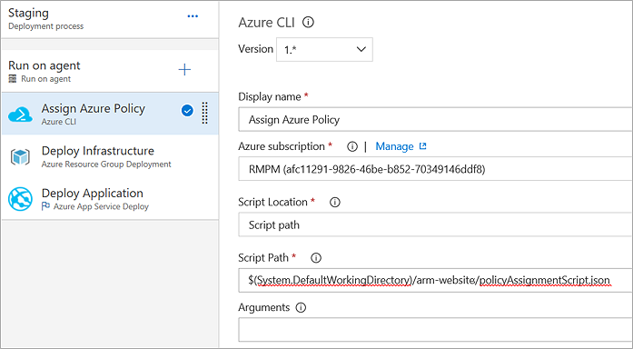
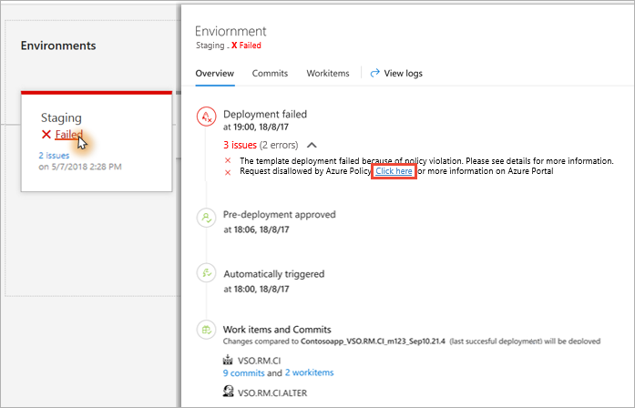
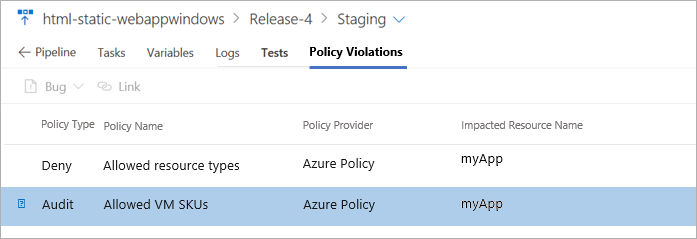

# Azure policy compliance

**Azure Pipelines**

Azure Policy helps you manage and prevent IT issues by using policy definitions
that enforce rules and effects for your resources. When you use Azure Policy,
resources stay compliant with your corporate standards and service level agreements.
Policies can be applied to an entire subscription, a management group, or a resource group. 

This topic describes how you can apply Azure policies in your build and release
pipelines. For example, you could apply an Azure policy that limits deployments
to a specific set of virtual machines. There are several pre-defined policies
that you can apply, or you can define your own policies in Azure.

For more information, see [What is Azure Policy?](https://docs.microsoft.com/azure/governance/policy/overview)
and [Create and manage policies to enforce compliance](https://docs.microsoft.com/azure/governance/policy/tutorials/create-and-manage).

## Use a release pipeline to create and apply an Azure policy

Start a new release and choose the **Azure Policy Deployment** template.
This adds two instances of the [Azure PowerShell task](../tasks/utility/powershell.md) to the **Run on agent** job.
These tasks contain pre-defined inline scripts and a set of parameters.

### Create an Azure policy

The **Create Azure Policy** task helps you [create a new Azure policy programmatically](https://docs.microsoft.com/azure/governance/policy/how-to/programmatically-create)
using Azure PowerShell cmdlets. There are example policy definitions in JSON format available in the
[Azure policy documentation](https://docs.microsoft.com/azure/governance/policy/samples/0)
and on [GitHub](https://github.com/Azure/azure-policy). A reference to the PowerShell cmdlets for Azure
policy is available at [AzureRM.Resources - Policies](https://docs.microsoft.com/powershell/module/azurerm.resources/?view=azurermps-6.11.0#policies).  

The script for the **Create Azure Policy** task has the following parameters: 

| Parameter | Description |
| --- | --- |
| policyName | Required. Policy definition name. |
| policyDisplayName | Optional. Policy definition display name. |
| policyDescription | Optional. Policy definition description. |
| subscriptionId | Optional. ID of the subscription in which the definition is available. |
| managementGroupName | Optional. Name of management group in which the definition is available. |
| policyRule | Required. Policy definition rule in JSON string format, or path to a file containing the [JSON policy definition rule](https://docs.microsoft.com/azure/governance/policy/concepts/definition-structure). The path can be fully qualified or relative to $(System.DefaultWorkingDirectory). |
| policyParameters | Optional. Policy parameter values in JSON string format. | 

### Assign an Azure policy

After you create an Azure policy, you can assign it by using the **Assign Azure Policy** task. 
Alternatively, you can create - or select an existing or a pre-defined policy - in the 
Azure portal as described in [this topic](https://docs.microsoft.com/azure/governance/policy/tutorials/create-and-manage)
and then assign it using the task.

The script for the **Assign Azure Policy** task has the following parameters:

| Parameter | Description |
| --- | --- |
| AssignmentName | Required. Policy assignment name. |
| AssignmentDisplayName | Optional. Policy assignment display name. |
| AssignmentDescription | Optional. Policy assignment description. |
| PolicyName | Optional. Name of policy definition to assign. |
| PolicySetName | Optional. Name of policy set definition to assign. |
| ResourceGroupName | Optional. Name of resource group to which the policy [set] definition will be applied. |
| SubscriptionId | Optional. ID of the subscription to which the policy [set] definition will be applied. |
| ManagementGroupName | Optional. Name of management group to which the policy [set] definition will be applied. |
| PolicyParameters | Optional. Policy parameter values in JSON string format. |

## Run a release pipeline to confirm Azure policy 

When a release pipeline runs and attempts to perform an action disallowed by
a defined policy, the deployment is marked as **Failed**. The error
message contains a link to view policy violations.

An error message is written to the logs and displayed in 
the stage status panel in the releases page of Azure pipelines.

<!--
## View assigned Azure policies

The **Policy Violations** tab in the **Releases** page of Azure Pipelines
lists the assigned policy violations. Each one links to the matching
policy definition in the Azure portal. From here you can view more information
about the policy and its conditions.

-->

[!INCLUDE [rm-help-support-shared](../_shared/rm-help-support-shared.md)]
