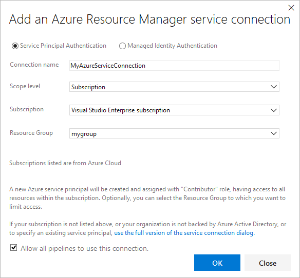

# Troubleshoot Azure Resource Manager service connections

[!INCLUDE [version-tfs-2015-rtm](../includes/version-tfs-2015-rtm.md)]

::: moniker range="<= tfs-2018"

[!INCLUDE [temp](../includes/concept-rename-note.md)]

::: moniker-end

This topic will help you resolve issues you may encounter when creating a connection to Microsoft Azure using an [Azure Resource Manager service connection](../library/service-endpoints.md) for your Azure DevOps CI/CD processes.

## What happens when you create a Resource Manager service connection?

1. In Azure DevOps, open the Service connections page from the [project settings page](../../project/navigation/go-to-service-page.md#open-project-settings). In TFS, open the **Services** page from the "settings" icon in the top menu bar.

1. Choose **+ New service connection** and select the type of service connection you need.

1. In the **Add Azure Resource Manager service connection** dialog, provide a connection name, and select a subscription from drop-down list of your subscriptions.  

> [!div class="mx-imgBorder"]
> 

When you select **OK**, the system:

1. Connects to the Azure Active Directory (Azure AD) tenant for to the selected subscription.
1. Creates an application in Azure AD on behalf of the user.
1. After the application has been successfully created, assigns the application as a contributor to the selected subscription.
1. Creates an Azure Resource Manager service connection using this application's details.

## How do I troubleshoot errors that may occur while creating a connection?

Errors that may occur when the system attempts to create the service connection include:

* [Insufficient privileges to complete the operation](#privileges)
* [Failed to obtain an access token](#sessionexpired)
* [A valid refresh token was not found](#sessionexpired)
* [Failed to assign contributor role](#contributorrole)
* [Some subscriptions are missing from the subscription drop down menu](#missingSubscriptions)
* [Subscription isn't listed when creating a service connection](#subscription-isnt-listed-service-connection)
* [Automatically created service principal secret has expired](#autoCreatedSecretExpiration)
* [Failed to obtain the JSON Web Token (JWT)](#failedToObtainJWT)
* [Creating a service connection with Artifactory instance fails despite allowlisted IPs](#service-connection-artifactory)
* [Can't create a service connection manually by using PowerShell scripts and Azure Cloud Shell](#cant-create-service-connection-manually)
* [Azure subscription not taken directly from previous task output](#azure-subscription-not-taken-directly-from-previous-task-output)
* [What authentication mechanisms are supported? How do managed identities work?](#authentication-mechanisms)

### Insufficient privileges to complete the operation

This typically occurs when the system attempts to create an
application in Azure AD on your behalf.

This is a permission issue that may be due to the following causes:

* [The user has only guest permission in the directory](#guestonly)
* [The user is not authorized to add applications in the directory](#notauthtoadd)

#### The user has only guest permission in the directory

The best approach to resolve this issue, while granting only the minimum additional permissions to the user, is to increase the Guest user permissions as follows.

1. Sign in to the Azure portal using an administrator account. The account should be an [owner](/azure/role-based-access-control/built-in-roles#owner), [global administrator](/azure/active-directory/active-directory-assign-admin-roles-azure-portal#global-administrator--company-administrator), or [user account administrator](/azure/active-directory/active-directory-assign-admin-roles-azure-portal#user-administrator-permissions).

1. Select **Azure Active Directory** in the left navigation bar.

1. Ensure you are editing the appropriate directory corresponding to the user subscription. If not, select **Switch directory** and log in using the appropriate credentials if required.

1. In the **MANAGE** section select **Users**.

1. Select **User settings**.

1. In the **External users** section, select **Manage external collaboration settings**.

1. The **External collaboration settings** blade opens.

1. Change **Guest user permissions are limited** to **No**.

Alternatively, if you are prepared to give the user additional permissions (administrator-level), you can make the user a member of the **Global administrator** role. To do so follow the steps below:

> [!WARNING]
> Users who are assigned to the Global administrator role can read and modify every administrative setting in your Azure AD organization. As a best practice, we recommend that you assign this role to fewer than five people in your organization. 

1. Sign in to the Azure portal using an administrator account. The account should be an [owner](/azure/role-based-access-control/built-in-roles#owner), [global administrator](/azure/active-directory/active-directory-assign-admin-roles-azure-portal#global-administrator--company-administrator), or [user account administrator](/azure/active-directory/active-directory-assign-admin-roles-azure-portal#user-administrator-permissions).

1. Select **Azure Active Directory** in the left navigation bar.

1. Ensure you are editing the appropriate directory corresponding to the user subscription. If not, select **Switch directory** and log in using the appropriate credentials if required.

1. In the **MANAGE** section select **Users**.
   
1. Use the search box to filter the list and then select the user you want to manage.

1. In the **MANAGE** section select **Directory role** and change the role to **Global administrator**.

1. Save the change.

It typically takes 15 to 20 minutes to apply the changes globally. After this period has elapsed, the user can retry creating the service connection.

#### The user is not authorized to add applications in the directory

You must have permissions to add integrated applications in the directory. The directory administrator has permissions to change this setting.

1. Select **Azure Active Directory** in the left navigation bar.

1. Ensure you are editing the appropriate directory corresponding to the user subscription. If not, select **Switch directory** and log in using the appropriate credentials if required.

1. In the **MANAGE** section select **Users**.

1. Select **User settings**.

1. In the **App registrations** section, change **Users can register applications** to **Yes**.

#### Create the service principal manually with the user already having required permissions in Azure Active Directory

You can also create the service principal with an existing user who already has the required permissions in Azure Active Directory. For more information, see [Create an Azure Resource Manager service connection with an existing service principal](../library/connect-to-azure.md#create-an-azure-resource-manager-service-connection-with-an-existing-service-principal).

### Failed to obtain an access token or a valid refresh token was not found

These errors typically occur when your session has expired.

To resolve these issues:

1. Sign out of Azure Pipelines or TFS.
1. Open an InPrivate or incognito browser window and navigate to [https://visualstudio.microsoft.com/team-services/](https://visualstudio.microsoft.com/team-services/).
1. If you are prompted to sign out, do so.
1. Sign in using the appropriate credentials.
1. Choose the organization you want to use from the list.
1. Select the project you want to add the service connection to.
1. Create the service connection you need by opening the **Settings** page. Then, select **Services** > **New service connection** > **Azure Resource Manager**.

### Failed to assign Contributor role

This error typically occurs when you do not have **Write** permission for the selected Azure subscription when the system attempts to assign the **Contributor** role.

To resolve this issue, ask the subscription administrator to [assign you the appropriate role](/azure/active-directory/fundamentals/active-directory-users-assign-role-azure-portal).

### Some subscriptions are missing from the list of subscriptions

To fix this issue you will need to modify the supported account types and who can use your application. To do so, follow the steps below:

1. Sign in to the Azure portal.

1. If you have access to multiple tenants, use the **Directory + subscription** filter in the top menu to select the tenant in which you want to register an application.

1. Search for and select **Azure Active Directory**.

1. Under **Manage**, select **App registrations**.

1. Select you application from the list of registered applications.

1. Under **Essentials**, select **Supported account types**.

1. Under **Supported account types**, _Who can use this application or access this API?_ select **Accounts in any organizational directory**.

1. Select **Save**.

### Subscription isn't listed when creating a service connection

A maximum of 50 Azure subscriptions are listed in the various Azure subscription drop-down menus (billing, service connection, etc.). If you're setting up a service connection and you have more than 50 Azure subscriptions, some of your subscriptions won't be listed. In this scenario, complete these steps:

1. Create a new, native Azure AD user in the Azure AD instance for the Azure subscription. 

1. Set up the Azure AD user so that it has the proper permissions in the Azure subscription to set up Azure DevOps billing or a service connection. For more information, see [Add a user who can set up billing for Azure DevOps](../../organizations/billing/add-backup-billing-managers.md).
 
1. Add the Azure AD user to the Azure DevOps org with the access level of **Stakeholder** and add them to the **Project Collection Administrators** group (for billing), or ensure that the user has sufficient permissions in the Team Project to create service connections.

1. Log in to Azure DevOps as this user and set up a billing service connection. You'll only see one Azure subscription in the list.

### Automatically created service principal client secret has expired

An issue that often arises with service principals that are automatically created is that the service principal's token expires and needs to be renewed. If you run into issues with refreshing the token, check out [our other troubleshooting resolutions](#troubleshoot). 

To renew the token for an automatically created service principal:

1. Go to the Azure Resource Manager service connection that was created by using the Automatic method.

1. In the upper-right corner, click **Edit**.

1. Click **Verify** on the service connection page. 

1. Click **Save**. The client secret for that service principal has now been renewed for two years.

### Failed to obtain the JWT by using the service principal client ID

This issue occurs when you try to verify a service connection that has an expired secret.

To resolve this issue:

1. Go to the Azure Resource Manager service connection you want to update.

1. Make a change to the service connection. The easiest and recommended change is to add a description.

1. Save the service connection.

   > [!NOTE]
   > Select **Save**. Don't try to verify at this step.

1. Exit the service connection, and then refresh the service connections page.

1. Edit the service connection again.

1. Click **Verify**.

1. Save the service connection.

### Creating a service connection with Artifactory instance fails despite allowlisted IPs

Be sure that the correct IP addresses are allowlisted. See [Microsoft-hosted agents](../agents/hosted.md#networking) and the [current list of IP addresses](../../organizations/security/allow-list-ip-url.md#azure-artifacts) that's published weekly based on geographic location.  

### Can't create a service connection manually by using PowerShell scripts and Azure Cloud Shell

To learn how to manually create an Azure Resource Manager service connection, see [Create an Azure service principal to use with an Azure Resource Manager service connection](https://azuredevopslabs.com/labs/devopsserver/azureserviceprincipal).

### Azure subscription not taken directly from previous task output

When you set an Azure subscription dynamically for the release pipeline and the subscription is an output variable from a preceding task, you might encounter this issue. 

To resolve the issue, ensure that the values are defined within the pipeline variables section, which can be used in the subscription name or in the service connection.

### What authentication mechanisms are supported? How do managed identities work?

An Azure Resource Manager service connection can connect to an Azure subscription by using a Service Principal Authentication (SPA) or managed identity authentication. Managed identities for Azure resources provide Azure services with an automatically managed identity in Azure Active Directory (Azure AD). You can use this identity to authenticate to any service that supports Azure AD authentication without persisting credentials in code or in the service connection.

To learn about managed identities for virtual machines, see [Assigning roles](/azure/active-directory/managed-identities-azure-resources/qs-configure-portal-windows-vm).  

> [!NOTE]
> Managed identities aren't supported in Microsoft-hosted agents. In this scenario, you must [set up a self-hosted agent](../agents/agents.md#install) on an Azure VM and configure a managed identity for the VM.

[!INCLUDE [rm-help-support-shared](../includes/rm-help-support-shared.md)]
