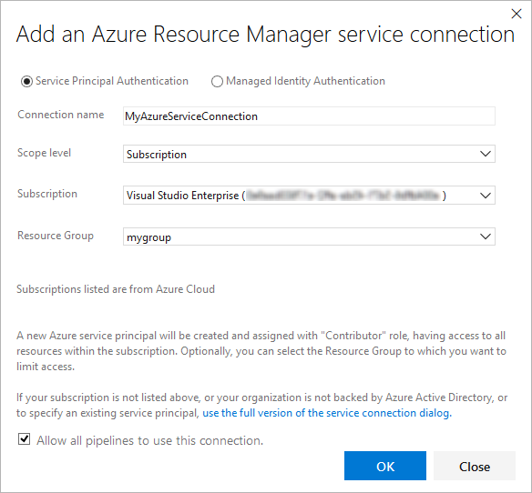

# Troubleshoot Azure Resource Manager service connections

[!INCLUDE [version-tfs-2015-rtm](../_shared/version-tfs-2015-rtm.md)]

::: moniker range="<= tfs-2018"
[!INCLUDE [temp](../_shared/concept-rename-note.md)]
::: moniker-end

This topic will help you resolve issues you may encounter when creating
a connection to Microsoft Azure using an **Azure Resource Manager** 
[service connection](../library/service-endpoints.md) for your Azure DevOps CI/CD processes.

## What happens when you create a Resource Manager service connection?

You open the **Add Azure Resource Manager service connection** dialog,
provide a connection name, and select a subscription from drop-down
list of your subscriptions.  

When you choose **OK**, the system:

1. Connects to the Azure Active Directory (Azure AD) tenant for to the selected subscription
1. Creates an application in Azure AD on behalf of the user
1. After the application has been successfully created, assigns the application as a contributor to the selected subscription
1. Creates an Azure Resource Manager service connection using this application's details

## How to troubleshoot errors that may occur

Errors that may occur when the system attempts to create the service connection include:

* [Insufficient privileges to complete the operation](#privileges)
* [Failed to obtain an access token](#sessionexpired)
* [A valid refresh token was not found](#sessionexpired)
* [Failed to assign contributor role](#contributorrole)

### Insufficient privileges to complete the operation

This typically occurs when the system attempts to create an
application in Azure AD on your behalf.

This is a permission issue that may be due to the following causes:

* [The user has only guest permission in the directory](#guestonly)
* [The user is not authorized to add applications in the directory](#notauthtoadd)

#### The user has only guest permission in the directory

The best approach to resolve this issue, while granting only the minimum additional permissions
to the user, is to increase the Guest user permissions as follows.

1. Sign into the Azure portal at [https://portal.azure.com](https://portal.azure.com) using an administrator account.
   The account should be an [owner](/azure/role-based-access-control/built-in-roles#owner),
   [global administrator](/azure/active-directory/active-directory-assign-admin-roles-azure-portal#global-administrator), or
   [user account administrator](/azure/active-directory/active-directory-assign-admin-roles-azure-portal#user-account-administrator).

1. Choose **Azure Active Directory** in the left navigation bar.

1. Ensure you are editing the appropriate directory corresponding to the user subscription. If not, select **Switch directory** and log in using the appropriate credentials if required.

1. In the **MANAGE** section choose **Users**.

1. Choose **User settings**.

1. In the **External users** section, choose **Manage external collaboration settings**.

1. The **External collaboration settings** blade opens.

1. Change **Guest user permissions are limited** to **No**.

Alternatively, if you are prepared to give the user additional (administrator-level) permissions,
you can make the user a member of the **Global administrator** role as follows.

> **WARNING**: Users with this role have access to all administrative features in Azure Active Directory, as well as services that use Azure Active Directory identities such as Exchange Online, SharePoint Online, and Skype for Business Online. 

1. Sign into the Azure portal at [https://portal.azure.com](https://portal.azure.com) using an administrator account.
   The account should be an [owner](/azure/role-based-access-control/built-in-roles#owner),
   [global administrator](/azure/active-directory/active-directory-assign-admin-roles-azure-portal#global-administrator), or
   [user account administrator](/azure/active-directory/active-directory-assign-admin-roles-azure-portal#user-account-administrator).

1. Choose **Azure Active Directory** in the left navigation bar.

1. Ensure you are editing the appropriate directory corresponding to the user subscription. If not, select **Switch directory** and log in using the appropriate credentials if required.

1. In the **MANAGE** section choose **Users**.
   
1. Use the search box to filter the list and then choose the user you want to manage.

1. In the **MANAGE** section choose **Directory role** and change the role to **Global administrator**.

1. Save the change.

It typically takes 15 to 20 minutes to apply the changes globally.
After this period has elapsed, the user can retry creating the service connection.

#### The user is not authorized to add applications in the directory

You must have permission to add integrated applications in the directory.
The directory administrator has permission to change this setting, as follows:

1. Choose **Azure Active Directory** in the left navigation bar.

1. Ensure you are editing the appropriate directory corresponding to the user subscription. If not, select **Switch directory** and log in using the appropriate credentials if required.

1. In the **MANAGE** section choose **Users**.

1. Choose **User settings**.

1. In the **App registrations** section, change **Users can register applications** to **Yes**.

### Failed to obtain an access token or A valid refresh token was not found

These errors typically occur when your session has expired.

To resolve these issues:

* Sign out of Azure Pipelines or TFS.
* Open an InPrivate or incognito browser window and navigate to [https://visualstudio.microsoft.com/team-services/](https://visualstudio.microsoft.com/team-services/).
* If you are prompted to sign out, do so.
* Sign in using the appropriate credentials.
* Choose the organization you want to use from the list.
* Select the project you want to add the service connection to.
* Create the service connection you need by opening the **Settings** page, selecting the **Services** tab,
  choosing **New service connection**, and selecting **Azure Resource Manager**.

### Failed to assign Contributor role

This error typically occurs when you do not have **Write** permission
for the selected Azure subscription when the system attempts to assign
the **Contributor** role.

To resolve this issue, ask the subscription administrator to
[configure your identity in an **Admin Access** role](/azure/active-directory/fundamentals/active-directory-users-assign-role-azure-portal).

[!INCLUDE [rm-help-support-shared](../_shared/rm-help-support-shared.md)]
