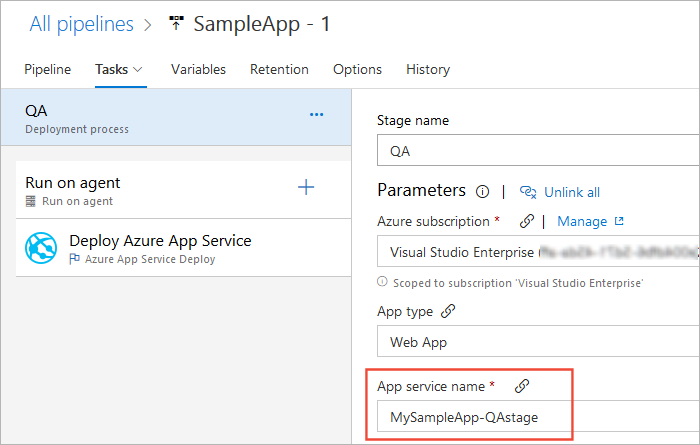
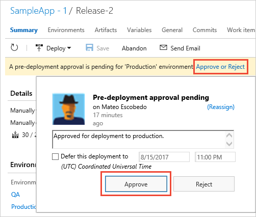

# Define your multi-stage continuous deployment (CD) process

::: moniker range="<= tfs-2018"
[!INCLUDE [temp](../_shared/concept-rename-note.md)]
::: moniker-end

Visual Studio Team Services (VSTS) and Team Foundation Server (TFS) provide a highly
configurable and manageable pipeline for releases to multiple environments
such as development, staging, QA, and production environments; including
requiring approvals at specific stages.

In this tutorial, you learn about:

> [!div class="checklist"]
> * Configuring triggers within the release pipeline
> * Extending a release pipeline by adding environments
> * Configuring the environments as a multi-stage release pipeline
> * Adding approvals to your release pipeline
> * Creating a release and monitoring the deployment to each environment

## Prerequisites

You'll need:

* A release pipeline that contains at least one environment. If you don't already have one,
  you can create it by working through any of the following quickstarts and tutorials:

  - [Deploy to an Azure Web App](../apps/cd/deploy-webdeploy-webapps.md)
  - [Azure DevOps project](../get-started-azure-devops-project.md)
  - [Deploy to IIS web server on Windows](../apps/cd/deploy-webdeploy-iis-deploygroups.md)

* Two separate targets where you will deploy the app. These could be virtual machines,
  web servers, on-premises physical deployment groups, or other types of deployment target.
  In this example, we are using Azure App Services website instances.
  If you decide to do the same, you will have to choose names that are unique, but it's a good idea to include
  "QA" in the name of one, and "Production" in the name of the other so that you
  can easily identify them. Use the Azure portal to create a new web app.

## Configure the triggers in your release pipeline

In this section, you will check that the triggers you need for continuous deployment are configured in your release pipeline.

1. In the **Build &amp; Release** hub, open the **Releases** tab. Select your release pipeline and, in
   the right pane, choose **Edit**.

   

1. Choose the **Continuous deployment trigger** icon in the **Artifacts** section to open the trigger panel.
   Make sure this is enabled so that a new release is created after every new successful build is completed.

   

   For more information, see [Release triggers](../release/triggers.md?toc=/vsts/deploy-azure/toc.json)
   in the Release Management documentation.

1. Choose the **Pre-deployment conditions** icon in the **Environments** section to open the conditions panel.
   Make sure that the trigger for deployment to this environment is set to **Release**.
   This means that a deployment will be initiated automatically when a new release is created from this release pipeline.   

   

   Notice that you can also define artifact filters that determine a condition for the release to proceed,
   and set up a schedule for deployments. You can use features to, for example, specify a branch from
   which the build artifacts must have been created, or a specific time of day when you know the app will not be heavily used.
   For more information, see [Environment triggers](../release/triggers.md?toc=/vsts/deploy-azure/toc.json)
   in the Release Management documentation.

## Extend a release pipeline by adding environments

In this section, you will add a new environment to the release pipeline. The two environments will deploy your app to the
"QA" and the "Production" targets (in our example, two Azure App Services websites). This is a typical scenario where you deploy initially to a test or staging server, and then to a
live or production server. Each [environment](../release/environments.md?toc=/vsts/deploy-azure/toc.json)
represents one deployment target, though that target could be a physical or virtual server,
a groups of servers, or any other legitimate physical or virtual deployment target.

1. In the **Pipeline** tab of your release pipeline, select the existing environment and rename it to **Production**.

   

1. Open the **+ Add** drop-down list and choose **Clone environment** (the clone option is available only
   when an existing environment is selected).

   

   Typically, you want to use the same deployment methods with a test and a production environment
   so that you can be sure the deployed apps will behave in exactly the same way. Therefore, cloning an existing
   environment is a good way to ensure you have the same settings for both. Then you just need to change the deployment
   targets (the websites where each copy of the app will be deployed).

1. The clone of the environment appears after the existing environment in the pipeline, and has the name **Copy of Production**.
   Select this environment and, in the **Environment** panel, change the name to **QA**.

   

1. To reorganize the environments in the pipeline, choose the **Pre-deployment conditions** icon for the **QA** environment and
   set the trigger to **After release**. The pipeline diagram changes to show that the deployment to the two environments will
   now execute in parallel.

   

1. Choose the **Pre-deployment conditions** icon for the **Production** environment and
   set the trigger to **After environment**, then select **QA** in the **Environments** drop-down list.
   The pipeline diagram changes to show that the deployment to the two environments will
   now execute in the required order.

   

   Notice that you can specify deployment to start when a deployment to the previous environment is _partially_ successful.
   Usually, this means the deployment tasks were set to continue the deployment even if a specific non-critical task failed
   (the default is that all tasks must succeed). You're most likely to set this option if you create a pipeline containing
   [fork and join deployments](../../pipelines/release/triggers.md?toc=/vsts/deploy-azure/toc.json)
   that deploy to different environments in parallel.  

1. Open the **Tasks** drop-down list and choose the **QA** environment.

   

1. Recall that this environment is a clone of the original **Production** environment in the release pipeline.
   Therefore, currently, it will deploy the app to the same target as the **Production** environment. Depending on the
   tasks that you are using, change the settings so that this environment deploys to your "QA" target. In our example,
   using Azure App Services websites, we just need to select the **Deploy Azure App Service** task and select the "QA"
   website instead of the "Production" website.

   

   If you are using a different type of task to deploy your app, the way you change the target for the deployment
   may differ. For example, if you are using deployment groups, you may be able to select a different deployment group,
   or a different set of tags within the same deployment group.

[!INCLUDE [edit-template-vars-in-environment](../apps/_shared/edit-template-vars-in-environment.md)]

## Add approvals within a release pipeline

The release pipeline you have modified deploys to test and then to production. If the deployment to test fails, the trigger
on the production environment does not fire, and so it is not deployed to production. However, it is typically the case that
you want the deployment to pause after _successful_ deployment to the test website so that you can verify the app is working correctly before
you deploy to production. In this section, you will add an approval step to the release pipeline to achieve this.

1. Back in the **Pipeline** tab of the release pipeline, choose the **Pre-deployment conditions** icon in the **Environments** section
   to open the conditions panel. Scroll down to the **Pre-deployment approvers** section and enable pre-deployment approvals.

   

1. In the **Approvers** section, choose your organization from the list. You
   can type part of a name to search for matches. Also make sure you clear (untick) the checkbox 
   **User requesting a release...** so that you can approve your own releases.

   

   You can add as many approvers as you need, both individual accounts and organization groups.
   It's also possible to set up post-deployment approvals by choosing the icon at the right side of the environment item in the pipeline diagram.
   For more information, see [Approvals and gates overview](../../pipelines/release/approvals/index.md?toc=/vsts/deploy-azure/toc.json).

1. Save the modified release pipeline.

   

## Create a release

Now that you have completed the modifications to the release pipeline, it's time to start the deployment. To do this, you
create a release from the release pipeline. A release may be created automatically; for example, the continuous deployment
trigger is set in the release pipeline. This means that modifying
the source code will start a new build and, from that, a new release. However, in this section you will create a new release manually.

1. Open the **Release** drop-down list and choose **Create release**.

   

1. Enter a description for the release, check that the correct artifacts are selected, and then choose **Create**.

   

1. After a few moments, a banner appears indicating that the new release was created.
   Choose the link (the name of the release).

   

1. The release summary page opens showing details of the release. In the **Environments** section,
   you will see the deployment status for the "QA" environment change from "IN PROGRESS" to "SUCCEEDED" and, at that point,
   a banner appears indicating that the release is now waiting for approval.
   When a deployment to an environment is pending or has failed, a blue (i) information icon is shown.
   Point to this to see a pop-up containing the reason.

   

   Other views, such as the list of releases, also display an icon that indicates approval is pending.
   The icon shows a pop-up containing the environment name and more details when you point to it.
   This makes it easy for an administrator to see which releases are awaiting approval, as well as the overall progress of all releases.    

   

1. Choose the **Approve or Reject** link to open the approval dialog. Enter a brief note about the
   approval, and choose **Approve**.

   

   Notice that you can defer a deployment to a specific day and time; for example, a time when you expect the app to be only lightly loaded.
   You can also reassign the approval to another user. Release administrators can open _any_ approval
   and over-ride it to accept or reject that deployment.

## Monitor and track deployments

In this section, you will see how you can monitor and track deployments - in this example to two Azure App Services websites -
from the release you created in the previous section.

1. In the release summary page, choose the **Logs** link. While the deployment is taking place,
   this page shows the live log from the agent and, in the left pane, an indication of the status
   of each operation in the deployment process for each environment.

   

   >Choose the icon in the **Action** column for a pre-deployment or post-deployment approval to see details
   of who approved (or rejected) the deployment, and the message that user provided.

1. After the deployment is complete, the entire log file is displayed in the right pane.
   Select any of the process steps in the left pane to show just the log file contents for that step.
   This makes it easier to trace and debug individual parts of the overall deployment. Alternatively, download
   the individual log files, or a zip of all the log files, from the icons and links in the page.

   

1. Open the **Summary** tab to see the overall detail of the release. It shows details of the build and
   the environments it was deployed to - along with the deployment status and other information about
   the release.   

   

1. Select each of the environment links to see more details about
   existing and pending deployments to that specific environment.
   You can use these pages to verify that the same build was deployed to both environments.

   

1. Open the deployed production app in your browse. For example, for an Azure App Services website, from the URL `http://[your-app-name].azurewebsites.net`

   

If you are having problems with a deployment, you can get more information from the log files by
[running the release in debug mode](../../pipelines/release/variables.md#debug-mode).

## Next step

> [!div class="nextstepaction"]
> [Use approvals and gates to control your deployment](deploy-using-approvals.md)
