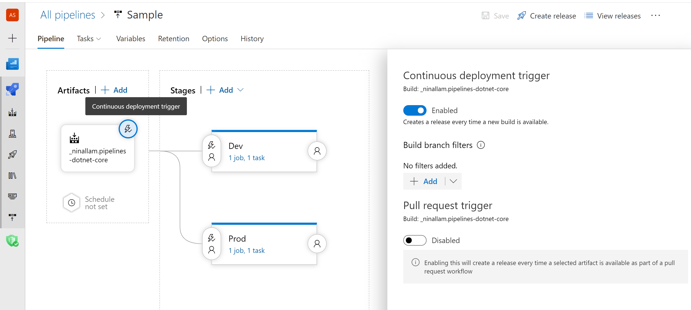
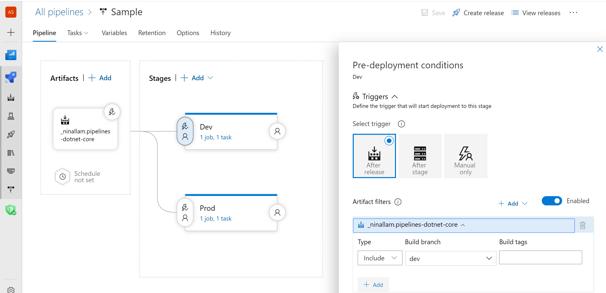
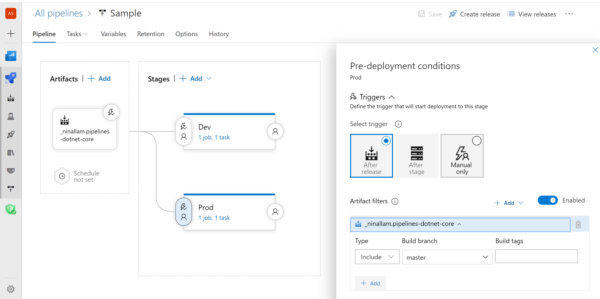

# Deploy from multiple branches using Azure Pipelines

**Azure Pipelines | Azure DevOps Server 2019**

Artifact filters can be with After release triggers to deploy from multiple branches. When you use an artifact filter and select a build branch, the stage will execute only when the the artifact filter condition is met.

## Prerequisites

You'll need:

* A build pipeline builds multiple branches and publishes an artifact

  - [Build multiple branches](/azure/devops/pipelines/build/ci-build-git)
 
* Two separate targets where you will deploy the app. These could be virtual machines,
  web servers, on-premises physical deployment groups, or other types of deployment target.
  You will have to choose names that are unique, but it's a good idea to include
  "Dev" in the name of one, and "Prod" in the name of the other so that you
  can easily identify them. 

## Set up a release pipeline

1. In **Azure Pipelines**, open the **Releases** tab. Create a New release Pipeline. Add the build artifact     that was published in your build pipeline.

1. Choose the **Continuous deployment trigger** icon in the **Artifacts** section to open the trigger panel.
   Make sure this is enabled so that a new release is created after every new successful build is completed.

   

1. Add a stage and name it *Dev*. This stage would be triggered if the artifact was published from the dev      branch.

1. Choose the **Pre-deployment conditions** icon in the **Stages** section to open the conditions panel.
   Make sure that the trigger for deployment to this stage is set to **After release**.
   This means that a deployment will be initiated automatically when a new release is created from this release pipeline.   

1. Enable the **Artifact filters**. Click on Add and select the artifact. In the **Build branch** select the    dev branch. Click on Save.

    

1. Add another stage and name it *Prod*. This stage would be triggered if the artifact was published from       the master branch. Repeat steps 4-5 by selecting **Build branch** as master.

    

1. Add the deployment tasks in each stage

The next time the pipeline runs, only the artifact filter will filter the branch which triggered the build and only that stage will get executed.

 

## Related articles

- [Release triggers](triggers.md)

If you encounter issues or have suggestions, please feel free to [post a comment or create a post on Developer Community](https://developercommunity.visualstudio.com/spaces/21/index.html).
