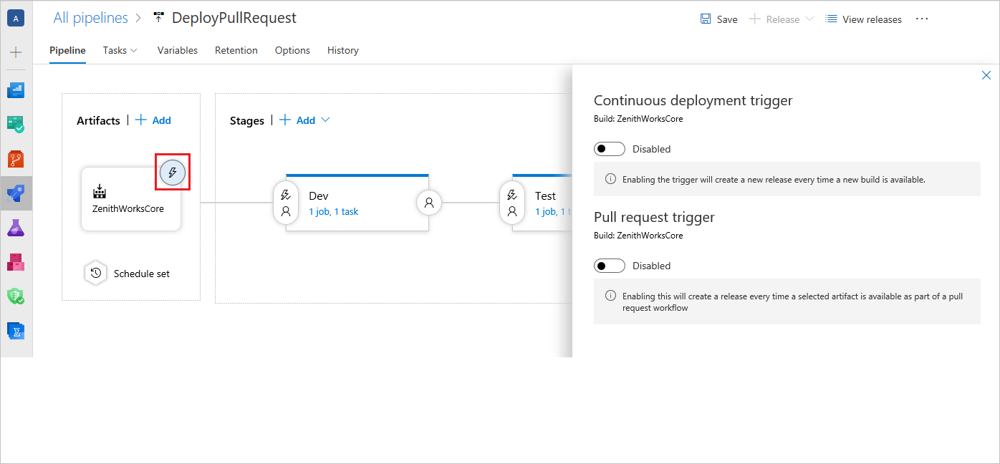
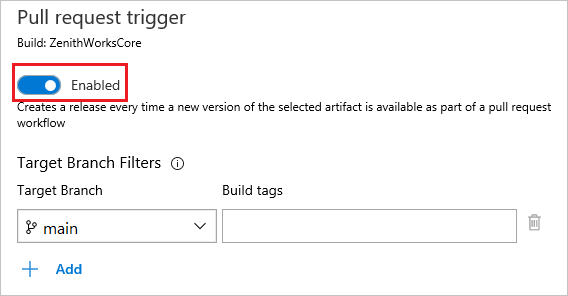
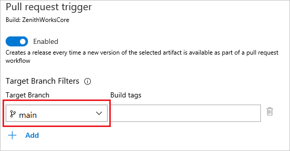
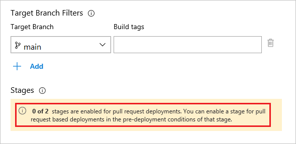
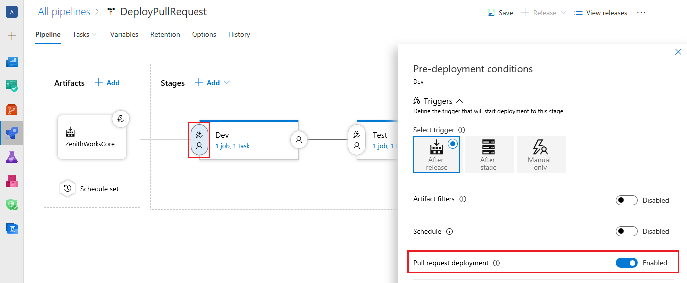
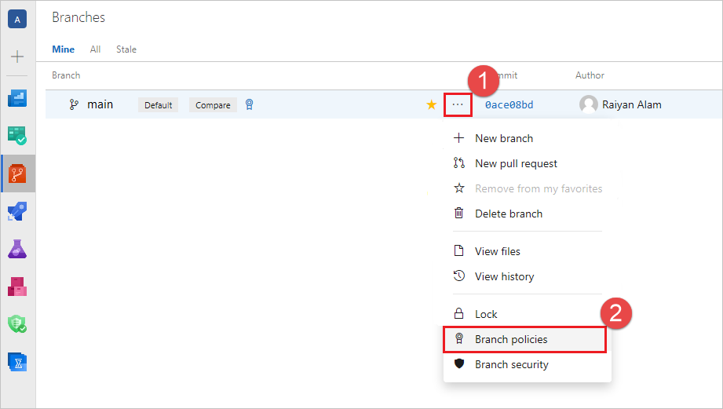
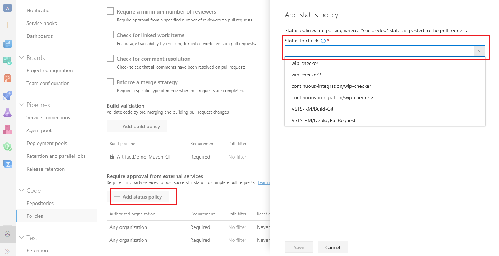
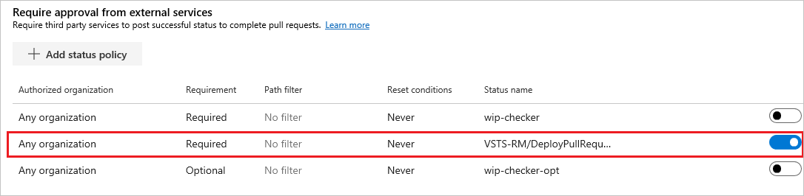
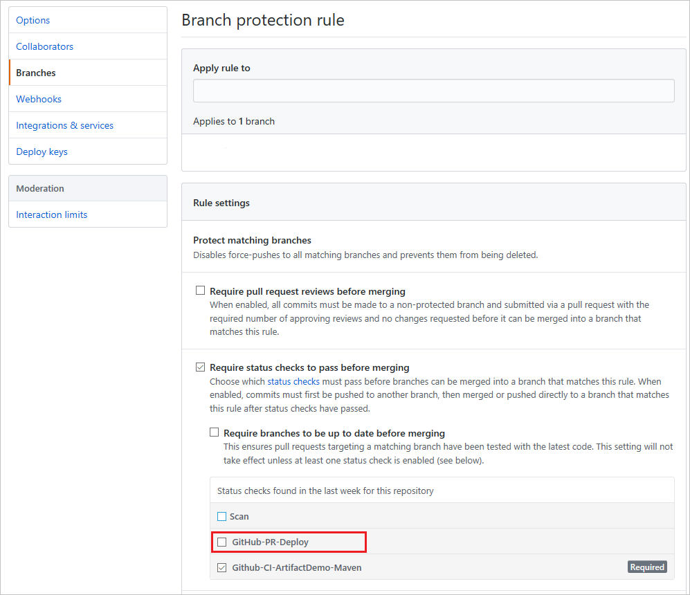
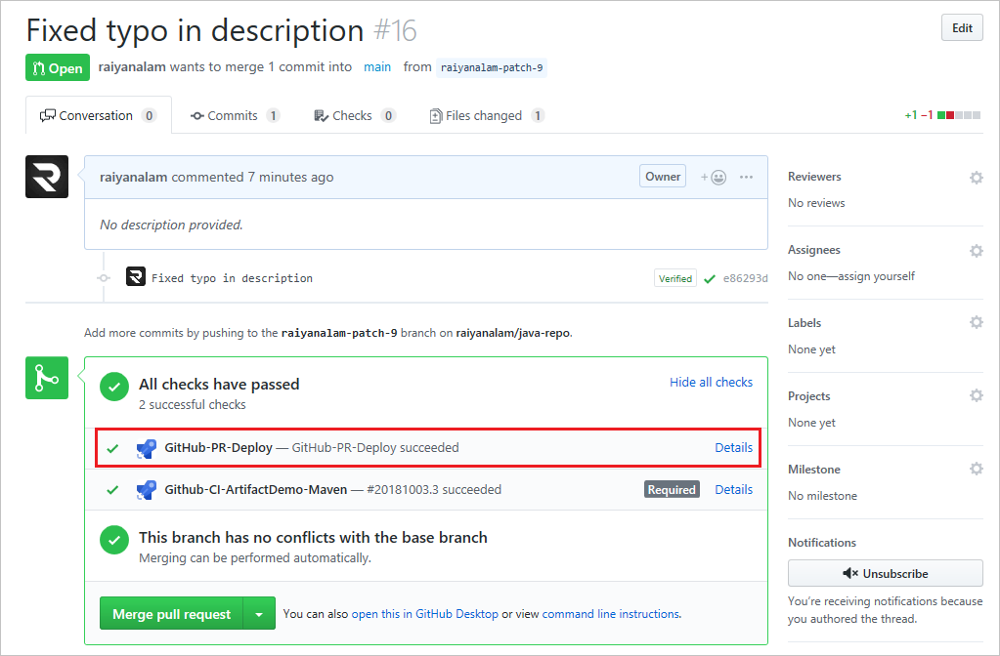

# Deploy pull request Artifacts with Azure Pipelines

**Azure DevOps Services | Azure DevOps Server 2020 | Azure DevOps Server 2019**

Pull requests provide an effective way to have code reviewed before it is merged to the codebase. However, certain issues can be tricky to find until the code is built and deployed to an environment. Before the introduction of [pull request release triggers](/azure/devops/release-notes/2018/aug-21-vsts#perform-additional-testing-using-a-pull-request-release-trigger), when a PR was raised, you could trigger a build, but not a deployment. Pull request triggers enable you to set up a set of criteria that must be met before deploying your code. You can use pull request triggers with code hosted on Azure Repos or GitHub.

Configuring pull request based releases has two parts:

1. Setting up a pull request trigger.
2. Setting up a branch policy (in Azure Repos) or a status check (in GitHub) for your release pipeline.

Once a pull request release is configured, anytime a pull request is raised for the protected branch a release is triggered automatically, deployed to the specified environments, and the status of the deployment is displayed in the PR page. Pull request deployments may help you catch deployment issues early in the cycle, maintain better code quality, and release with higher confidence.

This article shows how you can set up a pull request based release for code hosted in Azure Repos and in GitHub.

## Create a pull request trigger

Pull request trigger creates a release every time a new version of your selected Artifact is available. You can set up PR triggers with both Azure repos or GitHub repositories.

1. Under **Artifacts** select the **Continuous deployment trigger** icon.

   > [!div class="mx-imgBorder"]
   > 

2. Select the pull request trigger toggle and set it to **Enabled**.

   > [!div class="mx-imgBorder"]  
   > 

3. Set up one or more target branches. Target branches are the branches for which the pull request is raised. When a pull request is created for one of these branches, it triggers a build, and when the build succeeds, it triggers the PR release. You can optionally specify build tags as well.

   > [!div class="mx-imgBorder"]
   > 

4. To deploy to a specific stage you need to explicitly opt-in that stage. The **Stages** section shows the stages that are enabled for pull request deployments.

   > [!div class="mx-imgBorder"]
   > 

   To opt-in a stage for PR deployment, select the **Pre-deployment conditions** icon for that specific stage and under the **Triggers** section, select **Pull request deployment** to set it to **Enabled**. 

   > [!div class="mx-imgBorder"]
   > 

> [!IMPORTANT]
> For critical stages like production, **Pull request deployment** should not be turned on.

## Set up branch policy for Azure Repos

You can use branch policies to implement a list of criteria that must be met for a PR to be merged.

1. Under **Repos** select **Branches** to access the list of branches for your repository.

   > [!div class="mx-imgBorder"]
   > 

2. Select the the context menu `...` for your appropriate branch and select **Branch policies**.

   > [!div class="mx-imgBorder"]
   > 

3. Select **Add status policy** and select a status policy from the **status to check** dropdown menu. The dropdown contains a list of recent statuses. The release definition should have run at least once with the PR trigger switched on in order to get the status. Select the status corresponding to your release definition and save the policy.

   > [!div class="mx-imgBorder"]
   > 

   You can further customize the policy for this status, like making the policy required or optional. For more information, see [Configure a branch policy for an external service](../../repos/git/pr-status-policy.md).

4. You should now be able to see your new status policy in the list. Users won't be able to merge any changes to the target branch until "succeeded" status is posted to the pull request.
   > [!div class="mx-imgBorder"]
   > 

5. You can view the status of your policies in the pull request Overview page. Depending on your policy settings, you can view the posted release status under the **Required**, **Optional**, or **Status** sections. The release status gets updated every time the pipeline is triggered.
   
   > [!div class="mx-imgBorder"]
   > 

## PR release with code hosted on GitHub

1. You can also deploy pull release builds if your code is hosted in GitHub.com and a build is generated using Azure Pipelines. After linking the intended build artifact in the release definition, perform steps 1 through 4 in the previous [Create the pull request trigger](#create-the-pull-request-trigger) section, and then configure the status checks in GitHub as described in the following section.

   

### Configure status checks in GitHub

1. Configure status checks for branch in GitHub. To learn more about status checks, see [how to enable required status checks in GitHub](https://help.github.com/articles/enabling-required-status-checks/). Note that the status corresponding to the release definition appears in GitHub only after the release definition is run at least once with the **Pull request deployment** setting enabled.

   

2. The next time the pipeline runs, the status of the release is posted back to GitHub and is displayed on the PR page.

   

## Related articles

- [Release triggers](triggers.md)
- [Supported build source repositories](../repos/index.md)

## Additional resources 
- [Azure Repos](../../repos/git/index.yml)
- [Branch policies](../../repos/git/branch-policies-overview.md)
- [Configure branch policy for an external service](../../repos/git/pr-status-policy.md)

If you encounter issues or have suggestions, please feel free to [post a comment or create a post on Developer Community](https://developercommunity.visualstudio.com/spaces/21/index.html).
