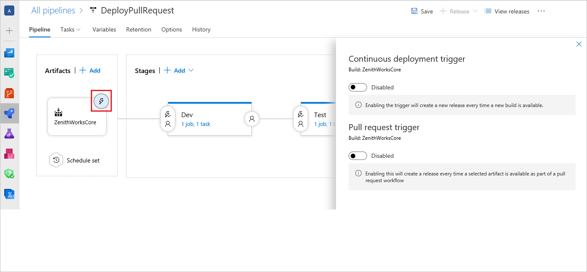
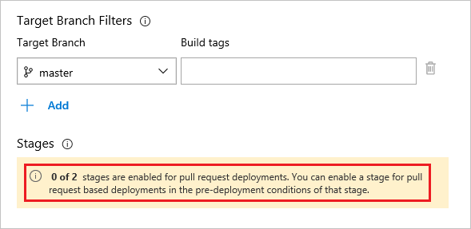
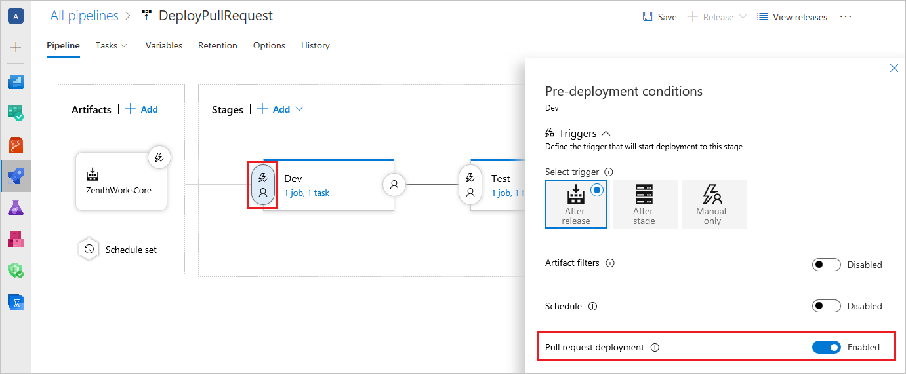
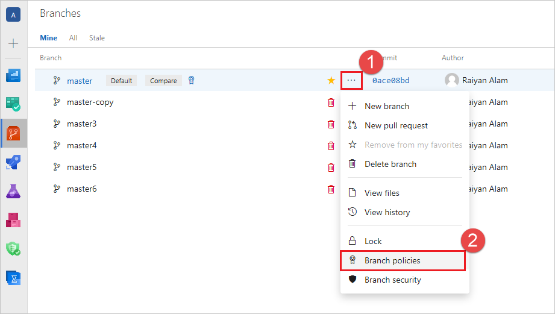
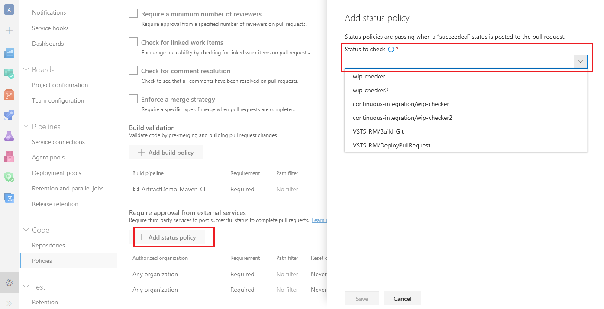
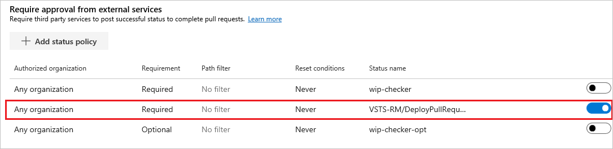
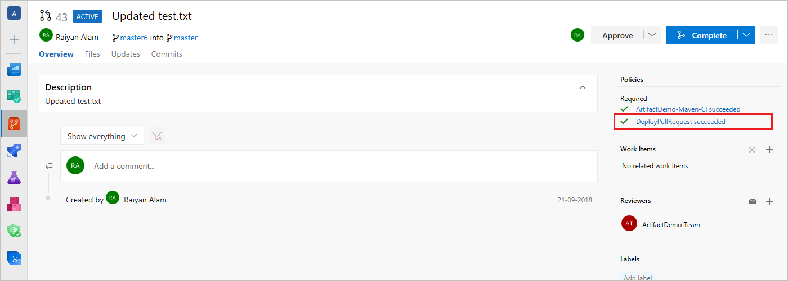
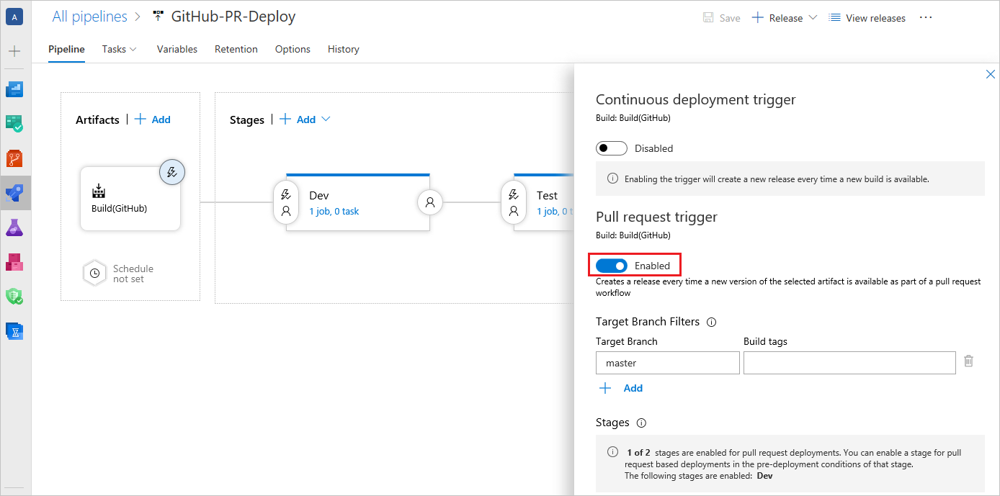
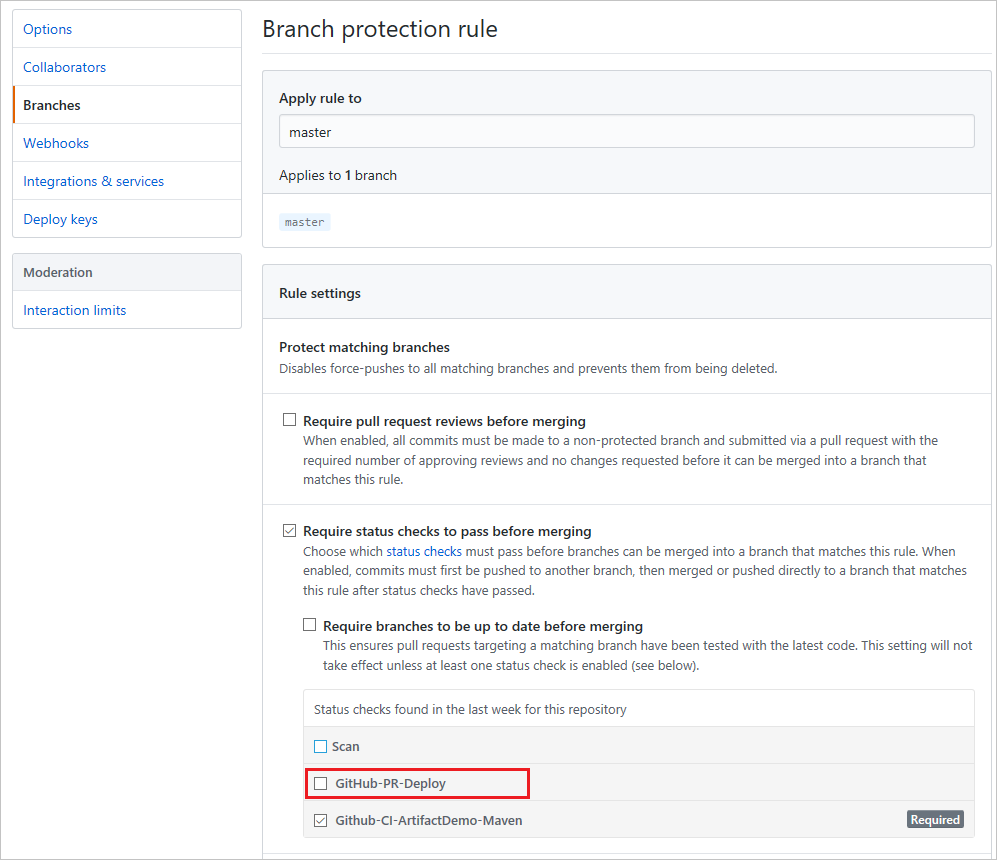
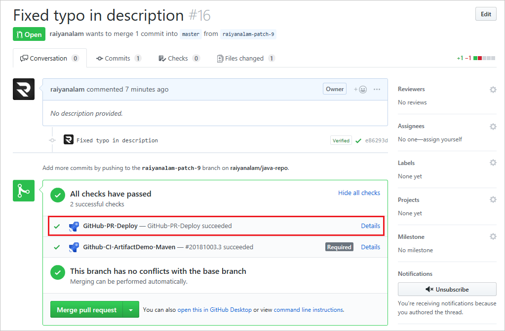

# Deploy pull request builds using Azure Pipelines

**Azure Pipelines | Azure DevOps Server 2019**

Pull requests (PRs) provide an effective way to have code reviewed before it is merged to the codebase. However, certain issues can be tricky to find until the code is built and deployed to an environment. Before the introduction of [pull request release triggers](/azure/devops/release-notes/2018/aug-21-vsts#perform-additional-testing-using-a-pull-request-release-trigger), when a PR was raised, you could trigger a build, but not a deployment. Pull request triggers enable you to create pull request releases that deploy your PR code or PR builds to detect deployment issues before the code changes are merged. You can use pull request triggers with code hosted on Azure Repos or GitHub.

Configuring pull request based releases has two parts:

0. Setting up a pull request trigger for the intended artifact in a release pipeline
0. Setting up a branch policy (in Azure Repos) or a status check (in GitHub) for the release pipeline

Once a pull request release is configured, anytime a pull request is raised for the protected branch, a release is triggered automatically, deployed to the specified environments, and the status of the deployment is displayed in the PR page. Pull request deployments may help you catch deployment issues early in the cycle, maintain better code quality, and release with higher confidence.

This article shows how you can set up a pull request based release for code hosted in Azure Repos and in GitHub.

## PR release with code hosted on Azure Repos

### Create the pull request trigger

0. Select the trigger of the artifact for which you want to set up a PR trigger.

  

0. Select the pull request trigger toggle and set it to **Enabled**.

  

0. Configure one or more target branches. Target branches are the branches for which the pull request is raised. When a pull request is created for one of these branches, it triggers a build, and when the build succeeds, it triggers the PR release. You can optionally specify build tags as well.

  

0. To deploy a PR release in a specific stage you need to explicitly opt-in that stage. An information bar below the **Target Branch Filters** shows the stages that have opted in for PR deployment.

  

  To opt-in a stage for PR deployment, select **Pre-deployment conditions** for the intended stage. Inside the **Triggers** section, set **Pull request deployment** to on, which allows PR releases to be deployed to this stage. 

  >[!IMPORTANT]
  > For critical stages like production, **Pull request deployment** should not be turned on.

  

Whenever a new build is generated from a PR branch, a release is deployed to the opted-in stages and the release status is posted back to the repository. The following section shows how you can display this status in your pull request, and optionally block the PR from being completed if the deployment failed.

### Configure status policy in Azure Repos

You can use branch policies to enforce successful deployment as a required criteria for a PR to be merged. The following steps detail how to configure policy in Azure Repos for a posted status.

0. Open the **Branches** page by navigating to your project in the web portal and selecting **Repos**, **Branches**.

  

0. Open the context menu for the branch for which the PRs are raised by selecting the ... icon. Select **Branch policies** from the context menu.

  

0. Select **Add status policy** to display the **Add status policy** page in the right pane. In the **status to check** dropdown, a list of recent statuses that have been posted are displayed. The status of the PR release is also be posted here with the release definition name. The release definition should have run at least once with the PR trigger switched on to see this status. Select the status corresponding to your release definition and save the policy.

  

  You can further customize the policy for this status, for example by making the policy required or optional. For more information, see [Configure a branch policy for an external service](../../repos/git/pr-status-policy.md).

0. After configuring the status policy, a new row is displayed in the policy list. Once the policy is configured, anytime a PR is raised for the configured branch (master), the PR waits for the status of the release to be posted from the corresponding release definition.

  

0. You can view the status of the pipeline run in the policies section of the pull request **Overview** page. Depending on your policy settings, you can view the posted release status under the **Required**, **Optional**, or **Status** sections. The release status is updated each time the pipeline runs.

  

## PR release with code hosted on GitHub

0. You can also deploy pull release builds if your code is hosted in GitHub.com and a build is generated using Azure Pipelines. After linking the intended build artifact in the release definition, perform steps 1 through 4 in the previous [Create the pull request trigger](#create-the-pull-request-trigger) section, and then configure the status checks in GitHub as described in the following section.

  

### Configure status checks in GitHub

0. Configure status checks for branch in GitHub. To learn more about status checks, see [how to enable required status checks in GitHub](https://help.github.com/articles/enabling-required-status-checks/). Note that the status corresponding to the release definition appears in GitHub only after the release definition is run at least once with the **Pull request deployment** setting enabled.

  

0. The next time the pipeline runs, the status of the release is posted back to GitHub and is displayed on the PR page.

  

## Learn more

- [Learn more about Azure Pipelines](../index.md)
- [Learn more about release triggers and stage triggers](triggers.md)
- [Learn more about Azure Repos](../../repos/git/index.md)
- [Learn more about branch policies](../../repos/git/branch-policies-overview.md)
- [Learn more about configuring branch policy for an external service](../../repos/git/pr-status-policy.md)

If you encounter issues or have suggestions, please feel free to [post a comment or create a post on Developer Community](https://developercommunity.visualstudio.com/spaces/21/index.html).
