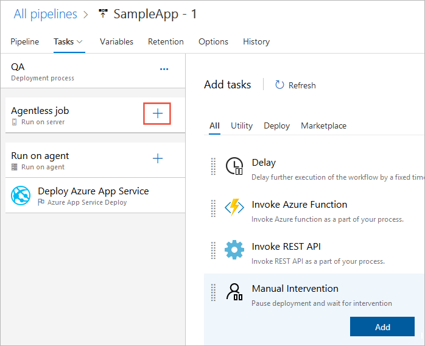
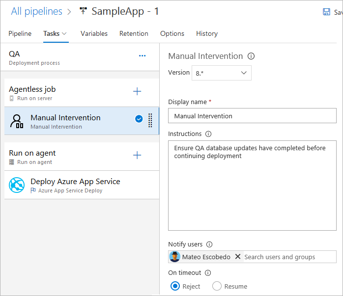
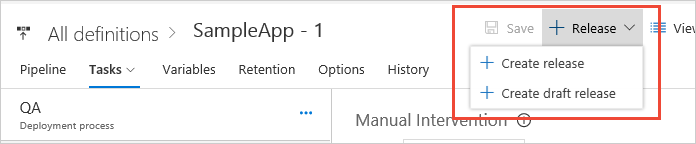
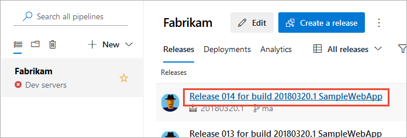
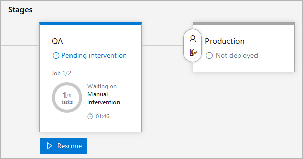
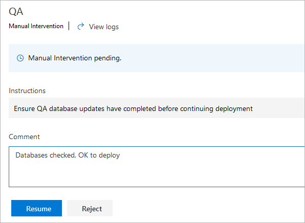

# Use gates and approvals to control your deployment

[!INCLUDE [version-tfs-2018](../includes/version-tfs-2018.md)]

::: moniker range="<= tfs-2018"
[!INCLUDE [temp](../includes/concept-rename-note.md)]
::: moniker-end

By using a combination of manual deployment approvals, gates, and manual intervention in your release pipeline, you can quickly and easily configure your deployment to meet all the specific pre-deployment requirements for your DevOps CI/CD workflow.

In this tutorial, you will learn about:

> [!div class="checklist"]
> * Pre-deployment gates
> * Manual intervention
> * Manual validation
> * Deployment logs

## Prerequisites

- Complete the [Define your multi-stage continuous deployment (CD) pipeline](define-multistage-release-process.md) tutorial.

- A work item query. You can create a new query here: [Create managed queries with the query editor](../../boards/queries/using-queries.md) if you don't already have one.

<a name="configure-gate"></a>

## Configure a gate

You can use gates to ensure that the release pipeline meets specific criteria before deployment without requiring user intervention.

1. Select **Releases**, and then select your release pipeline and then **Edit** to open the pipeline editor.

    :::image type="content" source="media/deploy-using-approvals/open-pipeline.png" alt-text="Edit the release pipeline":::

1. Select the pre-deployment icon for your stage to open the pre-deployment conditions panel, and then select the toggle button to **Enable** gates.   

    :::image type="content" source="media/deploy-using-approvals/gates-01.png" alt-text="Enable gates":::

1. Enter the delay time before the added gates are evaluated. This time is to allow gate functions to initialize and stabilize before returning results.

    :::image type="content" source="media/deploy-using-approvals/gates-02.png" alt-text="Gates delay time":::

1. Select **Add**, and then choose the **Query Work Items** task.

    :::image type="content" source="media/deploy-using-approvals/gates-03.png" alt-text="Adding Query work items task":::

1. Select an existing work item query or [create your own](../../boards/queries/using-queries.md). Depending on how many work items you expect the query to return, set your maximum and minimum thresholds.

    :::image type="content" source="media/deploy-using-approvals/gates-04.png" alt-text="Configuring the Query Work Items task":::

1. Select the **Evaluation options** section, and then specify the timeout and the sampling interval. The minimum values you can specify are 6 minutes timeout and 5 minutes sampling interval.

    :::image type="content" source="media/deploy-using-approvals/gates-05.png" alt-text="Evaluation options setup":::

1. Select **Save** when you are done.

    :::image type="content" source="media/deploy-using-approvals/gates-06.png" alt-text="Save a release pipeline":::

<a name="configure-maninter"></a>
   
## Configure a manual intervention 

Sometimes, you may need to introduce manual intervention into a release pipeline.
For example, there may be tasks that cannot be accomplished automatically such as
confirming network conditions are appropriate, or that specific hardware or software 
is in place, before you approve a deployment. You can do this by using the **Manual
Intervention** task in your pipeline.

1. In the release pipeline editor, open the **Tasks** editor for the **QA** stage.

   

1. Choose the ellipses (**...**) in the **QA** deployment pipeline bar and then choose **Add agentless job**.

   

   Several tasks, including the **Manual Intervention** task, can be used only in an
   [agentless job](../process/phases.md#server-jobs).

1. Drag and drop the new agentless job to the start of the QA process, before the existing agent job.
   Then choose **+** in the **Agentless job** bar and add a **Manual Intervention** task to the job.

   

1. Configure the task by entering a message (the **Instructions**) to display when it executes and pauses the release pipeline.

   

   Notice that you can specify a list of users who will receive a notification that the deployment
   is waiting for manual approval. You can also specify a timeout and the action (approve or reject)
   that will occur if there is no user response within the timeout period.
   For more details, see [Manual Intervention task](../tasks/utility/manual-intervention.md).

1. Save the release pipeline and then start a new release.

   

<a name="view-approvals"></a>


## Configure manual validation 

You can use the [manual validation task](../tasks/utility/manual-validation.md) to pause a YAML pipeline run and perform manual activities. You can then resume or reject the run. Manual validation is especially useful in scenarios where you want to pause a pipeline and validate configuration settings or build package before moving onto a computation-intensive job.

In this pipeline, `waitForValidation` does not run until you give manual approval. There's a prompt within the Pipeline UI to review and provide validation. The email addresses listed in `notifyUsers` will receive emails asking them to approve the pipeline. 

:::image type="content" source="media/needs-validation-prompt.png" alt-text="Add validation for the pipeline to continue.":::
    

```yaml
pool: 
   vmImage: ubuntu-latest

jobs:
- job: waitForValidation
  displayName: Wait for external validation  
  pool: server    
  timeoutInMinutes: 4320 # job times out in 3 days
  steps:   
   - task: ManualValidation@0
     timeoutInMinutes: 1440 # task times out in 1 day
     inputs:
         notifyUsers: |
            someone@example.com
         instructions: 'Please validate the build configuration and resume'
         onTimeout: 'resume'

- job: myPostValidationJob
  pool:
    vmImage: 'ubuntu-latest'
  steps:
  - bash: echo "Hello world"

```
## View the logs for approvals 

You typically need to validate and audit a release and the associated deployments
after it has completed, or even during the deployment pipeline. This is useful when
debugging a problematic deployment, or when checking when and by whom approvals were
granted. The comprehensive logging capabilities provide this information.

1. Open the release summary for the release you just created. You can do this by choosing the
   link in the information bar in the release editor after you create the release,
   or directly from the **Releases** tab of **Azure Pipelines**.

   

1. You'll see the live status for each step in the release pipeline. It indicates that a 
   manual intervention is pending (this pre-deployment approval was configured in the
   previous tutorial [Define your multi-stage continuous deployment pipeline](define-multistage-release-process.md)).
   Choose the **Resume** link.  

   

1. You see the intervention message, and can choose to resume or reject the deployment.
   Enter some text response to the intervention and choose **Resume**.

   
   
1. Go back to the pipeline view of the release. After deployment to the QA stage succeeds,
   you see the pre-deployment approval pending message for the **Production** environment.

   

1. Enter your approval message and choose **Approve** to continue the deployment.

   

1. Go back to the pipeline view of the release. Now you see that the gates are being processed before the release continues.  

   

1. After the gate evaluation has successfully completed, the deployment occurs for the Production stage.
   Choose the **Production** stage icon in the release summary to see more details of the approvals and gate evaluations.

Altogether, by using a combination of manual approvals, approval gates, and the manual
intervention task, you've seen how can configure a release pipeline with all the control and
auditing capabilities you may require.

## Next step

> [!div class="nextstepaction"]
> [Integrate with ServiceNow change management](approvals/servicenow.md)
