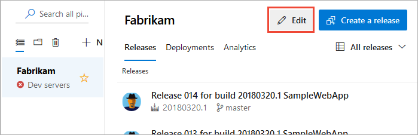
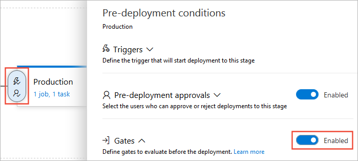
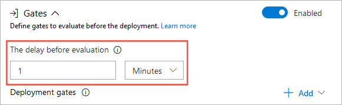
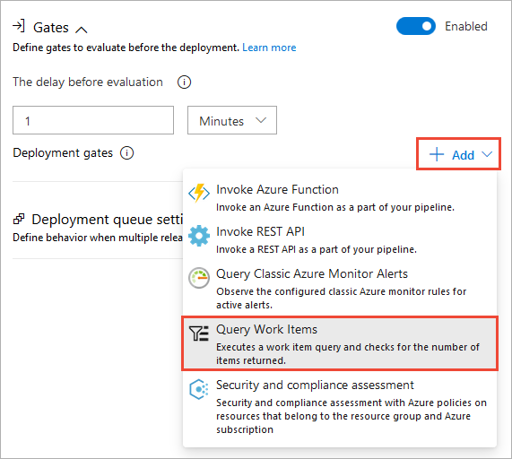
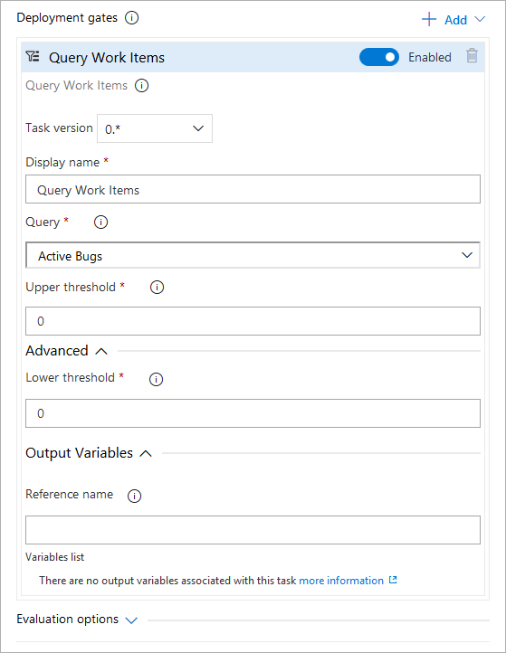
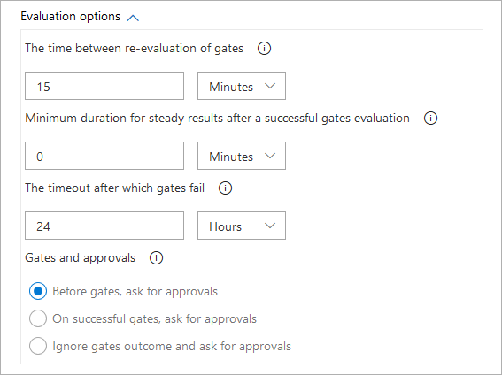

# Use approvals and gates to control your deployment

[!INCLUDE [version-tfs-2018](../_shared/version-tfs-2018.md)]

::: moniker range="<= tfs-2018"
[!INCLUDE [temp](../_shared/concept-rename-note.md)]
::: moniker-end

By using a combination of manual deployment approvals, gates, and manual
intervention within a release pipeline in Azure Pipelines and Team Foundation Server (TFS), you can quickly and easily configure
a release pipeline with all the control and auditing capabilities you require
for your DevOps CI/CD processes.

In this tutorial, you learn about:

> [!div class="checklist"]
> * Extending the approval process with gates
> * Extending the approval process with manual intervention
> * Viewing and monitoring approvals and gates

## Prerequisites

This tutorial extends the tutorial [Define your multi-stage
continuous deployment (CD) pipeline](define-multistage-release-process.md).
**You must have completed that tutorial first.**

You'll also need a **work item query** that returns some work items from
Azure Pipelines or TFS. This query is used in the gate you
will configure. You can use one of the built-in queries, or create a
new one just for this gate to use. For more information, see
[Create managed queries with the query editor](../../boards/queries/using-queries.md).

In the previous tutorial, you saw a simple use of manual approvals to allow an administrator
to confirm that a release is ready to deploy to the production stage. In this 
tutorial, you'll see some additional and more powerful ways to configure approvals 
for releases and deployments by using manual intervention and gates.
For more information about the ways you can configure approvals for a release,
see [Approvals and gates overview](../release/approvals/index.md).

## Configure a gate

First, you will extend the approval process for the release by adding a gate.
Gates allow you to configure automated calls to external services, where the results
are used to approve or reject a deployment. You can use gates to ensure that the release
meets a wide range or criteria, without requiring user intervention.

1. In the **Releases** tab of **Azure Pipelines**, select your release
   pipeline and choose **Edit** to open the pipeline editor.

   

1. Choose the pre-deployment conditions icon for the **Production** stage to
   open the conditions panel. Enable gates by using the switch control in the **Gates** section.   

   
 
1. To allow gate functions to initialize and stabilize (it may take some time for them
   to begin returning accurate results), you configure a delay before the results
   are evaluated and used to determine if the deployment should be approved or rejected.
   For this example, so that you can see a result reasonably quickly, set the delay
   to a short period such as one minute.

   

1. Choose **+ Add** and select the **Query Work Items** gate.

   

1. Configure the gate by selecting an existing work item query. You can use one of the built-in
   Azure Pipelines and TFS queries, or [create your own query](../../boards/queries/using-queries.md).
   Depending on how many work items you expect it to return, set the maximum and minimum
   thresholds (run the query in the **Work** hub if you're not sure what to expect).

   

   > You'll need to open the **Advanced** section to see the **Lower Threshold** setting.
   > You can also set an **Output Variable** to be returned from the gate task. 
   > For more details about the gate arguments, see [Work Item Query task](../tasks/utility/work-item-query.md).

1. Open the **Evaluation options** section and specify the timeout and the sampling interval.
   For this example, choose short periods so that you can see the results reasonably quickly.
   The minimum values you can specify are 6 minutes timeout and 5 minutes sampling interval.

   

   >The sampling interval and timeout work together so that the gates will call their functions
   at suitable intervals, and reject the deployment if they don't all succeed during the same sampling
   interval and within the timeout period.
   For more details, see [Gates](../release/approvals/gates.md).

1. Save you release pipeline.

   

For more information about using other types of approval gates, see [Approvals and gates](../release/approvals/index.md).

<!-- TBD - ADD GATE TASK TO TASKS LIST -->

   
## Configure a manual intervention

Sometimes, you may need to introduce manual intervention into a release pipeline.
For example, there may be tasks that cannot be accomplished automatically such as
confirming network conditions are appropriate, or that specific hardware or software 
is in place, before you approve a deployment. You can do this by using the **Manual
Intervention** task in your pipeline.

1. In the release pipeline editor, open the **Tasks** editor for the **QA** stage.

   

1. Choose the ellipses (**...**) in the **QA** deployment pipeline bar and then choose **Add agentless job**.

   

   Several tasks, including the **Manual Intervention** task, can be used only in an
   [agentless job](../process/server-phases.md).

1. Drag and drop the new agentless job to the start of the QA process, before the existing agent job.
   Then choose **+** in the **Agentless job** bar and add a **Manual Intervention** task to the job.

   

1. Configure the task by entering a message (the **Instructions**) to display when it executes and pauses the release pipeline.

   

   Notice that you can specify a list of users who will receive a notification that the deployment
   is waiting for manual approval. You can also specify a timeout and the action (approve or reject)
   that will occur if there is no user response within the timeout period.
   For more details, see [Manual Intervention task](../tasks/utility/manual-intervention.md).

1. Save the release pipeline and then start a new release.

   

## View the logs for approvals 

You typically need to validate and audit a release and the associated deployments
after it has completed, or even during the deployment pipeline. This is useful when
debugging a problematic deployment, or when checking when and by whom approvals were
granted. The comprehensive logging capabilities provide this information.

1. Open the release summary for the release you just created. You can do this by choosing the
   link in the information bar in the release editor after you create the release,
   or directly from the **Releases** tab of **Azure Pipelines**.

   

1. You'll see the live status for each step in the release pipeline. It indicates that a 
   manual intervention is pending (this pre-deployment approval was configured in the
   previous tutorial [Define your multi-stage continuous deployment pipeline](define-multistage-release-process.md)).
   Choose the **Resume** link.  

   

1. You see the intervention message, and can choose to resume or reject the deployment.
   Enter some text response to the intervention and choose **Resume**.

   
   
1. Go back to the pipeline view of the release. After deployment to the QA stage succeeds,
   you see the pre-deployment approval pending message for the **Production** environment.

   

1. Enter your approval message and choose **Approve** to continue the deployment.

   

1. Go back to the pipeline view of the release. Now you see that the gates are being processed before the release continues.  

   

1. After the gate evaluation has successfully completed, the deployment occurs for the Production stage.
   Choose the **Production** stage icon in the release summary to see more details of the approvals and gate evaluations.

Altogether, by using a combination of manual approvals, approval gates, and the manual
intervention task, you've seen how can configure a release pipeline with all the control and
auditing capabilities you may require.

## Next step

> [!div class="nextstepaction"]
> [Integrate with ServiceNow change management](approvals/servicenow.md)
