# Deploy to Azure VMs using deployment groups in Azure Pipelines

[!INCLUDE [version-tfs-2018](../../includes/version-tfs-2018.md)]

::: moniker range="<= tfs-2018"
[!INCLUDE [temp](../../includes/concept-rename-note.md)]
::: moniker-end

In earlier versions of Azure Pipelines, applications that needed to be deployed to multiple servers required a significant amount of planning and maintenance. Windows PowerShell remoting had to be enabled manually, required ports opened, and deployment agents installed on each of the servers. The pipelines then had to be managed manually if a roll-out deployment was required.

All the above challenges have been evolved seamlessly with the introduction of the [Deployment Groups](/vsts/build-release/concepts/definitions/release/deployment-groups/).

A deployment group installs a deployment agent on each of the target servers in the configured group and instructs the release pipeline to gradually deploy the application to those servers. Multiple pipelines can be created for the roll-out deployments so that the latest version of an application can be delivered in a phased manner to multiple user groups for validation of newly introduced features.

> [!NOTE]
> Deployment groups are a concept used in Classic pipelines. If you are using YAML pipelines, see [Environments](../../process/environments.md).

In this tutorial, you learn about:

> [!div class="checklist"]
> * Provisioning VM infrastructure to Azure using a template
> * Creating an Azure Pipelines deployment group
> * Creating and running a CI/CD pipeline to deploy the solution with a deployment group 

## Prerequisites

- A Microsoft Azure account.
- An Azure DevOps organization.

Use the [Azure DevOps Demo Generator](https://azuredevopsdemogenerator.azurewebsites.net/?TemplateId=77368&Name=deploymentgroups) to provision the tutorial project on your Azure DevOps organization.

## Setting up the Azure deployment environment

The following resources are provisioned on the Azure using an ARM template:

- Six Virtual Machines (VM) web servers with IIS configured
- SQL server VM (DB server)
- Azure Network Load Balancer

1. Click the **Deploy to Azure** button below to initiate resource provisioning. Provide all the necessary information and select **Purchase**. You may use any combination of allowed administrative usernames and passwords as they are not used again in this tutorial. The **Env Prefix Name** is prefixed to all of the resource names in order to ensure that those resources are generated with globally unique names. Try to use something personal or random, but if you see a naming conflict error during validation or creation, try changing this parameter and running again.

    

    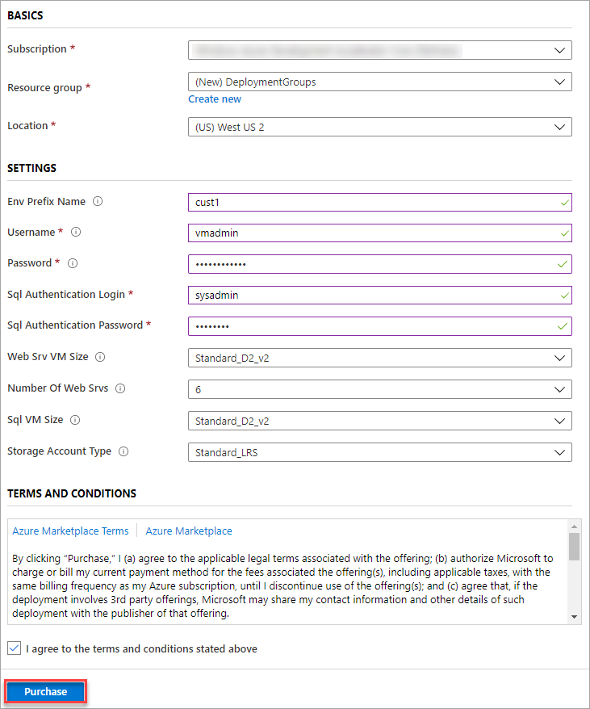

    > [!NOTE]
    > It takes approximately 10-15 minutes to complete the deployment. If you receive any naming conflict errors, try changing the parameter you provide for **Env Prefix Name**.

1. Once the deployment completes, you can review all of the resources generated in the specified resource group using the Azure portal. Select the DB server VM with **sqlSrv** in its name to view its details.

    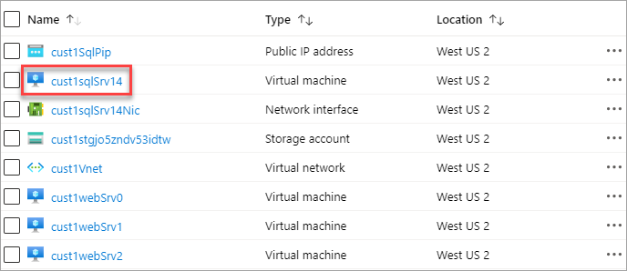

1. Make a note of the **DNS name**. This value is required in a later step. You can use the copy button to copy it to the clipboard.

    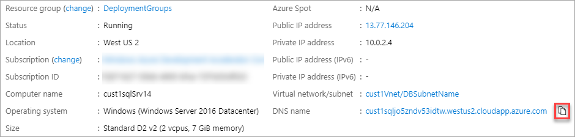

## Creating and configuring a deployment group

Azure Pipelines makes it easier to organize servers required for deploying applications. A deployment group is a collection of machines with deployment agents. Each of the machines interacts with Azure Pipelines to coordinate the deployment of the app.

Since there is no configuration change required for the build pipeline, the build is triggered automatically after the project is provisioned. When you queue a release later on, this build is used.

1. Navigate to the Azure DevOps project created by the demo generator.

1. From under **Pipelines**, navigate to **Deployment groups**.

    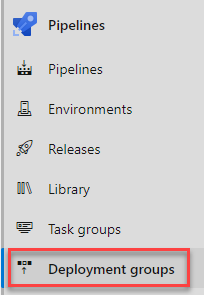

1. Select **Add a deployment group**.

1. Enter the **Deployment group name** of **Release** and select **Create**. A registration script is generated. You can register the target servers using the script provided if working on your own. However, in this tutorial, the target servers are automatically registered as part of the release pipeline. The release definition uses stages to deploy the application to the target servers. A stage is a logical grouping of the tasks that defines the runtime target on which the tasks will execute. Each deployment group stage executes tasks on the machines defined in the deployment group.

1. From under **Pipelines**, navigate to **Releases**. Select the release pipeline named **Deployment Groups** and select **Edit**.

1. Select the **Tasks** tab to view the deployment tasks in pipeline. The tasks are organized as three stages called **Agent phase**, **Deployment group phase**, and **IIS Deployment phase**.

1. Select the **Agent phase**. In this stage, the target servers are associated with the deployment group using the Azure Resource Group Deployment task. To run, an agent pool and specification must be defined. Select the **Azure Pipelines** pool and **vs2017-win2016** specification.

    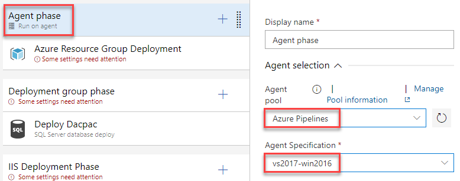

1. Select the **Azure Resource Group Deployment** task. Configure a service connection to the Azure subscription used earlier to create infrastructure. After authorizing the connection, select the resource group created for this tutorial.

    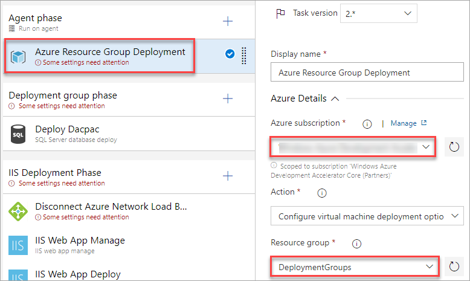

1. This task will run on the virtual machines hosted in Azure, and will need to be able to connect back to this pipeline in order to complete the deployment group requirements. To secure the connection, they will need a **personal access token (PAT)**. From the **User settings** dropdown, open **Personal access tokens** in a new tab. Most browsers support opening a link in a new tab via right-click context menu or **Ctrl+Click**.

    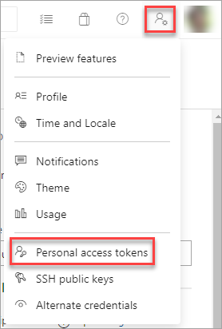

1. In the new tab, select **New Token**.

1. Enter a name and select the **Full access** scope. Select **Create** to create the token. Once created, copy the token and close the browser tab. You return to the Azure Pipeline editor.

    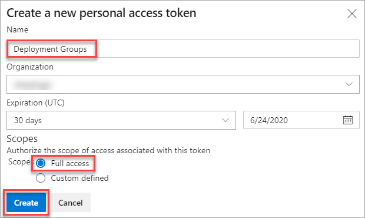

1. Under **Azure Pipelines service connection**, select **New**.

    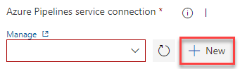

1. Enter the **Connection URL** to the current instance of Azure DevOps. This URL is something like `https://dev.azure.com/[Your account]`. Paste in the **Personal Access Token** created earlier and specify a **Service connection name**. Select **Verify and save**.

    
  
    > [!NOTE]
    > To register an agent, you must be a member of the Administrator role in the agent pool. The identity of the agent pool administrator is needed only at the time of registration. The administrator identity isn't persisted on the agent, and it's not used in any subsequent communication between the agent and Azure Pipelines or TFS. After the agent is registered, there's no need to renew the personal access token because it's required only at the time of registration.

1. Select the current **Team project** and the **Deployment group** created earlier.

    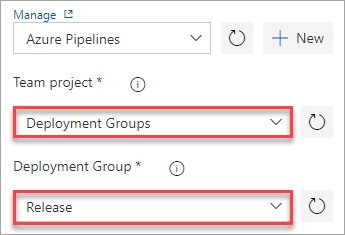

1. Select the **Deployment group phase** stage. This stage executes tasks on the machines defined in the deployment group. This stage is linked to the **SQL-Svr-DB** tag. Choose the **Deployment Group** from the dropdown.

    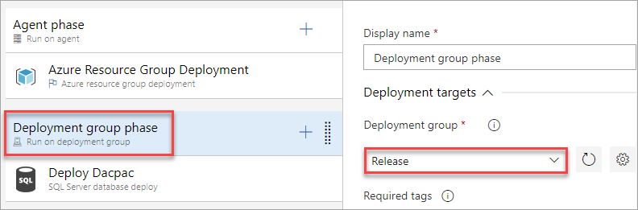

1. Select the **IIS Deployment phase** stage. This stage deploys the application to the web servers using the specified tasks. This stage is linked to the **WebSrv** tag. Choose the **Deployment Group** from the dropdown.

1. Select the **Disconnect Azure Network Load Balancer** task. As the target machines are connected to the NLB, this task will disconnect the machines from the NLB prior to the deployment and reconnect them back to the NLB after the deployment. Configure the task to use the Azure connection, resource group, and load balancer (there should only be one). 

1. Select the **IIS Web App Manage** task. This task runs on the deployment target machines registered with the deployment group configured for the task/stage. It creates a web app and application pool locally with the name **PartsUnlimited** running under the port **80**

1. Select the **IIS Web App Deploy** task. This task runs on the deployment target machines registered with the deployment group configured for the task/stage. It deploys the application to the IIS server using **Web Deploy**.

1. Select the **Connect Azure Network Load Balancer** task. Configure the task to use the Azure connection, resource group, and load balancer (there should only be one).

1. Select the **Variables** tab and enter the variable values as below.

    | Variable Name | Variable Value  |
    |--|--|
    | DatabaseName | PartsUnlimited-Dev |
    | DBPassword | P2ssw0rd@123 |
    | DBUserName |sqladmin  |
    | DefaultConnectionString | Data Source=[YOUR_DNS_NAME];Initial Catalog=PartsUnlimited-Dev;User ID=sqladmin;Password=P2ssw0rd@123;MultipleActiveResultSets=False;Connection Timeout=30; |
    | ServerName | localhost |

    > [!IMPORTANT]
    > Make sure to replace your SQL server DNS name (which you noted from Azure portal earlier) in **DefaultConnectionString** variable.

    Your DefaultConnectionString should be similar to this string after replacing the SQL DNS:

    `Data Source=cust1sqljo5zndv53idtw.westus2.cloudapp.azure.com;Initial Catalog=PartsUnlimited-Dev;User ID=sqladmin;Password=P2ssw0rd@123;MultipleActiveResultSets=False;Connection Timeout=30;`

    The final variable list should look something like this:

    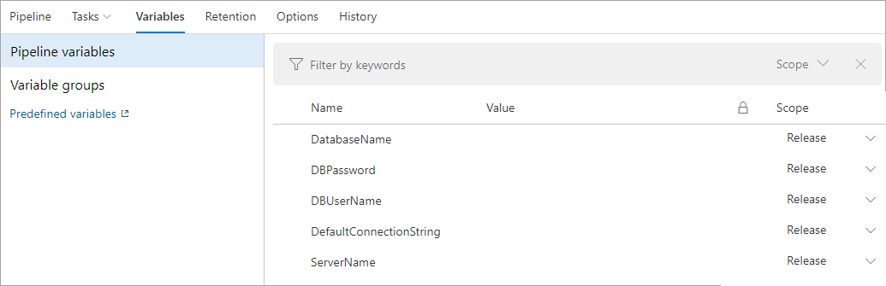

    > [!NOTE]
    > You may receive an error that the `DefaultConnectionString` variable must be saved as a secret. If that happens, select the variable and click the padlock icon that appears next to its value to protect it.

## Queuing a release and reviewing the deployment 

1. Select **Save** and confirm.

1. Select **Create release** and confirm. Follow the release through to completion. The deployment is then ready for review.

1. In the Azure portal, open one of the web VMs in your resource group. You can select any that have `websrv` in the name.

    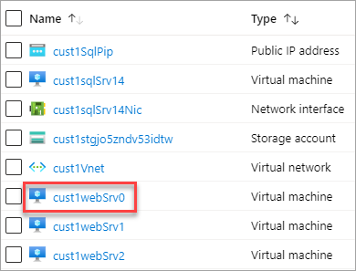

1. Copy the **DNS** of the VM. The [**Azure Load Balancer**](/azure/load-balancer/load-balancer-overview) will distribute incoming traffic among healthy instances of servers defined in a load-balanced set. As a result, the **DNS** of all web server instances is the same.

    

1. Open a new browser tab to the DNS of the VM. Confirm the deployed app is running.

    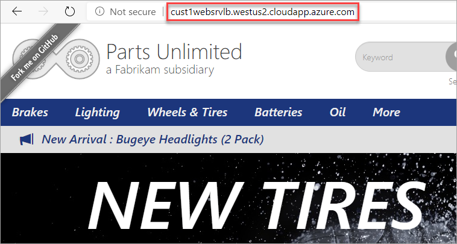

## Summary

In this tutorial, you deployed a web application to a set of Azure VMs using Azure Pipelines and Deployment Groups. While this scenario covered a handful of machines, you can easily scale the process up to support hundreds, or even thousands, of machines using virtually any configuration.

## Cleaning up resources

This tutorial created an Azure DevOps project and some resources in Azure. If you're not going to continue to use these resources, delete them with the following steps:

1. Delete the Azure DevOps project created by the Azure DevOps Demo Generator.

1. All Azure resources created during this tutorial were assigned to the resource group specified during creation. Deleting that group will delete the resources they contain. This deletion can be done via the CLI or portal.

## Next steps

> [!div class="nextstepaction"]
> [Provision agents for deployment groups](howto-provision-deployment-group-agents.md)
