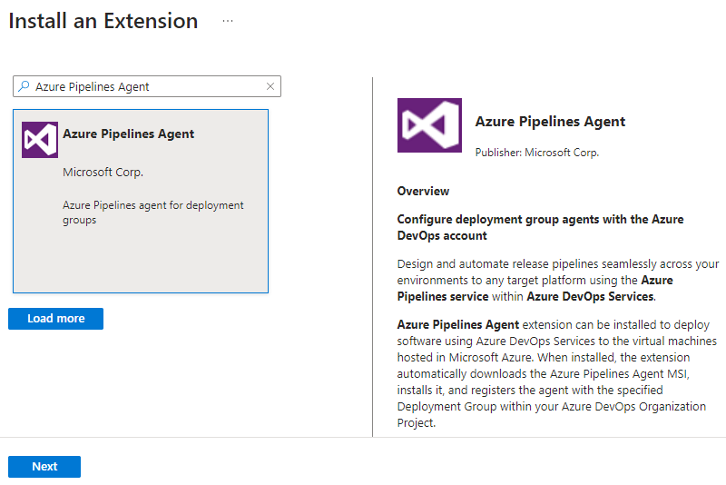

# Provision agents for deployment groups

[!INCLUDE [version-tfs-2018](../../includes/version-tfs-2018.md)]

::: moniker range="<= tfs-2018"
[!INCLUDE [temp](../../includes/concept-rename-note.md)]
::: moniker-end

[Deployment groups](index.md) make it easy to define logical groups of target machines for deployment,
and install the required agent on each machine. This topic explains how to create a deployment group,
and install and provision the agent on each virtual or physical machine in your deployment group.

You can install the agent in any one of these ways:

* [Run the script](#runscript) that is generated automatically when you create a deployment group.
* [Install the **Azure Pipelines Agent** Azure VM extension](#azureext) on each of the VMs.
* [Use the **ARM Template deployment** task](#deploytask) in your release pipeline.

For information about agents and pipelines, see:

* [Parallel jobs in Team Foundation Server](../../licensing/concurrent-pipelines-tfs.md).
* [Parallel jobs in Azure Pipelines](../../licensing/concurrent-jobs.md).
* [Pricing for Azure Pipelines features](https://visualstudio.microsoft.com/team-services/pricing/)

<a name="runscript"></a>

## Run the installation script on the target servers

1. In the **Deployment groups** tab of **Azure Pipelines**, choose **+New** to create a new group.

1. Enter a name for the group, and optionally a description, then choose **Create**.

1. In the **Register machines using command line** section of the next page, select the target machine operating system.

1. Choose **Use a personal access token in the script for authentication**. [Learn more](../../../organizations/accounts/use-personal-access-tokens-to-authenticate.md).

1. Choose **Copy the script to clipboard**.

1. Log onto each target machine in turn using the account with the [appropriate permissions](../../agents/v2-windows.md#permissions) and:

   - Open an Administrator PowerShell command prompt, paste in the script you copied, then execute it to register the machine with this group.
 
   - If you get an error when running the script that a secure channel could not be created, execute this command at the Administrator PowerShell prompt:

     `[Net.ServicePointManager]::SecurityProtocol = [Net.SecurityProtocolType]::Tls12` 
   
   - When prompted to configure tags for the agent, press `Y` and enter any tags you will use to identify subsets of the machines in the group for partial deployments.

     > Tags you assign allow you to limit deployment to specific servers when 
     the deployment group is used in a [**Run on machine group** job](../../process/deployment-group-phases.md).

   - When prompted for the user account, press *Return* to accept the defaults.

   - Wait for the script to finish with the message `Service vstsagent.{organization-name}.{computer-name} started successfully`.<p />

1. In the **Deployment groups** page of **Azure Pipelines**, open the **Machines** tab and verify that the agents are running. If the tags you configured are not visible, refresh the page.
 
<a name="azureext"></a>

## Install the Azure Pipelines Agent Azure VM extension

1. In the **Deployment groups** tab of **Azure Pipelines**, choose **+New** to create a new group.

1. Enter a name for the group, and optionally a description, then choose **Create**.

1. In the Azure portal, for each VM that will be included in the deployment group
   open the **Extension** blade, choose **+ Add** to open the **New resource** list, and select **Azure Pipelines Agent**.

   

1. In the **Install extension** blade, specify the name of the Azure Pipelines subscription to use. For example, if the URL is `https://dev.azure.com/contoso`, just specify **contoso**.

1. Specify the project name and the deployment group name.
   
1. Optionally, specify a name for the agent. If not specified, it uses the VM name appended with `-DG`.

1. Enter the [Personal Access Token (PAT)](../../../organizations/accounts/use-personal-access-tokens-to-authenticate.md) to use for authentication against Azure Pipelines.

1. Optionally, specify a comma-separated list of tags that will be configured on the agent.
   Tags are not case-sensitive, and each must no more than 256 characters.
   
1. Choose **OK** to begin installation of the agent on this VM.

1. Add the extension to any other VMs you want to include in this deployment group.

<a name="deploytask"></a>

## Use the ARM Template deployment task 

> [!IMPORTANT]
> These instructions refer to version 2 of the task. Switch your **Task version** from 3 to 2. 


You can use the [ARM Template deployment task](https://aka.ms/argtaskreadme)
to deploy an Azure Resource Manager (ARM) template that installs the Azure Pipelines Agent
Azure VM extension as you create a virtual machine, or to update the resource group
to apply the extension after the virtual machine has been created.
Alternatively, you can use the advanced deployment options of the
ARM Template deployment task to deploy the agent to deployment groups.

### Install the "Azure Pipelines Agent" Azure VM extension using an ARM template

An ARM template is a JSON file that declaratively defines a set of Azure resources.
The template can be automatically read and the resources provisioned by Azure.
In a single template, you can deploy multiple services along with their dependencies.

For a Windows VM, create an ARM template and add a resources element under the
`Microsoft.Compute/virtualMachine` resource as shown here:

```ARMTemplate
"resources": [
  {
    "name": "[concat(parameters('vmNamePrefix'),copyIndex(),'/TeamServicesAgent')]",
    "type": "Microsoft.Compute/virtualMachines/extensions",
    "location": "[parameters('location')]",
    "apiVersion": "2015-06-15",
    "dependsOn": [
        "[resourceId('Microsoft.Compute/virtualMachines/',
                      concat(parameters('vmNamePrefix'),copyindex()))]"
    ],
    "properties": {
      "publisher": "Microsoft.VisualStudio.Services",
      "type": "TeamServicesAgent",
      "typeHandlerVersion": "1.0",
      "autoUpgradeMinorVersion": true,
      "settings": {
        "VSTSAccountName": "[parameters('VSTSAccountName')]",
        "TeamProject": "[parameters('TeamProject')]",
        "DeploymentGroup": "[parameters('DeploymentGroup')]",
        "AgentName": "[parameters('AgentName')]",
        "Tags": "[parameters('Tags')]"
      },
      "protectedSettings": {
      "PATToken": "[parameters('PATToken')]"
     }
   }
  }
]
```

where:

* **VSTSAccountName** is required. The Azure Pipelines subscription to use. Example: If your URL is `https://dev.azure.com/contoso`, just specify `contoso`
* **TeamProject** is required. The project that has the deployment group defined within it
* **DeploymentGroup** is required. The deployment group against which deployment agent will be registered
* **AgentName** is optional. If not specified, the VM name with `-DG` appended will be used
* **Tags** is optional. A comma-separated list of tags that will be set on the agent. Tags are not case sensitive and each must be no more than 256 characters
* **PATToken** is required. The Personal Access Token that will be used to authenticate against Azure Pipelines to download and configure the agent

> [!NOTE]
> If you are deploying to a Linux VM, ensure that the `type` parameter in the code is `TeamServicesAgentLinux`.

### Troubleshoot the extension

These are some known issues with the extension:

* **Status file getting too big**: This issue occurs on Windows VMs; it has not been observed on Linux VMs. The status file contains a JSON object that describes the current status of the extension. The object is a placeholder to list the operations performed so far. Azure reads this status file and passes the status object as response to API requests. The file has a maximum allowed size; if the size exceeds the threshold, Azure cannot read it completely and gives an error for the status. On each machine reboot, some operations are performed by the extension (even though it might be installed successfully earlier), which append the status file. If the machine is rebooted a large number of times, the status file size exceeds the threshold, which causes this error. The error message reads: `Handler Microsoft.VisualStudio.Services.TeamServicesAgent:1.27.0.2 status file 0.status size xxxxxx bytes is too big. Max Limit allowed: 131072 bytes`. Note that extension installation might have succeeded, but this error hides the actual state of the extension.

  We have fixed this issue for machine reboots (version `1.27.0.2` for Windows extension and `1.21.0.1` for Linux extension onward), so on a reboot, nothing will be added to the status file. If you had this issue with your extension before the fix was made (that is, you were having this issue with earlier versions of the extension) and your extension was auto-upadted to the versions with the fix, the issue will still persist. This is because on extension update, the newer version of the extension still works with the earlier status file. Currently, you could still be facing this issue if you are using an earlier version of the extension with the flag to turn off minor version auto-updates, or if a large status file was carried from an earlier exension version to the newer versions that contains the fix, or for any other reason. If that is the case, you can get past this issue by uninstalling and re-installing the extension. Uninstalling the extension cleans up the entire extension directory, so a new status file will be created for fresh install. You need to install latest version of the extension. This solution is a permanemt fix, and after following this, you should not face the issue again.

* **Issue with custom data**: This issue is not with the extension, but some customers have reported confusion regarding the customdata location on the VM on switching OS versions. We suggest the following workaround. Python 2 has been deprecated, so we have made the extension to work with Python 3. If you are still using earlier OS versions that don't have Python 3 installed by default, to run the extension, you should either install Python 3 on the VM  or switch to OS versions that have Python 3 installed by default. On linux VMs, [custom data](/azure/virtual-machines/custom-data#linux) is copied to the file `/var/lib/waagent/ovf-env.xml` for earlier Microsoft Azure Linux Agent versions, and to `/var/lib/waagent/CustomData` for newer Microsoft Azure Linux Agent versions. It appears that customers who have hardcoded only one of these two paths face issues while switching OS versions because the file does not exist on the new OS version, but the other file is present. So, to avoid breaking the VM provisioning, you should consider both the files in the template so that if one fails, the other should succeed. 

For more information about ARM templates, see [Define resources in Azure Resource Manager templates](/azure/templates/).

To use the template:

1. In the **Deployment groups** tab of **Azure Pipelines**, choose **+New** to create a new group.

1. Enter a name for the group, and optionally a description, then choose **Create**.

1. In the **Releases** tab of **Azure Pipelines**, create a release pipeline with a stage that contains the **ARM Template deployment** task.

1. Provide the parameters required for the task such as the Azure subscription, resource group name,
   location, and template information, then save the release pipeline.

1. Create a release from the release pipeline to install the agents.

### Install agents using the advanced deployment options

1. In the **Deployment groups** tab of **Azure Pipelines**, choose **+New** to create a new group.

1. Enter a name for the group, and optionally a description, then choose **Create**.

1. In the **Releases** tab of **Azure Pipelines**, create a release pipeline with a stage that contains the **ARM Template deployment** task.

1. Select the task and expand the **Advanced deployment options for virtual machines** section.
   Configure the parameters in this section as follows:

   * **Enable Prerequisites**: select **Configure with Deployment Group Agent**.

   * **Azure Pipelines/TFS endpoint**: Select an existing Team Foundation Server/TFS service connection that points
     to your target. Agent registration for deployment groups requires access to your Visual
     Studio project. If you do not have an existing service connection, choose **Add** and create one now.
     Configure it to use a [Personal Access Token (PAT)](../../../organizations/accounts/use-personal-access-tokens-to-authenticate.md)
     with scope restricted to **Deployment Group**.

   * **Project**: Specify the project containing the deployment group.

   * **Deployment Group**: Specify the name of the deployment group against which the agents will be registered.  

   * **Copy Azure VM tags to agents**: When set (ticked), any tags already configured on the Azure VM will
     be copied to the corresponding deployment group agent. By default, all
     [Azure tags](/azure/azure-resource-manager/resource-group-using-tags)
     are copied using the format `Key: Value`. For example, `Role: Web`.

1. Provide the other parameters required for the task such as the Azure subscription, resource group name,
   and location, then save the release pipeline.

1. Create a release from the release pipeline to install the agents.

## Related topics

* [Run on machine group job](../../process/deployment-group-phases.md)
* [Deploy an agent on Windows](../../agents/v2-windows.md)
* [Deploy an agent on macOS](../../agents/v2-osx.md)
* [Deploy an agent on Linux](../../agents/v2-linux.md)

[!INCLUDE [rm-help-support-shared](../../includes/rm-help-support-shared.md)]
