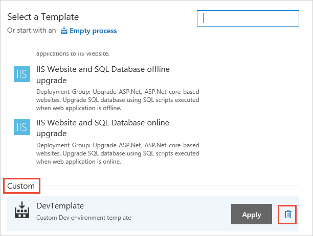

# Stage templates in Azure Pipelines

[!INCLUDE [version-tfs-2015-rtm](../_shared/version-tfs-2015-rtm.md)]

::: moniker range="<= tfs-2018"
[!INCLUDE [temp](../_shared/concept-rename-note.md)]
::: moniker-end

When you start a new release pipeline, or when you add a stage to
an existing release pipeline, you can choose from a list of templates for
each stage. These templates pre-populate the stage with the
appropriate tasks and settings, which can considerably reduce the time and
effort required to create a release pipeline for your DevOps CI/CD processes.

A set of pre-defined stage templates are available in
Azure Pipelines and in each version of TFS. You can use these templates
when you create a new release pipeline or add a new
stage to a pipeline. You can also create your own custom
stage templates from a stage you have populated and
configured.

> Templates do not have any additional security capability. There is no way to restrict the use of a template to specific users. All templates, pre-defined and custom, are available for use by all users who have permission to create release pipelines.

When a stage is created from a template, the tasks in the template are copied over to the stage.
Any further updates to the template have no impact on existing stages.
If you want a way to easily insert a number of stages into release pipelines
(perhaps to keep the definitions consistent) and to enable these stages to all be updated
in one operation, use [task groups](../library/task-groups.md) instead of stage templates.

## Q & A

### Can I export templates or share them with other subscriptions, enterprises, or projects?

Custom templates that you create are scoped to the project that you created them in.
Templates cannot be exported or shared with another project, collection, server, or organization.
You can, however, export a release pipeline and import it into another project, collection, server, or subscription.
Then you can re-create the template for use in that location.

### How do I delete a custom stage template?

You can delete an existing custom template from the list of templates that is displayed when you add a new stage to our pipeline.

### How do I update a custom stage template?

To update an stage template, delete the existing template in a release pipeline and then save the stage as a template with the same name.

[!INCLUDE [rm-help-support-shared](../_shared/rm-help-support-shared.md)]
