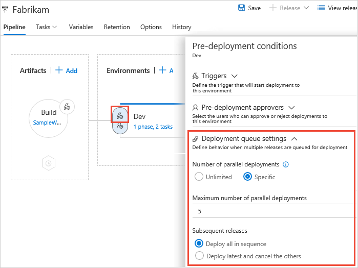
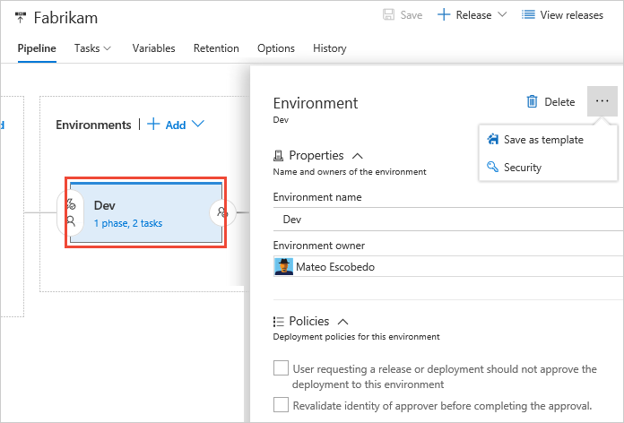

# Release stages, queuing policies, and options

[!INCLUDE [version-tfs-2015-rtm](../_shared/version-tfs-2015-rtm.md)]

::: moniker range="<= tfs-2018"
[!INCLUDE [temp](../_shared/concept-rename-note.md)]
::: moniker-end

<a name="introduction"/>
A **stage** is a _logical_ and _independent_ entity that
represents where you want to deploy a release generated from a release
pipeline. We'll examine these two characteristics in more detail
to help you understand how to divide your release pipeline into
stages in your DevOps CI/CD processes.

First, a stage in a release pipeline is a **logical** entity.
It can represent any physical or real stage that you need.
For example, the deployment in a stage may be to a collection of servers,
a cloud, or multiple clouds. In fact, you can even use a stage to represent
shipping the software to an app store, or the manufacturing process of a boxed product.

Second, you must be able to deploy to a stage **independently** of other stages in the pipeline.
For example, your pipeline might consist of two stages A and B, and Azure Pipelines could deploy Release 2
to A and Release 1 to B. If you make any assumptions in B about the existence of a certain release in A, the
two stages are not independent.

Here are some suggestions and examples for stages:

* **Dev, QA, Prod** - As new builds are produced, they can be deployed to Dev. They can then be promoted to QA, and finally to Prod.
  At any time, each of these stages may have a different release (set of build artifacts) deployed to them.
  This is a good example of the use of stages in a release pipeline.

* **Customer adoption rings** (for example, early adopter ring, frequent adopter ring, late adopter ring) -
  You typically want to deploy new or beta releases to your early adopters more often than to other users.
  Therefore, you are likely to have different releases in each of these rings. This is a good example of the use of stages in a pipeline.

* **Database and web tiers of an application** - These should be modeled as a single stage
  because you want the two to be in sync. If you model these as separate stages, you risk
  deploying one build to the database stage and a different build to the web tier stage.

* **Staging and production slots of a web site** - There is clearly an interdependence between these two slots.
  You do not want the production slot to be deployed independently of the build version currently deployed to the
  staging slot. Therefore, you must model the deployment to both the staging and production slots as a single stage.

* **Multiple geographic sites with the same application** - In this example, you want to deploy your website to many geographically distributed sites around the globe
  and you want all of them to be the same version. You want to deploy the new version of your application to a staging slot in all the sites, test it,
  and - if all of them pass - swap all the staging slots to production slots.
  In this case, given the interdependence between the sites, you cannot model each site as a different stage.
  Instead, you must model this as a single stage with parallel deployment to multiple sites
  (typically by using [jobs](../process/phases.md)).

* **Multiple test stages to test the same application** - Having one or more release pipelines,
  each with multiple stages intended to run test automation for a build, is a common practice.
  This is fine if each of the stages deploys the build independently, and then runs tests.
  However, if you set up the first stage to deploy the build, and subsequent stages to test
  the same shared deployment, you risk overriding the shared stage with a newer build while testing
  of the previous builds is still in progress.

The deployment pipeline of a release to a stage is defined in terms of [jobs](../process/phases.md) and [tasks](../process/tasks.md).
The physical deployment of a release to a stage is controlled through  
[approvals and gates](approvals/index.md), [deployment conditions and triggers](triggers.md#env-triggers),
and [queuing policies](#queuing-policies).

## Queuing policies

In some cases, you may be generating builds more quickly than
they can be deployed. Alternatively, you may configure multiple
[agents](../agents/agents.md) and, for example, be creating releases from the same release pipeline
for deployment of different artifacts. In such cases, it's useful to
be able to control how multiple releases are queued into a
stage. **Queuing policies** give you that control.

The options you can choose for a queuing policy are:

* **Number of parallel deployments**:
  Use this option if you dynamically provision new resources
  in your stage and it is physically capable of handling
  the deployment of multiple releases in parallel, but you want
  to limit the number of parallel deployments.

* If you specify a maximum number of deployments, two more options appear:

  - **Deploy all in sequence**:
    Use this option if you want to deploy all the releases
    sequentially into the same shared physical resources.
    By deploying them in turn, one after the other, you
    ensure that two deployment jobs do not target the same
    physical resources concurrently, even if there are
    multiple build and release agents available. You
    also ensure that pre-deployment approval requests for the
    stage are sent out in sequence.

  - **Deploy latest and cancel the others**:
    Use this option if you are producing releases faster
    than builds, and you only want to deploy the latest build.

To understand how these options work, consider a scenario
where releases **R1**, **R2**, **...**, **R5** of a
single release pipeline are created in quick succession
due to new builds being produced rapidly. Assume that
the first stage in this pipeline is named **QA**
and has both pre-deployment and post-deployment approvers
defined.

* If you do not specify a limit for the number of parallel deployments,
  all five approval requests will be sent out as soon as
  the releases are created. If the approvers grant approval for all of the
  releases, they will all be deployed to the **QA** stage in parallel.
  (if the **QA** stage did not have any pre-deployment
  approvers defined, all the five releases will automatically
  be deployed in parallel to this stage).

* If you specify a limit and **Deploy all in sequence**,
  and the limit has already been reached, the pre-deployment approval for
  release **R1** will be sent out first. After this
  approval is completed, the deployment of release **R1** to the
  **QA** stage begins. Next, a request for
  post-deployment approval is sent out for release **R1**. It is
  only after this post-deployment approval is completed that
  execution of release **R2** begins and its pre-deployment
  approval is sent out. The process continues like this for
  all of the releases in turn.

* If you specify a limit and **Deploy latest and cancel the others**,
  and the limit has already been reached, releases **R2**, **R3**, and **R4** will be
  skipped, and the pre-deployment approval for **R5** in
  the **QA** stage will be sent out immediately
  after the post-deployment approval for release **R1** is completed.

<h2 id="options">Stage general options</h2>

While the most important part of defining a stage is the
automation tasks, you can also configure several properties and options
for a stage in a release pipeline. You can:

* Edit the name of the stage here if required.
* Designate a single user or a single
  group to be the stage owner. Stage owners are
  notified whenever a deployment of a release is completed to that
  stage. Stage owners are not automatically assigned
  any additional permissions.
* Delete the stage from the pipeline.
* Change the order of stages.
* Save a copy of the stage as a template.
* Manage the security settings for the stage.

## Q & A

### I need to deploy two Azure resource groups in order to deploy my application. Is that one stage or two?

A stage is a logical entity that represents an independent
unit of deployment for your application, so you can deploy both the
resource groups using a single stage. For more guidance on
stages see the [introductory section](#introduction) above.

### At the end of my pipeline, I update the binaries in an app store. I really do not have any stage in this case. How do I model this in a release pipeline?

A stage is a logical entity that can be used to perform any
automation. It doesn't need to map to any physical resources.
Therefore, you can add a stage to your release pipeline
and add tasks to it to upload your binaries to the app store.

## Related topics

* [Stage triggers](triggers.md#env-triggers)
* [Tasks](../process/tasks.md)
* [Stage security](../policies/permissions.md#release-permissions)

[!INCLUDE [rm-help-support-shared](../_shared/rm-help-support-shared.md)]
