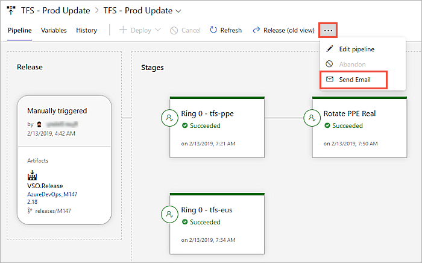

# Release pipelines

[!INCLUDE [version-tfs-2015-rtm](../_shared/version-tfs-2015-rtm.md)]

::: moniker range="<= tfs-2018"

[!INCLUDE [temp](../_shared/concept-rename-note.md)]

::: moniker-end

::: moniker range="azure-devops"
> [!NOTE] 
> This topic covers classic release pipelines. If you want to use YAML to author CI/CD pipelines, then see [Create your first pipeline](../create-first-pipeline.md).
::: moniker-end

**Release pipelines** in Azure Pipelines
and Team Foundation Server (TFS 2015.2 and later) help your team **continuously deliver** software
to your customers at a faster pace and with lower risk.
You can **fully automate** the testing and delivery of your software
in multiple stages all the way to production, or set up
semi-automated processes with **approvals** and **on-demand deployments**.

* **[Watch this video](https://channel9.msdn.com/events/Microsoft-Azure/Azure-DevOps-Launch-2018/A101)** - see Azure Pipelines releases in action.

  
<iframe src="https://channel9.msdn.com/Events/Microsoft-Azure/Azure-DevOps-Launch-2018/A101/player" width="640" height="360" allowFullScreen="true" frameBorder="0"></iframe>

## How do release pipelines work?

Release pipelines store the data about your pipelines,
stages, tasks, releases, and deployments in Azure Pipelines or TFS.

Azure Pipelines runs the following steps as part of every deployment:

1. **Pre-deployment approval:** When a new deployment request is triggered,
   Azure Pipelines checks whether a pre-deployment approval is required
   before deploying a release to a stage. If it is required, it sends
   out email notifications to the appropriate approvers.

1. **Queue deployment job:** Azure Pipelines schedules the deployment job on
   an available [automation agent](../agents/agents.md). An agent is a piece
   of software that is capable of running tasks in the deployment.

1. **Agent selection**: An automation agent picks up the job.
   The agents for release pipelines are exactly the same as those that run your
   builds in Azure Pipelines and TFS. A release pipeline can
   contain settings to select an appropriate agent at runtime.

1. **Download artifacts**: The agent downloads all the artifacts specified
   in that release (provided you have not opted to skip the download). The
   agent currently understands two types of artifacts: Azure Pipelines artifacts
   and Jenkins artifacts.

1. **Run the deployment tasks**: The agent then runs all the tasks in the
   deployment job to deploy the app to the target servers for a stage.

1. **Generate progress logs**: The agent creates detailed logs for each
   step while running the deployment, and pushes these logs back to Azure Pipelines
   or TFS.

1. **Post-deployment approval:** When deployment to a stage is complete,
   Azure Pipelines checks if there is a post-deployment approval required
   for that stage. If no approval is required, or upon completion of
   a required approval, it proceeds to trigger deployment to
   the next stage.

::: moniker range="< azure-devops-2019"

Release pipelines and build pipelines have separate UIs.
The main differences in the pipelines are the support in release
pipelines for different types of triggers, and the support for approvals and gates.

::: moniker-end

## How do I use a release pipeline?

You start using Azure Pipelines releases by authoring a release pipeline for your application. To author a release pipeline, you must specify the [artifacts](artifacts.md) that make up the application and the **release pipeline**.

An **artifact** is a deployable component of your application. It is typically produced through a Continuous Integration or a build pipeline. Azure Pipelines releases can deploy artifacts that are produced by a [wide range of artifact sources](artifacts.md#sources) such as Azure Pipelines build, Jenkins, or Team City.

You define the **release pipeline** using [stages](../process/stages.md), and restrict deployments into or out of an stage using [approvals](approvals/index.md). You define the automation in each stage using [jobs](../process/phases.md) and [tasks](../process/tasks.md). You use [variables](variables.md) to generalize your automation and [triggers](triggers.md) to control when the deployments should be kicked off automatically.

An example of a release pipeline that can be modeled through a release pipeline in shown below:

[What's the difference between a release pipeline and a release?](releases.md)

In this example, a release of a website is created by collecting specific versions of two builds (artifacts), each from a different build pipeline. The release is first deployed to a Dev stage
and then forked to two QA stages in parallel. If the deployment succeeds in both the QA stages, the release is deployed to Prod ring 1 and then to Prod ring 2. Each production ring represents multiple instances of the same website deployed at various locations around the globe.

::: moniker range=">= tfs-2017"

An example of how deployment automation can be modeled within an stage is shown below:

In this example, a [job](../process/phases.md) is used to deploy the app to websites across the globe in parallel within production ring 1.
After all those deployments are successful, a second job is used to switch traffic from the previous version to the newer version.

::: moniker-end

::: moniker range="<= tfs-2015"

> **TFS 2015**: Jobs, and fork and join deployments, are not available in TFS 2015.

::: moniker-end

**Next:**

* **[Create your first pipeline](../create-first-pipeline.md)**

* **[Set up a multi-stage managed release pipeline](define-multistage-release-process.md)**
    
* **[Manage deployments by using approvals and gates](deploy-using-approvals.md)**

## What is a draft release?

Creating a draft release allows you to edit some of the settings for the release and the tasks,
depending on your role permissions, before starting the deployment.
The changes apply only to that release, and do not affect the settings of the original pipeline.

Create a draft release using the "..." ellipses link in the list of releases:

... or the **Release** drop-down in the pipeline definition page: 

After you finish editing the draft release, choose **Start** from the draft release toolbar. 

## How do I specify variables I want to edit when a release is created?

In the **Variables** tab of a release pipeline, when you add new variables, set the **Settable at release time** option for those
you want to be able to edit when a release is created and queued.

Then, when you create and queue a new release, you can edit the values for these variables.

## How do I integrate and report release status?

The current status for a release can be reported back in the source repository.
In the **Options** tab of a release pipeline, open the **Integrations** page.

**Report deployment status to the repository host**

If your sources are in an Azure Repos Git repository in your project,
this option displays a badge on the Azure Repos pages to indicate where the
specific commit was deployed and whether the deployment is passing or failing.
This improves the traceability from code commit to deployment. 

The deployment status is displayed in the following sections of Azure Repos:

* **Files**: Indicates the status of the latest deployment for the selected branch.
* **Commits**: Indicates the deployment status of the each commit (this requires the continuous integration (CD) trigger to be enabled for your release).
* **Branches**: Indicates the status of the latest deployment for each branch.

If a commit is deployed to multiple release pipelines (with multiple stages), each has an entry in the badge
with the status shown for each stage. By default, when you create a release pipeline, deployment status is
posted for all stages. However, you can selectively choose the stages for which deployment status should be
displayed in the status badge (for example, show only the production stage). Your team members can click the
status badge to view the latest deployment status for each of the selected stages of the release pipelines.

**Note**: If your source is not an Azure Repos Git repository, you cannot use Azure Pipelines or TFS to
automatically publish the deployment status to your repository. However, you can still use the
"Enable the Deployment status badge" option described below to show deployment status within your version control system.

**Report deployment status to Work**

Select this option if you want to create links to all work items that represent associated changes
to the source when a release is complete.

**Enable the deployment status badge**

Select this option if you want to display the latest outcome of a stage deployment on an external website. 

1.	Select "Enable the deployment status badge".

1.	Select the stages for which you want to display the outcome. By default, all the stages are selected.

1.	Save your pipeline.

1.	Copy the badge URL for the required stage to the clipboard.

1.	Use this badge URL as a source of an image in an external website.  
    For example: ``

## When should I edit a release instead of the pipeline that defines it?

You can edit the approvals, tasks, and variables of a previously deployed release, instead of editing these
values in the pipeline from which the release was created. However, these edits apply to only the release
generated when you redeploy the artifacts. If you want your edits apply to all future releases and deployments,
choose the option to edit the release pipeline instead.

## When and why would I abandon a release?

After you create a [release](releases.md), you can use it to redeploy the artifacts
to any of the stages defined in that release.
This is useful if you want to perform regular manual releases, or set up a 
continuous integration [stage trigger](triggers.md#env-triggers)
that redeploys the artifacts using this release.

If you do not intend to reuse the release, or want to prevent it being used to redeploy the artifacts,
you can abandon the release using the shortcut menu that opens from the ellipses (**...**) icon in the
**Pipeline** view of the pipeline.

Note that you cannot abandon a release when a deployment is in progress, you must cancel the deployment first.

## How do I send release summaries by email?

After a release is triggered and completed, you may want to email the summary to stakeholders.
Use the **Send Email** option on the menu that opens from the ellipses (**...**) icon in the **Pipeline** view of the pipeline. 

In the **Send release summary mail** window you can further customize the information to be sent in the email
by selecting only certain sections of the release summary.

## How do I manage the names for new releases?

The names of releases for a release pipeline are, by default, sequentially numbered.
The first release is named **Release-1**, the next release is
**Release-2**, and so on. You can change this naming scheme by editing the
release name format mask. In the **Options** tab of a release pipeline,
edit the **Release name format** property in the **General** page.

When specifying the format mask, you can use the following pre-defined variables.

| Variable | Description |
|----------|-------------|
| **Rev:rr** | An auto-incremented number with at least the specified number of digits. |
| **Date / Date:MMddyy** | The current date, with the default format **MMddyy**. Any combinations of M/MM/MMM/MMMM, d/dd/ddd/dddd, y/yy/yyyy/yyyy, h/hh/H/HH, m/mm, s/ss are supported. |
| **System.TeamProject** | The name of the project to which this build belongs. |
| **Release.ReleaseId** | The ID of the release, which is unique across all releases in the project. |
| **Release.DefinitionName** | The name of the release pipeline to which the current release belongs. |
| **Build.BuildNumber** | The number of the build contained in the release. If a release has multiple builds, this is the number of the [primary build](artifacts.md#primary-source). |
| **Build.DefinitionName** | The pipeline name of the build contained in the release. If a release has multiple builds, this is the pipeline name of the [primary build](artifacts.md#primary-source). |
| **Artifact.ArtifactType** | The type of the artifact source linked with the release. For example, this can be **Azure Pipelines** or **Jenkins**. |
| **Build.SourceBranch** | The branch of the [primary artifact source](artifacts.md#primary-source). For Git, this is of the form **master** if the branch is **refs/heads/master**. For Team Foundation Version Control, this is of the form **branch** if the root server path for the workspace is **$/teamproject/branch**. This variable is not set for Jenkins or other artifact sources. |
| *Custom variable* | The value of a global configuration property defined in the release pipeline. |

For example, the release name format `Release $(Rev:rrr) for build $(Build.BuildNumber) $(Build.DefinitionName)` will create releases with names such as **Release 002 for build 20170213.2 MySampleAppBuild**.

## How do I specify the retention period for releases?

You can customize how long releases of this pipeline must be retained. For more information, see [release retention](../policies/retention.md).

## How do I use and manage release history?

Every time you save a release pipeline, Azure Pipelines keeps a copy of the changes. This allows you to compare the changes at a later point, especially when you are debugging a deployment failure.

## Get started now!

Simply follow these steps:

1. **[Set up a multi-stage managed release pipeline](define-multistage-release-process.md)**
    
1. **[Manage deployments by using approvals and gates](deploy-using-approvals.md)**

## Related topics

* [Sign up for Azure Pipelines](https://visualstudio.microsoft.com/products/visual-studio-team-services-vs)
