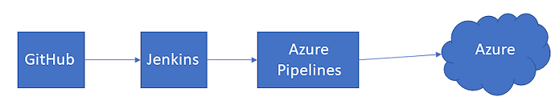

# Continuously deploy from a Jenkins build

[!INCLUDE [version-tfs-2015-rtm](../_shared/version-tfs-2015-rtm.md)]

::: moniker range="<= tfs-2018"
[!INCLUDE [temp](../_shared/concept-rename-note.md)]
::: moniker-end

Azure Pipelines supports integration with Jenkins so that you can use
Jenkins for Continuous Integration (CI) while gaining several DevOps benefits
from an Azure Pipelines release pipeline that deploys to Azure:

* Reuse your existing investments in Jenkins build jobs
* Track work items and related code changes
* Get end-to-end traceability for your CI/CD workflow
* Consistently deploy to a range of cloud services
* Enforce quality of builds by gating deployments
* Define work flows such as manual approval processes and CI triggers  
* Integrate Jenkins with JIRA and Azure Pipelines to show associated issues for each Jenkins job
* Integrate with other service management tools such as [ServiceNow](approvals/servicenow.md)

A typical approach is to use Jenkins to build an app from source
code hosted in a Git repository such as GitHub and then deploy it to
Azure using Azure Pipelines.



## Before you begin

* You'll need the source code for your app hosted in a repository such as GitHub, Azure Repos, GitHub Enterprise Server,
  Bitbucket Cloud, or any another source control provider that Jenkins can interact with.
* You'll need a Jenkins server where you run your CI builds. You can quickly
  [set up a Jenkins server on Azure](https://docs.microsoft.com/azure/jenkins/install-jenkins-solution-template). 
* You'll need a Jenkins project that builds you app. For example, 
  you can [build a Java app with Maven](https://jenkins.io/doc/tutorials/build-a-java-app-with-maven/) on Jenkins.

## Link Jenkins with Azure Pipelines

Create a Jenkins service connection from the **Service connections** section of the project settings page.

::: moniker range="< azure-devops"
In TFS, open the **Services** page from the "settings" icon in the top menu bar.
::: moniker-end

For more information, see [Jenkins service connection](../library/service-endpoints.md#sep-jenkins).
If you are not familiar with the general concepts in this section, see
[Accessing your project settings](https://docs.microsoft.com/en-us/azure/devops/project/navigation/go-to-service-page?view=azure-devops#open-project-settings)
and [Creating and using a service connection](../library/service-endpoints.md).


## Add a Jenkins artifact

Create a new release pipeline and add a Jenkins artifact to it.
After you select the Jenkins service connection, you can select an existing Jenkins job to deploy. 

It's possible to [store the output from a Jenkins build in Azure blob storage](https://docs.microsoft.com/azure/storage/common/storage-java-jenkins-continuous-integration-solution?toc=%2Fen-us%2Fazure%2Fjenkins%2Ftoc.json&bc=%2Fen-us%2Fazure%2Fbread%2Ftoc.json).
If you have configured this in your Jenkins project, choose **Download artifacts from Azure storage**
and select the default version and source alias.

For more information, see [Jenkins artifacts](artifacts.md#jenkins).
If you are not familiar with the general concepts in this section, see
[Creating a release pipeline](../create-first-pipeline.md)
and [Release artifacts and artifact sources](artifacts.md).

## Define the deployment steps

Add the tasks you require to deploy your app to your chosen target in the **Agent job** section in the **Tasks** page
of your release pipeline. For example, add the **Azure App Service Deploy** task to deploy a web app. 

# [YAML](#tab/yaml)

::: moniker range="azure-devops"

Add the **Azure App Service Deploy** task YAML code to a job in the  `.yml` file at the root of the repository.

```YAML

...
jobs:
- job: DeployMyApp
  pool:
    name: Default
  steps:
    - task: AzureRmWebAppDeployment@4
      inputs:
        connectionType: 'AzureRM'
        azureSubscription: your-subscription-name
        appType: webAppLinux
        webAppName: 'MyApp'
        deployToSlotOrASE: false
        packageForLinux: '$(System.DefaultWorkingDirectory)/**/*.zip'
        takeAppOfflineFlag: true
...
```

::: moniker-end

::: moniker range="< azure-devops"

YAML builds aren't yet available on TFS.

::: moniker-end

# [Designer](#tab/designer)

1. In the **Tasks** page of your release pipeline, choose the **+**
  (plus sign) in the **Agent job** section.

1. In the list of tasks, select **Azure App Service Deploy** and choose **Add**.
  You can use the Search box to quickly find the required task.

1. Save the pipeline.

For an example of using the designer, see [Deploy an Azure Web App](../targets/webapp.md?tabs=designer).

---

Whenever you trigger your Azure release pipeline, the artifacts published by the Jenkins CI job
are downloaded and made available for your deployment. You get full traceability of your workflow,
including the commits associated with each job.

[See more details of the Azure App Service Deploy task](../tasks/deploy/azure-rm-web-app-deployment.md)
If you are not familiar with the general concepts in this section, see
[Build and release jobs](../process/phases.md?tabs=yaml)
and [Using tasks in builds and releases](../tasks/index.md).

## Enable continuous deployment

If your Jenkins server is **hosted in Azure**, or your Azure DevOps organization
has **direct visibility** to your Jenkins server, you can easily enable a continuous
deployment (CD) trigger within your release pipeline that causes a release to be
created and a deployment started every time the source artifact is updated.

To enable continuous deployment for an Azure hosted or directly visible Jenkins server:

1. Open the [continuous deployment trigger](triggers.md#release-triggers) pane from the **Pipelines** page of your release pipeline.

1. Change the setting to **Enabled**.

1. Choose **Add** and select the branch you want to create the trigger for. Or select the default branch.  

However, if you have an **on-premises** Jenkins server, or your Azure DevOps organization **does not** have direct visibility
to your Jenkins Server, you can trigger a release for an Azure pipeline from a Jenkins project using the following steps:

1. Create a [Personal Access Token](../../organizations/accounts/use-personal-access-tokens-to-authenticate.md) (PAT) in your Azure DevOps or TFS organization. Jenkins requires this information to access your organization.
   Ensure you keep a copy of the token information for upcoming steps in this section.

1. Install the [Team Foundation Server plugin](https://plugins.jenkins.io/tfs) on your Jenkins server.

1. Within your Jenkins project, you will find a new post build action named **Trigger release in TFS/Team Services**.
   Add this action to your project.

1. Enter the collection URL for your Azure DevOps organization or TFS server as `https://<accountname>.visualstudio.com/DefaultCollection/`

1. Leave **username** empty and enter your PAT as the password.

1. Select the Azure DevOps project and the release definition to trigger.
 
Now a new CD release will be triggered every time your Jenkins CI job is completed.

# See also

* [Artifacts](artifacts.md)
* [Stages](environments.md)
* [Triggers](triggers.md)
* [YAML schema reference](../yaml-schema.md)

