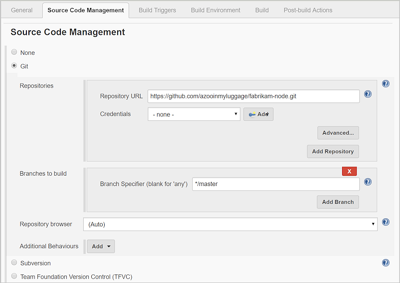

# Tutorial:  Deploy to Kubernetes on Azure Container Service (AKS) with Jenkins CI and VSTS CD

Visual Studio Team Services (VSTS) provides integration with Jenkins so that you can:

* Continue to use your existing investments in Jenkins.
* Create a single release process using VSTS that deploys to a variety of Azure targets.

In this tutorial, you use Jenkins for Continuous Integration (CI) and VSTS for Continuous Delivery (CD) to deploy a **Spring Boot app** to an **Azure Container Service (AKS) Kubernetes cluster**.  

You will:

> [!div class="checklist"]
> * Get the sample app
> * Configure the sample app to build and push a Docker image to your ACR
> * Configure the sample app to include a YAML file used for deploying to your AKS cluster
> * Configure Jenkins credentials to connect to VSTS
> * Configure Jenkins Maven global settings
> * Create Jenkins Service Hooks in VSTS
> * Configure a Jenkins CI build with VSTS integration
> * Install the Release Management Utilty tasks VSTS extension
> * Create a VSTS release definition for CD to Azure
> * Test the CI/CD pipeline with a pull request
> * View the deployed sample app
> * Delete your AKS cluster

## Prerequisites

* A VSTS account. If you don't have one, you can [create one for free](https://go.microsoft.com/fwlink/?LinkId=307137). If your team already has one, then make sure you are an administrator of the team project you want to use.

* An Azure subscription. You can get one free from [Visual Studio Dev Essentials](https://www.visualstudio.com/dev-essentials/).

* The [Azure Command-Line Interface (CLI)](https://docs.microsoft.com/en-us/cli/azure/index?view=azure-cli-latest).

* You need a Spring Boot app.  You can fork the sample app found [here](https://github.com/spring-guides/gs-spring-boot-docker.git).

* You need An Azure Container Registry (ACR).  You can follow  steps to deploy an ACR and login to the registry using the Azure CLI via the steps [here](https://docs.microsoft.com/en-us/azure/aks/tutorial-kubernetes-prepare-acr#deploy-azure-container-registry).

* An AKS cluster.  You can follow the steps for creating this [here](https://docs.microsoft.com/en-us/azure/aks/tutorial-kubernetes-deploy-cluster).

* Access to a Jenkins server with Maven and the VSTS plugin configured. If you have not yet created a Jenkins server,
  see [Create a Jenkins master on an Azure Virtual Machine](https://docs.microsoft.com/azure/jenkins/install-jenkins-solution-template).  Also, the following Jenkins plugins must be installed:
    * **VS Team Services Continous Deployment** plugin.  You can find additional information about the **VSTS plugin** [here](https://github.com/jenkinsci/tfs-plugin).
    * **Config File Provider** plugin.  You can find additional information about the **Config File plugin** [here](https://wiki.jenkins.io/display/JENKINS/Config+File+Provider+Plugin).
    * **Maven Integration** plugin.  You can find additional information about the **Maven Integration plugin** [here](https://plugins.jenkins.io/maven-plugin).

## Get the sample app

You need an app stored in a Git repository.  You use this app to build and deploy.
For this tutorial, we recommend you use [this Spring Boot sample app available from
GitHub](https://github.com/spring-guides/gs-spring-boot-docker.git).  This tutorial uses a Spring Boot sample application that is configured for deployment to an AKS cluster.  If you want to work with your own repository, you should configure a similar sample.

1. In VSTS, on the **Code** hub for your VSTS project, select the option to **Import repository**.

1. In the **Import a Git repository** dialog box, paste the following URL into the **Clone URL** text box.
  ```
  https://github.com/spring-guides/gs-spring-boot-docker
  ```

1. Click **Import** to copy the sample code into your Git repo.

1.  Select **Clone** at the top right, and keep the **clone URL** for future steps in this tutorial. 

## Configure the sample app to build and push a Docker image to your ACR

The [Spotify Dockerfile Maven plugin](https://github.com/spotify/dockerfile-maven) is used to build and push a Docker image to a registry, such as ACR.  The Spring Boot sample app's Maven **pom.xml** file is already configured to use this plugin.  

You will find the **pom.xml** file in your repository in the folder named **complete**.  You must update the **pom.xml** file with your ACR's login server:

1. Navigate to your VSTS project.  Select the **Code** tab.

1. In the code explorer, expand the **complete** folder and select the **pom.xml** file.

1. In the **Contents** pane that shows the contents of the **pom.xml** file, select the **Edit** button.

1. Update the `<properties>` collection in the **pom.xml** with the login server value for your ACR.  The login server is the name of your ACR appended with *.azurecr.io*.  For example, **yourACRName.azurecr.io**.

    ```
    <properties>
       <docker.image.prefix>wingtiptoysregistry.azurecr.io</docker.image.prefix>
       <java.version>1.8</java.version>
    </properties>
    ```

1. Update the **com.spotify** plugin in the **pom.xml** file so that the `<configuration>` section includes the tag for the Docker image that will be built and pushed to your ACR.  The tag will be set to the current Jenkins build id.  Also, add the **useMavenSettingsForAuth** setting to the configuration so that in a later step, you can configure Maven to authenticate with your ACR which is a private registry.

    ```
    <plugin>
      <groupId>com.spotify</groupId>
      <artifactId>dockerfile-maven-plugin</artifactId>
      <version>1.3.4</version>
        <configuration>
            <repository>${docker.image.prefix}/${project.artifactId}</repository>
            <tag>${env.BUILD_NUMBER}</tag>
            <useMavenSettingsForAuth>true</useMavenSettingsForAuth>
				    <buildArgs>
				        <JAR_FILE>target/${project.build.finalName}.jar</JAR_FILE>
				    </buildArgs>
       </configuration>
    </plugin>
    ```

1. Select **Commit** and choose to commit these changes to the **master** branch. 

## Configure the sample app to include a YAML file used for deploying to your AKS cluster
The YAML file contains deployment settings for pulling the docker image from the ACR.  Update this file to include the name of your ACR:

1. Navigate to your VSTS project. Select the **Code** tab.

1. In the code explorer, select the **complete** folder's ellipsis button to open the context menu that shows more actions.

1. From the context menu, select **New**, **File**.

1. Name the file **K8sDeploy.yaml** and select **Create**.

1. Copy and paste the following contents into the **K8sDeploy.yaml** file.  Ensure the image prefix `<yourACRName>` is replaced with the name of your ACR appended with *.azurecr.io*.  Also, notice that the image is tagged with **__Build.BuildId__**.  This is a token that will be automatically replaced during the VSTS release so that it's set to the current Jenkins build id.  For example, if the current Jenkins build id is 5, the full name of an image that will be pulled during the VSTS release will look similar to: yourACRName.azurecr.io/gs-spring-boot-docker:5.

    ```
    apiVersion: extensions/v1beta1
    kind: Deployment
    metadata:
      name: gs-spring-boot-docker
    spec:
      replicas: 3
      template:
        metadata:
          labels:
            app: gs-spring-boot-docker
        spec:
          containers:
          - image: <yourACRName>.azurecr.io/gs-spring-boot-docker:__Build.BuildId__
            name: gs-spring-boot-docker
            imagePullPolicy: Always
            ports:
            - containerPort: 8080
          imagePullSecrets:
            - name: regsecret
    ---
    apiVersion: v1
    kind: Service
    metadata:
      name: gs-spring-boot-docker
    spec:
      ports:
      - protocol: TCP
        port: 80
        targetPort: 8080
      selector:
        app: gs-spring-boot-docker
      type: LoadBalancer
    ```

1. Select **Commit** and choose to commit these changes to the **master** branch. 

## Configure Jenkins credentials to connect to VSTS

You must configure credentials for connecting to VSTS.  When using credentials to connect to VSTS, it is a best practice to use a **personal access token (PAT)**.  You also need to create a Jenkins credential to use in your Jenkins build jobs.

  > [!NOTE]
  Ensure the PAT you use for the following steps contains the **Release (read, write, execute and manage), Code (read), Build (read and execute) permissions in VSTS**.
 
1.  Create a PAT in your VSTS account. Jenkins requires this information to access your VSTS account.  Ensure you **store** the token information for upcoming steps in this section.
  Read [How do I create a personal access token for VSTS and TFS](https://www.visualstudio.com/docs/setup-admin/team-services/use-personal-access-tokens-to-authenticate) to learn how to generate a PAT, or use an existing PAT if you have one.

1. Open your Jenkins account and select **Credentials**, **System**, and then choose **Add Domain**.

1. Enter a **name**, **description**, and then select **Add** **hostname**.

1. In the **Include** text box, enter ```\*.visualstudio.com``` to enable this credential for all VSTS accounts.  You can optionally enter your specific VSTS account.

1. Select **Ok**.  You will see a message about empty credentials.  Select the link for **adding some credentials**.

1. For **Kind**, choose **Username with password**.  Enter the **Username** and the **PAT** you created earlier for **Password**.  Select **Ok**.

## Configure Jenkins Maven global settings

Since your ACR is a private registry, you must configure the user name and password for your ACR in Maven's global settings in Jenkins.  This will authenticate Maven so that it can push images to your ACR during a build.

1. Retrieve the password for your ACR using the Azure CLI.  Replace `<yourACRName>` with the name of your registry.

    ```
    az acr credential show --name <acrName> --query passwords[0]
    ```

1. Navigate to your Jenkins server.  Select **Manage Jenkins** and then select the **Managed files** link.

1. To create the Maven **settings.xml** file the first time, select the **Add a new Config** link.  

1. Select the **Maven settings.xml** radio button and select the **Submit** button.

1. Enter a **Name** for the file.

1. In the **Content** window, update the `<servers>` section of the contents to include the name of your ACR and its password.  For example:
  
    ```
    <server>
      <id>yourACRName.azurecr.io</id>
      <username>yourACRName</username>
      <password>e1M3Y3Z9vuUtusVx12+GoQvuAV3wsQFZ</password>
    </server>
    ```

1. Select the **Submit** button to save the settings.

## Configure a Jenkins CI build with VSTS integration

You create a Jenkins build job to use the source code stored in your VSTS repository and execute a basic build.  Ensure your Jenkins server has **Maven** installed and configured.  You also create triggers to enable CI builds when code changes are pushed to the repository, and a CD trigger to initiate a VSTS release after the Jenkins build completes via a post build action.

1. Navigate to your Jenkins server.  Click **New Item**.  Enter an **item name**.

1. Choose **Maven project**.  Select **OK**.

1. In the **Source Code Management** tab, select **Git** and enter the **clone URL** you saved earlier for the VSTS **Repository URL** and the branch containing your app code. If you are using Team Foundation Server, you can choose the option for **Team Foundation Version Control (TFVC)**.   
    

1. Select the **Credentials** drop down and choose the credential you created earlier.  You should successfully authenticate to your VSTS repository and not receive errors before continuing.  If you see errors, you likely have an issue with your credentials and VSTS **PAT**.

1. Select the **Build Triggers** tab, then **tick** the checkboxes for **Build when a change is pushed to TFS/Team Services** and **Build when a change is pushed to a TFS pull request**.  These two options rely on **VSTS Service Hooks** which you create in the next section.

1. Select the **Build** tab, set the **Root POM** to the relative path to the sample app's **pom.xml**: **complete/pom.xml**.

1. Enter **clean package** for **Goals**.

1. Select the **Advanced...** button.  Set the **Settings file** to **provided settings.xml** and set **Provided Settings** to the name of the Maven settings.xml file that you created earlier.

1. Select the **Post-build Actions** tab.  Choose **Add post-build action**, then select **Archive the artifacts**.

1. For **Files to archive** enter the relative path to the Kubernetes YAML deployment file: **complete/K8sDeploy.yaml**.

1. Select the **Post-build Actions** tab.  Choose **Add post-build action**, then select **Trigger release in TFS/Team Services**.

1. Enter a **Collection URL**.  An example is 
`http://{YourVSTSAccount}.visualstudio.com/DefaultCollection`

1. Enter the **Team project** and choose a **Release definition** name.  Store the **Release definition** name since it is needed on later steps in this tutorial.

1. Enter the **username** and **PAT** you created earlier.
 
1. **Save** the Jenkins project.

## Create a Jenkins and AKS Service Endpoints in VSTS

You configure a Jenkins Service Endpoint to allow VSTS to connect to your Jenkins server.  You also need to configure an AKS service endpoint to allow VSTS to access your AKS cluster to configure deployment.

1. Open the **Services** page in VSTS, open the **New Service Endpoint** list, and choose **Jenkins**.

     

1. Enter a name for the connection.

1. Enter the URL of your Jenkins server, and if using **http** tick the **Accept untrusted SSL certificates** option.  An example URL is:
 	`http://{YourJenkinsURL}.westcentralus.cloudapp.azure.com`

1. Enter the **user name and password** for your Jenkins account.

1. Choose **Verify connection** to check that the information is correct.

1. Choose **OK** to create the service endpoint.

Add a second service endpoint for the AKS cluster.

1. Opening the **New Service Endpoint** list, and choose **Kubernetes**.

1. Enter a name for the connection.

1. Set the **Server URL** to the cluster's fully qualified domain name, such as **http:\//yourAKSCluster-yourResourceGroup-e65186-1e0d187e.hcp.eastus.azmk8s.io**.  Retrieve the fully qualified domain name using the Azure CLI.  Replace `<yourResourceGroup>` with the name of the resource group that contains the AKS cluster. Replace `<yourAKSCluster>` with the name of the AKS cluster.

    ```
    az aks show --resource-group <yourResourceGroup> --name <yourAKSCluster> --query fqdn
    ```

1. Set the **KubeConfig** to the access credentials for the AKS cluster.  Use the Azure CLI to get these credentials:

    ```
    az aks get-credentials --resource-group <yourResourceGroup> --name <yourAKSCluster> 
    ```

    This command will get the access credentials for the AKS cluster.  Navigate to the **.kube** folder under your home directory, such as **C:\Users\YOUR_HOMEDIR\.kube**.  Copy the contents of the **config** file and paste it in the **Kubernetes Connection** window.  Select **OK** to create the service endpoint.

## Create Jenkins Service Hooks in VSTS
You must also configure two Jenkins service hooks so you can execute CI builds via automated triggers for both simple commits as well as pull requests to your VSTS Git repository.

1. From the **Service Hooks** page in VSTS, Select the **+** to add a new service and choose **Jenkins**.  Select **next**.

1. Choose **Code pushed** for the type of event trigger.  Select your **code repository** that contains the sample application you imported earlier.  Select **Next**.

1. Enter the URL of your Jenkins server.  An example is below.
 	`http://{YourJenkinsURL}.westcentralus.cloudapp.azure.com`

1. Enter the **user name and password** for your Jenkins account.

1. Select the Jenkins build you created earlier. 

1. Choose **Test** to check that the information is correct.

1. Choose **Finish** to create the service endpoint.

1. Repeat the steps in this section to create another **service hook** for the **pull request merge attempted** trigger type.  This will allow either simple commits to the repository as well as pull requests to both trigger the Jenkins build.

## Install the Release Management Utilty tasks VSTS extension

A release definition specifies the process VSTS executes to deploy the app.  In this example, you deploy your app that originates from the Jenkins CI system.  You deploy to a Docker image running Tomcat and a Spring Boot app to an AKS cluster.

Before you create the release definition, you need to install a VSTS extension that will be used to replace the **K8sDeploy.yaml** file's **__Build.BuildId__** token with the current Jenkins build id. 

1. In your VSTS account, on the top right-hand side of the browser, Select the **Browse Marketplace** menu item. (The icon appears as a shopping bag.)

2. Search for the **Release Management Utility Tasks** extension provided by **Microsoft DevLabs**.  The extension includes the **Tokenizer** utility.

3. Select the **Get it free** button.  

4. Select your VSTS account and select the **Install** button to install the extension. 

5. After the extension is installed, select the **Proceed to Account** button and navigate back to your VSTS project.

## Create a VSTS release definition for CD to Azure

1. Open the **Releases** on the **Build &amp; Release** hub, and choose **Create release definition**. 

1. Select the **Empty** template by choosing **Start with an Empty process**.

1. In the **Artifacts** section, click on **+ Add Artifact** and choose **Jenkins** for **Source type**. Select your Jenkins service endpoint connection. Then select the Jenkins source job and choose **Add**.

Add two tasks to the release definition.  The first task updates the **K8sDeploy.yaml** file to pull the image tagged with the current Jenkins build id.

1. Next to the **1 phase, 0 environments** link, select the **+** on the **Agent Phase** to add a task to the phase. 

1. Search for the **Tokenize with XPath/Regular expressions** task which was added with the extension that was installed in the previous step.  Select **Add** to add the task.

1. Set the **Source filename** to the **K8sDeploy.yaml** that is archived by the Jenkins job during the build.  This task automatically replaces the **__Build.BuildId__** token with the current Jenkins build id.

The second task deploys to the AKS cluster:

1. Select the **+** button to add a second task.  Search for the **Deploy to Kubernetes** task.  Select **Add** to add the task.

1. Set the **Kubernetes Service Connection** to the name of the service endpoint that you created for the AKS cluster.

1. Set the **Command** to **apply**.

1. Select the **Use Configuration files** check box and set the **Configuration File** to the **K8sDeploy.yml** file.

1. Expand the **Container Registry Details** section of the task.    

1. Set **Container Registry type** to **Azure Container Registry**.

1. Set **Azure subscription** to your subscription.  If you do not have an existing Azure connection in VSTS, you can follow the steps [here](https://docs.microsoft.com/vsts/pipelines/library/service-endpoints#sep-azure-rm) to create one.

1. Set **Azure Container Registry** to the name of your ACR. 

1. Set **Secret name** to the secret provided in the **K8sDeploy.yaml** file which is named **regsecret**.  This is the name of an object in the AKS cluster that is used to store an authentication token.  The cluster uses this token to authenticate to the ACR to pull images.

1. Ensure the **name** for your release definition matches the same name you chose earlier during the **Create a Jenkins Service Endpoint and Service Hooks in VSTS** steps.

1. Click **Save**, and then click **OK** to save the release definition.

## Test the CI/CD pipeline with a pull request

You can initiate the CI build and the subsequent CD deployment to Azure by completing a pull request into your master branch.  The Jenkins build will initiate due to the service hook you set up earlier, and the Jenkins post build action will initiate a VSTS release which will deploy your app to the Azure App Service.

1. Navigate to **Code** in VSTS, then select your **repository**.

1. Select **New branch** to create a branch from the master branch.  Enter a **name** for your new branch, and then select **Create branch**.

1. Select your new branch, then navigate to the **complete/src/main/java/hello/Application.java** file.

1. Select **Edit**, then make a change to the message displayed in the **home()** method and **Commit** your changes.

1. Select **Pull Requests**, then select **New Pull Request**.  Select **Create** to issue a pull request from your branch to master.

1. Select **Approve**, then select **Complete**, then **Complete Merge**.  This code change will initiate a CI build in Jenkins. 

1. Navigate to your **Jenkins dashboard** and examine the build that is executing.  Once it finishes, a new Docker image will be pushed to your ACR that is tagged with the current Jenkins build id.  You can then navigate to VSTS to watch the **Release Definition** execute.  In a few moments, the Docker image for the current Jenkins build will be deployed to your AKS cluster.

You are now using Jenkins CI builds with a VSTS code repository and release pipeline to perform CI/CD to **Azure Container Services (AKS)**.  You can easily track your code changes and deployments via the rich reporting capabilities of VSTS, and leverage Jenkins to execute CI builds.

## View the deployed sample app
Once the app is deployed to the AKS cluster, you can query the external IP address using  **kubectl**, the Kubernetes command-line client.  You can learn how to install and connect **kubectl** to your AKS Cluster by following [these steps](https://docs.microsoft.com/en-us/azure/aks/tutorial-kubernetes-deploy-cluster#install-the-kubectl-cli).

1. Use the following command for querying the external IP address for the deployed app:

```
kubectl get svc -w
```

**kubectl** will display the internal and external IP addresses; for example: 
```
NAME                    CLUSTER-IP   EXTERNAL-IP   PORT(S)        AGE
kubernetes              10.0.0.1     <none>        443/TCP        19h
gs-spring-boot-docker   10.0.242.8   13.65.196.3   80:31215/TCP   3m
```

1. Use the external IP address to open the sample app in a web browser.

## Delete your AKS cluster
When your AKS cluster is no longer needed, you can use the `az group delete` command to remove the resource group, which will remove all of its related resources;  for example:

```azurecli
az group delete --name <yourAKSCluster> --yes --now-wait
```

## Next Steps

In this tutorial, you automated the deployment of an app to Azure using Jenkins build and VSTS for release. You learned how to:

> [!div class="checklist"]
> * Get the sample app
> * Configure the sample app to build and push a Docker image to your ACR
> * Configure the sample app to include a YAML file used for deploying to your AKS cluster
> * Configure Jenkins credentials to connect to VSTS
> * Configure Jenkins Maven global settings
> * Create Jenkins Service Hooks in VSTS
> * Configure a Jenkins CI build with VSTS integration
> * Install the Release Management Utilty tasks VSTS extension
> * Create a VSTS release definition for CD to Azure
> * Test the CI/CD pipeline with a pull request
> * View the deployed sample app
> * Delete your AKS cluster

> [!div class="nextstepaction"]
> [Integrate your Jenkins CI jobs with VSTS DevOps](https://docs.microsoft.com/en-us/vsts/pipelines/release/integrate-jenkins-vsts-cicd?view=vsts)
> [Deploy to Kubernetes with Fabric8](https://docs.microsoft.com/en-us/java/azure/spring-framework/deploy-spring-boot-java-app-using-fabric8-maven-plugin)