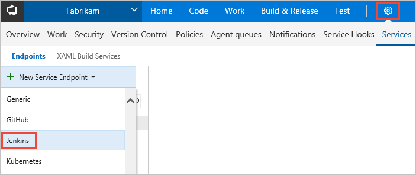

# Tutorial:  Integrate your Jenkins CI jobs with VSTS CD to Azure

Visual Studio Team Services (VSTS) provides integration with Jenkins so that you can use Jenkins for Continuous Integration (CI) while gaining several DevOps benefits from a VSTS release pipeline to Azure such as:

* Reusing your existing investments in Jenkins Build jobs
* Tracking work items and related code changes
* View the entire CI/CD pipeline from a central location
* Deploy various Azure services consistently via VSTS
* Enforce quality of builds to gate deployments
* Define work flows such as manual approval processes and CI triggers  

In this tutorial, you use Jenkins to build a **Java web app** that uses Maven and VSTS or Team Foundation Server (TFS) to deploy to an **Azure App Service**.

You will:

> [!div class="checklist"]
> * Get the Sample App
> * Configure Jenkins credentials and the VSTS plugin
> * Configure a Jenkins CI build with VSTS integration
> * Create a Jenkins Service Endpoint and Service Hooks in VSTS
> * Create a VSTS Release Definition for CD to Azure
> * Test the CI/CD pipeline with a pull request
> * (Optionally) Create a VSTS build definition to wrap the Jenkins CI job

## Before you begin

* An Azure subscription. You can get one free through [Visual Studio Dev Essentials](https://visualstudio.microsoft.com/dev-essentials/).

* A Tomcat and Java 8 based Azure Web App.  You can follow the steps for creating one [here](https://docs.microsoft.com/en-us/java/azure/java-quickstart-maven-webapps)

* Basic Jenkins and Git knowledge.

* You need access to a Jenkins server with Maven configured. If you have not yet created a Jenkins server,
  see [Create a Jenkins master on an Azure Virtual Machine](https://docs.microsoft.com/azure/jenkins/install-jenkins-solution-template). 

* Sign in to your VSTS account (`https://{youraccount}.visualstudio.com`). 
  You can get a [free VSTS account](https://go.microsoft.com/fwlink/?LinkId=307137&clcid=0x409&wt.mc_id=o~msft~vscom~home-vsts-hero~27308&campaign=o~msft~vscom~home-vsts-hero~27308).

  > [!NOTE]
  > For more information, see [Connect to VSTS](https://visualstudio.microsoft.com/docs/setup-admin/team-services/connect-to-visual-studio-team-services).

## Get the sample app

You need an app stored in a Git repository.  You use this app to build and deploy.
For this tutorial, we recommend you use [this sample Java app available from
GitHub](https://github.com/Azure-Samples/app-service-maven).  This tutorial uses a Java and Maven sample application that is configured for deployment to Azure App Service.  If you want to work with your own repository, you should configure a similar sample.

1. In VSTS, on the **Code** hub for your VSTS project, select the option to **Import repository**.

1. In the **Import a Git repository** dialog box, paste the following URL into the **Clone URL** text box.
  ```
  https://github.com/Azure-Samples/app-service-maven
  ```

1. Click **Import** to copy the sample code into your Git repo.

1.  Select **Clone** at the top right, and keep the **clone url** for future steps in this tutorial. 

## Configure Jenkins credentials and the VSTS plugin

You must configure credentials for connecting to VSTS, and a plug in for **VS Team Services Continuous Deployment** on your Jenkins server.  When using credentials to connect to VSTS, it is a best practice to use a **personal access token (PAT)**.  You also need to create a Jenkins credential to use in your Jenkins build jobs.

  > [!NOTE]
  Ensure the PAT you use for the following steps contains the **Release (read, write, execute and manage), Code (read), Build (read and execute) permissions in VSTS**.
 
1.  Create a PAT in your VSTS account. Jenkins requires this information to access your VSTS account.  Ensure you **store** the token information for upcoming steps in this section.
  Read [How do I create a personal access token for VSTS and TFS](../../organizations/accounts/use-personal-access-tokens-to-authenticate.md) to learn how to generate a PAT, or use an existing PAT if you have one.

1. Open your Jenkins account and select **Credentials**, **System**, and then choose **Add Domain**.

1. Enter a **name**, **description**, and then select **Add** **hostname**.

1. In the **Include** text box, enter ```\*.visualstudio.com``` to enable this credential for all VSTS accounts.  You can optionally enter your specific VSTS account.

1. Select **Ok**.  You will see a message about empty credentials.  Select the link for **adding some credentials**.

1. For **Kind**, choose **Username with password**.  Enter the **Username** and the **PAT** you created earlier for **Password**.  Select **Ok**.

1. **Navigate** back to the **Jenkins** home page. 

1. Choose **Manage Jenkins**.

1. In the **Manage Jenkins** page, choose **Manage Plugins**.

1. Filter the **available list** to find the **VS Team Services Continuous Deployment** plug in and choose the **Install without restart** option.  You can find additional information about the **VSTS plugin** [here](https://github.com/jenkinsci/tfs-plugin).

## Configure a Jenkins CI build with VSTS integration

You create a Jenkins build job to use the source code stored in your VSTS repository and execute a basic build.  Ensure your Jenkins server has **Maven** installed and configured.  You also create triggers to enable CI builds when code changes are pushed to the repository, and a CD trigger to initiate a VSTS release after the Jenkins build completes via a post build action.

1. Navigate to your Jenkins server.  Click **New Item**.  Enter an **item name**.

1. Choose **Freestyle project**.  Select **OK**.

1. In the **Source Code Management** tab, select **Git** and enter the **clone url** you saved earlier for the VSTS **Repository URL** and the branch containing your app code. If you are using Team Foundation Server, you can choose the option for **Team Foundation Version Control (TFVC)**.   
    

1. Select the **Credentials** drop down and choose the credential you created earlier.  You should successfully authenticate to your VSTS repository and not receive errors before continuing.  If you see errors, you likely have an issue with your credentials and VSTS **PAT**.

1. Select the **Build Triggers** tab, then **tick** the check boxes for **Build when a change is pushed to TFS/Team Services** and **Build when a change is pushed to a TFS pull request**.  These two options rely on **VSTS Service Hooks** which you create in the next section.

1. Select the **Build** tab, **Add build step**, and then choose **Invoke top-level Maven targets**.

1. Select **Advanced...**.  Enter **clean package** for **Goals**, and then enter **pom.xml** for **POM**.

1. Select the **Post-build Actions** tab.  Choose **Add post-build action**, then select **Archive the artifacts**.

1. For **Files to archive** enter the following:  
 	 ```
  	target/*.war
  	```

1. Select the **Post-build Actions** tab.  Choose **Add post-build action**, then select **Trigger release in TFS/Team Services**.

1. Enter a **Collection url**.  An example is 
`http://{YourVSTSAccount}.visualstudio.com/DefaultCollection`

1. Enter the **Team project** and choose a **Release definition** name.  Store the **Release definition** name since it is needed on later steps in this tutorial.

1. Enter the **username** and **PAT** you created earlier.
 
1. **Save** the Jenkins project.

## Create a Jenkins Service Endpoint and Service Hooks in VSTS

You configure a Jenkins Service Endpoint to allow VSTS to connect to your Jenkins server.  You must also configure two Jenkins service hooks so you can execute CI builds via automated triggers for both simple commits as well as pull requests to your VSTS Git repository.

1. Open the **Services** page in VSTS, open the **New Service Endpoint** list, and choose **Jenkins**.
    

1. Enter a name for the connection.

1. Enter the URL of your Jenkins server, and if using **http** tick the **Accept untrusted SSL certificates** option.  An example URL is:
 	`http://{YourJenkinsURL}.westcentralus.cloudapp.azure.com`

1. Enter the **user name and password** for your Jenkins account.

1. Choose **Verify connection** to check that the information is correct.

1. Choose **OK** to create the service endpoint.

1. From the **Service Hooks** page in VSTS, Select the **+** to add a new service and choose **Jenkins**.  Select **next**.

1. Choose **Code pushed** for the type of event trigger.  Select your **code repository** that contains the sample application you imported earlier.  Select **Next**.

1. Enter the URL of your Jenkins server.  An example is below.
 	`http://{YourJenkinsURL}.westcentralus.cloudapp.azure.com`

1. Enter the **user name and password** for your Jenkins account.

1. Select the Jenkins build you created earlier. 

1. Choose **Test** to check that the information is correct.

1. Choose **Finish** to create the service endpoint.

1. Repeat the steps in this section to create another **service hook** for the **pull request merge attempted** trigger type.  This will allow either simple commits to the repository as well as pull requests to both trigger the Jenkins build.

## Create a VSTS release definition for CD to Azure

A release definition specifies the process VSTS executes to deploy the app.  In this example, you deploy your app that originates from the Jenkins CI system.  You deploy to an Azure App Service running Tomcat and Java.

To create the release definition in VSTS:

1. Open **Releases** on the **Build &amp; Release** hub in VSTS, and choose **Create release definition**. 

1. Select the **Empty** template by choosing **Start with an Empty process**.

1. In the **Artifacts** section, click on **+ Add Artifact** and choose **Jenkins** for **Source type**. Select your Jenkins service endpoint connection. Then select the Jenkins source job and choose **Add**.

1. Next to the **1 phase, 0 environments** link, select the **+** on the **Agent Phase** to add a task to the phase. 

1. Search for the **Azure App Service Deploy** task. Select **Add** to add the task.

1. Choose your **Azure Subscription**.  If you do not have an existing Azure connection in VSTS, you can follow the steps [here](https://docs.microsoft.com/vsts/pipelines/library/connect-to-azure) to create one.

1. Enter a name for your existing Web App for the **App Service name**.  This **name** must match your existing **Web App name** from the prerequisites.

1. For the **Package or folder** setting, select the ellipsis to browse, and then select your **.war artifact**.

1. Ensure the **name** for your release definition matches the same name you chose earlier during the **Create a Jenkins Service Endpoint and Service Hooks in VSTS** steps.

1. Click **Save**, and then click **OK** to save the release definition.

## Test the CI/CD pipeline with a pull request

You can initiate the CI build and the subsequent CD deployment to Azure by completing a pull request into your master branch.  The Jenkins build will initiate due to the service hook you set up earlier, and the Jenkins post build action will initiate a VSTS release which will deploy your app to the Azure App Service.

1. Navigate to **Code** in VSTS, then select your **repository**.

1. Select **New branch** to create a branch from the master branch.  Enter a **name** for your new branch, and then select **Create branch**.

1. Select your new branch, then navigate to the **src/main/webapp/index.jsp** file.

1. Select **Edit**, then make a change to the **Title** for the **index.jsp page**, and then **Commit** your changes.

1. Select **Pull Requests**, then select **New Pull Request**.  Select **Create** to issue a pull request from your branch to master.

1. Select **Approve**, then select **Complete**, then **Complete Merge**.  This code change will initiate a CI build in Jenkins. 

1. Navigate to your **Jenkins dashboard** and examine the build that is executing.  Once it finishes, you can navigate to VSTS to watch the **Release Definition** execute.  In a few moments your latest changes will be deployed to the **Azure App service.** 

You are now using Jenkins CI builds with a VSTS code repository and release pipeline to perform CI/CD to Azure App Service.  You can easily track your code changes and deployments via the rich reporting capabilities of VSTS, and leverage Jenkins to execute CI builds.

## (Optionally) Create a VSTS build definition to wrap the Jenkins CI job

There is an additional approach (pattern) possible when integrating Jenkins and VSTS CI/CD.  You can optionally create a VSTS build definition to wrap the Jenkins build job, which will help you monitor the Jenkins job from VSTS.  This pattern works slightly differently by using the built-in VSTS build capabilities to trigger the pipeline when new code is pushed to the repository.  The approach for using both VSTS build and Jenkins together requires both VSTS build and Jenkins agents.  To enable this pattern, you will modify a few items for the VSTS and Jenkins CI/CD pipeline that you created in earlier steps.

1. Navigate to the Jenkins build job you created earlier.

1. Select the **Build Triggers** tab, then remove the **tick** for the check boxes for **Build when a change is pushed to TFS/Team Services** and **Build when a change is pushed to a TFS pull request**.  These two options are not needed for this pattern since the VSTS build definition has the ability to trigger the CI/CD pipeline when new code is pushed to the repo.

1. Navigate to your **VSTS account**.

1. Open **Builds** on the **Build &amp; Release** hub in VSTS, and choose **+ New** to create a new build definition. 

1. Ensure **VSTS Git** is selected for the source, and then select **Continue**.

1. Search for the **Jenkins** template, and then select **Apply**.

1. Select **Process**, and then select **Hosted VS 2017** for the **Agent queue**.

1. For the **Job name** parameter, enter the **Jenkins Job name** you created in the earlier steps of this tutorial.  This name must match exactly.  This will allow you to queue the Jenkins job and download the artifacts it produces.

1. Select the **Jenkins service endpoint**.
 
1. Select **Get sources**, and then check the **Don't sync sources** option.  Since the Jenkins job is handling fetching the sources from VSTS, we do not need the VSTS build definition to perform this step.  However, this step will configure a local working directory on the VSTS build agent.

1. Ensure the **Report build status** option is enabled so the build status will be reported on the code tab for the VSTS repository.

1. Select the **Jenkins** build tasks under **Phase 1**, and then examine the additional options provided by the tasks.  There is a task to queue the Jenkins job, download the artifacts produced by the job, and then finally to publish the artifacts which can later be used by the VSTS release definition.

1. Select the **Queue Jenkins Job** task.  **Capture console output and wait for completion** is enabled to help provide the Jenkins logging information to VSTS, and also it will cause the VSTS build to wait for this step to complete successfully in Jenkins before proceeding.  This causes the VSTS build to succeed for fail based on the Jenkins result.  **Capture pipeline output and wait for completion** is similarly enabled to ensure VSTS succeeds or fails based on the entire Jenkins pipeline result.  These two options help you view Jenkins logging information in a single place (VSTS) for the entire CI/CD pipeline. 

1. Open **Releases** on the **Build &amp; Release** hub in VSTS, and choose the **release definition** you created earlier. Select the **ellipsis** and choose **Edit**.

1. **Delete** the artifact you used earlier.  **Add** a new artifact by choosing your VSTS build definition.  The VSTS build definition will now provide the artifact for the CD part of the pipeline.

1. In the **Artifacts** section, click on **+ Add Artifact** and choose **Jenkins** for **Source type**. Select your Jenkins service endpoint connection. Then select the Jenkins source job and choose **Add**.

You can now test the pipeline (as you did on earlier steps) with a pull request or by pushing new code to your branch.  A VSTS build will initiate, a Jenkins job executes, and a VSTS release definition will deploy your changes to Azure.

## Next Steps

In this tutorial, you automated the deployment of an app to Azure using Jenkins for the CI build and VSTS for release. You learned how to:

> [!div class="checklist"]
> * Get the Sample App
> * Configure Jenkins credentials and VSTS plugin
> * Configure a Jenkins CI build with VSTS integration
> * Create a Jenkins Service Endpoint and Service Hooks in VSTS
> * Create a VSTS Release Definition for CD to Azure
> * Test the CI/CD pipeline with a pull request
> * (Optionally) Create a VSTS build definition to wrap the Jenkins CI job

> [!div class="nextstepaction"]
> [Improve code quality with branch policies](https://docs.microsoft.com/vsts/git/branch-policies)
