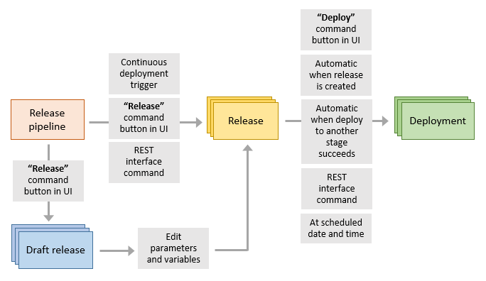

# Releases in Azure Pipelines

::: moniker range="<= tfs-2018"
[!INCLUDE [temp](../_shared/concept-rename-note.md)]
::: moniker-end

[!INCLUDE [version-tfs-2015-rtm](../_shared/version-tfs-2015-rtm.md)]

A **release** is the package or container that holds a versioned set of artifacts
specified in a [release pipeline](index.md) in your DevOps CI/CD processes.
It includes a snapshot of all the information required to carry out all the tasks
and actions in the release pipeline, such as the
[stages](environments.md),
the tasks for each one, the values of task parameters
and variables, and the release policies such as triggers, approvers, and release
queuing options. There can be multiple releases from one released pipeline, and information
about each one is stored and displayed in Azure Pipelines for the specified
[retention period](../policies/retention.md#release).  

A **deployment** is the action of running the [tasks](../process/tasks.md)
for one stage, which results in the application
[artifacts](artifacts.md)
being deployed, tests being run, and whatever other
actions are specified for that stage. Initiating a release
starts each deployment based on the settings and policies defined in the original
release pipeline. There can be multiple deployments of each release even for one stage.
When a deployment of a release fails for a stage, you can redeploy the same release
to that stage.

The following schematic shows the relationship between release pipelines, releases, and deployments.

Releases (and, in some cases, [draft releases](index.md#draftrelease)) can be created from a release pipeline in several ways:

* By a [continuous deployment trigger](triggers.md)
  that creates a release when a new version of the source build artifacts is available.

* By using the **Release** command in the UI to create a release manually from the Releases or the Builds summary.

* By sending a command over the network to the [REST interface](../../integrate/index.md).

**However**, the action of creating a release **_does not_** mean it will automatically
or immediately start a deployment. For example:

* There may be [deployment triggers](triggers.md)
  defined for a stage, which force the deployment to wait; this could be for a manual
  deployment, until a scheduled day
  and time, or for successful deployment to another stage.

* A deployment started manually from the **[Deploy]** command in the UI,
  or from a network command sent to the [REST interface](../../integrate/index.md), may
  specify a final target stage other than the last stage in a release pipeline.
  For example, it may specify that the release is deployed only as far as the QA stage
  and not to the production stage.   

* There may be [queuing policies](environments.md#queuing-policies)
  defined for an stage, which specify which of multiple deployments will occur,
  or the order in which releases are deployed.

* There may be [pre-deployment approvers or gates](approvals/index.md)
  defined for a stage, and the deployment will not occur until all
  necessary approvals have been granted.

* Approvers may defer the release to a stage until a specified date and time.

[!INCLUDE [rm-help-support-shared](../_shared/rm-help-support-shared.md)]
