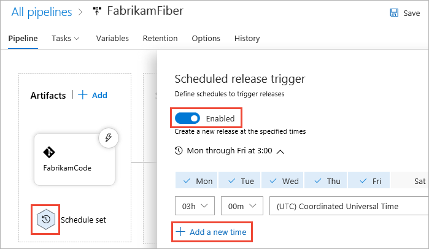
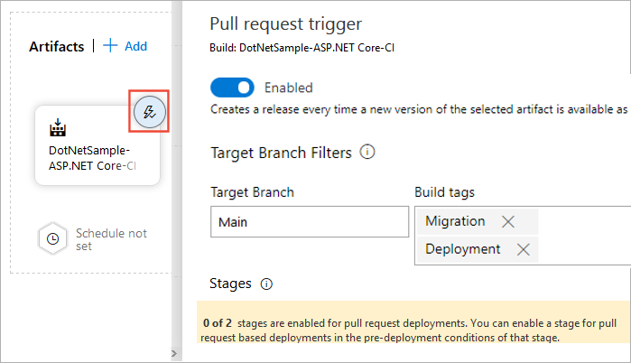
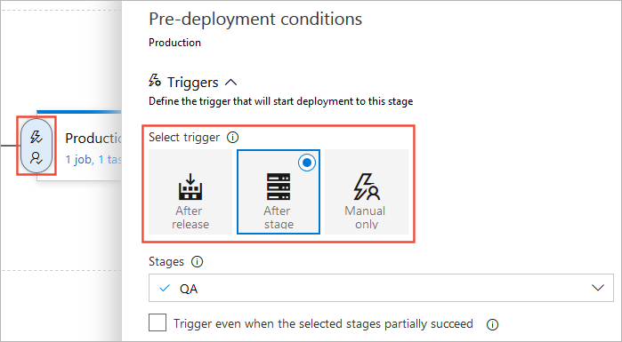
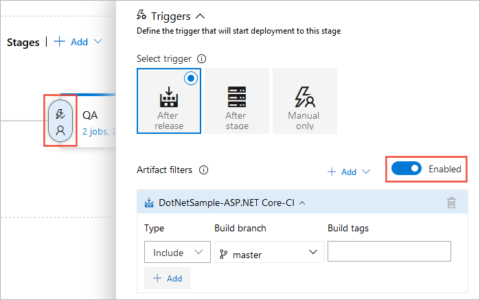
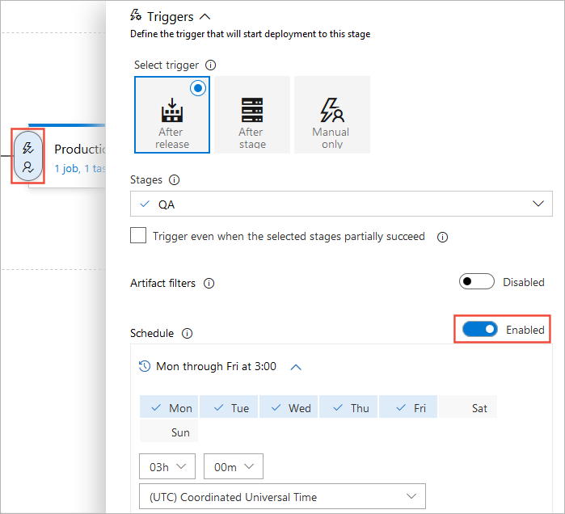
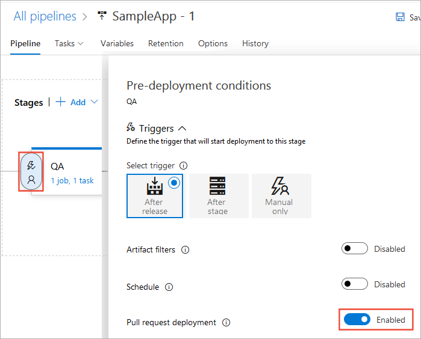
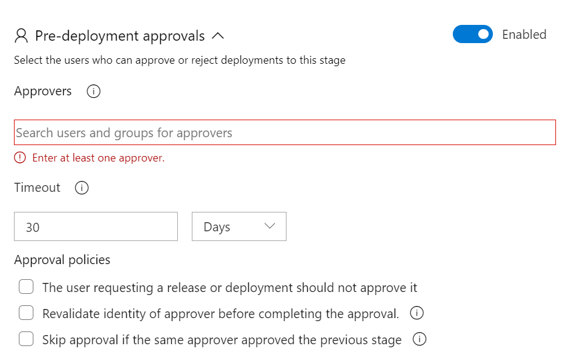
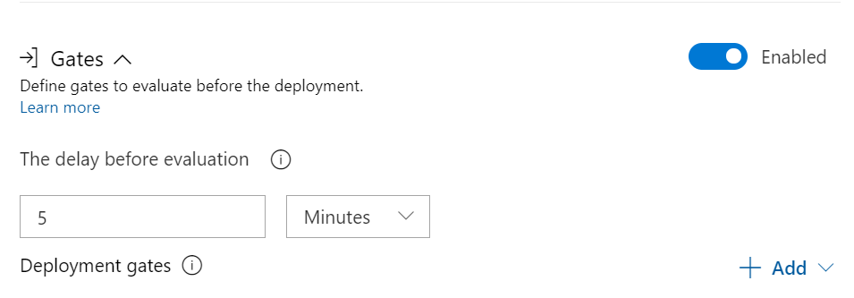
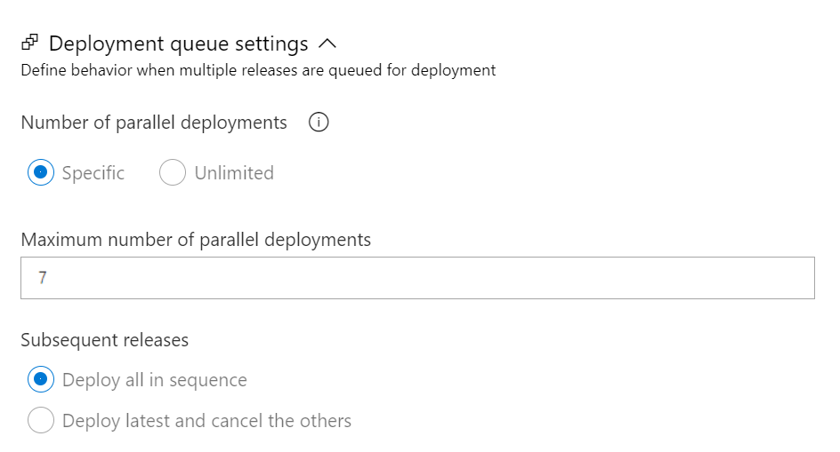

# Release triggers

[!INCLUDE [version-tfs-2015-rtm](../includes/version-tfs-2015-rtm.md)]

::: moniker range="<= tfs-2018"
[!INCLUDE [temp](../includes/concept-rename-note.md)]
::: moniker-end

::: moniker range="azure-devops"
> [!NOTE] 
> This topic covers classic release pipelines. To understand triggers in YAML pipelines, see [pipeline triggers](../build/triggers.md).
::: moniker-end

Release triggers are an automation tool to deploy your application. When the trigger conditions are met, the pipeline will deploy your artifacts to the environment/stages you already specified. 

## Continuous deployment triggers

Continuous deployment triggers allow you to create a release every time a new build artifact is available. Using the build branch filters you can trigger deployment for a specific target branch. A release will be triggered only if the Git push contains a commit on the specified branch. For example, selecting `main` will trigger a release for a Git push which contains one or more commits to the main branch. To trigger a release for any commit to branches under `features/`, enter `features/*`. To trigger a release for commits to all branches, enter `*`. Note that all specified filters will be OR'ed.

:::image type="content" source="media/trigger-01.png" alt-text="Configure continuous deployment triggers":::

> [!NOTE]
> Automatically creating a release does not mean it will be automatically deployed to a stage. You must set up stages triggers to deploy your app to the various stages.

## Scheduled release triggers

Scheduled release trigger allow you to create new releases at specific times.

Select the schedule icon under the **Artifacts** section. Toggle the Enabled/Disabled button and specify your release schedule. You can set up multiple schedules to trigger a release.

> [!div class="mx-imgBorder"]
> 

::: moniker range="> tfs-2018"

## Pull request triggers

If you chose to enable the pull-request triggers, a release will be created every time a selected artifact is available as part of a pull request workflow.

> [!div class="mx-imgBorder"]
> 

To use a pull request trigger, you must also enable it for specific stages. We will go through stage triggers in the next section. You may also want to set up a [branch policies](../../repos/git/pr-status-policy.md) for your branches.

::: moniker-end

## Stage triggers

Stage triggers allow you set up specific conditions to trigger deployment to a specific stage.

  > [!div class="mx-imgBorder"]
  > 

* **Select trigger**:
  Set the trigger that will start the deployment to this stage automatically. Select "Release" to deploy to the stage every time a new release is created. Use the "Stage" option to deploy after deployments to selected stages are successful. To allow only manual deployments, select "Manual".

* **Artifacts filter**:
  Select artifact condition(s) to trigger a new deployment. A release will be deployed to this stage only if all artifact conditions are met.

  > [!div class="mx-imgBorder"]
  > 

  

* **Schedule**:
  Trigger a new deployment to this stage at a specific time.

  > [!div class="mx-imgBorder"]
  > 

* **Pull-request deployment**:
  Enabling this will allow pull request based releases to be deployed to this stage. Keep it disabled if this is a critical or production stage.

  > [!div class="mx-imgBorder"]
  > 

* **Pre-deployment approvals**:
Select the users who can approve or reject deployments to this stage. By default, all users must approve the deployment. If a group is added, one user in the group must approve the deployment. You can also specify the timeout (the maximum time that an approval is allowed to be pending before it is automatically rejected) and approval policies.

  > [!div class="mx-imgBorder"]
  > 

* **Gates**:
Allow you to set up specific gates to evaluate before the deployment.

  > [!div class="mx-imgBorder"]
  > 

* **Deployment queue settings**:
Allow you to configure actions when multiple releases are queued for deployment.

  > [!div class="mx-imgBorder"]
  > 

::: moniker range="tfs-2015"

> [!NOTE]
> **TFS 2015**: The following features are not available in TFS 2015 - continuous deployment triggers for multiple artifact sources, multiple scheduled triggers combining scheduled and continuous deployment triggers in the same pipeline, continuous deployment based on the branch or tag of a build.

::: moniker-end

[!INCLUDE [rm-help-support-shared](../includes/rm-help-support-shared.md)]
