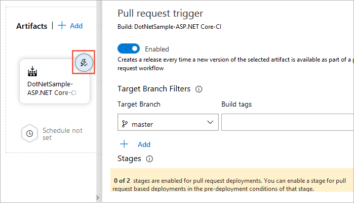
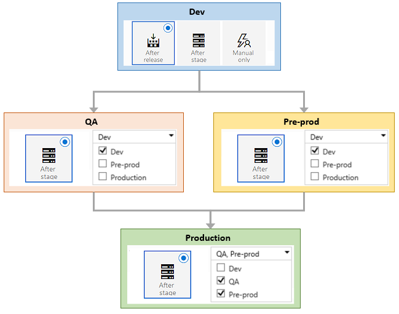

# Release, branch, and stage triggers

[!INCLUDE [version-tfs-2015-rtm](../_shared/version-tfs-2015-rtm.md)]

::: moniker range="<= tfs-2018"
[!INCLUDE [temp](../_shared/concept-rename-note.md)]
::: moniker-end

You can configure when releases should be created, and when those releases should be deployed to stages,
in your DevOps CI/CD processes.
The former is configured through [release triggers](#release-triggers),
and the latter through [stage triggers](#env-triggers) - both in a release pipeline.

<h2 id="release-triggers">Continuous deployment triggers</h2>

If you specify [certain types](artifacts.md#sources) of
artifacts in a release pipeline, you can enable continuous deployment.
This instructs Azure Pipelines to create
new releases automatically when it detects new artifacts
are available. At present this option is available only for Team Foundation Build artifacts
and Git-based sources such as Team Foundation Git, GitHub, and other Git repositories.

If you have linked multiple Team Foundation Build artifacts to a release pipeline,
you can configure continuous deployment for each of them.
In other words, you can choose to have a release created automatically when a new build
of any of those artifacts is produced.

You add build branch filters if you want to create the release only
when the build is produced by compiling code from certain branches
(only applicable when the code is in a TFVC, Git, or GitHub repository)
or when the build has certain tags. These can be both include and exclude filters.
For example, use **features/*** to include all builds under the **features** branch.
You can also include [custom variables](variables.md) in a filter value.

Alternatively, you can specify a filter to use the default branch specified
in the build pipeline. This is useful when, for example, the default build branch
changes in every development sprint. It means you don't need to update the trigger
filter across all release pipelines for every change - instead you just change the
default branch in the build pipeline.

>Note that, even though a release is automatically created, it
might not be deployed automatically to any stages. The
[stage triggers](#env-triggers) govern when and if a release should be deployed to a stage.

For information about the ID of the requester for CI triggers, see [How are the identity variables set?](../build/variables.md#how-are-the-identity-variables-set)

<h2 id="scheduled-triggers">Scheduled release triggers</h2>

If you want to create and start a release at specific times, define one or more
scheduled release triggers. Choose the schedule icon in the **Artifacts** section of your
pipeline and enable scheduled release triggers. You can configure multiple schedules.

See also [stage scheduled triggers](#stage-scheduled-triggers).

::: moniker range="> tfs-2018"

<h2 id="prsettrigger">Pull request triggers</h2>

You can configure a pull request trigger that will create a new release when a pull request 
uploads a new version of the artifact. Enable the trigger and add the branches targeted by pull requests
that you want to activate this trigger. 

However, to use a pull request trigger, you must also enable it for specific stages of the pipeline.
Do this in the stage [triggers panel](#prtrigger) for the required stage(s). 
You may also want to set up a [branch policy](../../repos/git/pr-status-policy.md) for the branch. For more information, see [Deploy pull request builds](deploy-pull-request-builds.md).

>Note that, even though a release is automatically created, it
might not be deployed automatically to any stages. The
[stage triggers](#env-triggers) govern when and if a release should be deployed to a stage.

::: moniker-end

<h2 id="env-triggers">Stage triggers</h2>

You can choose to have the deployment to each stage triggered automatically
when a release is created by a continuous deployment trigger, based on:

* **The result of deploying to a previous stage in the pipeline**.
  Use this setting if you want the release to be first deployed and validated in
  another stage(s) before it is deployed to this stage.
  Triggers are configured for each stage,
  but the combination of these allows you to orchestrate
  the overall deployment - such as the sequence in which automated
  deployments occur across all the stages in a release
  pipeline. For example, you can set up a linear pipeline where
  a release is deployed first to the **Test** and **QA** stages.
  Then, if these two deployments succeed, it will be deployed to a **Staging**
  stage. In addition, you can configure the trigger to fire
  for partially succeeded (but not failed) deployments.

  

* **Filters based on the artifacts**. You can add one or more filters for each artifact linked to the release pipeline,
  and specify if you want to include or exclude particular branches of the code.
  Deployment will be triggered to this stage only if all the artifact conditions are successfully met.
  Unlike [build branch filters](#release-triggers), variables _cannot_ be used in artifact filter conditions.

  

  

* **A predefined schedule**. When you select this option,
  you can select the days of the week and the time of day that
  Azure Pipelines will automatically start a new deployment. Unlike scheduled
  release triggers, you cannot configure multiple schedules for stage triggers.
  Note that, with scheduled triggers, a new deployment is created that deploys the 
  artifacts from the _most recently available_ release, overwriting any previously deployed artifacts
  for the stage. It does not necessarily require a newer version of the artifacts to be
  available.

  

* **A pull request that updates the artifacts**. If you have enabled
  [pull request triggers](#prsettrigger) for your pipeline, you must also enable
  pull request deployment for the specific stages where you want the release to be deployed. 
  You may also want to set up a [branch policy](../../repos/git/pr-status-policy.md) for the branch. For more information, see [Deploy pull request builds](deploy-pull-request-builds.md).

  

* **Manually by a user**. Releases are
  not automatically deployed to the stage. To
  deploy a release to this stage, you must manually
  start a release and deployment from the release pipeline
  or from a build summary.

You can combine the automated settings to have deployments created
automatically either when a new build is available or according to
a schedule.

::: moniker range="tfs-2015"

> **TFS 2015**: The following features are not available in TFS 2015 -
continuous deployment triggers for multiple artifact sources,
multiple scheduled triggers, combining scheduled and continuous deployment triggers in the same pipeline,
continuous deployment based on the branch or tag of a build.

::: moniker-end

::: moniker range=">= tfs-2017"

### Parallel forked and joined deployments

The **Triggering stage** list lets you select
more than one stage. This allows you to
configure parallel (_forked_ and _joined_) deployment
pipelines where the deployment to a stage occurs
only when deployment to **all** the selected
stages succeeds.

For example, the following schematic shows a pipeline
where deployment occurs in parallel to the **QA** and
**Pre-prod** stages after deployment to the **Dev**
stage succeeds. However, deployment to the
**Production** stage occurs only after successful
deployment to both the **QA** and **Pre-prod** stages.

In combination with the ability to define
[pre- and post-deployment approvals](approvals/approvals.md),
this capability enables the configuration of complex
and fully managed deployment pipelines to suit
almost any release scenario.  

::: moniker-end

Note that you can always deploy a release directly to any of the
stages in your release pipeline by selecting the
**Deploy** action when you create a new release. In this case, the
stage triggers you configure, such as a trigger
on successful deployment to another stage, do not
apply. The deployment occurs irrespective of these settings.
This gives you the ability to override the release
pipeline. Performing such direct deployments requires
the **Manage deployments** permission, which should
only be given to selected and approved users.

::: moniker range="tfs-2015"

> **TFS 2015**: Parallel fork and joined deployments are not available in TFS 2015

::: moniker-end

[!INCLUDE [rm-help-support-shared](../_shared/rm-help-support-shared.md)]
