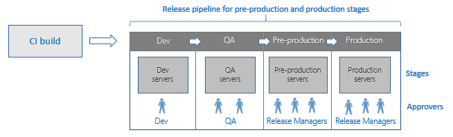

# Why use Azure Pipelines for releases?

[!INCLUDE [version-tfs-2015-rtm](../_shared/version-tfs-2015-rtm.md)]

::: moniker range="<= tfs-2018"

[!INCLUDE [temp](../_shared/concept-rename-note.md)]

::: moniker-end

**Release pipelines** in Azure Pipelines
and Team Foundation Server (TFS 2015.2 and later) are an essential
element of DevOps CI/CD that help your team **continuously deliver** software
to your customers at a faster pace and with lower risk.
You can **fully automate** the testing and delivery of your software
in multiple stages all the way to production, or set up
semi-automated processes with **approvals** and **on-demand deployments**.

* **[Watch this video](https://channel9.msdn.com/events/Microsoft-Azure/Azure-DevOps-Launch-2018/A101)** - see Azure Pipelines releases in action.

  
<iframe src="https://channel9.msdn.com/Events/Microsoft-Azure/Azure-DevOps-Launch-2018/A101/player" width="640" height="360" allowFullScreen="true" frameBorder="0"></iframe>

* **[Decide if it suits your scenarios](#isitforyou)** - use the simple checklist.

* **[See how it works](#howrmworks)** - get a basic understanding of the process.

* **[Get started now](#getstartednow)** - follow the steps to deploy your apps.

## Are release pipelines appropriate for you?

Consider using release pipelines if:

* **You develop applications and need to deploy them regularly to any platform,**
  public or private cloud services, or App stores. Azure Pipelines
  has many out-of-the-box tasks to deploy a variety of applications. If
  you cannot find an out-of-the-box task to deploy your application
  using Azure Pipelines, consider this: if you can script the
  deployment of your application using Shell scripts or PowerShell scripts,
  utilities such as Ant or Maven, batch files or EXE utilities, then
  you can deploy it using Azure Pipelines. It also integrates with third party deployment systems
  such as Chef and Docker.

* **You use a continuous integration (CI) system**
  and are looking for a fully-fledged continuous delivery management or release
  system. Whether you use Azure Pipelines, TFS, or
  Jenkins as your CI system, you can set up release pipelines to
  automatically deploy new builds to multiple stages. Even if
  we do not yet support integration with your favorite CI system or artifact
  repository, you can still write custom tasks to download and
  deploy artifacts from it.

* **You need to track the progress of releases.**
  If you use several stages for your tests, release pipelines
  help you monitor whether a release has been deployed and tested on each
  of these stages. It also tracks whether an issue fixed
  by a developer, or a product backlog item completed by your team, has
  been deployed to a specific stage.

* **You need control of the deployments.**
  Release pipelines let you specify which users can change the
  configuration of an stage, or approve the release to be
  deployed into a particular stage. If there is a problem with
  your deployment, Azure Pipelines helps you roll back to a previous
  deployment, and provide all the logs in one place to help you debug the
  problem.

* **You need audit history for all releases and their deployments.**
  Release pipelines provides a history of all changes to the pipelines,
  configurations, and deployments. Azure Pipelines also provides a history of all the
  activity performed during each deployment. Each release is accompanied
  by a listing of new features and developer commits that went into that
  release.

See [more advantages of Azure Pipelines](https://azure.microsoft.com/services/devops/pipelines/).

## How do release pipelines work?

Release pipelines store the data about your pipelines,
stages, tasks, releases, and deployments in Azure Pipelines or TFS.

Azure Pipelines runs the following steps as part of every deployment:

1. **Pre-deployment approval:** When a new deployment request is triggered,
   Azure Pipelines checks whether a pre-deployment approval is required
   before deploying a release to a stage. If it is required, it sends
   out email notifications to the appropriate approvers.

1. **Queue deployment job:** Azure Pipelines schedules the deployment job on
   an available [automation agent](../agents/agents.md). An agent is a piece
   of software that is capable of running tasks in the deployment.

1. **Agent selection**: An automation agent picks up the job.
   The agents for release pipelines are exactly the same as those that run your
   builds in Azure Pipelines and TFS. A release pipeline can
   contain settings to select an appropriate agent at runtime.

1. **Download artifacts**: The agent downloads all the artifacts specified
   in that release (provided you have not opted to skip the download). The
   agent currently understands two types of artifacts: Azure Pipelines artifacts
   and Jenkins artifacts.

1. **Run the deployment tasks**: The agent then runs all the tasks in the
   deployment job to deploy the app to the target servers for a stage.

1. **Generate progress logs**: The agent creates detailed logs for each
   step while running the deployment, and pushes these logs back to Azure Pipelines
   or TFS.

1. **Post-deployment approval:** When deployment to a stage is complete,
   Azure Pipelines checks if there is a post-deployment approval required
   for that stage. If no approval is required, or upon completion of
   a required approval, it proceeds to trigger deployment to
   the next stage.

::: moniker range="< azure-devops-2019"

Release pipelines and build pipelines have separate designer interfaces
(separate UIs). The main differences in the pipelines are the support in release
pipelines for different types of triggers, and the support for approvals and gates.

::: moniker-end

## Get started now!

Simply follow these steps:

1. **[Understand release pipelines](index.md)**

1. **[Create your first pipeline](../create-first-pipeline.md)**

1. **[Set up a multi-stage managed release pipeline](define-multistage-release-process.md)**
    
1. **[Manage deployments by using approvals and gates](deploy-using-approvals.md)**

## Related topics

* [What is a draft release?](index.md#draftrelease)
* [When and why would I abandon a release?](index.md#abandonrelease)
* [Download Team Foundation Server](https://visualstudio.microsoft.com/products/tfs-overview-vs)
* [Install and configure Team Foundation Server](/azure/devops/server/install/get-started)
* [Sign up for Azure Pipelines](https://visualstudio.microsoft.com/products/visual-studio-team-services-vs)

[!INCLUDE [rm-help-support-shared](../_shared/rm-help-support-shared.md)]

