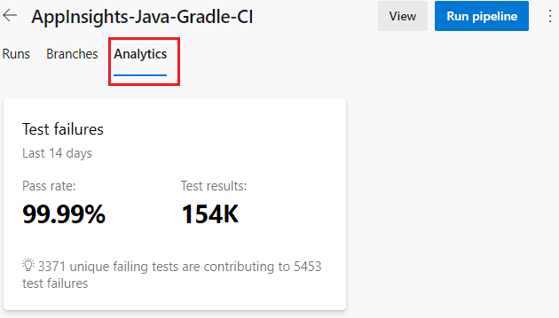
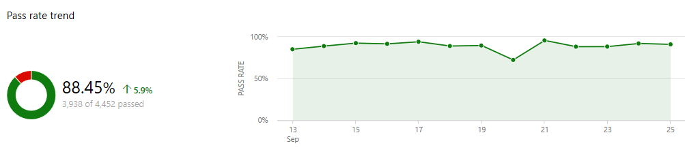
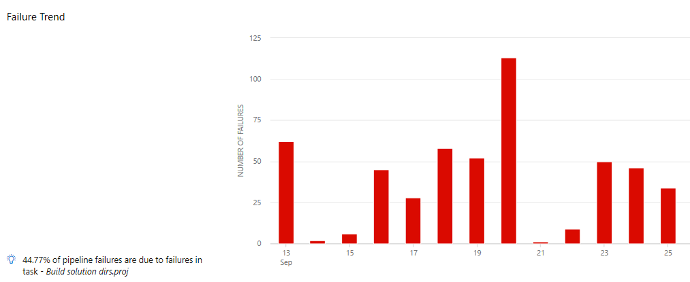
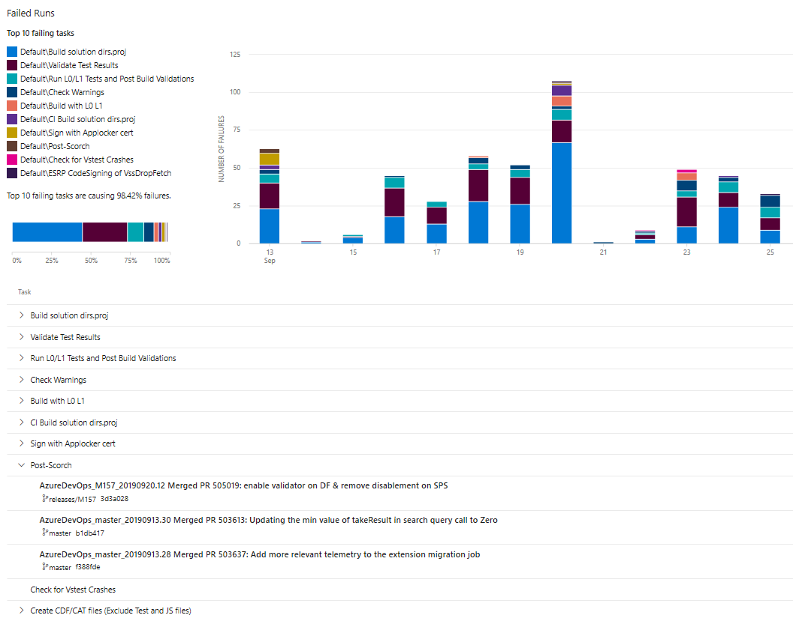

# Pipeline reports

[!INCLUDE [version-header-ap](../_shared/version-server-2019-rtm.md)]

Teams track their pipeline health and efficiency to ensure continuous delivery to their customers. You can gain visibility into your team's pipeline(s) using Pipeline analytics. The source of information for pipeline analytics is the set of runs for your pipeline. These analytics are accrued over a period of time, and form the basis of the rich insights offered. Pipelines reports show you metrics, trends, and can help you identify insights to improve the efficiency of your pipeline.  

::: moniker range="azure-devops-2019"

## Prerequisites

Ensure that you have installed the [the Analytics Marketplace extension](../../report/dashboards/analytics-extension.md) for Azure DevOps Server.

## View pipeline reports

A summary of the pass rate can be viewed in the **Analytics** tab of a pipeline. To drill into the trend and insights, click on the card to view the full report.

::: moniker-end

::: moniker range="azure-devops"

## View pipeline reports

A summary of the pass rate and duration can be viewed in the **Analytics** tab of a pipeline. To drill into the trend and insights, click on the card to view the full report.

> [!div class="mx-imgBorder"]
> 

::: moniker-end

::: moniker range="azure-devops-2019"

> [!div class="mx-imgBorder"]
> 

::: moniker-end

::: moniker range="azure-devops"

## Pipeline pass rate report 

The **Pipeline pass rate** report  provides a granular view of the pipeline pass rate and its trend over time. You can also view which specific task failure contributes to a high number of pipeline run failures, and use that insight to fix the top failing tasks.

The report contain the following sections:

  - **Summary**: Provides the key  metrics of pass rate of the pipeline over the specified period. The default view shows data for 14 days, which you can modify.

    > [!div class="mx-imgBorder"]
    > 
    
  - **Failure trend**: Shows the number of failures per day. This data is divided by stages if multiple stages are applicable for the pipeline.
    > [!div class="mx-imgBorder"]
    > 

  - **Top failing tasks & their failed runs**: Lists the top failing tasks, their trend and provides pointers to their failed runs. Analyze the failures in the build to fix your failing task and improve the pass rate of the pipeline.
        
    > [!div class="mx-imgBorder"]
    > 

## Pipeline duration report

The **Pipeline duration** report shows how long your pipeline typically takes to complete successfully. You can review the duration trend and analyze the top tasks by duration to optimize the duration of the pipeline.

> [!div class="mx-imgBorder"]
> 

> [!div class="mx-imgBorder"]
> 

::: moniker-end

## Test failures report

The **Test failures** report provides a granular view of the top failing tests in the pipeline, along with the failure details. For more information on this report, see [Test failures](../test/test-analytics.md#test-failures).

> [!div class="mx-imgBorder"]

## Filters

Pipelines reports can be further filtered by date range or branch. 

- **Date range**: The default view shows data from the last 14 days. The filter helps change this range.
  
    > [!div class="mx-imgBorder"]
    > 

- **Branch filter**: View the report for a particular branch or a set of branches. 
  
    > [!div class="mx-imgBorder"]
    > 

[!INCLUDE [help-and-support-footer](../test/_shared/help-and-support-footer.md)] 
