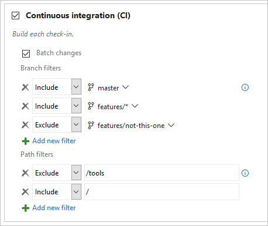

# Build Azure Repos Git or TFS Git repositories

[!INCLUDE [version-tfs-2015-rtm](../includes/version-tfs-2015-rtm.md)]

::: moniker range="<= tfs-2018"
[!INCLUDE [temp](../includes/concept-rename-note.md)]
::: moniker-end

Azure Pipelines can automatically build and validate every pull request and commit to your Azure Repos Git repository.

## Choose a repository to build

# [YAML](#tab/yaml/)

::: moniker range=">= azure-devops-2019"

You create a new pipeline by first selecting a repository and then a YAML file in that repository. The repository in which the YAML file is present is called `self` repository. By default, this is the repository that your pipeline builds. 

::: moniker-end

::: moniker range="azure-devops"

You can later configure your pipeline to check out a different repository or multiple repositories. To learn how to do this, see [multi-repo checkout](multi-repo-checkout.md).

::: moniker-end

::: moniker range="< azure-devops-2019"

YAML pipelines are not available in TFS.

::: moniker-end

# [Classic](#tab/classic/)

While creating a pipeline, to choose the repository to build, first select the project to which the repository belongs. Then, select the repository.

To clone additional repositories as part of your pipeline:

* If the repo is in the same project as your pipeline, or if the access token (explained below) has access to the repository in a different project, use the following command:

  `git clone -c http.extraheader="AUTHORIZATION: bearer $(System.AccessToken)" <clone URL>`

  In order to use `System.AccessToken` in a script, you must first make it available to the script. To do this, select the job under the **Tasks** tab in the editor, select **Additional Options** in the right panel, and check the option to **Allow scripts to access the OAuth token**.

* If the access token (explained below) does not have access to the repository:

    1. Get a [personal access token (PAT)](../../organizations/accounts/use-personal-access-tokens-to-authenticate.md) with `Code (read)` scope, and prefix it with `pat:`
    2. Base64-encode this string to create a basic auth token.
    3. Add a script in your pipeline with the following command to clone that repo
       `git clone -c http.extraheader="AUTHORIZATION: basic <BASIC_AUTH_TOKEN>" <clone URL>`

---

Azure Pipelines must be granted access to your repositories to trigger their builds and fetch their code during builds. Normally, a pipeline has access to repositories in the same project. But, if you wish to access repositories in a different project, then you need to update the permissions granted to [job access tokens](../process/access-tokens.md).

## CI triggers

Continuous integration (CI) triggers cause a pipeline to run whenever you push an update to the specified branches or you push  specified tags.

# [YAML](#tab/yaml/)
::: moniker range=">= azure-devops-2019"
[!INCLUDE [ci-triggers](includes/ci-triggers1.md)]
::: moniker-end

::: moniker range="azure-devops"
[!INCLUDE [ci-triggers](includes/ci-triggers2.md)]
::: moniker-end

::: moniker range=">= azure-devops-2019"
[!INCLUDE [ci-triggers](includes/ci-triggers3.md)]
::: moniker-end

::: moniker range="< azure-devops-2019"
YAML pipelines are not available in TFS.
::: moniker-end

# [Classic](#tab/classic/)
[!INCLUDE [ci-triggers](includes/ci-triggers4.md)]

::: moniker range=">= tfs-2017"
**Azure Pipelines, TFS 2017.3 and newer**


::: moniker-end

::: moniker range="<= tfs-2017"
**TFS 2017.1 and older versions**


::: moniker-end

---

### Skipping CI for individual commits

::: moniker range="<= azure-devops-2019"

You can also tell Azure Pipelines to skip running a pipeline that a commit would normally trigger. Just include `***NO_CI***` in the commit message of the HEAD commit and Azure Pipelines will skip running CI.

::: moniker-end

::: moniker range="> azure-devops-2019"

You can also tell Azure Pipelines to skip running a pipeline that a commit would normally trigger. Just include `[skip ci]` in the commit message or description of the HEAD commit and Azure Pipelines will skip running CI. You can also use any of the variations below.

- `[skip ci]` or `[ci skip]`
- `skip-checks: true` or `skip-checks:true`
- `[skip azurepipelines]` or `[azurepipelines skip]`
- `[skip azpipelines]` or `[azpipelines skip]`
- `[skip azp]` or `[azp skip]`
- `***NO_CI***`

::: moniker-end

[!INCLUDE [ci-triggers](includes/ci-triggers5.md)]

## PR triggers

Pull request (PR) triggers cause a pipeline to run whenever a pull request is opened with one of the specified target branches, or when changes are pushed to such a pull request. In Azure Repos Git, this functionality is implemented using branch policies. To enable pull request validation in Azure Git Repos, navigate to the branch policies for the desired branch, and configure the [Build validation policy](../../repos/git/branch-policies.md#build-validation) for that branch. For more information, see [Configure branch policies](../../repos/git/branch-policies.md).

>[!NOTE]
>To configure validation builds for an Azure Repos Git repository, you must be a project administrator of its project.

>[!NOTE]
>[Draft pull requests](../../repos/git/pull-requests.md#draft-pull-requests) do not trigger a pipeline even if you configure a branch policy.

::: moniker range=">tfs-2018"

### Validate contributions from forks

Building pull requests from Azure Repos forks is no different from building pull requests within the same repository or project. You can create forks only within the same organization that your project is part of.

::: moniker-end

::: moniker range=">=azure-devops-2020"

## Limit job authorization scope

::: moniker-end

::: moniker range=">azure-devops-2020"

Azure Pipelines provides several security settings to configure the job authorization scope that your pipelines run with.

- [Limit job authorization scope to current project](#limit-job-authorization-scope-to-current-project)
- [Limit job authorization scope to referenced Azure DevOps repositories](#limit-job-authorization-scope-to-referenced-azure-devops-repositories)

### Limit job authorization scope to current project

Azure Pipelines provides two **Limit job authorization scope to current project** settings:

- **Limit job authorization scope to current project for non-release pipelines** - This setting applies to YAML pipelines and classic build pipelines. This setting does not apply to classic release pipelines.
- **Limit job authorization scope to current project for release pipelines** - This setting applies to [classic release pipelines](../release/index.md) only.

Pipelines run with collection scoped access tokens unless the relevant setting for the pipeline type is enabled. The **Limit job authorization scope** settings allow you to reduce the scope of access for all pipelines to the current project. This can impact your pipeline if you are accessing an Azure Repos Git repository in a different project in your organization. 

If your Azure Repos Git repository is in a different project than your pipeline, and the **Limit job authorization scope** setting for your pipeline type is enabled, you must grant permission to the build service identity for your pipeline to the second project. For more information, see [Manage build service account permissions](../process/access-tokens.md#manage-build-service-account-permissions).

::: moniker-end

::: moniker range="azure-devops-2020"

Azure Pipelines provides a security setting to configure the job authorization scope that your pipelines run with.

- **Limit job authorization scope to current project** - This setting applies to YAML pipelines and classic build pipelines. This setting does not apply to [classic release pipelines](../release/index.md).

Pipelines run with collection scoped access tokens unless **Limit job authorization scope to current project** is enabled. This setting allows you to reduce the scope of access for all pipelines to the current project. This can impact your pipeline if you are accessing an Azure Repos Git repository in a different project in your organization. 

If your Azure Repos Git repository is in a different project than your pipeline, and the **Limit job authorization scope** setting is enabled, you must grant permission to the build service identity for your pipeline to the second project. For more information, see [Job authorization scope](../process/access-tokens.md#job-authorization-scope).

::: moniker-end

:::moniker range=">azure-devops-2019"

For more information on **Limit job authorization scope**, see [Understand job access tokens](../process/access-tokens.md).

:::moniker-end

:::moniker range="azure-devops"

### Limit job authorization scope to referenced Azure DevOps repositories

Pipelines can access any Azure DevOps repositories in authorized projects, as described in the previous [Limit job authorization scope to current project](#limit-job-authorization-scope-to-current-project) section, unless **Limit job authorization scope to referenced Azure DevOps repositories** is enabled. With this option enabled, you can reduce the scope of access for all pipelines to only Azure DevOps repositories explicitly referenced by a `checkout` step or a `uses` statement in the pipeline job that uses that repository.

To configure this setting, navigate to **Pipelines**, **Settings** at either **Organization settings** or **Project settings**. If enabled at the organization level, the setting is grayed out and unavailable at the project settings level.

> [!IMPORTANT]
> **Limit job authorization scope to referenced Azure DevOps repositories** is enabled by default for new organizations and projects created after May 2020.

When **Limit job authorization scope to referenced Azure DevOps repositories** is enabled, your YAML pipelines must explicitly reference any Azure Repos Git repositories you want to use in the pipeline as a [checkout step](../yaml-schema.md#checkout) in the job that uses the repository. You won't be able to fetch code using scripting tasks and git commands for an Azure Repos Git repository unless that repo is first explicitly referenced.

There are a few exceptions where you don't need to explicitly reference an Azure Repos Git repository before using it in your pipeline when **Limit job authorization scope to referenced Azure DevOps repositories** is enabled.

* If you do not have an explicit checkout step in your pipeline, it is as if you have a `checkout: self` step, and the `self` repository is checked out.
* If you are using a script to perform read-only operations on a repository in a public project, you don't need to reference the public project repository in a `checkout` step.
* If you are using a script that provides its own authentication to the repo, such as a PAT, you don't need to reference that repository in a `checkout` step.

For example, when **Limit job authorization scope to referenced Azure DevOps repositories** is enabled, if your pipeline is in the `FabrikamProject/Fabrikam` repo in your organization, and you want to use a script to check out the `FabrikamProject/FabrikamTools` repo, you must either reference this repository in a `checkout` step or with a `uses` statement.

If you are already checking out the `FabrikamTools` repository in your pipeline using a checkout step, you may subsequently use scripts to interact with that repository, such as checking out different branches.

```yml
steps:
- checkout: git://FabrikamFiber/FabrikamTools # Azure Repos Git repository in the same organization
- script: # Do something with that repo

# Or you can reference it with a uses statement in the job
uses:
  repositories: # List of referenced repositories
  - FabrikamTools # Repository reference to FabrikamTools

steps:
- script: # Do something with that repo like clone it
```

> [!NOTE]
> For many scenarios, multi-repo checkout can be leveraged, removing the need to use scripts to check out additional repositories in your pipeline. For more information, see [Check out multiple repositories in your pipeline](multi-repo-checkout.md).

::: moniker-end

::: moniker range=">tfs-2018"

[!INCLUDE [ci-triggers](includes/source-options.md)]

::: moniker-end

<a name="q-a"></a>
## FAQ

Problems related to Azure Repos integration fall into three categories:

* **[Failing triggers](#failing-triggers):** My pipeline is not being triggered when I push an update to the repo.
* **[Failing checkout](#failing-checkout):** My pipeline is being triggered, but it fails in the checkout step.
* **[Wrong version](#wrong-version):** My pipeline runs, but it is using an unexpected version of the source/YAML.

### Failing triggers

[!INCLUDE [qa](includes/qa2.md)]

* Are you configuring the PR trigger in the YAML file or in branch policies for the repo? For an Azure Repos Git repo, you cannot configure a PR trigger in the YAML file. You need to use [branch policies](../../repos/git/branch-policies.md).

[!INCLUDE [qa](includes/qa2-1.md)]

[!INCLUDE [qa](includes/qa3.md)]

[!INCLUDE [qa](includes/qa4.md)]

#### I have multiple repositories in my YAML pipeline. How do I set up triggers for each repository?

See triggers in [Using multiple repositories](multi-repo-checkout.md#triggers).

### Failing checkout

#### I see the following error in the log file during checkout step. How do I fix it?

```log
remote: TF401019: The Git repository with name or identifier XYZ does not exist or you do not have permissions for the operation you are attempting.
fatal: repository 'XYZ' not found
##[error] Git fetch failed with exit code: 128
```

Follow each of these steps to troubleshoot your failing triggers:

* Does the repository still exist? First, make sure it does by opening it in the **Repos** page.

* Are you accessing the repository using a script? If so, check the [Limit job authorization scope to referenced Azure DevOps repositories](#limit-job-authorization-scope-to-referenced-azure-devops-repositories) setting. When **Limit job authorization scope to referenced Azure DevOps repositories** is enabled, you won't be able to check out Azure Repos Git repositories using a script unless they are explicitly referenced first in the pipeline.

* What is the [job authorization scope](../process/access-tokens.md#q-a) of the pipeline?
  * If the scope is **collection**: 
    * This may be an intermittent error. Re-run the pipeline.
    * Someone may have removed the access to **Project Collection Build Service account**.
      * Go to the **project settings** of the project in which the repository exists. Select Repos -> Repositories -> specific repository.
      * Check if **Project Collection Build Service (your-collection-name)** exists in the list of users.
      * Check if that account has **Create tag** and **Read** access.

  * If the scope is **project**: 
    * Is the repo in the same project as the pipeline?
      * Yes: 
        * This may be an intermittent error. Re-run the pipeline.
        * Someone may have removed the access to **Project Build Service account**.
          * Go to the **project settings** of the project in which the repository exists. Select Repos -> Repositories -> specific repository.
          * Check if **your-project-name Build Service (your-collection-name)** exists in the list of users.
          * Check if that account has **Create tag** and **Read** access.
      * No:
        * Is your pipeline in a public project?
          * Yes: You cannot access resources outside of your public project. Make the project private.
          * No: You need to take additional steps to grant access. Let us say that your pipeline exists in project **A** and that your repository exists in project **B**.
            * Go to the project settings of the project in which the repository exists (B). Select Repos -> Repositories -> specific repository.
            * Add **your-project-name Build Service (your-collection-name)** to the list of users, where your-project-name is the name of the project in which your pipeline exists (A).
            * Give **Create tag** and **Read** access to the account.

### Wrong version

[!INCLUDE [qa](includes/qa1.md)]

## Related articles

- [Scheduled triggers](../process/scheduled-triggers.md)
- [Pipeline completion triggers](../process/pipeline-triggers.md)