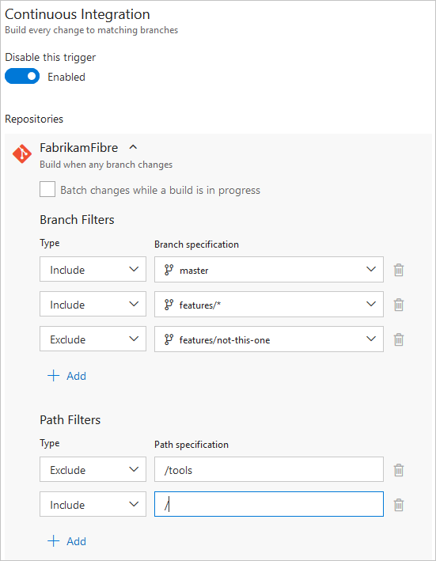
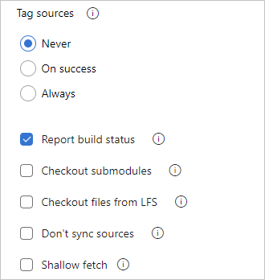
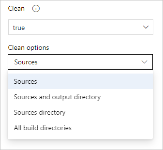
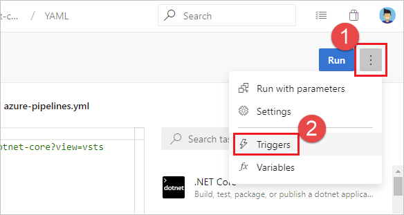
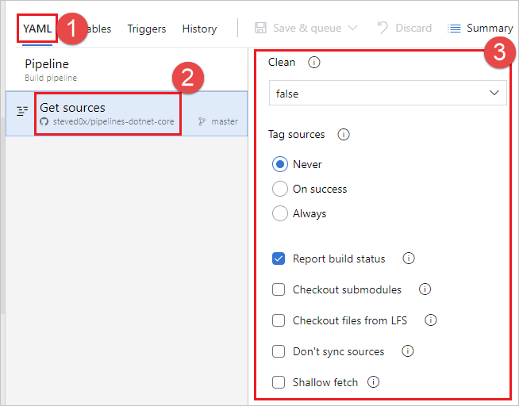

# Build Azure Repos Git or TFS Git repositories

[!INCLUDE [version-tfs-2015-rtm](../_shared/version-tfs-2015-rtm.md)]

::: moniker range="<= tfs-2018"
[!INCLUDE [temp](../_shared/concept-rename-note.md)]
::: moniker-end

Azure Pipelines can automatically build and validate every pull request and commit to your Azure Repos Git repository.

If you're new to Azure Pipelines, follow the steps in [Create your first pipeline](../create-first-pipeline.md) to get your first pipeline working with an Azure Repos Git repository, and then come back to this article to learn more about configuring and customizing the integration between Azure Repos and Azure Pipelines.

::: moniker range="azure-devops"

Azure Pipelines is free for Azure Repos Git repositories, with multiple free offerings available depending on whether your Azure DevOps project is public or private.

### Azure DevOps public project

If your Azure Repos Git repository is open source, you can make your Azure DevOps project **public** so that anyone can view your pipeline's build results, logs, and test results without signing in. When users submit pull requests, they can view the status of builds that automatically validate those pull requests.

> [!NOTE]
> Azure Repos Git repositories do not support forks by users who do not have explicit access to the project.

If your project is public, you can run up to 10 parallel jobs in Azure Pipelines for free. These free jobs have a maximum timeout of 360 minutes (6 hours) each. If you need more, you can contact us to have the limits increased.

For more information on public projects, see [Create a public project](../../organizations/public/create-public-project.md).

### Azure DevOps private project

If your project is private, we still provide a free tier. In this tier, you can run one free parallel job that can run up to 60 minutes each time until you've used 1800 minutes per month. When the free tier is no longer sufficient, you can purchase additional Microsoft-hosted parallel jobs through the [Azure DevOps Marketplace](https://marketplace.visualstudio.com/items?itemName=ms.build-release-hosted-pipelines). Purchasing jobs for private projects removes any monthly time limit and allows jobs to have a maximum timeout of 360 minutes (6 hours) each.

::: moniker-end

::: moniker range="<= tfs-2018"

Azure Pipelines is free if your project is privately hosted in TFS. You can run one free parallel job that can run up to 60 minutes each time until you've used 1800 minutes per month. When the free tier is no longer sufficient, you can purchase additional Microsoft-hosted parallel jobs through the [Azure DevOps Marketplace](https://marketplace.visualstudio.com/items?itemName=ms.build-release-hosted-pipelines). Purchasing jobs for private projects or private repositories removes any monthly time limit and allows jobs to have a maximum timeout of 360 minutes (6 hours) each.

::: moniker-end

::: moniker range=">= azure-devops-2019 < azure-devops"

Azure Pipelines is free if your project is privately hosted in Azure DevOps Server. You can run up to 10 parallel jobs in Azure Pipelines for free. These free jobs have a maximum timeout of 360 minutes (6 hours) each. If you need more, you can contact us to have the limits increased.

::: moniker-end

To adjust the timeout of jobs, see [Timeouts](../process/phases.md#timeouts).

Learn more about pricing based on [parallel jobs](../licensing/concurrent-jobs.md).

## Choose a repository to build

While creating a pipeline, to choose the repository to build, first select the project to which the repository belongs. Then, select the repository.

## Authorize access to your repositories

Azure Pipelines must be granted access to your repositories to display them, trigger their builds, and fetch their code during builds.

For the main repository that you configured when creating the pipeline - if the repository that you wish to build is in the same project as your pipeline, you're all set. Your builds will automatically have access to the repository. If the repository is in a different project than your pipeline, you must have read access to the project and repository (otherwise you won't be able to see the repository during pipeline creation to select it).

To clone additional repositories as part of your pipeline:

* If the repo is in the same project as your pipeline, use the following command:

  `git clone -c http.extraheader="AUTHORIZATION: bearer $(System.AccessToken)" <clone URL>`

* If the repo is not in the same project as your pipeline:

    1. Get a [personal access token (PAT)](../../organizations/accounts/use-personal-access-tokens-to-authenticate.md) with `Code (read)` scope, and prefix it with `pat:`
    2. Base64-encode this string to create a basic auth token.
    3. Use the following command to clone that repo
       `git clone -c http.extraheader="AUTHORIZATION: basic <BASIC_AUTH_TOKEN>" <clone URL>`

::: moniker range="azure-devops"

### Access restrictions

Be aware of the following access restrictions when you're running builds in Azure Pipelines public projects:

* **Cross-project access:** All builds in an Azure DevOps public project run with an access token restricted to the project. Builds in a public project can access resources such as build artifacts or test results only within the project and not from other projects of the organization.
* **Azure Artifacts packages:** If your builds need access to packages from Azure Artifacts, you must explicitly grant permission to the **Project Build Service** account to access the package feeds.

::: moniker-end

## Triggering a pipeline

You can have a pipelines triggered when the following events occur in your repo:

* A change is pushed to your repo ([CI Trigger](#ci-triggers))
* A pull request is created or updated ([Branch policy for pull request validation](#pull-request-validation))

### CI triggers

Continuous integration (CI) triggers cause a build to run whenever a push is made to the specified branches or a specified tag is pushed.

#### [YAML](#tab/yaml/)
::: moniker range=">= azure-devops-2019"

YAML builds are configured by default with a CI trigger on all branches.

### Branches

You can control which branches get CI triggers with a simple syntax:

```yaml
trigger:
- master
- releases/*
```

You can specify the full name of the branch (for example, `master`) or a wildcard (for example, `releases/*`).
See [Wildcards](../build/triggers.md#wildcards) for information on the wildcard syntax.

You can specify branches to include and exclude. For example:

```yaml
# specific branch build
trigger:
  branches:
    include:
    - master
    - releases/*
    exclude:
    - releases/old*
```

In addition to specifying branch names in the `branches` lists, you can also configure triggers based on tags by using the following format:

```yaml
trigger:
  branches:
    include:
      refs/tags/{tagname}
    exclude:
      refs/tags/{othertagname}
```

If you don't specify any triggers, the default is as if you wrote:

```yaml
trigger:
  branches:
    include:
    - '*'  # must quote since "*" is a YAML reserved character; we want a string
```

>[!IMPORTANT]
>When you specify a trigger, it replaces the default implicit trigger, and only pushes to branches that are explicitly configured to be included will trigger a pipeline. Includes are processed first, and then excludes are removed from that list. If you specify an exclude but don't specify any includes, nothing will trigger.

::: moniker-end

::: moniker range="azure-devops"

### Tags

In addition to specifying tags in the `branches` lists as covered in the previous section, you can directly specify tags to include or exclude:

```yaml
# specific branch build
trigger:
  tags:
    include:
    - v2.*
    exclude:
    - v2.0
```

If you don't specify any tag triggers, then by default, tags will not trigger pipelines.

::: moniker-end

::: moniker range=">= azure-devops-2019"

### Batching CI builds

If you have a lot of team members uploading changes often, you may want to reduce the number of builds you're running.
If you set `batch` to `true`, when a build is running, the system waits until the build is completed, then queues another build of all changes that have not yet been built.

```yaml
# specific branch build with batching
trigger:
  batch: true
  branches:
    include:
    - master
```

### Paths

You can specify file paths to include or exclude.

```yaml
# specific path build
trigger:
  branches:
    include:
    - master
    - releases/*
  paths:
    include:
    - docs/*
    exclude:
    - docs/README.md
```

When you specify paths, you also need to explicitly specify branches or tags to trigger on.

### Opting out of CI builds

#### Disabling the CI trigger

You can opt out of CI builds entirely by specifying `trigger: none`.

```yaml
# A pipeline with no CI trigger
trigger: none
```

>[!IMPORTANT]
>When you push a change to a branch, the YAML file in that branch is evaluated to determine if a CI build should be run.

For more information, see [Triggers](../yaml-schema.md#triggers) in the [YAML schema](../yaml-schema.md).

::: moniker-end

#### Skipping CI for individual commits

::: moniker range="<= azure-devops-2019"

You can also tell Azure Pipelines to skip running a pipeline that a commit would normally trigger. Just include `***NO_CI***` in the commit message of the HEAD commit and Azure Pipelines will skip running CI.

::: moniker-end

::: moniker range="> azure-devops-2019"

You can also tell Azure Pipelines to skip running a pipeline that a commit would normally trigger. Just include `[skip ci]` in the commit message or description of the HEAD commit and Azure Pipelines will skip running CI. You can also use any of the variations below.

- `[skip ci]` or `[ci skip]`
- `skip-checks: true` or `skip-checks:true`
- `[skip azurepipelines]` or `[azurepipelines skip]`
- `[skip azpipelines]` or `[azpipelines skip]`
- `[skip azp]` or `[azp skip]`
- `***NO_CI***`

::: moniker-end

::: moniker range="< azure-devops-2019"
YAML builds are not yet available on TFS.
::: moniker-end

#### [Classic](#tab/classic/)
Select this trigger if you want the build to run whenever someone checks in code.

### Batch changes

Select this check box if you have many team members uploading changes often and you want to reduce the number of builds you are running. If you select this option, when a build is running, the system waits until the build is completed and then queues another build of all changes that have not yet been built.

### Git filters

If your repository is Git then you can specify the branches where you want to trigger builds. If you want to use wildcard characters, then type the branch specification (for example, `features/modules/*`) and then press Enter.

#### Path filters

You can also specify path filters to reduce the set of files that you want to trigger a build.

> **Tips:**
>  * If you don't set path filters, then the root folder of the repo is implicitly included by default.
>  * When you add an explicit path filter, the implicit include of the root folder is removed. So make sure to explicitly include all folders that your build needs.
>  * If you exclude a path, you cannot also include it unless you qualify it to a deeper folder. For example if you exclude _/tools_ then you could include _/tools/trigger-runs-on-these_
>  * The order of path filters doesn't matter.

#### Example

For example, you want your build to be triggered by changes in master and most, but not all, of your feature branches. You also don't want builds to be triggered by changes to files in the tools folder.

::: moniker range=">= tfs-2017"

**Azure Pipelines, TFS 2017.3 and newer**



::: moniker-end

::: moniker range="<= tfs-2017"

**TFS 2017.1 and older versions**


::: moniker-end

* * *
### Pull request validation

Pull request (PR) triggers cause a build to run whenever a pull request is opened with one of the specified target branches, or when changes are pushed to such a pull request. In Azure Repos Git, this functionality is implemented using branch policies. To enable pull request validation in Azure Git Repos, navigate to the branch policies for the desired branch, and configure the [Build validation policy](../../repos/git/branch-policies.md#build-validation) for that branch. For more information, see [Configure branch policies](../../repos/git/branch-policies.md).

>[!NOTE]
>To configure validation builds for an Azure Repos Git repository, you must be a project administrator of its project.

::: moniker range=">= tfs-2018"

## Validate contributions from forks

Building pull requests from Azure Repos forks is no different from building pull requests within the same repository or project. You can create forks only within the same organization that your project is part of.

::: moniker-end

::: moniker range=">tfs-2018 || azure-devops"

## Add a build badge

To add a build badge to the `readme.md` file at the root of your repository, follow the steps in [Get the status badge](../create-first-pipeline.md#get-the-status-badge).

::: moniker-end

## Getting the source code

When a pipeline is triggered, Azure Pipelines pulls your source code from the Azure Repos Git repository. You can control various aspects of how this happens.

### Preferred version of Git

The Windows agent comes with its own copy of Git.
If you prefer to supply your own Git rather than use the included copy, set `System.PreferGitFromPath` to `true`.
This setting is always true on non-Windows agents.

::: moniker range="> azure-devops-2019"

### Checkout path

By default, your source code will be checked out into a directory called `s`. For YAML pipelines, you can change this by specifying `checkout` with a `path`. The specified path is relative to `$(Agent.BuildDirectory)`. For example: if the checkout path value is `mycustompath` and `$(Agent.BuildDirectory)` is `C:\agent\_work\1`, then the source code will be checked out into `C:\agent\_work\1\mycustompath`.

Please note that the checkout path value cannot be set to go up any directory levels above `$(Agent.BuildDirectory)`, so `path\..\anotherpath` will result in a valid checkout path (i.e. `C:\agent\_work\1\anotherpath`), but a value like `..\invalidpath` will not (i.e. `C:\agent\_work\invalidpath`).

# [YAML](#tab/yaml)

You can configure the `path` setting in the [Checkout](../yaml-schema.md#checkout) step of your pipeline.

```yaml
steps:
- checkout: self  # self represents the repo where the initial Pipelines YAML file was found
  clean: boolean  # whether to fetch clean each time
  fetchDepth: number  # the depth of commits to ask Git to fetch
  lfs: boolean  # whether to download Git-LFS files
  submodules: true | recursive  # set to 'true' for a single level of submodules or 'recursive' to get submodules of submodules
  path: string  # path to check out source code, relative to the agent's build directory (e.g. \_work\1)
  persistCredentials: boolean  # set to 'true' to leave the OAuth token in the Git config after the initial fetch
```

# [Classic](#tab/classic)

This setting is not configurable in the classic editor.

---

::: moniker-end

### Submodules

Select if you want to download files from [submodules](https://git-scm.com/book/en/v2/Git-Tools-Submodules).
You can either choose to get the immediate submodules or all submodules nested to any depth of recursion.

# [YAML](#tab/yaml)

You can configure the `submodules` setting in the [Checkout](../yaml-schema.md#checkout) step of your pipeline.

```yaml
steps:
- checkout: self  # self represents the repo where the initial Pipelines YAML file was found
  clean: boolean  # whether to fetch clean each time
  fetchDepth: number  # the depth of commits to ask Git to fetch
  lfs: boolean  # whether to download Git-LFS files
  submodules: true | recursive  # set to 'true' for a single level of submodules or 'recursive' to get submodules of submodules
  path: string  # path to check out source code, relative to the agent's build directory (e.g. \_work\1)
  persistCredentials: boolean  # set to 'true' to leave the OAuth token in the Git config after the initial fetch
```

# [Classic](#tab/classic)

You can configure the **Submodules** setting from the properties of the **Get sources** task in your pipeline.

 

---

The build pipeline will check out your Git submodules as long as they are:

* **Unauthenticated:**  A public, unauthenticated repo with no credentials required to clone or fetch.

* **Authenticated:**  

  - Contained in the same project as the Azure Repos Git repo specified above.

  - Added by using a URL relative to the main repository. For example
    - This one would be checked out: 
     `git submodule add ../../../FabrikamFiberProject/_git/FabrikamFiber FabrikamFiber` 

      In this example the submodule refers to a repo (FabrikamFiber) in the same Azure DevOps organization, but in a different project (FabrikamFiberProject)

    - This one would not be checked out:
     `git submodule add https://fabrikam-fiber@dev.azure.com/fabrikam-fiber/FabrikamFiberProject/_git/FabrikamFiber FabrikamFiber`


#### Authenticated submodules

> [!NOTE]
> Make sure that you have registered your submodules using HTTPS and not using SSH.

The same credentials that are used by the agent to get the sources from the main repository are also used to get the sources for submodules.

# [YAML](#tab/yaml)

YAML builds run with project scope, so by default submodules are accessed using the Project Build Service account. There is no way to configure a YAML build to run with project collection scope.

# [Classic](#tab/classic)

If your main repository and submodules are in an Azure Repos Git repository in your Azure DevOps project, then you can select the account used to access the sources. On the **Options** tab, on the **Build job authorization scope** menu, select either:

* **Project collection** to use the Project Collection Build service account

* **Current project** to use the Project Build Service account

Make sure that whichever account you use has access to both the main repository as well as the submodules.

---

#### Alternative to using the Checkout submodules option

In some cases you can't use the **Checkout submodules** option.
You might have a scenario where a different set of credentials are needed to access the submodules.
This can happen, for example, if your main repository and submodule repositories aren't stored in the same Azure DevOps organization.

If you can't use the **Checkout submodules** option, then you can instead use a custom script step to fetch submodules.
First, get a personal access token (PAT) and prefix it with `pat:`.
Next, [base64-encode](https://www.base64encode.org/) this prefixed string to create a basic auth token.
Finally, add this script to your pipeline:

```
git -c http.https://<url of submodule repository>.extraheader="AUTHORIZATION: basic <BASE64_ENCODED_TOKEN_DESCRIBED_ABOVE>" submodule update --init --recursive
```

Be sure to replace "<BASIC_AUTH_TOKEN>" with your Base64-encoded token.

Use a secret variable in your project or build pipeline to store the basic auth token that you generated.
Use that variable to populate the secret in the above Git command.
> [!NOTE]
> **Q: Why can't I use a Git credential manager on the agent?** **A:** Storing the submodule credentials in a Git credential manager installed on your private build agent is usually not effective as the credential manager may prompt you to re-enter the credentials whenever the submodule is updated. This isn't desirable during automated builds when user interaction isn't possible.

### Shallow fetch

Select if you want to limit how far back in history to download. Effectively this results in `git fetch --depth=n`. If your repository is large, this option might make your build pipeline more efficient. Your repository might be large if it has been in use for a long time and has sizeable history. It also might be large if you added and later deleted large files.

# [YAML](#tab/yaml)

You can configure the `fetchDepth` setting in the [Checkout](../yaml-schema.md#checkout) step of your pipeline.

```yaml
steps:
- checkout: self  # self represents the repo where the initial Pipelines YAML file was found
  clean: boolean  # whether to fetch clean each time
  fetchDepth: number  # the depth of commits to ask Git to fetch
  lfs: boolean  # whether to download Git-LFS files
  submodules: true | recursive  # set to 'true' for a single level of submodules or 'recursive' to get submodules of submodules
  path: string  # path to check out source code, relative to the agent's build directory (e.g. \_work\1)
  persistCredentials: boolean  # set to 'true' to leave the OAuth token in the Git config after the initial fetch
```

# [Classic](#tab/classic)

You can configure the **Shallow fetch** setting from the properties of the **Get sources** task in your pipeline.

 

---

In these cases this option can help you conserve network and storage resources. It might also save time. The reason it doesn't always save time is because in some situations the server might need to spend time calculating the commits to download for the depth you specify.

> [!NOTE]
> When the build is queued, the branch to build is resolved to a commit ID. Then, the agent
> fetches the branch and checks out the desired commit. There is a small window between when a branch
> is resolved to a commit ID and when the agent performs the checkout. If the branch updates rapidly
> and you set a very small value for shallow fetch, the commit may not exist when the agent attempts
> to check it out. If that happens, increase the shallow fetch depth setting.

### Don't sync sources

Use this option if you want to skip fetching new commits. This option can be useful in cases when you want to:

* Git init, config, and fetch using your own custom options.

* Use a build pipeline to just run automation (for example some scripts) that do not depend on code in version control.

# [YAML](#tab/yaml)

You can configure the **Don't sync sources** setting in the [Checkout](../yaml-schema.md#checkout) step of your pipeline, by setting `checkout: none`.

```yaml
steps:
- checkout: none  # Don't sync sources
```

# [Classic](#tab/classic)

Select the **Don't sync sources** setting from the properties of the **Get sources** task in your pipeline.

 

---

If you want to disable downloading sources, from the **Get sources** task, select **Don't sync sources**.

> [!NOTE]
> When you use this option, the agent also skips running Git commands that clean the repo.

### Multiple repos

By default, your pipeline is associated with one repo from Azure Repos.
This is the repo that can trigger builds on commits and pull requests.

You may want to include sources from a second repo in your pipeline.
You can do this by writing a script.

```
git clone https://github.com/Microsoft/TypeScript.git
```

If the repo is not public, you will need to pass authentication to the Git command.

> [!NOTE]
> Secret variables are not automatically made available to scripts as environment variables.
> See [Secret variables](../process/variables.md#secret-variables) on how to map them in.

### Clean build

[!INCLUDE [include](_shared/build-clean-intro.md)]

> [!NOTE]
> Cleaning is not effective if you're using a [Microsoft-hosted agent](../agents/hosted.md) because you'll get a new agent every time.

#### [YAML](#tab/yaml/)
You can configure the `clean` setting in the [Checkout](../yaml-schema.md#checkout) step of your pipeline.

```yaml
steps:
- checkout: self  # self represents the repo where the initial Pipelines YAML file was found
  clean: boolean  # whether to fetch clean each time
  fetchDepth: number  # the depth of commits to ask Git to fetch
  lfs: boolean  # whether to download Git-LFS files
  submodules: true | recursive  # set to 'true' for a single level of submodules or 'recursive' to get submodules of submodules
  path: string  # path to check out source code, relative to the agent's build directory (e.g. \_work\1)
  persistCredentials: boolean  # set to 'true' to leave the OAuth token in the Git config after the initial fetch
```

When `clean` is set to `true` the build pipeline performs an undo of any changes in `$(Build.SourcesDirectory)`. More specifically, the following Git commands are executed prior to fetching the source.

 ```
 git clean -ffdx
 git reset --hard HEAD
 ```

For more options, you can configure the `workspace` setting of a [Job](../yaml-schema.md#job). 

```yaml
jobs:
- job: string  # name of the job, A-Z, a-z, 0-9, and underscore
  ...
  workspace:
    clean: outputs | resources | all # what to clean up before the job runs
```


This gives the following clean options.

* **outputs**: Same operation as the clean setting described in the previous the checkout task, plus: Deletes and recreates `$(Build.BinariesDirectory)`. Note that the `$(Build.ArtifactStagingDirectory)` and `$(Common.TestResultsDirectory)` are always deleted and recreated prior to every build regardless of any of these settings.

* **resources**: Deletes and recreates `$(Build.SourcesDirectory)`. This results in initializing a new, local Git repository for every build.

* **all**: Deletes and recreates `$(Agent.BuildDirectory)`. This results in initializing a new, local Git repository for every build.

#### [Classic](#tab/classic/)
Select the **Clean** setting from the properties of the **Get sources** task in your pipeline and select one of the following options.

 

* **Sources**: The build pipeline performs an undo of any changes in `$(Build.SourcesDirectory)`. More specifically, the following Git commands are executed prior to fetching the source.
  ```
  git clean -ffdx
  git reset --hard HEAD
  ```

* **Sources and output directory**: Same operation as **Sources** option above, plus: Deletes and recreates `$(Build.BinariesDirectory)`. Note that the `$(Build.ArtifactStagingDirectory)` and `$(Common.TestResultsDirectory)` are always deleted and recreated prior to every build regardless of any of these settings.

* **Sources directory**: Deletes and recreates `$(Build.SourcesDirectory)`. This results in initializing a new, local Git repository for every build.

* **All build directories**: Deletes and recreates `$(Agent.BuildDirectory)`. This results in initializing a new, local Git repository for every build.

* * *
### Label sources

You may want to label your source code files to enable your team to easily identify which version of each file is included in the completed build. You also have the option to specify whether the source code should be labeled for all builds or only for successful builds.

# [YAML](#tab/yaml)

You can't currently configure this setting in YAML but you can in the classic editor. When editing a YAML pipeline, you can access the classic editor by choosing either **Triggers** or **Variables** from the settings menu.



From the classic editor, choose **YAML**, choose the **Get sources** task, and then configure the desired properties there.



# [Classic](#tab/classic)

You can configure the **Tag sources** setting from the properties of the **Get sources** task in your pipeline.

 

---

In the **Tag format** you can use user-defined and predefined variables that have a scope of "All." For example:

```
$(Build.DefinitionName)_$(Build.DefinitionVersion)_$(Build.BuildId)_$(Build.BuildNumber)_$(My.Variable)
```

The first four variables are predefined. `My.Variable` can be defined by you on the [variables tab](../build/variables.md).

The build pipeline labels your sources with a [Git tag](https://git-scm.com/book/en/v2/Git-Basics-Tagging).

Some build variables might yield a value that is not a valid label. For example, variables such as `$(Build.RequestedFor)` and `$(Build.DefinitionName)` can contain white space. If the value contains white space, the tag is not created.

After the sources are tagged by your build pipeline, an artifact with the Git ref `refs/tags/{tag}` is automatically added to the completed build. This gives your team additional traceability and a more user-friendly way to navigate from the build to the code that was built.


