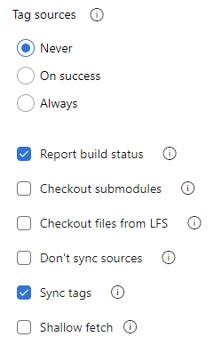

# Build Azure Repos Git or TFS Git repositories

[!INCLUDE [version-tfs-2015-rtm](../includes/version-tfs-2015-rtm.md)]

::: moniker range="<= tfs-2018"
[!INCLUDE [temp](../includes/concept-rename-note.md)]
::: moniker-end

Azure Pipelines can automatically build and validate every pull request and commit to your Azure Repos Git repository.

## Choose a repository to build

# [YAML](#tab/yaml/)

::: moniker range=">= azure-devops-2019"

You create a new pipeline by first selecting a repository and then a YAML file in that repository. The repository in which the YAML file is present is called `self` repository. By default, this is the repository that your pipeline builds. 

::: moniker-end

::: moniker range="azure-devops-2019"

You can configure your pipeline to check out a different repository or multiple repositories. To learn how to do this, see [multi-repo checkout](multi-repo-checkout.md).

::: moniker-end

::: moniker range="< azure-devops-2019"

YAML pipelines are not available in TFS.

::: moniker-end

# [Classic](#tab/classic/)

While creating a pipeline, to choose the repository to build, first select the project to which the repository belongs. Then, select the repository.

To clone additional repositories as part of your pipeline:

* If the repo is in the same project as your pipeline, or if the access token (explained below) has access to the repository in a different project, use the following command:

  `git clone -c http.extraheader="AUTHORIZATION: bearer $(System.AccessToken)" <clone URL>`

* If the access token (explained below) does not have access to the repository:

    1. Get a [personal access token (PAT)](../../organizations/accounts/use-personal-access-tokens-to-authenticate.md) with `Code (read)` scope, and prefix it with `pat:`
    2. Base64-encode this string to create a basic auth token.
    3. Add a script in your pipeline with the following command to clone that repo
       `git clone -c http.extraheader="AUTHORIZATION: basic <BASIC_AUTH_TOKEN>" <clone URL>`

---

Azure Pipelines must be granted access to your repositories to trigger their builds and fetch their code during builds. Access to the repository is governed by permissions of job access tokens. A **job access token** is a security token that is dynamically generated by Azure Pipelines for each job at run time. The token's permissions are derived from (a) job authorization scope and (b) the permissions you set on project or collection build service account.

### Job authorization scope

You can set the job authorization scope to be **collection** or **project**. By setting the scope to **collection**, you choose to let pipelines access all repositories in the collection or organization. By setting the scope to **project**, you choose to restrict access to only those repositories that are in the same project as the pipeline.

# [YAML](#tab/yaml/)

::: moniker range="azure-devops"

Job authorization scope can be set for the entire Azure DevOps organization or for a specific project. 

To set job authorization scope for the organization:

- Navigate to your organization settings page in the Azure DevOps user interface.
- Select **Settings** under **Pipelines**.
- Turn on the toggle **Limit job authorization scope to current project** to limit the scope to project. This is the recommended setting, as it enhances security for your pipelines.

To set job authorization scope for a specific project:

- Navigate to your project settings page in the Azure DevOps user interface.
- Select **Settings** under **Pipelines**.
- Turn on the toggle **Limit job authorization scope to current project** to limit the scope to project. This is the recommended setting, as it enhances security for your pipelines.

>[!NOTE]
>If the scope is set to **project** at the organization level, you cannot change the scope in each project.

>[!IMPORTANT]
If the scope is not restricted at either the organization level or project level, then every job in your YAML pipeline gets a collection scoped job access token. In other words, your pipeline has access to any repository in any project of your organization. If an adversary is able to gain access to a single pipeline in a single project, he or she will be able to gain access to any repository in your organization. This is why, it is recommended that you restrict the scope at the highest level (organization settings) in order to contain the attack to a single project.

::: moniker-end

::: moniker range="<= azure-devops-2019"

If you use Azure DevOps Server 2019, then all YAML jobs run with the job authorization scope set to **collection**. In other words, these jobs have access to all repositories in your project collection. You cannot change this in Azure DevOps server 2019.

YAML pipelines are not available in TFS.

::: moniker-end

# [Classic](#tab/classic/)

::: moniker range="azure-devops"

Job authorization scope can be set for the entire Azure DevOps organization, for a specific project, or for a specific pipeline. 

To set job authorization scope for the organization:

- Navigate to your organization settings page in the Azure DevOps user interface.
- Select **Settings** under **Pipelines**.
- Turn on the toggle **Limit job authorization scope to current project** to limit the scope to project. This is the recommended setting, as it enhances security for your pipelines.

To set job authorization scope for a specific project:

- Navigate to your project settings page in the Azure DevOps user interface.
- Select **Settings** under **Pipelines**.
- Turn on the toggle **Limit job authorization scope to current project** to limit the scope to project. This is the recommended setting, as it enhances security for your pipelines.

>[!NOTE]
>If the scope is set to **project** at the organization level, you cannot change the scope in each project.

To set job authorization scope for a specific pipeline:

- Navigate to the pipeline in the **Pipelines** page.
- Select **Edit** to edit the pipeline.
- In the **Options** tab, select **Project collection** or **Current project** for **Build job authorization scope**.
- Save the build pipeline.

>[!NOTE]
>If the scope if restricted to **project** in the organization or project level settings, then the pipeline-level job authorization scope is ignored. The project or organization level setting prevails.

>[!IMPORTANT]
If the scopes are not restricted at either the organization level or project level, then you are allowing the pipeline authors to determine the access they need to repositories. If an adversary is able to create or edit a pipeline in one project, he or she will be able to gain access to any repository in your organization. This is why, it is recommended that you restrict the scope at the highest level (organization settings) in order to contain the attack to a single project.

::: moniker-end

::: moniker range="<= azure-devops-2019"

Job authorization scope can be set for each pipeline. To set this scope:

- Navigate to the pipeline in the **Pipelines** page.
- Select **Edit** to edit the pipeline.
- In the **Options** tab, select **Project collection** or **Current project** for **Build job authorization scope**.
- Save the build pipeline.

::: moniker-end

---

>[!NOTE]
> If your pipeline is in a **pubic project**, then the job authorization scope is automatically restricted to **project** no matter what you configure in any setting. Jobs in a public project can access resources such as build artifacts or test results only within the project and not from other projects of the organization.

### Build service account

You may want to change the permissions of build access token in scenarios such as the following:

- You want your pipeline to access a feed that is in a different project.
- You want your pipeline to be restricted from changing code in the repository.
- You want your pipeline to be restricted from creating work items.

To update the permissions of build access token:

- First, determine the job authorization scope for your pipeline. See the section above to understand job authorization scope. If the job authorization scope is **collection**, then the corresponding build service account to manage permissions on is **Project Collection Build Service (<your collection name>)**. If the job authorization scope is **project**, then the build service account to manage permissions on is **<Your project name> Build Service (<your collection name>)**.

- To restrict or grant additional access to **Project Collection Build Service (<your collection name>)**:
  - Select **Manage security** in the overflow menu on **Pipelines** page.
  - Under **Users**, select **Project Collection Build Service (<your collection name>)**.
  - Make any changes to the pipelines-related permissions for this account.
  - Navigate to organization settings for your Azure DevOps organization (or collection settings for your project collection).
  - Select **Permissions** under **Security**.
  - Under the **Users** tab, look for **Project Collection Build Service (<your collection name>)**.
  - Make any changes to the non-pipelines-related permissions for this account.
  - Since **Project Collection Build Service (<your collection name>)** is a user in your organization or collection, you can add this account explicitly to any resource - for e.g., to a feed in Azure Artifacts.

- To restrict or grant additional access to **<Your project name> Build Service (<your collection name>)**:
  - The build service account on which you can manage permissions will only be created after you run the pipeline once. Make sure that you already ran the pipeline once.
  - Select **Manage security** in the overflow menu on **Pipelines** page.
  - Under **Users**, select **<Your project name> Build Service (<your collection name>)**.
  - Make any changes to the pipelines-related permissions for this account.
  - Navigate to organization settings for your Azure DevOps organization (or collection settings for your project collection).
  - Select **Permissions** under **Security**.
  - Under the **Users** tab, look for **<Your project name> build service (<your collection name>)**.
  - Make any changes to the non-pipelines-related permissions for this account.
  - Since **<Your project name> Build Service (<your collection name>)** is a user in your organization or collection, you can add this account explicitly to any resource - for e.g., to a feed in Azure Artifacts.

## CI triggers

[!INCLUDE [ci-triggers](includes/ci-triggers.md)]

## Pull request validation

Pull request (PR) triggers cause a build to run whenever a pull request is opened with one of the specified target branches, or when changes are pushed to such a pull request. In Azure Repos Git, this functionality is implemented using branch policies. To enable pull request validation in Azure Git Repos, navigate to the branch policies for the desired branch, and configure the [Build validation policy](../../repos/git/branch-policies.md#build-validation) for that branch. For more information, see [Configure branch policies](../../repos/git/branch-policies.md).

>[!NOTE]
>To configure validation builds for an Azure Repos Git repository, you must be a project administrator of its project.

::: moniker range=">tfs-2018"

### Validate contributions from forks

Building pull requests from Azure Repos forks is no different from building pull requests within the same repository or project. You can create forks only within the same organization that your project is part of.

::: moniker-end

::: moniker range=">tfs-2018"

## Add a build badge

To add a build badge to the `readme.md` file at the root of your repository, follow the steps in [Get the status badge](../create-first-pipeline.md#get-the-status-badge).

::: moniker-end

## Get the source code

When a pipeline is triggered, Azure Pipelines pulls your source code from the Azure Repos Git repository. You can control various aspects of how this happens.

### Preferred version of Git

The Windows agent comes with its own copy of Git.
If you prefer to supply your own Git rather than use the included copy, set `System.PreferGitFromPath` to `true`.
This setting is always true on non-Windows agents.

### Checkout path

# [YAML](#tab/yaml)

::: moniker range="azure-devops-2019"

If you are checking out a single repository, by default, your source code will be checked out into a directory called `s`. For YAML pipelines, you can change this by specifying `checkout` with a `path`. The specified path is relative to `$(Agent.BuildDirectory)`. For example: if the checkout path value is `mycustompath` and `$(Agent.BuildDirectory)` is `C:\agent\_work\1`, then the source code will be checked out into `C:\agent\_work\1\mycustompath`.

If you are using multiple `checkout` steps and checking out multiple repositories, and not explicitly specifying the folder using `path`, each repository is placed in a subfolder of `s` named after the repository. For example if you check out two repositories named `tools` and `code`, the source code will be checked out into `C:\agent\_work\1\s\tools` and `C:\agent\_work\1\s\code`.

Please note that the checkout path value cannot be set to go up any directory levels above `$(Agent.BuildDirectory)`, so `path\..\anotherpath` will result in a valid checkout path (i.e. `C:\agent\_work\1\anotherpath`), but a value like `..\invalidpath` will not (i.e. `C:\agent\_work\invalidpath`).

You can configure the `path` setting in the [Checkout](../yaml-schema.md#checkout) step of your pipeline.

```yaml
steps:
- checkout: self  # self represents the repo where the initial Pipelines YAML file was found
  clean: boolean  # whether to fetch clean each time
  fetchDepth: number  # the depth of commits to ask Git to fetch
  lfs: boolean  # whether to download Git-LFS files
  submodules: true | recursive  # set to 'true' for a single level of submodules or 'recursive' to get submodules of submodules
  path: string  # path to check out source code, relative to the agent's build directory (e.g. \_work\1)
  persistCredentials: boolean  # set to 'true' to leave the OAuth token in the Git config after the initial fetch
```

::: moniker-end

::: moniker range="azure-devops-2019"

Your source code will be checked out into a directory called `s`, which is relative to `$(Agent.BuildDirectory)`. For example: if `$(Agent.BuildDirectory)` is `C:\agent\_work\1`, then the source code will be checked out into `C:\agent\_work\1\mycustompath`.

::: moniker-end

::: moniker range="< azure-devops-2019"

YAML pipelines are not available in TFS.

::: moniker-end

# [Classic](#tab/classic)

This setting is not configurable in the classic editor. Your source code will be checked out into a directory called `s`, which is relative to `$(Agent.BuildDirectory)`. For example: if `$(Agent.BuildDirectory)` is `C:\agent\_work\1`, then the source code will be checked out into `C:\agent\_work\1\mycustompath`.

---

### Submodules

# [YAML](#tab/yaml)

::: moniker range="azure-devops"

You can configure the `submodules` setting in the [Checkout](../yaml-schema.md#checkout) step of your pipeline if you want to download files from [submodules](https://git-scm.com/book/en/v2/Git-Tools-Submodules).

```yaml
steps:
- checkout: self  # self represents the repo where the initial Pipelines YAML file was found
  clean: boolean  # whether to fetch clean each time
  fetchDepth: number  # the depth of commits to ask Git to fetch
  lfs: boolean  # whether to download Git-LFS files
  submodules: true | recursive  # set to 'true' for a single level of submodules or 'recursive' to get submodules of submodules
  path: string  # path to check out source code, relative to the agent's build directory (e.g. \_work\1)
  persistCredentials: boolean  # set to 'true' to leave the OAuth token in the Git config after the initial fetch
```

::: moniker-end

::: moniker range="azure-devops-2019"

This feature is not available in Azure DevOps Server 2019.

::: moniker-end

::: moniker range="< azure-devops-2019"

YAML pipelines are not available in TFS.

::: moniker-end

# [Classic](#tab/classic)

You can configure the **Submodules** setting from the properties of the **Get sources** task in your pipeline if you want to download files from [submodules](https://git-scm.com/book/en/v2/Git-Tools-Submodules).



---

The build pipeline will check out your Git submodules as long as they are:

* **Unauthenticated:**  A public, unauthenticated repo with no credentials required to clone or fetch.

* **Authenticated:** 

  - Contained in the same project as the Azure Repos Git repo specified above.  The same credentials that are used by the agent to get the sources from the main repository are also used to get the sources for submodules.

  - Added by using a URL relative to the main repository. For example
    - This one would be checked out:
     `git submodule add ../../../FabrikamFiberProject/_git/FabrikamFiber FabrikamFiber` 

      In this example the submodule refers to a repo (FabrikamFiber) in the same Azure DevOps organization, but in a different project (FabrikamFiberProject).  The same credentials that are used by the agent to get the sources from the main repository are also used to get the sources for submodules. This requires that the job access token has access to the repository in the second project. If you restricted the job access token as explained in the section above, then you won't be able to do this.

    - This one would not be checked out:
     `git submodule add https://fabrikam-fiber@dev.azure.com/fabrikam-fiber/FabrikamFiberProject/_git/FabrikamFiber FabrikamFiber`

#### Alternative to using the Checkout submodules option

In some cases you can't use the **Checkout submodules** option.
You might have a scenario where a different set of credentials are needed to access the submodules.
This can happen, for example, if your main repository and submodule repositories aren't stored in the same Azure DevOps organization, or if your job access token does not have access to the repository in a different project.

If you can't use the **Checkout submodules** option, then you can instead use a custom script step to fetch submodules.
First, get a personal access token (PAT) and prefix it with `pat:`.
Next, [base64-encode](https://www.base64encode.org/) this prefixed string to create a basic auth token.
Finally, add this script to your pipeline:

```
git -c http.https://<url of submodule repository>.extraheader="AUTHORIZATION: basic <BASE64_ENCODED_TOKEN_DESCRIBED_ABOVE>" submodule update --init --recursive
```

Be sure to replace "<BASIC_AUTH_TOKEN>" with your Base64-encoded token.

Use a secret variable in your project or build pipeline to store the basic auth token that you generated.
Use that variable to populate the secret in the above Git command.

> [!NOTE]
> **Q: Why can't I use a Git credential manager on the agent?** **A:** Storing the submodule credentials in a Git credential manager installed on your private build agent is usually not effective as the credential manager may prompt you to re-enter the credentials whenever the submodule is updated. This isn't desirable during automated builds when user interaction isn't possible.

### Shallow fetch

You may want to limit how far back in history to download. Effectively this results in `git fetch --depth=n`. If your repository is large, this option might make your build pipeline more efficient. Your repository might be large if it has been in use for a long time and has sizeable history. It also might be large if you added and later deleted large files.

# [YAML](#tab/yaml)

::: moniker range="azure-devops"

You can configure the `fetchDepth` setting in the [Checkout](../yaml-schema.md#checkout) step of your pipeline.

```yaml
steps:
- checkout: self  # self represents the repo where the initial Pipelines YAML file was found
  clean: boolean  # whether to fetch clean each time
  fetchDepth: number  # the depth of commits to ask Git to fetch
  lfs: boolean  # whether to download Git-LFS files
  submodules: true | recursive  # set to 'true' for a single level of submodules or 'recursive' to get submodules of submodules
  path: string  # path to check out source code, relative to the agent's build directory (e.g. \_work\1)
  persistCredentials: boolean  # set to 'true' to leave the OAuth token in the Git config after the initial fetch
```

::: moniker-end

::: moniker range="azure-devops-2019"

This feature is not available in Azure DevOps Server 2019.

::: moniker-end

::: moniker range="< azure-devops-2019"

YAML pipelines are not available in TFS.

::: moniker-end

# [Classic](#tab/classic)

You can configure the **Shallow fetch** setting from the properties of the **Get sources** task in your pipeline.


---

In these cases this option can help you conserve network and storage resources. It might also save time. The reason it doesn't always save time is because in some situations the server might need to spend time calculating the commits to download for the depth you specify.

> [!NOTE]
> When the pipeline is started, the branch to build is resolved to a commit ID. Then, the agent
> fetches the branch and checks out the desired commit. There is a small window between when a branch
> is resolved to a commit ID and when the agent performs the checkout. If the branch updates rapidly
> and you set a very small value for shallow fetch, the commit may not exist when the agent attempts
> to check it out. If that happens, increase the shallow fetch depth setting.

### Don't sync sources

::: moniker range=">= azure-devops-2019"

You may want to skip fetching new commits. This option can be useful in cases when you want to:

* Git init, config, and fetch using your own custom options.

* Use a build pipeline to just run automation (for example some scripts) that do not depend on code in version control.

# [YAML](#tab/yaml)

You can configure the **Don't sync sources** setting in the [Checkout](../yaml-schema.md#checkout) step of your pipeline, by setting `checkout: none`.

```yaml
steps:
- checkout: none  # Don't sync sources
```

::: moniker-end

::: moniker range="< azure-devops-2019"

YAML pipelines are not available in TFS.

::: moniker-end

# [Classic](#tab/classic)

Select the **Don't sync sources** setting from the properties of the **Get sources** task in your pipeline.


---

> [!NOTE]
> When you use this option, the agent also skips running Git commands that clean the repo.

### Clean build

[!INCLUDE [include](includes/build-clean-intro.md)]

> [!NOTE]
> Cleaning is not effective if you're using a [Microsoft-hosted agent](../agents/hosted.md) because you'll get a new agent every time.

# [YAML](#tab/yaml/)

::: moniker range="azure-devops"

You can configure the `clean` setting in the [Checkout](../yaml-schema.md#checkout) step of your pipeline.

```yaml
steps:
- checkout: self  # self represents the repo where the initial Pipelines YAML file was found
  clean: boolean  # whether to fetch clean each time
  fetchDepth: number  # the depth of commits to ask Git to fetch
  lfs: boolean  # whether to download Git-LFS files
  submodules: true | recursive  # set to 'true' for a single level of submodules or 'recursive' to get submodules of submodules
  path: string  # path to check out source code, relative to the agent's build directory (e.g. \_work\1)
  persistCredentials: boolean  # set to 'true' to leave the OAuth token in the Git config after the initial fetch
```

When `clean` is set to `true` the build pipeline performs an undo of any changes in `$(Build.SourcesDirectory)`. More specifically, the following Git commands are executed prior to fetching the source.

 ```
 git clean -ffdx
 git reset --hard HEAD
 ```

For more options, you can configure the `workspace` setting of a [Job](../yaml-schema.md#job). 

```yaml
jobs:
- job: string  # name of the job, A-Z, a-z, 0-9, and underscore
  ...
  workspace:
    clean: outputs | resources | all # what to clean up before the job runs
```


This gives the following clean options.

* **outputs**: Same operation as the clean setting described in the previous the checkout task, plus: Deletes and recreates `$(Build.BinariesDirectory)`. Note that the `$(Build.ArtifactStagingDirectory)` and `$(Common.TestResultsDirectory)` are always deleted and recreated prior to every build regardless of any of these settings.

* **resources**: Deletes and recreates `$(Build.SourcesDirectory)`. This results in initializing a new, local Git repository for every build.

* **all**: Deletes and recreates `$(Agent.BuildDirectory)`. This results in initializing a new, local Git repository for every build.

::: moniker-end

::: moniker range="azure-devops-2019"

This feature is not available in Azure DevOps Server 2019.

::: moniker-end

::: moniker range="< azure-devops-2019"

YAML pipelines are not available in TFS.

::: moniker-end

# [Classic](#tab/classic/)
Select the **Clean** setting from the properties of the **Get sources** task in your pipeline and select one of the following options.


* **Sources**: The build pipeline performs an undo of any changes in `$(Build.SourcesDirectory)`. More specifically, the following Git commands are executed prior to fetching the source.
  ```
  git clean -ffdx
  git reset --hard HEAD
  ```

* **Sources and output directory**: Same operation as **Sources** option above, plus: Deletes and recreates `$(Build.BinariesDirectory)`. Note that the `$(Build.ArtifactStagingDirectory)` and `$(Common.TestResultsDirectory)` are always deleted and recreated prior to every build regardless of any of these settings.

* **Sources directory**: Deletes and recreates `$(Build.SourcesDirectory)`. This results in initializing a new, local Git repository for every build.

* **All build directories**: Deletes and recreates `$(Agent.BuildDirectory)`. This results in initializing a new, local Git repository for every build.

---

### Label sources

You may want to label your source code files to enable your team to easily identify which version of each file is included in the completed build. You also have the option to specify whether the source code should be labeled for all builds or only for successful builds.

# [YAML](#tab/yaml)

::: moniker range=">=azure-devops-2019"

You can't currently configure this setting in YAML but you can in the classic editor. When editing a YAML pipeline, you can access the classic editor by choosing either **Triggers** from the YAML editor menu.


From the classic editor, choose **YAML**, choose the **Get sources** task, and then configure the desired properties there.


::: moniker-end

::: moniker range="< azure-devops-2019"

YAML pipelines are not available in TFS.

::: moniker-end

# [Classic](#tab/classic)

You can configure the **Tag sources** setting from the properties of the **Get sources** task in your pipeline.

 

---

In the **Tag format** you can use user-defined and predefined variables that have a scope of "All." For example:

```
$(Build.DefinitionName)_$(Build.DefinitionVersion)_$(Build.BuildId)_$(Build.BuildNumber)_$(My.Variable)
```

The first four variables are predefined. `My.Variable` can be defined by you on the [variables tab](../build/variables.md).

The build pipeline labels your sources with a [Git tag](https://git-scm.com/book/en/v2/Git-Basics-Tagging).

Some build variables might yield a value that is not a valid label. For example, variables such as `$(Build.RequestedFor)` and `$(Build.DefinitionName)` can contain white space. If the value contains white space, the tag is not created.

After the sources are tagged by your build pipeline, an artifact with the Git ref `refs/tags/{tag}` is automatically added to the completed build. This gives your team additional traceability and a more user-friendly way to navigate from the build to the code that was built.

::: moniker range="azure-devops"

## Pricing

Azure Pipelines is free for Azure Repos Git repositories, with multiple free offerings available depending on whether your Azure DevOps project is public or private.

If your Azure Repos Git repository is open source, you can make your Azure DevOps project **public** so that anyone can view your pipeline's build results, logs, and test results without signing in. When users submit pull requests, they can view the status of builds that automatically validate those pull requests.

> [!NOTE]
> Azure Repos Git repositories do not support forks by users who do not have explicit access to the project.

If your project is public, you can run up to 10 parallel jobs in Azure Pipelines for free. These free jobs have a maximum timeout of 360 minutes (6 hours) each. If your project is private, we still provide a free tier. In this tier, you can run one free parallel job that can run up to 60 minutes each time until you've used 1800 minutes per month. For more information, see [parallel jobs](../licensing/concurrent-jobs.md).

For more information on public projects, see [Create a public project](../../organizations/public/create-public-project.md).

::: moniker-end


