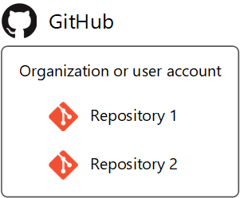
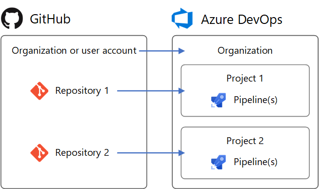
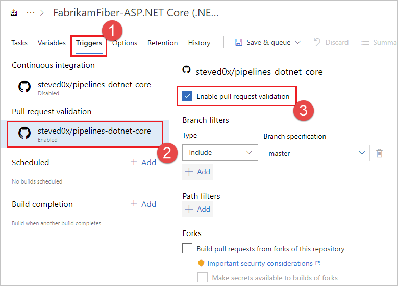
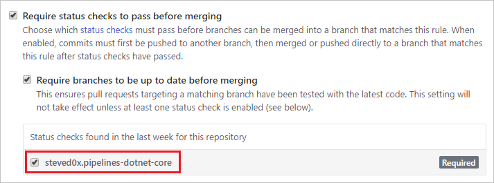
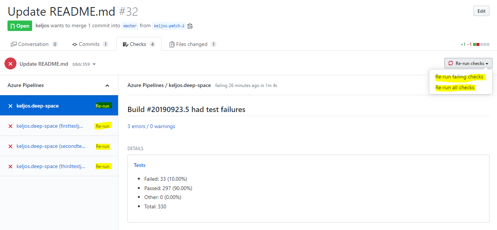

# Build GitHub repositories

[!INCLUDE [version-team-services](../includes/version-team-services.md)]

Azure Pipelines can automatically build and validate every pull request and commit to your GitHub repository. This article describes how to configure the integration between GitHub and Azure Pipelines.

If you're new to Azure Pipelines integration with GitHub, follow the steps in [Create your first pipeline](../create-first-pipeline.md) to get your first pipeline working with a GitHub repository, and then come back to this article to learn more about configuring and customizing the integration between GitHub and Azure Pipelines.

## Organizations and users

GitHub and Azure Pipelines are two independent services that integrate well together. Each of them have their own organization and user management. This section makes a recommendation on how to replicate the organization and users from GitHub to Azure Pipelines.

### Organizations

GitHub's structure consists of **organizations and user accounts** that contain **repositories**. See [GitHub's documentation](https://help.github.com/articles/differences-between-user-and-organization-accounts/).



Azure DevOps' structure consists of **organizations** that contain **projects**. See [Plan your organizational structure](../../user-guide/plan-your-azure-devops-org-structure.md).


Azure DevOps can reflect your GitHub structure with:
* An Azure DevOps **organization** for your GitHub **organization or user account**
* Azure DevOps **Projects** for your GitHub **repositories**



To set up an identical structure in Azure DevOps:

1. Create an Azure DevOps organization named after your GitHub organization or user account. It will have a URL like `https://dev.azure.com/your-organization`.
1. In the Azure DevOps organization, create projects named after your repositories. They will have URLs like `https://dev.azure.com/your-organization/your-repository`.
1. In the Azure DevOps Project, create pipelines named after the GitHub organization and repository they build, such as `your-organization.your-repository`. Then, it's clear which repositories they're for.

Following this pattern, your GitHub repositories and Azure DevOps Projects will have matching URL paths. For example:

| Service      | URL                                    |
|--------------|----------------------------------------|
| GitHub       | `https://github.com/python/cpython`    |
| Azure DevOps | `https://dev.azure.com/python/cpython` |

### Users

Your GitHub users do not automatically get access to Azure Pipelines. Azure Pipelines is unaware of GitHub identities. For this reason, there is no way to configure Azure Pipelines to automatically notify users of a build failure or a PR validation failure using their GitHub identity and email address. You must explicitly create new users in Azure Pipelines to replicate GitHub users. Once you create new users, you can configure their permissions in Azure DevOps to reflect their permissions in GitHub. You can also configure notifications in Azure DevOps using their Azure DevOps identity.

#### GitHub organization roles

GitHub organization member roles are found at `https://github.com/orgs/your-organization/people` (replace `your-organization`).

Azure DevOps organization member permissions are found at `https://dev.azure.com/your-organization/_settings/security` (replace `your-organization`).

Roles in a GitHub organization and equivalent roles in an Azure DevOps organization are shown below.

| GitHub organization role | Azure DevOps organization equivalent          |
| ------------------------ | --------------------------------------------- |
| Owner                    | Member of `Project Collection Administrators` |
| Billing manager          | Member of `Project Collection Administrators` |
| Member                   | Member of `Project Collection Valid Users`. By default, this group lacks permission to create new projects. To change this, set the group's `Create new projects` permission to `Allow`, or create a new group with permissions you need. |

#### GitHub user account roles

A GitHub user account has one role, which is ownership of the account.

Azure DevOps organization member permissions are found at `https://dev.azure.com/your-organization/_settings/security` (replace `your-organization`).

The GitHub user account role maps to Azure DevOps organization permissions as follows.

| GitHub user account role | Azure DevOps organization equivalent          |
| ------------------------ | --------------------------------------------- |
| Owner                    | Member of `Project Collection Administrators` |

#### GitHub repository permissions

GitHub repository permissions are found at `https://github.com/your-organization/your-repository/settings/collaboration` (replace `your-organization` and `your-repository`).

Azure DevOps project permissions are found at `https://dev.azure.com/your-organization/your-project/_settings/security` (replace `your-organization` and `your-project`).

Equivalent permissions between GitHub repositories and Azure DevOps Projects are as follows.

| GitHub repository permission | Azure DevOps project equivalent    |
| ---------------------------- | ---------------------------------- |
| Admin                        | Member of `Project Administrators` |
| Write                        | Member of `Contributors`           |
| Read                         | Member of `Readers`                |

If your GitHub repository grants permission to teams, you can create matching teams in the `Teams` section of your Azure DevOps project settings. Then, add the teams to the security groups above, just like users.

#### Pipeline-specific permissions

To grant permissions to users or teams for specific pipelines in an Azure DevOps project, follow these steps:

1. Visit the project's Pipelines page (for example, `https://dev.azure.com/your-organization/your-project/_build`).
1. Select the pipeline for which to set specific permissions.
1. From the '**...**' context menu, select **Security**.
1. Click **Add...** to add a specific user, team, or group and customize their permissions for the pipeline.

## Access to GitHub repositories

# [YAML](#tab/yaml/)

You create a new pipeline by first selecting a GitHub repository and then a YAML file in that repository. The repository in which the YAML file is present is called `self` repository. By default, this is the repository that your pipeline builds. 

You can later configure your pipeline to check out a different repository or multiple repositories. To learn how to do this, see [multi-repo checkout](multi-repo-checkout.md).

# [Classic](#tab/classic/)

You create a new pipeline by first selecting **GitHub** for repository type, and then one of the repositories you have access to.

---

Azure Pipelines must be granted access to your repositories to trigger their builds, and fetch their code during builds.

There are 3 authentication types for granting Azure Pipelines access to your GitHub repositories while creating a pipeline.

| Authentication type            | Pipelines run using              | Works with [GitHub Checks](https://developer.github.com/v3/checks/) |
|--------------------------------|-------------------------------|-----|
| 1. [GitHub App](#github-app-authentication) | The Azure Pipelines identity  | Yes |
| 2. [OAuth](#oauth-authentication)           | Your personal GitHub identity | No  |
| 3. [Personal access token (PAT)](#personal-access-token-pat-authentication) | Your personal GitHub identity | No  |

### GitHub app authentication

The Azure Pipelines GitHub App is the **recommended** authentication type for continuous integration pipelines. By installing the GitHub App in your GitHub account or organization, your pipeline can run without using your personal GitHub identity. Builds and GitHub status updates will be performed using the Azure Pipelines identity. The app works with [GitHub Checks](https://developer.github.com/v3/checks/) to display build, test, and code coverage results in GitHub.

To use the GitHub App, install it in your GitHub organization or user account for some or all repositories. The GitHub App can be installed and uninstalled from the app's [homepage](https://github.com/apps/azure-pipelines).

After installation, the GitHub App will become Azure Pipelines' default method of authentication to GitHub (instead of OAuth) when pipelines are created for the repositories.

If you install the GitHub App for all repositories in a GitHub organization, you don't need to worry about Azure Pipelines sending mass emails or automatically setting up pipelines on your behalf. As an alternative to installing the app for all repositories, repository admins can install it one at a time for individual repositories. This requires more work for admins, but has no advantage nor disadvantage.

#### Permissions needed in GitHub

Installation of Azure Pipelines GitHub app requires you to be a GitHub organization owner or repository admin. In addition, to create a pipeline for a GitHub repository with continuous integration and pull request triggers, you must have the required GitHub permissions configured. Otherwise, **the repository will not appear** in the repository list while creating a pipeline. Depending on the authentication type and ownership of the repository, ensure that the appropriate access is configured.

- If the repo is in your personal GitHub account, install the Azure Pipelines GitHub App in your personal GitHub account. You will be able to list this repository when create the pipeline in Azure Pipelines.

- If the repo is in someone else's personal GitHub account, the other person must install the Azure Pipelines GitHub App in their personal GitHub account. You must be added as a collaborator in the repository's settings under "Collaborators". Accept the invitation to be a collaborator using the link that is emailed to you. Once you have done so, you can create a pipeline for that repository.

- If the repo is in a GitHub organization that you own, install the Azure Pipelines GitHub App in the GitHub organization. You must also be added as a collaborator, or your team must be added, in the repository's settings under "Collaborators and teams". 

- If the repo is in a GitHub organization that someone else owns, a GitHub organization owner or repository admin must install the Azure Pipelines GitHub App in the organization. You must be added as a collaborator, or your team must be added, in the repository's settings under "Collaborators and teams". Accept the invitation to be a collaborator using the link that is emailed to you.

#### GitHub App permissions

The GitHub App requests the following permissions during installation:

| Permission | What Azure Pipelines does with it |
|------------|-----------------------------------|
| Write access to code | Only upon your deliberate action, Azure Pipelines will simplify creating a pipeline by committing a YAML file to a selected branch of your GitHub repository. |
| Read access to metadata | Azure Pipelines will retrieve GitHub metadata for displaying the repository, branches, and issues associated with a build in the build's summary. |
| Read and write access to checks | Azure Pipelines will read and write its own build, test, and code coverage results to be displayed in GitHub. |
| Read and write access to pull requests | Only upon your deliberate action, Azure Pipelines will simplify creating a pipeline by creating a pull request for a YAML file that was committed to a selected branch of your GitHub repository. Azure Pipelines will retrieve pull request metadata to display in build summaries associated with pull requests. |

<!--
Detailed permissions not displayed to the user during installation:
| Checks (read & write)
| Repository contents (read & write)
| Deployments (read & write)
| Issues (read & write)
| Repository metadata (read)
| Pull requests (read & write)
| Commit statuses (read & write)
 -->

#### Troubleshooting GitHub App installation

GitHub may display an error such as:

`You do not have permission to modify this app on your-organization. Please contact an Organization Owner.`

This means that the GitHub App is likely already installed for your organization. When you create a pipeline for a repository in the organization, the GitHub App will automatically be used to connect to GitHub.

#### Create pipelines in multiple Azure DevOps organizations and projects

Once the GitHub App is installed, pipelines can be created for the organization's repositories in different Azure DevOps organizations and projects. However, if you create pipelines for a single repository in multiple Azure DevOps organizations, only the first organization's pipelines can be automatically triggered by GitHub commits or pull requests. Manual or scheduled builds are still possible in secondary Azure DevOps organizations.

### OAuth authentication

[OAuth](https://help.github.com/articles/authorizing-oauth-apps/) is the simplest authentication type to get started with for repositories in your personal GitHub account. GitHub status updates will be performed on behalf of your personal GitHub identity. For pipelines to keep working, your repository access must remain active. Some GitHub features, like Checks, are unavailable with OAuth and require the GitHub App.

To use OAuth, click **Choose a different connection** below the list of repositories while creating a pipeline. Then, click **Authorize** to sign into GitHub and authorize with OAuth. An OAuth connection will be saved in your Azure DevOps project for later use, as well as used in the pipeline being created.

#### Permissions needed in GitHub

To create a pipeline for a GitHub repository with continuous integration and pull request triggers, you must have the required GitHub permissions configured. Otherwise, **the repository will not appear** in the repository list while creating a pipeline. Depending on the authentication type and ownership of the repository, ensure that the appropriate access is configured.

- If the repo is in your personal GitHub account, at least once, authenticate to GitHub with OAuth using your personal GitHub account credentials. This can be done in Azure DevOps project settings under Pipelines > Service connections > New service connection > GitHub > Authorize. Grant Azure Pipelines access to your repositories under "Permissions" [here](https://github.com/settings/connections/applications/0d4949be3b947c3ce4a5).

- If the repo is in someone else's personal GitHub account, at least once, the other person must authenticate to GitHub with OAuth using their personal GitHub account credentials. This can be done in Azure DevOps project settings under Pipelines > Service connections > New service connection > GitHub > Authorize. The other person must grant Azure Pipelines access to their repositories under "Permissions" [here](https://github.com/settings/connections/applications/0d4949be3b947c3ce4a5). You must be added as a collaborator in the repository's settings under "Collaborators". Accept the invitation to be a collaborator using the link that is emailed to you.

- If the repo is in a GitHub organization that you own, at least once, authenticate to GitHub with OAuth using your personal GitHub account credentials. This can be done in Azure DevOps project settings under Pipelines > Service connections > New service connection > GitHub > Authorize. Grant Azure Pipelines access to your organization under "Organization access" [here](https://github.com/settings/connections/applications/0d4949be3b947c3ce4a5). You must be added as a collaborator, or your team must be added, in the repository's settings under "Collaborators and teams". 

- If the repo is in a GitHub organization that someone else owns, at least once, a GitHub organization owner must authenticate to GitHub with OAuth using their personal GitHub account credentials. This can be done in Azure DevOps project settings under Pipelines > Service connections > New service connection > GitHub > Authorize. The organization owner must grant Azure Pipelines access to the organization under "Organization access" [here](https://github.com/settings/connections/applications/0d4949be3b947c3ce4a5). You must be added as a collaborator, or your team must be added, in the repository's settings under "Collaborators and teams". Accept the invitation to be a collaborator using the link that is emailed to you.

#### Revoke OAuth access

After authorizing Azure Pipelines to use OAuth, to later revoke it and prevent further use, visit [OAuth Apps](https://github.com/settings/developers) in your GitHub settings. You can also delete it from the list of GitHub [service connections](../library/service-endpoints.md) in your Azure DevOps project settings.

### Personal access token (PAT) authentication

[PATs](https://help.github.com/articles/creating-a-personal-access-token-for-the-command-line/) are effectively the same as OAuth, but allow you to control which permissions are granted to Azure Pipelines. Builds and GitHub status updates will be performed on behalf of your personal GitHub identity. For builds to keep working, your repository access must remain active.

To create a PAT, visit [Personal access tokens](https://github.com/settings/tokens) in your GitHub settings.
The required permissions are `repo`, `admin:repo_hook`, `read:user`, and `user:email`. These are the same permissions required when using OAuth above. Copy the generated PAT to the clipboard and paste it into a new GitHub [service connection](../library/service-endpoints.md) in your Azure DevOps project settings.
For future recall, name the service connection after your GitHub username. It will be available in your Azure DevOps project for later use when creating pipelines.

#### Permissions needed in GitHub

To create a pipeline for a GitHub repository with continuous integration and pull request triggers, you must have the required GitHub permissions configured. Otherwise, **the repository will not appear** in the repository list while creating a pipeline. Depending on the authentication type and ownership of the repository, ensure that the following access is configured.

- If the repo is in your personal GitHub account, the PAT must have the required access scopes under [Personal access tokens](https://github.com/settings/tokens): `repo`, `admin:repo_hook`, `read:user`, and `user:email`.

- If the repo is in someone else's personal GitHub account, the PAT must have the required access scopes under [Personal access tokens](https://github.com/settings/tokens): `repo`, `admin:repo_hook`, `read:user`, and `user:email`. You must be added as a collaborator in the repository's settings under "Collaborators". Accept the invitation to be a collaborator using the link that is emailed to you.

- If the repo is in a GitHub organization that you own, the PAT must have the required access scopes under [Personal access tokens](https://github.com/settings/tokens): `repo`, `admin:repo_hook`, `read:user`, and `user:email`. You must be added as a collaborator, or your team must be added, in the repository's settings under "Collaborators and teams". 

- If the repo is in a GitHub organization that someone else owns, the PAT must have the required access scopes under [Personal access tokens](https://github.com/settings/tokens): `repo`, `admin:repo_hook`, `read:user`, and `user:email`. You must be added as a collaborator, or your team must be added, in the repository's settings under "Collaborators and teams". Accept the invitation to be a collaborator using the link that is emailed to you.

#### Revoke PAT access

After authorizing Azure Pipelines to use a PAT, to later delete it and prevent further use, visit [Personal access tokens](https://github.com/settings/tokens) in your GitHub settings. You can also delete it from the list of GitHub [service connections](../library/service-endpoints.md) in your Azure DevOps project settings.

## CI triggers

Continuous integration (CI) triggers cause a pipeline to run whenever you push an update to the specified branches or you push  specified tags.

# [YAML](#tab/yaml/)

[!INCLUDE [ci-triggers](includes/ci-triggers1.md)]

[!INCLUDE [ci-triggers](includes/ci-triggers2.md)]

[!INCLUDE [ci-triggers](includes/ci-triggers3.md)]

# [Classic](#tab/classic/)

[!INCLUDE [ci-triggers](includes/ci-triggers4.md)]


---

### Skipping CI for individual commits

You can also tell Azure Pipelines to skip running a pipeline that a commit would normally trigger. Just include `[skip ci]` in the commit message or description of the HEAD commit and Azure Pipelines will skip running CI. You can also use any of the variations below.

- `[skip ci]` or `[ci skip]`
- `skip-checks: true` or `skip-checks:true`
- `[skip azurepipelines]` or `[azurepipelines skip]`
- `[skip azpipelines]` or `[azpipelines skip]`
- `[skip azp]` or `[azp skip]`
- `***NO_CI***`

[!INCLUDE [ci-triggers](includes/ci-triggers5.md)]

## PR triggers

Pull request (PR) triggers cause a pipeline to run whenever a pull request is opened with one of the specified target branches,
or when updates are made to such a pull request.

# [YAML](#tab/yaml/)

### Branches

You can specify the target branches when validating your pull requests.
For example, to validate pull requests that
target `master` and `releases/*`, you can use the following `pr` trigger. 

```yaml
pr:
- master
- releases/*
```

This configuration starts a new run the first time a new pull request is created, and after every update made to the pull request.

You can specify the full name of the branch (for example, `master`) or a wildcard (for example, `releases/*`).

> [!NOTE]
> You cannot use [variables](../process/variables.md) in triggers, as variables are evaluated at runtime (after the trigger has fired).

> [!NOTE]
> If you use [templates](../process/templates.md) to author YAML files, then you can only specify triggers in the main YAML file for the pipeline. You cannot specify triggers in the template files.

GitHub creates a new _ref_ when a pull request is created. The ref points to a _merge commit_, which is the merged code between the source and target branches of the pull request. The PR validation pipeline builds the commit this ref points to. This means that the YAML file that is used to run the pipeline is also a merge between the source and the target branch. As a result, the changes you make to the YAML file in source branch of the pull request can override the behavior defined by the YAML file in target branch.

If no `pr` triggers appear in your YAML file, pull request validations are automatically enabled for all 
branches, as if you wrote the following `pr` trigger. This configuration triggers a build when any 
pull request is created, and when commits come into the source branch of any active pull request.

```yaml
pr:
  branches:
    include:
    - '*'  # must quote since "*" is a YAML reserved character; we want a string
```

>[!IMPORTANT]
>When you specify a `pr` trigger, it replaces the default implicit `pr` trigger, and only pushes to branches that are explicitly configured to be included will trigger a pipeline.

For more complex triggers that need to exclude certain branches, you must use the full syntax as shown in the following example.

```yaml
# specific branch
pr:
  branches:
    include:
    - master
    - releases/*
    exclude:
    - releases/old*
```

### Paths

You can specify file paths to include or exclude. For example:

```yaml
# specific path
pr:
  branches:
    include:
    - master
    - releases/*
  paths:
    include:
    - docs
    exclude:
    - docs/README.md
```

> **Tips:**
>  * Wild cards are not supported with path filters.
>  * Paths are always specified relative to the root of the repository.
>  * If you don't set path filters, then the root folder of the repo is implicitly included by default.
>  * If you exclude a path, you cannot also include it unless you qualify it to a deeper folder. For example if you exclude _/tools_ then you could include _/tools/trigger-runs-on-these_
>  * The order of path filters doesn't matter.
>  * Paths in Git *are case-sensitive*. Be sure to use the same case as the real folders.
>  * You cannot use [variables](../process/variables.md) in paths, as variables are evaluated at runtime (after the trigger has fired).

### Multiple PR updates

You can specify whether additional updates to a PR should cancel in-progress validation runs for the same PR. The default is `true`.

```yaml
# auto cancel false
pr:
  autoCancel: false
  branches:
    include:
    - master
```

### Draft PR validation

By default, pull request triggers fire on draft pull requests as well as pull requests that are ready for review. To disable pull request triggers for draft pull requests, set the `drafts` property to `false`.

```yaml
pr:
  autoCancel: boolean # indicates whether additional pushes to a PR should cancel in-progress runs for the same PR. Defaults to true
  branches:
    include: [ string ] # branch names which will trigger a build
    exclude: [ string ] # branch names which will not
  paths:
    include: [ string ] # file paths which must match to trigger a build
    exclude: [ string ] # file paths which will not trigger a build
  drafts: boolean # whether to build draft PRs, defaults to true
```

### Opting out of PR validation

You can opt out of pull request validation entirely by specifying `pr: none`.

```yaml
# no PR triggers
pr: none
```

For more information, see [PR trigger](../yaml-schema.md#pr-trigger) in the [YAML schema](../yaml-schema.md).

> [!NOTE]
> If your `pr` trigger isn't firing, follow the troubleshooting steps in the [FAQ](#failing-triggers).

>[!NOTE]
>[Draft pull requests](https://docs.github.com/github/collaborating-with-issues-and-pull-requests/about-pull-requests#draft-pull-requests) do not trigger a pipeline.

# [Classic](#tab/classic/)

Select the **Pull request validation** trigger and check the **Enable pull request validation** check box to enable builds on pull requests.



You can specify branches to include and exclude.
Select a branch name from the drop-down menu and select **Include** or **Exclude** as appropriate.
For included branches, a build will be triggered on each push to a pull request targeting that branch.

---

### Protected branches

You can run a validation build with each commit or pull request that targets a branch, and even prevent pull requests from merging until a validation build succeeds.

To configure mandatory validation builds for a GitHub repository, you must be its owner, a collaborator with the Admin role, or a GitHub organization member with the Write role.

1. First, create a pipeline for the repository and build it at least once so that its status is posted to GitHub, thereby making GitHub aware of the pipeline's name.

2. Next, follow GitHub's documentation for [configuring protected branches](https://help.github.com/articles/configuring-protected-branches/) in the repository's settings.

   For the status check, select the name of your pipeline in the **Status checks** list.

   

>[!IMPORTANT]
>If your pipeline doesn't show up in this list, please ensure the following:
>
>* You are using [GitHub app authentication](#github-app-authentication)
>* Your pipeline has run at least once in the last week

### Contributions from external sources

If your GitHub repository is open source, you can make your Azure DevOps project [public](../../organizations/public/create-public-project.md) so that anyone can view your pipeline's build results, logs, and test results without signing in. When users outside your organization fork your repository and submit pull requests, they can view the status of builds that automatically validate those pull requests.

You should keep in mind the following considerations when using Azure Pipelines in a public project when accepting contributions from external sources.

* [Access restrictions](#access-restrictions)
* [Validate contributions from forks](#contributions-from-forks)
* [Important security considerations](#important-security-considerations)

#### Access restrictions

Be aware of the following access restrictions when you're running pipelines in Azure DevOps public projects:

* **Secrets:** By default, secrets associated with your pipeline are not made available to pull request validations of forks. See [Validate contributions from forks](#contributions-from-forks).
* **Cross-project access:** All pipelines in an Azure DevOps public project run with an access token restricted to the project. Pipelines in a public project can access resources such as build artifacts or test results only within the project and not in other projects of the Azure DevOps organization.
* **Azure Artifacts packages:** If your pipelines need access to packages from Azure Artifacts, you must explicitly grant permission to the **Project Build Service** account to access the package feeds.

#### Contributions from forks

> [!IMPORTANT]
> These settings affect the security of your pipeline.

When you create a pipeline, it is automatically triggered for pull requests from forks of your repository. You can change this behavior, carefully considering how it affects security. To enable or disable this behavior:

1. Go to your Azure DevOps project. Select **Pipelines**, locate your pipeline, and select **Edit**.
2. Select the **Triggers** tab. After enabling the **Pull request trigger**, enable or disable the **Build pull requests from forks of this repository** check box.

By default with GitHub pipelines, secrets associated with your build pipeline are not made available to pull request builds of forks. These secrets are enabled by default with GitHub Enterprise Server pipelines. Secrets include:

* A security token with access to your GitHub repository.
* These items, if your pipeline uses them:
  * [Service connection](../library/service-endpoints.md) credentials
  * Files from the [secure files library](../library/secure-files.md)
  * Build [variables](../process/variables.md#secret-variables) marked **secret**

To bypass this precaution on GitHub pipelines, enable the **Make secrets available to builds of forks** check box. Be aware of this setting's effect on security.

#### Important security considerations

A GitHub user can fork your repository, change it, and create a pull request to propose changes to your repository. This pull request could contain malicious code to run as part of your triggered build. Such code can cause harm in the following ways:

* Leak secrets from your pipeline. To mitigate this risk, do not enable the **Make secrets available to builds of forks** check box if your repository is public or untrusted users can submit pull requests that automatically trigger builds. This option is disabled by default.

* Compromise the machine running the agent to steal code or secrets from other pipelines. To mitigate this:
  
  * Use a [Microsoft-hosted agent pool](../agents/hosted.md) to build pull requests from forks. Microsoft-hosted agent machines are immediately deleted after they complete a build, so there is no lasting impact if they're compromised.
  
  * If you must use a [self-hosted agent](../agents/agents.md#install), do not store any secrets or perform other builds and releases that use secrets on the same agent, unless your repository is private and you trust pull request creators.

## Comment triggers

Repository collaborators can comment on a pull request to manually run a pipeline. Here are a few common reasons for why you might want to do this:

- You may not want to automatically build pull requests from unknown users until their changes can be reviewed. You want one of your team members to first review their code and then run the pipeline. This is commonly used as a security measure when building contributed code from forked repositories.
- You may want to run an optional test suite or an additional validation build. 

To enable comment triggers you must follow the following two steps:

1. Enable pull request triggers for your pipeline, and make sure that you did not exclude the target branch.
2. In the Azure Pipelines web portal, edit your pipeline and choose **More actions**, **Triggers**. Then, under **Pull request validation**, enable **Require a tem member's comment before building a pull request**. 
    * Choose **On all pull requests** to require a team member's comment before building a pull request. With this workflow, a team member reviews the pull request and triggers the build with a comment once the pull request is deemed safe.
    * Choose **Only on pull requests from non-team members** to require a team member's comment only when a PR is made by a non-team member. In this workflow, a team member doesn't need a secondary team member's review to trigger a build.

With these two changes, the pull request validation build will not be triggered automatically, unless **Only on pull requests from non-team members** is selected and the PR is made by a team member. Only repository owners and collaborators with 'Write' permission can trigger the build by commenting on the pull request with `/AzurePipelines run` or `/AzurePipelines run <pipeline-name>`.

The following commands can be issued to Azure Pipelines in comments:

| Command | Result |
| - | - |
| `/AzurePipelines help` | Display help for all supported commands. |
| `/AzurePipelines help <command-name>` | Display help for the specified command. |
| `/AzurePipelines run` | Run all pipelines that are associated with this repository and whose triggers do not exclude this pull request. |
| `/AzurePipelines run <pipeline-name>` | Run the specified pipeline unless its triggers exclude this pull request. |

> [!Note]
> For brevity, you can comment using `/azp` instead of `/AzurePipelines`.

>[!IMPORTANT]
>Responses to these commands will appear in the pull request discussion only if your pipeline uses the [Azure Pipelines GitHub App](#github-app-authentication).

### Troubleshoot pull request comment triggers

If you have the necessary repository permissions, but pipelines aren't getting triggered by your comments, make sure that your membership is **public** in the repository's organization, or directly add yourself as a repository collaborator. Azure Pipelines cannot see private organization members unless they are direct collaborators or belong to a team that is a direct collaborator. You can change your GitHub organization membership from private to public here (replace `Your-Organization` with your organization name): `https://github.com/orgs/Your-Organization/people`.

[!INCLUDE [ci-triggers](includes/source-options.md)]

## Pre-defined variables

When you build a GitHub repository, most of the [pre-defined variables](../build/variables.md) are available to your jobs. However, since Azure Pipelines does not recognize the identity of a user making an update in GitHub, the following variables are set to system identity instead of user's identity:

* `Build.RequestedFor`
* `Build.RequestedForId`
* `Build.RequestedForEmail`

## Status updates

There are two types of statuses that Azure Pipelines posts back to GitHub - basic statuses and GitHub Check Runs. GitHub Checks functionality is only available with GitHub Apps.

Pipeline statuses show up in various places in the GitHub UI. 

* For PRs, they are displayed on the PR conversations tab.
* For individual commits, they are displayed when hovering over the status mark after the commit time on the repo's commits tab.

### PAT or OAuth GitHub connections

For pipelines using [PAT](#personal-access-token-pat-authentication) or [OAuth](#oauth-authentication) GitHub connections, statuses are posted back to the commit/PR that triggered the run. The [GitHub status API](https://developer.github.com/v3/repos/statuses/) is used to post such updates. These statuses contain limited information: pipeline status (failed, success), URL to link back to the build pipeline, and a brief description of the status.

Statuses for PAT or OAuth GitHub connections are only sent at the run level. In other words, you can have a single status updated for an entire run. If you have multiple jobs in a run, you cannot post a separate status for each job. However, multiple pipelines can post separate statuses to the same commit.

### GitHub Checks

For pipelines set up using the Azure Pipelines [GitHub app](#github-app-authentication)), the status is posted back in the form of GitHub Checks. GitHub Checks allow for sending detailed information about the pipeline status as well as test, code coverage, and errors. The GitHub Checks API can be found [here](https://developer.github.com/v3/checks/).

For every pipeline using the GitHub App, Checks are posted back for the overall run as well as each job in that run.

GitHub allows three options when one or more Check Runs fail for a PR/commit. You can choose to "re-run" the individual Check, re-run all the failing Checks on that PR/commit, or re-run all the Checks, whether they succeeded initially or not.



Clicking on the "Re-run" link next to the Check Run name will result in Azure Pipelines retrying the run that generated the Check Run. The resultant run will have the same run number and will use the same version of the source code, configuration, and YAML file as the initial build. Only those jobs that failed in the initial run and any dependent downstream jobs will be run again. Clicking on the "Re-run all failing checks" link will have the same effect. This is the same behavior as clicking "Re-try run" in the Azure Pipelines UI. Clicking on "Re-run all checks" will result in a new run, with a new run number and will pick up changes in the configuration or YAML file.

## FAQ

Problems related to GitHub integration fall into the following categories:

* **[Connection types](#connection-types):** I am not sure what connection type I am using to connect my pipeline to GitHub.
* **[Failing triggers](#failing-triggers):** My pipeline is not being triggered when I push an update to the repo.
* **[Failing checkout](#failing-checkout):** My pipeline is being triggered, but it fails in the checkout step.
* **[Wrong version](#wrong-version):** My pipeline runs, but it is using an unexpected version of the source/YAML.
* **[Missing status updates](#missing-status-updates):** My GitHub PRs are blocked because Azure Pipelines did not report a status update.

### Connection types

#### To troubleshoot triggers, how do I know the type of GitHub connection I'm using for my pipeline?

Troubleshooting problems with triggers very much depends on the type of GitHub connection you use in your pipeline. There are two ways to determine the type of connection - from GitHub and from Azure Pipelines.

* From GitHub: If a repo is set up to use the GitHub app, then the statuses on PRs and commits will be Check Runs. If the repo has Azure Pipelines set up with OAuth or PAT connections, the statuses will be the "old" style of statuses. A quick way to determine if the statuses are Check Runs or simple statuses is to look at the "conversation" tab on a GitHub PR. 
  * If the "Details" link redirects to the Checks tab, it is a Check Run and the repo is using the app. 
  * If the "Details" link redirects to the Azure DevOps pipeline, then the status is an "old style" status and the repo is not using the app.

* From Azure Pipelines: You can also determine the type of connection by inspecting the pipeline in Azure Pipelines UI. Open the editor for the pipeline. Select **Triggers** to open the classic editor for the pipeline. Then, select **YAML** tab and then the **Get sources** step. You'll notice a banner **Authorized using connection:** indicating the service connection that was used to integrate the pipeline with GitHub. The name of the service connection is a hyperlink. Select it to navigate to the service connection properties. The properties of the service connection will indicate the type of connection being used:
  * **Azure Pipelines app** indicates GitHub app connection
  * **oauth** indicates OAuth connection
  * **personalaccesstoken** indicates PAT authentication

#### How do I switch my pipeline to use GitHub app instead of OAuth?

Using a GitHub app instead of OAuth or PAT connection is the recommended integration between GitHub and Azure Pipelines. To switch to GitHub app, follow these steps:

1. Navigate [here](https://github.com/apps/azure-pipelines) and install the app in the GitHub organization of your repository.
2. During installation, you'll be redirected to Azure DevOps to choose an Azure DevOps organization and project. Choose the organization and project that contain the classic build pipeline you want to use the app for. This choice associates the GitHub App installation with your Azure DevOps organization. If you choose incorrectly, you can visit [this page](https://github.com/apps/azure-pipelines) to uninstall the GitHub app from your GitHub org and start over.
3. In the next page that appears, you do not need to proceed creating a new pipeline.
4. Edit your pipeline by visiting the Pipelines page (e.g., https:\//dev.azure.com/YOUR_ORG_NAME/YOUR_PROJECT_NAME/_build), selecting your pipeline, and clicking Edit.
5. If this is a YAML pipeline, select the **Triggers** menu to open the classic editor.
6. Select the "Get sources" step in the pipeline.
7. On the green bar with text "Authorized using connection", click "Change" and select the GitHub App connection with the same name as the GitHub organization in which you installed the app.
8. On the toolbar, select "Save and queue" and then "Save and queue". Click the link to the pipeline run that was queued to make sure it succeeds.
9. Create (or close and reopen) a pull request in your GitHub repository to verify that a build is successfully queued in its "Checks" section.

#### Why isn't a GitHub repository displayed for me to choose in Azure Pipelines?

Depending on the authentication type and ownership of the repository, specific permissions are required.

- If you're using the GitHub App, see [GitHub App authentication](#github-app-authentication).
- If you're using OAuth, see [OAuth authentication](#oauth-authentication).
- If you're using PATs, see [Personal access token (PAT) authentication](#personal-access-token-pat-authentication).

#### When I select a repository during pipeline creation, I get an error "The repository {repo-name} is in use with the Azure Pipelines GitHub App in another Azure DevOps organization."

This means that your repository is already associated with a pipeline in a different organization. CI and PR events from this repository won't work as they will be delivered to the other organization. Here are the steps you should take to remove the mapping to the other organization before proceeding to create a pipeline.

  1. Open a pull request in your GitHub repository, and make the comment `/azp where`. This reports back the Azure DevOps organization that the repository is mapped to. 
  
  2. To change the mapping, uninstall the app from the GitHub organization, and re-install it. As you re-install it, make sure to select the correct organization when you are redirected to Azure DevOps.

### Failing triggers

[!INCLUDE [qa](includes/qa2.md)]

* Are you using the GitHub app connection to connect the pipeline to GitHub? See [Connection types](#connection-types) to determine the type of connection you have. If you are using a GitHub app connection, follow these steps:

  * Is the mapping set up properly between GitHub and Azure DevOps? Open a pull request in your GitHub repository, and make the comment `/azp where`. This reports back the Azure DevOps organization that the repository is mapped to. 
  
    * If no organizations are set up to build this repository using the app, go to `https://github.com/<org_name>/<repo_name>/settings/installations` and complete the configuration of the app.

    * If a different Azure DevOps organization is reported, then someone has already established a pipeline for this repo in a different organization. We currently have the limitation that we can only map a GitHub repo to a single DevOps org. Only the pipelines in the first Azure DevOps org can be automatically triggered. To change the mapping, uninstall the app from the GitHub organization, and re-install it. As you re-install it, make sure to select the correct organization when you are redirected to Azure DevOps.

* Are you using OAuth or PAT to connect the pipeline to GitHub? See [Connection types](#connection-types) to determine the type of connection you have. If you are using a GitHub connection, follow these steps:

  1. OAuth and PAT connections rely on webhooks to communicate updates to Azure Pipelines. In GitHub, navigate to the settings for your repository, then to Webhooks. Verify that the webhooks exist. Usually you should see three webhooks - push, pull_request, and issue_comment. If you don't, then you must re-create the service connection and update the pipeline to use the new service connection.
  
  2. Select each of the webhooks in GitHub and verify that the payload that corresponds to the user's commit exists and was sent successfully to Azure DevOps. You may see an error here if the event could not be communicated to Azure DevOps.

* The traffic from Azure DevOps could be throttled by GitHub. When Azure Pipelines receives a notification from GitHub, it tries to contact GitHub and fetch more information about the repo and YAML file. If you have a repo with a large number of updates and pull requests, this call may fail due to such throttling. In this case, see if you can reduce the frequency of builds by using batching or stricter path/branch filters.

[!INCLUDE [qa](includes/qa2-1.md)]

[!INCLUDE [qa](includes/qa3.md)]

[!INCLUDE [qa](includes/qa4.md)]

### Failing checkout

#### I see the following error in the log file during checkout step. How do I fix it?

```log
remote: Repository not found.
fatal: repository <repo> not found
```

This could be caused by an outage of GitHub. Try to access the repository in GitHub and make sure that you are able to.

### Wrong version

[!INCLUDE [qa](includes/qa1.md)]

### Missing status updates

#### My PR in GitHub is blocked since Azure Pipelines did not update the status.

This could be a transient error that resulted in Azure DevOps not being able to communicate with GitHub. Retry the check in GitHub if you use the GitHub app. Or, make a trivial update to the PR to see if the problem can be resolved.

## Related articles

- [Scheduled triggers](../process/scheduled-triggers.md)
- [Pipeline completion triggers](../process/pipeline-triggers.md)
