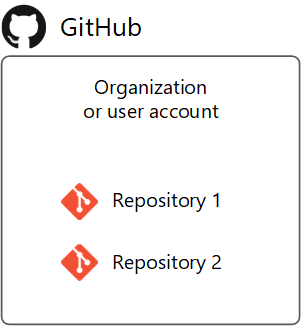
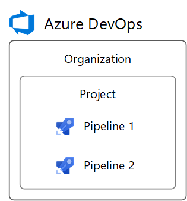

# Build GitHub repositories

[!INCLUDE [version-team-services](../_shared/version-server-2019-rtm.md)]

Azure Pipelines can automatically build and validate every pull request and commit to your GitHub repository.

## Introduction to creating pipelines

For an introduction to creating a pipeline for a GitHub repo, follow the steps in [Create your first pipeline](../create-first-pipeline.md).

[!INCLUDE [temp](_shared/pipeline-options-for-git.md)]

## Make open source projects public

If your GitHub repository is open source, you can make your Azure DevOps project **public** so that anyone can view your pipeline's build results, logs, and test results without signing in. When users outside your organization fork your repository and submit pull requests, they can view the status of builds that automatically validate those pull requests. See [Create a public project](../../organizations/public/create-public-project.md).

### Access restrictions

Be aware of the following access restrictions when you're running builds in Azure Pipelines public projects:

* **Build secrets:** By default, secrets associated with your build pipeline are not made available to pull request builds of forks. See [Validate contributions from forks](#validate-contributions-from-forks).
* **Cross-project access:** All builds in an Azure DevOps public project run with an access token restricted to the project. Builds in a public project can access resources such as build artifacts or test results only within the project and not in other projects of the Azure DevOps organization.
* **Azure Artifacts packages:** If your builds need access to packages from Azure Artifacts, you must explicitly grant permission to the **Project Build Service** account to access the package feeds.

## Map GitHub organizations to Azure DevOps

GitHub's structure consists of **organizations and user accounts** that contain **repositories**. See [GitHub's documentation](https://help.github.com/articles/differences-between-user-and-organization-accounts/).



Azure DevOps' structure consists of **organizations** that contain **projects**. See [Plan your organizational structure](../../user-guide/plan-your-azure-devops-org-structure.md).



Azure DevOps can reflect your GitHub structure with:
* An Azure DevOps **organization** for your GitHub **organization or user account**
* Azure DevOps **projects** for your GitHub **repositories**


To set up this mapping between GitHub and Azure DevOps:

1. Create an Azure DevOps organization named after your GitHub organization or user account. It will have a URL like `https://dev.azure.com/your-organization`.
1. In the Azure DevOps organization, create projects named after your repositories. They will have URLs like `https://dev.azure.com/your-organization/your-repository`.
1. In the Azure DevOps projects, create pipelines named after the GitHub organization and repository they build, such as `your-organization.your-repository`. Then, it's clear which repositories they're for.

Following this pattern, your GitHub repositories and Azure DevOps projects will have matching URL paths. For example:

|              |                                        |
|--------------|----------------------------------------|
| GitHub       | `https://github.com/python/cpython`    |
| Azure DevOps | `https://dev.azure.com/python/cpython` |

## Mapping GitHub permissions to Azure DevOps

GitHub permissions on GitHub organizations, user accounts, and repositories can be reflected in Azure DevOps.

### Mapping GitHub organization roles

GitHub organization member roles are found at `https://github.com/orgs/your-organization/people` (replace `your-organization`).

Azure DevOps organization member permissions are found at `https://dev.azure.com/your-organization/_settings/security` (replace `your-organization`).

GitHub organization roles map to Azure DevOps organization permissions as follows.

| GitHub organization role | Azure DevOps organization equivalent          |
| ------------------------ | --------------------------------------------- |
| Owner                    | Member of `Project Collection Administrators` |
| Billing manager          | Member of `Project Collection Administrators` |
| Member                   | Member of `Project Collection Valid Users`. By default, this group lacks permission to create new projects. To change this, set the group's `Create new projects` permission to `Allow`, or create a new group with permissions you need. |

### Mapping GitHub user account roles

A GitHub user account has 1 role, which is ownership of the account.

Azure DevOps organization member permissions are found at `https://dev.azure.com/your-organization/_settings/security` (replace `your-organization`).

The GitHub user account role maps to Azure DevOps organization permissions as follows.

| GitHub user account role | Azure DevOps organization equivalent          |
| ------------------------ | --------------------------------------------- |
| Owner                    | Member of `Project Collection Administrators` |

### Mapping GitHub repository permissions

GitHub repository permissions are found at `https://github.com/your-organization/your-repository/settings/collaboration` (replace `your-organization` and `your-repository`).

Azure DevOps project permissions are found at `https://dev.azure.com/your-organization/your-project/_settings/security` (replace `your-organization` and `your-project`).

GitHub repository permissions map to Azure DevOps project permissions as follows.

| GitHub repository permission | Azure DevOps project equivalent    |
| ---------------------------- | ---------------------------------- |
| Admin                        | Member of `Project Administrators` |
| Write                        | Member of `Contributors`           |
| Read                         | Member of `Readers`                |

If your GitHub repository grants permission to teams, you can create matching teams in the `Teams` section of your Azure DevOps project settings. Then, add the teams to the security groups above, just like users.

### Pipeline-specific permissions

To grant permissions to users or teams for specific pipelines in an Azure DevOps project, follow these steps:

1. Visit the project's Builds page (for example, `https://dev.azure.com/your-organization/your-project/_build`).
1. Select the pipeline for which to set specific permissions.
1. From the '**...**' context menu, select **Security**.
1. Click **Add...** to add a specific user, team, or group and customize their permissions for the pipeline.

## Authorize access to your repositories

Azure Pipelines must be granted access to your repositories to display them, trigger their builds, and fetch their code during builds.

There are 3 authentication types for granting Azure Pipelines access to your GitHub repositories while creating a pipeline.

| Authentication type            | Builds run using              | Works with [GitHub Checks](https://developer.github.com/v3/checks/) |
|--------------------------------|-------------------------------|-----|
| 1. GitHub App                  | The Azure Pipelines identity  | Yes |
| 2. OAuth                       | Your personal GitHub identity | No  |
| 3. Personal access token (PAT) | Your personal GitHub identity | No  |

## Integrate using the GitHub App

The Azure Pipelines GitHub App is the **recommended** authentication type. By installing it in your GitHub account or organization, your pipeline can run without using your personal GitHub identity. Builds and GitHub status updates will be performed using the Azure Pipelines identity. The app works with [GitHub Checks](https://developer.github.com/v3/checks/) to display build, test, and code coverage results in GitHub.

### Install the GitHub App

To use the GitHub App, install it in your GitHub organization or user account for some or all repositories. Installation requires you to be a GitHub organization owner or repository admin.

After installation, the GitHub App will become Azure Pipelines’ default method of authentication to GitHub (instead of OAuth) when pipelines are created for the repositories. This is recommended so that pipelines run as “Azure Pipelines” instead of a user’s GitHub identity which may lose access to the repository.

The GitHub App can be installed and uninstalled from 2 locations:

1. The app's [homepage](https://github.com/apps/azure-pipelines) - **This is recommended** when no parallel jobs are being purchased, or when your organization pays GitHub by purchase order (PO) or invoice.
1. The app's [GitHub Marketplace listing](https://github.com/marketplace/azure-pipelines/) where additional parallel jobs can be purchased for private repositories, but where cancellation of the price plan may delay uninstallation until the end of your GitHub billing period.

If you install the GitHub App for all repositories in a GitHub organization, you don't need to worry about Azure Pipelines sending mass emails or automatically setting up pipelines on your behalf. As an alternative to installing the app for all repositories, repository admins can install it one at a time for individual repositories. This requires more work for admins, but has no advantage nor disadvantage.

After installation, the GitHub App will be Azure Pipelines’ default method of authentication to GitHub (instead of OAuth) when pipelines are created for the repositories. This is recommended so that pipelines run as “Azure Pipelines” instead of a user’s GitHub identity which may lose access to the repository.

#### GitHub App permissions

The GitHub App requests the following permissions during installation:

| Permission | What Azure Pipelines does with it |
|------------|-----------------------------------|
| Write access to code | Only upon your deliberate action, Azure Pipelines will simplify creating a pipeline by committing a YAML file to a selected branch of your GitHub repository. |
| Read access to metadata | Azure Pipelines will retrieve GitHub metadata for displaying the repository, branches, and issues associated with a build in the build's summary. |
| Read and write access to checks | Azure Pipelines will read and write its own build, test, and code coverage results to be displayed in GitHub. |
| Read and write access to pull requests | Only upon your deliberate action, Azure Pipelines will simplify creating a pipeline by creating a pull request for a YAML file that was committed to a selected branch of your GitHub repository. Azure Pipelines will retrieve pull request metadata to display in build summaries associated with pull requests. |

<!--
Detailed permissions not displayed to the user during installation:
| Checks (read & write)
| Repository contents (read & write)
| Deployments (read & write)
| Issues (read & write)
| Repository metadata (read)
| Pull requests (read & write)
| Commit statuses (read & write)
 -->

#### Troubleshooting GitHub App installation

GitHub may display an error such as:

`You do not have permission to modify this app on your-organization. Please contact an Organization Owner.`

This means that the GitHub App is likely already installed for your organization. When you create a pipeline for a repository in the organization, the GitHub App will automatically be used to connect to GitHub.

### GitHub Marketplace purchases

Additional, Microsoft-hosted parallel jobs can be purchased through the [Azure DevOps Marketplace](https://marketplace.visualstudio.com/items?itemName=ms.build-release-hosted-pipelines) (recommended) or [GitHub Marketplace](https://github.com/marketplace/azure-pipelines). Pricing is the same in both marketplaces. Unless you prefer using an existing GitHub billing account, it's recommended that purchases be made in the Azure DevOps Marketplace to simplify associating purchases with different Azure DevOps organizations.

The **first time** the GitHub App is installed in a GitHub organization or user account, the Azure DevOps organization that is created or selected during installation will be where GitHub Marketplace purchases are applied. Currently, the only way to change where GitHub Marketplace purchases are applied is to uninstall and reinstall the GitHub App (which will disable existing pipelines), or purchase parallel jobs through the [Azure DevOps Marketplace](https://marketplace.visualstudio.com/items?itemName=ms.build-release-hosted-pipelines) instead of GitHub.

### Create pipelines in multiple Azure DevOps organizations and projects

Once the GitHub App is installed, pipelines can be created for the organization's repositories in different Azure DevOps organizations and projects. However, if you create pipelines for a single repository in multiple Azure DevOps organizations, only the first organization's pipelines can be automatically triggered by GitHub commits or pull requests. Manual or scheduled builds are still possible in secondary Azure DevOps organizations.

## Integrate using OAuth

[OAuth](https://help.github.com/articles/authorizing-oauth-apps/) is the simplest authentication type to get started with for repositories in your personal GitHub account. Builds and GitHub status updates will be performed on behalf of your personal GitHub identity. For builds to keep working, your repository access must remain active. Some GitHub features, like Checks, are unavailable with OAuth and require the GitHub App.

### Using OAuth

To use OAuth, click **Choose a different connection** below the list of repositories while creating a pipeline. Then, click **Authorize** to sign into GitHub and authorize with OAuth. An OAuth connection will be saved in your Azure DevOps project for later use, as well as used in the pipeline being created.

### Revoking OAuth access

After authorizing Azure Pipelines to use OAuth, to later revoke it and prevent further use, visit [OAuth Apps](https://github.com/settings/developers) in your GitHub settings. You can also delete it from the list of GitHub [service connections](../library/service-endpoints.md) in your Azure DevOps project settings.

## Integrate using a personal access token (PAT)

[PATs](https://help.github.com/articles/creating-a-personal-access-token-for-the-command-line/) are effectively the same as OAuth, but allow you to control which permissions are granted to Azure Pipelines. Builds and GitHub status updates will be performed on behalf of your personal GitHub identity. For builds to keep working, your repository access must remain active.

### Using a PAT

To create a PAT, visit [Personal access tokens](https://github.com/settings/tokens) in your GitHub settings.
The required permissions are `repo`, `admin:repo_hook`, `read:user`, and `user:email`. These are the same permissions required when using OAuth above. Copy the generated PAT to the clipboard and paste it into a new GitHub [service connection](../library/service-endpoints.md) in your Azure DevOps project settings.
For future recall, name the service connection after your GitHub username. It will be available in your Azure DevOps project for later use when creating pipelines.

### Revoking PAT access

After authorizing Azure Pipelines to use a PAT, to later delete it and prevent further use, visit [Personal access tokens](https://github.com/settings/tokens) in your GitHub settings. You can also delete it from the list of GitHub [service connections](../library/service-endpoints.md) in your Azure DevOps project settings.

## Choose a repository to build

To create a pipeline for your repository with continuous integration and pull request triggers, you must have the required GitHub permissions configured. Otherwise, **the repository will not appear** in the repository list while creating a pipeline. Depending on the authentication type and ownership of the repository, ensure that the following access is configured.

### Repository permissions for GitHub App authentication

| If the repo is in your personal GitHub account | If the repo is in someone else's personal GitHub account | If the repo is in a GitHub organization that you own | If the repo is in a GitHub organization that someone else owns |
|-----------------------------|-|-|-|
| Install the Azure Pipelines GitHub App in your personal GitHub account. You can do so from [here](https://github.com/apps/azure-pipelines). | **1.** The other person must install the Azure Pipelines GitHub App in their personal GitHub account. They can do so from [here](https://github.com/apps/azure-pipelines). <br/><br/> **2.** You must be added as a collaborator in the repository's settings under "Collaborators". Accept the invitation to be a collaborator using the link that is emailed to you. | **1.** Install the Azure Pipelines GitHub App in the GitHub organization. You can do so from [here](https://github.com/apps/azure-pipelines). <br/><br/> **2.** You must be added as a collaborator, or your team must be added, in the repository's settings under "Collaborators and teams". | **1.** A GitHub organization owner or repository admin must install the Azure Pipelines GitHub App in the organization. The app can be installed from [here](https://github.com/apps/azure-pipelines). <br/><br/> **2.** You must be added as a collaborator, or your team must be added, in the repository's settings under "Collaborators and teams". Accept the invitation to be a collaborator using the link that is emailed to you. |

### Repository permissions for OAuth authentication

| If the repo is in your personal GitHub account | If the repo is in someone else's personal GitHub account | If the repo is in a GitHub organization that you own | If the repo is in a GitHub organization that someone else owns |
|-----------------------------|-|-|-|
| **1.** At least once, authenticate to GitHub with OAuth using your personal GitHub account credentials. This can be done in Azure DevOps project settings under Pipelines > Service connections > New service connection > GitHub > Authorize. <br/><br/> **2.** Grant Azure Pipelines access to your repositories under "Permissions" [here](https://github.com/settings/connections/applications/0d4949be3b947c3ce4a5). | **1.** At least once, the other person must authenticate to GitHub with OAuth using their personal GitHub account credentials. This can be done in Azure DevOps project settings under Pipelines > Service connections > New service connection > GitHub > Authorize. <br/><br/> **2.**  The other person must grant Azure Pipelines access to their repositories under "Permissions" [here](https://github.com/settings/connections/applications/0d4949be3b947c3ce4a5). <br/><br/> **3.** You must be added as a collaborator in the repository's settings under "Collaborators". Accept the invitation to be a collaborator using the link that is emailed to you. | **1.** At least once, authenticate to GitHub with OAuth using your personal GitHub account credentials. This can be done in Azure DevOps project settings under Pipelines > Service connections > New service connection > GitHub > Authorize. <br/><br/> **2.** Grant Azure Pipelines access to your organization under "Organization access" [here](https://github.com/settings/connections/applications/0d4949be3b947c3ce4a5). <br/><br/> **3.** You must be added as a collaborator, or your team must be added, in the repository's settings under "Collaborators and teams". | **1.** At least once, a GitHub organization owner must authenticate to GitHub with OAuth using their personal GitHub account credentials. This can be done in Azure DevOps project settings under Pipelines > Service connections > New service connection > GitHub > Authorize. <br/><br/> **2.** The organization owner must grant Azure Pipelines access to the organization under "Organization access" [here](https://github.com/settings/connections/applications/0d4949be3b947c3ce4a5). <br/><br/> **3.** You must be added as a collaborator, or your team must be added, in the repository's settings under "Collaborators and teams". Accept the invitation to be a collaborator using the link that is emailed to you. |

### Repository permissions for Personal access token (PAT) authentication

| If the repo is in your personal GitHub account | If the repo is in someone else's personal GitHub account | If the repo is in a GitHub organization that you own | If the repo is in a GitHub organization that someone else owns |
|-----------------------------|-|-|-|
| The PAT must have the required access scopes under [Personal access tokens](https://github.com/settings/tokens): `repo`, `admin:repo_hook`, `read:user`, and `user:email`. | **1.**  The PAT must have the required access scopes under [Personal access tokens](https://github.com/settings/tokens): `repo`, `admin:repo_hook`, `read:user`, and `user:email`. <br/><br/> **2.** You must be added as a collaborator in the repository's settings under "Collaborators". Accept the invitation to be a collaborator using the link that is emailed to you. | **1.** The PAT must have the required access scopes under [Personal access tokens](https://github.com/settings/tokens): `repo`, `admin:repo_hook`, `read:user`, and `user:email`. <br/><br/> **2.** You must be added as a collaborator, or your team must be added, in the repository's settings under "Collaborators and teams". | **1.** The PAT must have the required access scopes under [Personal access tokens](https://github.com/settings/tokens): `repo`, `admin:repo_hook`, `read:user`, and `user:email`. <br/><br/> **2.** You must be added as a collaborator, or your team must be added, in the repository's settings under "Collaborators and teams". Accept the invitation to be a collaborator using the link that is emailed to you. |

## Protect branches with validation builds

You can run a validation build with each commit or pull request that targets a branch, and even prevent pull requests from merging until a validation build succeeds.

To configure mandatory validation builds for a GitHub repository, you must be its owner, a collaborator  with the Admin role, or a GitHub organization member with the Write role.

1. First, create a pipeline for the repository and build it at least once so that its status is posted to GitHub, thereby making GitHub aware of the pipeline's name.
2. Next, follow GitHub's documentation for [configuring protected branches](https://help.github.com/articles/configuring-protected-branches/) in the repository's settings.

::: moniker range="azure-devops"

## Trigger builds using GitHub pull request comments

Repository collaborators can comment on a pull request to manually run a pipeline. You might use this to run an optional test suite or validation build. The following commands can be issued to Azure Pipelines in comments:

| Command | Result |
| - | - |
| `/AzurePipelines help` | Display help for all supported commands. |
| `/AzurePipelines help <command-name>` | Display help for the specified command. |
| `/AzurePipelines run` | Run all pipelines that are associated with this repository and whose triggers do not exclude this pull request. |
| `/AzurePipelines run <pipeline-name>` | Run the specified pipeline unless its triggers exclude this pull request. |

> [!Note]
> For brevity, you can comment using `/azp` instead of `/AzurePipelines`.

>[!IMPORTANT]
>Responses to these commands will appear in the pull request discussion only if your pipeline uses the [Azure Pipelines GitHub App](#integrate-using-the-github-app).

### Build GitHub pull requests only when authorized by your team

You may not want to automatically build pull requests from unknown users until their changes can be reviewed. You can configure Azure Pipelines to build GitHub pull requests only when authorized by your team.

To enable this, in Azure Pipelines, select the **Triggers** tab in your pipeline's settings. Then, under **Pull request validation**, enable **Only trigger builds for collaborators’ pull request comments** and save the pipeline. Now, the pull request validation build will not be triggered automatically. Only repository owners and collaborators with 'Write' permission can trigger the build by commenting on the pull request with `/AzurePipelines run` or `/AzurePipelines run <pipeline-name>` as described above.

### Troubleshoot pull request comment triggers

If you have the necessary repository permissions, but pipelines aren't getting triggered by your comments, make sure that your membership is **public** in the repository's organization, or directly add yourself as a repository collaborator. Azure Pipelines cannot see private organization members unless they are direct collaborators or belong to a team that is a direct collaborator. You can change your GitHub organization membership from private to public here (replace `Your-Organization` with your organization name): `https://github.com/orgs/Your-Organization/people`.

## Trigger builds for GitHub tags

To trigger a build for specific tag names or patterns, add them to the `trigger` section of your YAML file. See [Build pipeline triggers](../build/triggers.md). Here are examples:

```yaml
# Trigger this pipeline only when tags are created with names beginning with 'v2.'
trigger:
  tags:
    include:
    - v2.*
  branches:
    exclude:
    - master
pr: none
```

```yaml
# Trigger this pipeline only when tags are created with names beginning with 'v2.' but not 'v2.0'
trigger:
  tags:
    include:
    - v2.*
    exclude:
    - v2.0
  branches:
    exclude:
    - master
pr: none
```

::: moniker-end

## Validate contributions from forks

> [!IMPORTANT]
> These settings affect the security of your build.

When you create a build pipeline, your pipeline is automatically triggered for pull requests from forks of your repository. You can change this behavior, carefully considering how it affects security. To enable or disable this behavior:

1. Go to your Azure DevOps project. Select **Pipelines**, and then select **Builds**. Locate your build pipeline, and select **Edit**.
2. Select the **Triggers** tab. After enabling the **Pull request trigger**, enable or disable the **Build pull requests from forks of this repository** check box.

By default with GitHub pipelines, secrets associated with your build pipeline are not made available to pull request builds of forks. These secrets are enabled by default with GitHub Enterprise Server pipelines. Secrets include:

* A security token with access to your GitHub repository.
* These items, if your build uses them:
  * [Service connection](../library/service-endpoints.md) credentials
  * Files from the [secure files library](../library/secure-files.md)
  * Build [variables](../process/variables.md#secret-variables) marked **secret**

To bypass this precaution on GitHub pipelines, enable the **Make secrets available to builds of forks** check box. Be aware of this setting's effect on security.

### Important security considerations

A GitHub user can fork your repository, change it, and create a pull request to propose changes to your repository. This pull request could contain malicious code to run as part of your triggered build. For example, an ill-intentioned script or unit test change might leak secrets or compromise the agent machine that's performing the build. We recommend the following actions to address this risk:

* Do not enable the **Make secrets available to builds of forks** check box if your repository is public or untrusted users can submit pull requests that automatically trigger builds. Otherwise, secrets might leak during a build.

* Use a [Microsoft-hosted agent pool](../agents/hosted.md) to build pull requests from forks. Microsoft-hosted agent machines are immediately deleted after they complete a build, so there is no lasting impact if they're compromised.

* If you must use a [self-hosted agent](../agents/agents.md#install), do not store any secrets or perform other builds and releases that use secrets on the same agent, unless your repository is private and you trust pull request creators. Otherwise, secrets might leak, and the repository contents or secrets of other builds and releases might be revealed.

## Add a build badge

To add a build badge to the `README.md` file at the root of your repository, follow the steps in [Get the status badge](../create-first-pipeline.md#get-the-status-badge).

## Parallel jobs and time limits

If you use a public project with a public repository, then Azure Pipelines jobs are free. These free jobs have a maximum timeout of 360 minutes (6 hours) each.

If you use a private project or a private repository, then you can run up to 1,800 minutes (30 hours) of jobs for free every month. These free jobs have a maximum timeout of 60 minutes each. Purchasing jobs for private projects or private repositories removes any monthly time limit and allows jobs to have a maximum timeout of 360 minutes (6 hours) each.

To adjust the timeout of jobs, see [Timeouts](../process/phases.md#timeouts).

Learn more about pricing based on [parallel jobs](../licensing/concurrent-jobs.md).

## Q & A
<!-- BEGINSECTION class="md-qanda" -->

<a name="missing-repo"></a>
### Why isn't a GitHub repository displayed for me to choose in Azure Pipelines?

Depending on the authentication type and ownership of the repository, specific permissions are required.
See [Choose a repository to build](#choose-a-repository-to-build) above.

<!-- ENDSECTION -->
