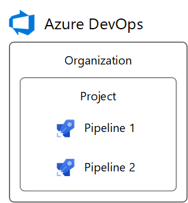
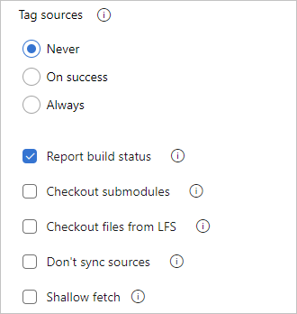
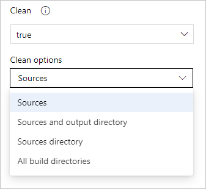

# Build GitHub repositories

[!INCLUDE [version-team-services](../_shared/version-team-services.md)]

Azure Pipelines can automatically build and validate every pull request and commit to your GitHub repository. This article describes how to configure the integration between GitHub and Azure Pipelines.

If you're new to Azure Pipelines integration with GitHub, follow the steps in [Create your first pipeline](../create-first-pipeline.md) to get your first pipeline working with a GitHub repository, and then come back to this article to learn more about configuring and customizing the integration between GitHub and Azure Pipelines.

Azure Pipelines is free for GitHub repositories, with multiple free offerings available depending on whether your GitHub repository and project are public or private.

### Public GitHub repository and Azure Pipelines in a public project

If your GitHub repository is open source, you can make your Azure DevOps project **public** so that anyone can view your pipeline's build results, logs, and test results without signing in. When users outside your organization fork your repository and submit pull requests, they can view the status of builds that automatically validate those pull requests.

If both your GitHub repository and your pipeline are public, you can run up to 10 parallel jobs in Azure Pipelines for free. These free jobs have a maximum timeout of 360 minutes (6 hours) each. If you need more, you can contact us to have the limits increased.

For more information on public projects, see [Create a public project](../../organizations/public/create-public-project.md).

### Private GitHub repository or Azure Pipelines in a private project

If either your GitHub repository or your pipeline is private, we still provide a free tier. In this tier, you can run one free parallel job that can run up to 60 minutes each time until you've used 1800 minutes per month. When the free tier is no longer sufficient, you can purchase additional Microsoft-hosted parallel jobs either through [Azure DevOps Marketplace](https://marketplace.visualstudio.com/items?itemName=ms.build-release-hosted-pipelines) (recommended) or [GitHub Marketplace](https://github.com/marketplace/azure-pipelines). Pricing is the same in both marketplaces. Unless you prefer using an existing GitHub billing account, it's recommended that purchases be made in the Azure DevOps Marketplace to simplify associating purchases with different Azure DevOps organizations. Purchasing jobs for private projects or private repositories removes any monthly time limit and allows jobs to have a maximum timeout of 360 minutes (6 hours) each.

To adjust the timeout of jobs, see [Timeouts](../process/phases.md#timeouts).

Learn more about pricing based on [parallel jobs](../licensing/concurrent-jobs.md).

## Map organizations and users

GitHub and Azure Pipelines are two independent services that integrate well together. Each of them have their own organization and user management. This section explains how to replicate the organization and users from GitHub to Azure Pipelines.

### Organizations

GitHub's structure consists of **organizations and user accounts** that contain **repositories**. See [GitHub's documentation](https://help.github.com/articles/differences-between-user-and-organization-accounts/).


Azure DevOps' structure consists of **organizations** that contain **projects**. See [Plan your organizational structure](../../user-guide/plan-your-azure-devops-org-structure.md).



Azure DevOps can reflect your GitHub structure with:
* An Azure DevOps **organization** for your GitHub **organization or user account**
* Azure DevOps **projects** for your GitHub **repositories**


To set up this mapping between GitHub and Azure DevOps:

1. Create an Azure DevOps organization named after your GitHub organization or user account. It will have a URL like `https://dev.azure.com/your-organization`.
1. In the Azure DevOps organization, create projects named after your repositories. They will have URLs like `https://dev.azure.com/your-organization/your-repository`.
1. In the Azure DevOps projects, create pipelines named after the GitHub organization and repository they build, such as `your-organization.your-repository`. Then, it's clear which repositories they're for.

Following this pattern, your GitHub repositories and Azure DevOps projects will have matching URL paths. For example:

|              |                                        |
|--------------|----------------------------------------|
| GitHub       | `https://github.com/python/cpython`    |
| Azure DevOps | `https://dev.azure.com/python/cpython` |

### Users

Your GitHub users do not automatically get access to Azure Pipelines. You must add your GitHub users explicitly to Azure Pipelines.

GitHub permissions on GitHub organizations, user accounts, and repositories can be reflected in Azure DevOps.

#### Mapping GitHub organization roles

GitHub organization member roles are found at `https://github.com/orgs/your-organization/people` (replace `your-organization`).

Azure DevOps organization member permissions are found at `https://dev.azure.com/your-organization/_settings/security` (replace `your-organization`).

GitHub organization roles map to Azure DevOps organization permissions as follows.

| GitHub organization role | Azure DevOps organization equivalent          |
| ------------------------ | --------------------------------------------- |
| Owner                    | Member of `Project Collection Administrators` |
| Billing manager          | Member of `Project Collection Administrators` |
| Member                   | Member of `Project Collection Valid Users`. By default, this group lacks permission to create new projects. To change this, set the group's `Create new projects` permission to `Allow`, or create a new group with permissions you need. |

#### Mapping GitHub user account roles

A GitHub user account has one role, which is ownership of the account.

Azure DevOps organization member permissions are found at `https://dev.azure.com/your-organization/_settings/security` (replace `your-organization`).

The GitHub user account role maps to Azure DevOps organization permissions as follows.

| GitHub user account role | Azure DevOps organization equivalent          |
| ------------------------ | --------------------------------------------- |
| Owner                    | Member of `Project Collection Administrators` |

#### Mapping GitHub repository permissions

GitHub repository permissions are found at `https://github.com/your-organization/your-repository/settings/collaboration` (replace `your-organization` and `your-repository`).

Azure DevOps project permissions are found at `https://dev.azure.com/your-organization/your-project/_settings/security` (replace `your-organization` and `your-project`).

GitHub repository permissions map to Azure DevOps project permissions as follows.

| GitHub repository permission | Azure DevOps project equivalent    |
| ---------------------------- | ---------------------------------- |
| Admin                        | Member of `Project Administrators` |
| Write                        | Member of `Contributors`           |
| Read                         | Member of `Readers`                |

If your GitHub repository grants permission to teams, you can create matching teams in the `Teams` section of your Azure DevOps project settings. Then, add the teams to the security groups above, just like users.

#### Pipeline-specific permissions

To grant permissions to users or teams for specific pipelines in an Azure DevOps project, follow these steps:

1. Visit the project's Builds page (for example, `https://dev.azure.com/your-organization/your-project/_build`).
1. Select the pipeline for which to set specific permissions.
1. From the '**...**' context menu, select **Security**.
1. Click **Add...** to add a specific user, team, or group and customize their permissions for the pipeline.

## Grant access to your GitHub repositories

Azure Pipelines must be granted access to your repositories to display them, trigger their builds, and fetch their code during builds.

There are 3 authentication types for granting Azure Pipelines access to your GitHub repositories while creating a pipeline.

| Authentication type            | Builds run using              | Works with [GitHub Checks](https://developer.github.com/v3/checks/) |
|--------------------------------|-------------------------------|-----|
| 1. [GitHub App](#github-app-authentication) | The Azure Pipelines identity  | Yes |
| 2. [OAuth](#oauth-authentication)           | Your personal GitHub identity | No  |
| 3. [Personal access token (PAT)](#personal-access-token-pat-authentication) | Your personal GitHub identity | No  |

### GitHub app authentication

>[!NOTE]
>The Azure Pipelines GitHub App is the **recommended** authentication type for continuous integration pipelines. For release pipelines that are triggered by changes to a GitHub repository, use [OAuth](#oauth-authentication) or [personal access token](#personal-access-token-pat-authentication) authentication.

By installing the GitHub App in your GitHub account or organization, your pipeline can run without using your personal GitHub identity. Builds and GitHub status updates will be performed using the Azure Pipelines identity. The app works with [GitHub Checks](https://developer.github.com/v3/checks/) to display build, test, and code coverage results in GitHub.

#### Install the GitHub App

To use the GitHub App, install it in your GitHub organization or user account for some or all repositories. Installation requires you to be a GitHub organization owner or repository admin.

After installation, the GitHub App will become Azure Pipelines’ default method of authentication to GitHub (instead of OAuth) when pipelines are created for the repositories. This is recommended so that pipelines run as “Azure Pipelines” instead of a user’s GitHub identity which may lose access to the repository.

The GitHub App can be installed and uninstalled from two locations:

1. The app's [homepage](https://github.com/apps/azure-pipelines) - **This method is recommended** when no parallel jobs are being purchased, or when your organization pays GitHub by purchase order (PO) or invoice.
1. The app's [GitHub Marketplace listing](https://github.com/marketplace/azure-pipelines/) where additional parallel jobs can be purchased for private repositories, but where cancellation of the price plan may delay uninstallation until the end of your GitHub billing period.

If you install the GitHub App for all repositories in a GitHub organization, you don't need to worry about Azure Pipelines sending mass emails or automatically setting up pipelines on your behalf. As an alternative to installing the app for all repositories, repository admins can install it one at a time for individual repositories. This requires more work for admins, but has no advantage nor disadvantage.

After installation, the GitHub App will be Azure Pipelines’ default method of authentication to GitHub (instead of OAuth) when pipelines are created for the repositories. This is recommended so that pipelines run as “Azure Pipelines” instead of a user’s GitHub identity, which may lose access to the repository.

#### Where to install the GitHub App

To create a pipeline for your repository with continuous integration and pull request triggers, you must have the required GitHub permissions configured. Otherwise, **the repository will not appear** in the repository list while creating a pipeline. Depending on the authentication type and ownership of the repository, ensure that the following access is configured.

#### If the repo is in your personal GitHub account

Install the Azure Pipelines GitHub App in your personal GitHub account. You can do so from [here](https://github.com/apps/azure-pipelines).

#### If the repo is in someone else's personal GitHub account

1. The other person must install the Azure Pipelines GitHub App in their personal GitHub account. They can do so from [here](https://github.com/apps/azure-pipelines).
2. You must be added as a collaborator in the repository's settings under "Collaborators". Accept the invitation to be a collaborator using the link that is emailed to you.

#### If the repo is in a GitHub organization that you own

 1. Install the Azure Pipelines GitHub App in the GitHub organization. You can do so from [here](https://github.com/apps/azure-pipelines).
 2. You must be added as a collaborator, or your team must be added, in the repository's settings under "Collaborators and teams". 

#### If the repo is in a GitHub organization that someone else owns

 1. A GitHub organization owner or repository admin must install the Azure Pipelines GitHub App in the organization. The app can be installed from [here](https://github.com/apps/azure-pipelines).
 2. You must be added as a collaborator, or your team must be added, in the repository's settings under "Collaborators and teams". Accept the invitation to be a collaborator using the link that is emailed to you.

#### GitHub App permissions

The GitHub App requests the following permissions during installation:

| Permission | What Azure Pipelines does with it |
|------------|-----------------------------------|
| Write access to code | Only upon your deliberate action, Azure Pipelines will simplify creating a pipeline by committing a YAML file to a selected branch of your GitHub repository. |
| Read access to metadata | Azure Pipelines will retrieve GitHub metadata for displaying the repository, branches, and issues associated with a build in the build's summary. |
| Read and write access to checks | Azure Pipelines will read and write its own build, test, and code coverage results to be displayed in GitHub. |
| Read and write access to pull requests | Only upon your deliberate action, Azure Pipelines will simplify creating a pipeline by creating a pull request for a YAML file that was committed to a selected branch of your GitHub repository. Azure Pipelines will retrieve pull request metadata to display in build summaries associated with pull requests. |

<!--
Detailed permissions not displayed to the user during installation:
| Checks (read & write)
| Repository contents (read & write)
| Deployments (read & write)
| Issues (read & write)
| Repository metadata (read)
| Pull requests (read & write)
| Commit statuses (read & write)
 -->

#### Troubleshooting GitHub App installation

GitHub may display an error such as:

`You do not have permission to modify this app on your-organization. Please contact an Organization Owner.`

This means that the GitHub App is likely already installed for your organization. When you create a pipeline for a repository in the organization, the GitHub App will automatically be used to connect to GitHub.

The **first time** the GitHub App is installed in a GitHub organization or user account, the Azure DevOps organization that is created or selected during installation will be where GitHub Marketplace purchases are applied. Currently, the only way to change where GitHub Marketplace purchases are applied is to uninstall and reinstall the GitHub App (which will disable existing pipelines), or purchase parallel jobs through the [Azure DevOps Marketplace](https://marketplace.visualstudio.com/items?itemName=ms.build-release-hosted-pipelines) instead of GitHub.

#### Create pipelines in multiple Azure DevOps organizations and projects

Once the GitHub App is installed, pipelines can be created for the organization's repositories in different Azure DevOps organizations and projects. However, if you create pipelines for a single repository in multiple Azure DevOps organizations, only the first organization's pipelines can be automatically triggered by GitHub commits or pull requests. Manual or scheduled builds are still possible in secondary Azure DevOps organizations.

### OAuth authentication

[OAuth](https://help.github.com/articles/authorizing-oauth-apps/) is the simplest authentication type to get started with for repositories in your personal GitHub account. Builds and GitHub status updates will be performed on behalf of your personal GitHub identity. For builds to keep working, your repository access must remain active. Some GitHub features, like Checks, are unavailable with OAuth and require the GitHub App.

#### Using OAuth

To use OAuth, click **Choose a different connection** below the list of repositories while creating a pipeline. Then, click **Authorize** to sign into GitHub and authorize with OAuth. An OAuth connection will be saved in your Azure DevOps project for later use, as well as used in the pipeline being created.

#### Revoking OAuth access

After authorizing Azure Pipelines to use OAuth, to later revoke it and prevent further use, visit [OAuth Apps](https://github.com/settings/developers) in your GitHub settings. You can also delete it from the list of GitHub [service connections](../library/service-endpoints.md) in your Azure DevOps project settings.

#### Repository permissions for OAuth authentication

To create a pipeline for your repository with continuous integration and pull request triggers, you must have the required GitHub permissions configured. Otherwise, **the repository will not appear** in the repository list while creating a pipeline. Depending on the authentication type and ownership of the repository, ensure that the following access is configured.

#### If the repo is in your personal GitHub account

1. At least once, authenticate to GitHub with OAuth using your personal GitHub account credentials. This can be done in Azure DevOps project settings under Pipelines > Service connections > New service connection > GitHub > Authorize.
2. Grant Azure Pipelines access to your repositories under "Permissions" [here](https://github.com/settings/connections/applications/0d4949be3b947c3ce4a5).

#### If the repo is in someone else's personal GitHub account

1. At least once, the other person must authenticate to GitHub with OAuth using their personal GitHub account credentials. This can be done in Azure DevOps project settings under Pipelines > Service connections > New service connection > GitHub > Authorize.
2. The other person must grant Azure Pipelines access to their repositories under "Permissions" [here](https://github.com/settings/connections/applications/0d4949be3b947c3ce4a5).
3. You must be added as a collaborator in the repository's settings under "Collaborators". Accept the invitation to be a collaborator using the link that is emailed to you. 

#### If the repo is in a GitHub organization that you own

1. At least once, authenticate to GitHub with OAuth using your personal GitHub account credentials. This can be done in Azure DevOps project settings under Pipelines > Service connections > New service connection > GitHub > Authorize.
2. Grant Azure Pipelines access to your organization under "Organization access" [here](https://github.com/settings/connections/applications/0d4949be3b947c3ce4a5). <br/><br/> **3.** You must be added as a collaborator, or your team must be added, in the repository's settings under "Collaborators and teams". 

#### If the repo is in a GitHub organization that someone else owns

1. At least once, a GitHub organization owner must authenticate to GitHub with OAuth using their personal GitHub account credentials. This can be done in Azure DevOps project settings under Pipelines > Service connections > New service connection > GitHub > Authorize.
2. The organization owner must grant Azure Pipelines access to the organization under "Organization access" [here](https://github.com/settings/connections/applications/0d4949be3b947c3ce4a5).
3. You must be added as a collaborator, or your team must be added, in the repository's settings under "Collaborators and teams". Accept the invitation to be a collaborator using the link that is emailed to you. |

### Personal access token (PAT) authentication

[PATs](https://help.github.com/articles/creating-a-personal-access-token-for-the-command-line/) are effectively the same as OAuth, but allow you to control which permissions are granted to Azure Pipelines. Builds and GitHub status updates will be performed on behalf of your personal GitHub identity. For builds to keep working, your repository access must remain active.

#### Using a PAT

To create a PAT, visit [Personal access tokens](https://github.com/settings/tokens) in your GitHub settings.
The required permissions are `repo`, `admin:repo_hook`, `read:user`, and `user:email`. These are the same permissions required when using OAuth above. Copy the generated PAT to the clipboard and paste it into a new GitHub [service connection](../library/service-endpoints.md) in your Azure DevOps project settings.
For future recall, name the service connection after your GitHub username. It will be available in your Azure DevOps project for later use when creating pipelines.

#### Repository permissions for Personal access token (PAT) authentication

To create a pipeline for your repository with continuous integration and pull request triggers, you must have the required GitHub permissions configured. Otherwise, **the repository will not appear** in the repository list while creating a pipeline. Depending on the authentication type and ownership of the repository, ensure that the following access is configured.

#### If the repo is in your personal GitHub account

The PAT must have the required access scopes under [Personal access tokens](https://github.com/settings/tokens): `repo`, `admin:repo_hook`, `read:user`, and `user:email`.

#### If the repo is in someone else's personal GitHub account

1. The PAT must have the required access scopes under [Personal access tokens](https://github.com/settings/tokens): `repo`, `admin:repo_hook`, `read:user`, and `user:email`.
2. You must be added as a collaborator in the repository's settings under "Collaborators". Accept the invitation to be a collaborator using the link that is emailed to you.

#### If the repo is in a GitHub organization that you own

1. The PAT must have the required access scopes under [Personal access tokens](https://github.com/settings/tokens): `repo`, `admin:repo_hook`, `read:user`, and `user:email`.
2. You must be added as a collaborator, or your team must be added, in the repository's settings under "Collaborators and teams". 

#### If the repo is in a GitHub organization that someone else owns

1. The PAT must have the required access scopes under [Personal access tokens](https://github.com/settings/tokens): `repo`, `admin:repo_hook`, `read:user`, and `user:email`.
2. You must be added as a collaborator, or your team must be added, in the repository's settings under "Collaborators and teams". Accept the invitation to be a collaborator using the link that is emailed to you.

#### Revoking PAT access

After authorizing Azure Pipelines to use a PAT, to later delete it and prevent further use, visit [Personal access tokens](https://github.com/settings/tokens) in your GitHub settings. You can also delete it from the list of GitHub [service connections](../library/service-endpoints.md) in your Azure DevOps project settings.

## Triggering a pipeline

You can have a pipeline triggered when the following events occur in GitHub:

* A change is pushed to GitHub repo ([CI trigger](#ci-triggers))
* A pull request is created or updated ([PR trigger](#pr-triggers))
* A special command is typed in pull request comments ([Comment trigger](#comment-triggers))

### CI triggers

Continuous integration (CI) triggers cause a build to run whenever a push is made to the specified branches or a specified tag is pushed.

# [YAML](#tab/yaml)

YAML builds are configured by default with a CI trigger on all branches.

#### Branches

You can control which branches get CI triggers with a simple syntax:

```yaml
trigger:
- master
- releases/*
```

You can specify the full name of the branch (for example, `master`) or a prefix-matching wildcard (for example, `releases/*`).
You cannot put a wildcard in the middle of a value. For example, `releases/*2018` is invalid.

You can specify the full name of the branch (for example, `master`) or a wildcard (for example, `releases/*`). See [Wildcards](../build/triggers.md#wildcards) for information on the wildcard syntax.

You can specify branches to include and exclude. For example:

```yaml
# specific branch build
trigger:
  branches:
    include:
    - master
    - releases/*
    exclude:
    - releases/old*
```

In addition to specifying branch names in the `branches` lists, you can also configure triggers based on tags by using the following format:

```yaml
trigger:
  branches:
    include:
      refs/tags/{tagname}
    exclude:
      refs/tags/{othertagname}
```

If you don't specify any branch triggers, the default is as if you wrote:

```yaml
trigger:
  branches:
    include:
    - '*'  # must quote since "*" is a YAML reserved character; we want a string
```

>[!IMPORTANT]
>When you specify a trigger, it replaces the default implicit trigger, and only pushes to branches that are explicitly configured to be included will trigger a pipeline. Includes are processed first, and then excludes are removed from that list. If you specify an exclude but don't specify any includes, nothing will trigger.

#### Tags

In addition to specifying tags in the `branches` lists as covered in the previous section, you can directly specify tags to include or exclude. In the following examples, this pipeline is triggered when tags are created with names beginning with `v2.`, but not `v2.0`.

```yaml
# specific branch build
trigger:
  tags:
    include:
    - v2.*
    exclude:
    - v2.0
```

If you don't specify any tag triggers, then by default, tags will not trigger pipelines.

#### Batching CI builds

If you have multiple team members uploading changes often, you may want to reduce the number of builds you're running.
If you set `batch` to `true`, if commits are made when a build is already running, the system waits until the build is completed, then queues another build of all changes that have not yet been built.

```yaml
# specific branch build with batching
trigger:
  batch: true
  branches:
    include:
    - master
```

#### Paths

You can specify file paths to include or exclude.

```yaml
# specific path build
trigger:
  branches:
    include:
    - master
    - releases/*
  paths:
    include:
    - docs/*
    exclude:
    - docs/README.md
```

#### Opting out of CI builds

You can opt-out of CI builds either by [disabling the CI trigger](#disabling-the-ci-trigger), or by [skipping CI builds for individual commits](#skipping-ci-for-individual-commits)).

You can also override the YAML CI trigger in the classic editor and disable it there. For more information, see [Overriding YAML triggers](#overriding-yaml-triggers).

#### Disabling the CI trigger

You can opt out of CI builds entirely by specifying `trigger: none`.

```yaml
# A pipeline with no CI trigger
trigger: none
```

>[!IMPORTANT]
>When you push a change to a branch, the YAML file in that branch is evaluated to determine if a CI build should be run.

For more information, see [Trigger](../yaml-schema.md#triggers) in the [YAML schema](../yaml-schema.md).

#### Skipping CI for individual commits

You can also tell Azure Pipelines to skip running a pipeline that a commit would normally trigger. Just include `[skip ci]` in the commit message or description of the HEAD commit and Azure Pipelines will skip running CI. You can also use any of the variations below.

- `[skip ci]` or `[ci skip]`
- `skip-checks: true` or `skip-checks:true`
- `[skip azurepipelines]` or `[azurepipelines skip]`
- `[skip azpipelines]` or `[azpipelines skip]`
- `[skip azp]` or `[azp skip]`
- `***NO_CI***`

# [Classic](#tab/classic)

Select this trigger if you want the build to run whenever someone checks in code.

### Batch changes

Select this check box if you have many team members uploading changes often and you want to reduce the number of builds you are running. If you select this option, when commits are made when a build is already running, the system waits until the build is completed and then queues another build of all changes that have not yet been built.

### Branch filters

You can specify the branches where you want to trigger builds. If you want to use wildcard characters, then type the branch specification (for example, `features/modules/*`) and then press Enter.

#### Example

For example, you want your build to be triggered by changes in master and most, but not all, of your feature branches. You also don't want builds to be triggered by changes to files in the tools folder.


---

### PR triggers

# [YAML](#tab/yaml)

Pull request (PR) triggers cause a build to run whenever a pull request is opened with one of the specified target branches, or when changes are pushed to such a pull request.

> [!NOTE]
> If your `pr` trigger isn't firing, ensure that you have not overridden YAML PR triggers in the UI.
> To opt into YAML-based control, you must disable a setting on the **Triggers** tab in pipelines settings by following the steps in [Overriding YAML triggers](#overriding-yaml-triggers).

You can specify the target branches for your pull request builds.
For example, to run pull request builds only for branches that target: `master` and `releases/*`:

```yaml
pr:
- master
- releases/*
```

PR triggers will fire for these branches once the pipeline YAML file has reached that branch.
For example, if you add `master` in a topic branch, PRs to `master` will not start automatically building.
When the changes from the topic branch are merged into `master`, then the trigger will be fully configured.

If no `pr` triggers appear in your YAML file, pull request builds are automatically enabled for all branches, as if you wrote:

```yaml
pr:
  branches:
    include:
    - '*'  # must quote since "*" is a YAML reserved character; we want a string
```

>[!IMPORTANT]
>When you specify a `pr` trigger, it replaces the default implicit `pr` trigger, and only pushes to branches that are explicitly configured to be included will trigger a pipeline. Includes are processed first, and then excludes are removed from that list. If you specify an exclude but don't specify any includes, nothing will trigger.

You can specify the full name of the branch (for example, `master`) or a wildcard (for example, `releases/*`). See [Wildcards](../build/triggers.md#wildcards) for information on the wildcard syntax.

You can specify branches to include and exclude. For example:

```yaml
# specific branch build
pr:
  branches:
    include:
    - master
    - releases/*
    exclude:
    - releases/old*
```

You can specify file paths to include or exclude. For example:

```yaml
# specific path build
pr:
  branches:
    include:
    - master
    - releases/*
  paths:
    include:
    - docs/*
    exclude:
    - docs/README.md
```

You can specify whether additional pushes to a PR should cancel in-progress runs for the same PR. The default is `true`.

```yaml
# auto cancel false
pr:
  autoCancel: false
  branches:
    include:
    - master
```

You can opt out of pull request builds entirely by specifying `pr: none`.

```yaml
# no PR builds
pr: none
```

>[!IMPORTANT]
>When you create a pull request, or push a change to the source branch of a PR, the YAML file in the source branch is evaluated to determine if a PR build should be run.

For more information, see [PR trigger](../yaml-schema.md#pr-trigger) in the [YAML schema](../yaml-schema.md).

# [Classic](#tab/classic)

Select the **Pull request validation** trigger and check the **Enable pull request validation** check box to enable builds on pull requests.


You can specify branches to include and exclude.
Select a branch name from the drop-down menu and select **Include** or **Exclude** as appropriate.
For included branches, a build will be triggered on each push to a pull request targeting that branch.

You can choose whether or not to build pull requests from forks. See the following section on security considerations when enabling this feature that you should understand before selecting it.
If you choose to build fork pull requests, you may also choose whether or not to expose secrets (like secret variables and secure files) to fork pull request builds.

---

#### Considerations when accepting contributions from external sources

If your GitHub repository is open source, you can make your Azure DevOps project [public](../../organizations/public/create-public-project.md) so that anyone can view your pipeline's build results, logs, and test results without signing in. When users outside your organization fork your repository and submit pull requests, they can view the status of builds that automatically validate those pull requests.

You should keep in mind the following considerations when using Azure Pipelines in a public project when accepting contributions from external sources.

* [Access restrictions](#access-restrictions)
* [Validate contributions from forks](#validate-contributions-from-forks)
  * [Important security considerations](#important-security-considerations)

##### Access restrictions

Be aware of the following access restrictions when you're running builds in Azure Pipelines public projects:

* **Build secrets:** By default, secrets associated with your build pipeline are not made available to pull request builds of forks. See [Validate contributions from forks](#validate-contributions-from-forks).
* **Cross-project access:** All builds in an Azure DevOps public project run with an access token restricted to the project. Builds in a public project can access resources such as build artifacts or test results only within the project and not in other projects of the Azure DevOps organization.
* **Azure Artifacts packages:** If your builds need access to packages from Azure Artifacts, you must explicitly grant permission to the **Project Build Service** account to access the package feeds.

#### Validate contributions from forks

> [!IMPORTANT]
> These settings affect the security of your build.

When you create a build pipeline, your pipeline is automatically triggered for pull requests from forks of your repository. You can change this behavior, carefully considering how it affects security. To enable or disable this behavior:

1. Go to your Azure DevOps project. Select **Pipelines**, and then select **Builds**. Locate your build pipeline, and select **Edit**.
2. Select the **Triggers** tab. After enabling the **Pull request trigger**, enable or disable the **Build pull requests from forks of this repository** check box.

By default with GitHub pipelines, secrets associated with your build pipeline are not made available to pull request builds of forks. These secrets are enabled by default with GitHub Enterprise Server pipelines. Secrets include:

* A security token with access to your GitHub repository.
* These items, if your build uses them:
  * [Service connection](../library/service-endpoints.md) credentials
  * Files from the [secure files library](../library/secure-files.md)
  * Build [variables](../process/variables.md#secret-variables) marked **secret**

To bypass this precaution on GitHub pipelines, enable the **Make secrets available to builds of forks** check box. Be aware of this setting's effect on security.

##### Important security considerations

A GitHub user can fork your repository, change it, and create a pull request to propose changes to your repository. This pull request could contain malicious code to run as part of your triggered build. For example, an ill-intentioned script or unit test change might leak secrets or compromise the agent machine that's performing the build. We recommend the following actions to address this risk:

* Do not enable the **Make secrets available to builds of forks** check box if your repository is public or untrusted users can submit pull requests that automatically trigger builds. Otherwise, secrets might leak during a build.

* Use a [Microsoft-hosted agent pool](../agents/hosted.md) to build pull requests from forks. Microsoft-hosted agent machines are immediately deleted after they complete a build, so there is no lasting impact if they're compromised.

* If you must use a [self-hosted agent](../agents/agents.md#install), do not store any secrets or perform other builds and releases that use secrets on the same agent, unless your repository is private and you trust pull request creators. Otherwise, secrets might leak, and the repository contents or secrets of other builds and releases might be revealed.

### Comment triggers

Repository collaborators can comment on a pull request to manually run a pipeline. You might use this to run an optional test suite or validation build. The following commands can be issued to Azure Pipelines in comments:

| Command | Result |
| - | - |
| `/AzurePipelines help` | Display help for all supported commands. |
| `/AzurePipelines help <command-name>` | Display help for the specified command. |
| `/AzurePipelines run` | Run all pipelines that are associated with this repository and whose triggers do not exclude this pull request. |
| `/AzurePipelines run <pipeline-name>` | Run the specified pipeline unless its triggers exclude this pull request. |

> [!Note]
> For brevity, you can comment using `/azp` instead of `/AzurePipelines`.

>[!IMPORTANT]
>Responses to these commands will appear in the pull request discussion only if your pipeline uses the [Azure Pipelines GitHub App](#github-app-authentication).

#### Build GitHub pull requests only when authorized by your team

You may not want to automatically build pull requests from unknown users until their changes can be reviewed. You can configure Azure Pipelines to build GitHub pull requests only when authorized by your team.

To enable this, in Azure Pipelines, select the **Triggers** tab in your pipeline's settings. Then, under **Pull request validation**, enable **Only trigger builds for collaborators’ pull request comments** and save the pipeline. Now, the pull request validation build will not be triggered automatically. Only repository owners and collaborators with 'Write' permission can trigger the build by commenting on the pull request with `/AzurePipelines run` or `/AzurePipelines run <pipeline-name>` as described above.

#### Troubleshoot pull request comment triggers

If you have the necessary repository permissions, but pipelines aren't getting triggered by your comments, make sure that your membership is **public** in the repository's organization, or directly add yourself as a repository collaborator. Azure Pipelines cannot see private organization members unless they are direct collaborators or belong to a team that is a direct collaborator. You can change your GitHub organization membership from private to public here (replace `Your-Organization` with your organization name): `https://github.com/orgs/Your-Organization/people`.

### Overriding YAML triggers

PR and CI triggers that are configured in YAML pipelines can be overridden in the pipeline settings, and by default, new pipelines automatically override YAML PR triggers. To configure this setting, select **Triggers** from the settings menu while editing your YAML pipeline.


Select either the **Continuous integration** trigger or the **Pull request validation** trigger, and configure your desired setting by enabling or disabling **Override the YAML ... trigger from here**.


## Getting the source code

When a pipeline is triggered, Azure Pipelines pulls your source code from the GitHub repository. You can control various aspects of how this happens.

### Preferred version of Git

The Windows agent comes with its own copy of Git.
If you prefer to supply your own Git rather than use the included copy, set `System.PreferGitFromPath` to `true`.
This setting is always true on non-Windows agents.

::: moniker range="> azure-devops-2019"

### Checkout path

By default, your source code will be checked out into a directory called `s`. For YAML pipelines, you can change this by specifying `checkout` with a `path`. The specified path is relative to `$(Agent.BuildDirectory)`. For example: if the checkout path value is `mycustompath` and `$(Agent.BuildDirectory)` is `C:\agent\_work\1`, then the source code will be checked out into `C:\agent\_work\1\mycustompath`.

Please note that the checkout path value cannot be set to go up any directory levels above `$(Agent.BuildDirectory)`, so `path\..\anotherpath` will result in a valid checkout path (i.e. `C:\agent\_work\1\anotherpath`), but a value like `..\invalidpath` will not (i.e. `C:\agent\_work\invalidpath`).

# [YAML](#tab/yaml)

You can configure the `path` setting in the [Checkout](..//yaml-schema.md#checkout) step of your pipeline.

```yaml
steps:
- checkout: self  # self represents the repo where the initial Pipelines YAML file was found
  clean: boolean  # whether to fetch clean each time
  fetchDepth: number  # the depth of commits to ask Git to fetch
  lfs: boolean  # whether to download Git-LFS files
  submodules: true | recursive  # set to 'true' for a single level of submodules or 'recursive' to get submodules of submodules
  path: string  # path to check out source code, relative to the agent's build directory (e.g. \_work\1)
  persistCredentials: boolean  # set to 'true' to leave the OAuth token in the Git config after the initial fetch
```

# [Classic](#tab/classic)

This setting is not configurable in the classic editor.

---

::: moniker-end

### Submodules

Select if you want to download files from [submodules](https://git-scm.com/book/en/v2/Git-Tools-Submodules).
You can either choose to get the immediate submodules or all submodules nested to any depth of recursion.

# [YAML](#tab/yaml)

You can configure the `submodules` setting in the [Checkout](..//yaml-schema.md#checkout) step of your pipeline.

```yaml
steps:
- checkout: self  # self represents the repo where the initial Pipelines YAML file was found
  clean: boolean  # whether to fetch clean each time
  fetchDepth: number  # the depth of commits to ask Git to fetch
  lfs: boolean  # whether to download Git-LFS files
  submodules: true | recursive  # set to 'true' for a single level of submodules or 'recursive' to get submodules of submodules
  path: string  # path to check out source code, relative to the agent's build directory (e.g. \_work\1)
  persistCredentials: boolean  # set to 'true' to leave the OAuth token in the Git config after the initial fetch
```

# [Classic](#tab/classic)

You can configure the **Submodules** setting from the properties of the **Get sources** task in your pipeline.

 

---

The build pipeline will check out your Git submodules as long as they are:

* **Unauthenticated:**  A public, unauthenticated repo with no credentials required to clone or fetch.

* **Authenticated:**  

  - Contained in the same GitHub organization as the Git repo specified above.

  - Added by using a URL relative to the main repository. For example, this one would be checked out: ```git submodule add /../../submodule.git mymodule``` This one would not be checked out: ```git submodule add https://dev.azure.com/fabrikamfiber/_git/ConsoleApp mymodule```


#### Authenticated submodules

> [!NOTE]
> Make sure that you have registered your submodules using HTTPS and not using SSH.

The same credentials that are used by the agent to get the sources from the main repository are also used to get the sources for submodules.

If your main repository and submodules are in an Azure Repos Git repository in your Azure DevOps project, then you can select the account used to access the sources. On the **Options** tab, on the **Build job authorization scope** menu, select either:

* **Project collection** to use the Project Collection Build service account

* **Current project** to use the Project Build Service account.

Make sure that whichever account you use has access to both the main repository as well as the submodules.

If your main repository and submodules are in the same GitHub organization, then the token stored in the GitHub service connection is used to access the sources.

#### Alternative to using the Checkout submodules option

In some cases you can't use the **Checkout submodules** option.
You might have a scenario where a different set of credentials are needed to access the submodules.
This can happen, for example, if your main repository and submodule repositories aren't stored in the same Azure DevOps organization or Git service.

If you can't use the **Checkout submodules** option, then you can instead use a custom script step to fetch submodules.
First, get a personal access token (PAT) and prefix it with `pat:`.
Next, [base64-encode](https://www.base64encode.org/) this prefixed string to create a basic auth token.
Finally, add this script to your pipeline:

```
git -c http.https://<url of submodule repository>.extraheader="AUTHORIZATION: basic <BASE64_ENCODED_TOKEN_DESCRIBED_ABOVE>" submodule update --init --recursive
```

Be sure to replace "<BASIC_AUTH_TOKEN>" with your Base64-encoded token.

Use a secret variable in your project or build pipeline to store the basic auth token that you generated.
Use that variable to populate the secret in the above Git command.
> [!NOTE]
> **Q: Why can't I use a Git credential manager on the agent?** **A:** Storing the submodule credentials in a Git credential manager installed on your private build agent is usually not effective as the credential manager may prompt you to re-enter the credentials whenever the submodule is updated. This isn't desirable during automated builds when user interaction isn't possible.

### Shallow fetch

Select if you want to limit how far back in history to download. Effectively this results in `git fetch --depth=n`. If your repository is large, this option might make your build pipeline more efficient. Your repository might be large if it has been in use for a long time and has sizeable history. It also might be large if you added and later deleted large files.

# [YAML](#tab/yaml)

You can configure the `fetchDepth` setting in the [Checkout](..//yaml-schema.md#checkout) step of your pipeline.

```yaml
steps:
- checkout: self  # self represents the repo where the initial Pipelines YAML file was found
  clean: boolean  # whether to fetch clean each time
  fetchDepth: number  # the depth of commits to ask Git to fetch
  lfs: boolean  # whether to download Git-LFS files
  submodules: true | recursive  # set to 'true' for a single level of submodules or 'recursive' to get submodules of submodules
  path: string  # path to check out source code, relative to the agent's build directory (e.g. \_work\1)
  persistCredentials: boolean  # set to 'true' to leave the OAuth token in the Git config after the initial fetch
```

# [Classic](#tab/classic)

You can configure the **Shallow fetch** setting from the properties of the **Get sources** task in your pipeline.

 

---

In these cases this option can help you conserve network and storage resources. It might also save time. The reason it doesn't always save time is because in some situations the server might need to spend time calculating the commits to download for the depth you specify.

> [!NOTE]
> When the build is queued, the branch to build is resolved to a commit ID. Then, the agent
> fetches the branch and checks out the desired commit. There is a small window between when a branch
> is resolved to a commit ID and when the agent performs the checkout. If the branch updates rapidly
> and you set a very small value for shallow fetch, the commit may not exist when the agent attempts
> to check it out. If that happens, increase the shallow fetch depth setting.

### Don't sync sources

Use this option if you want to skip fetching new commits. This option can be useful in cases when you want to:

* Git init, config, and fetch using your own custom options.

* Use a build pipeline to just run automation (for example some scripts) that do not depend on code in version control.

# [YAML](#tab/yaml)

You can configure the **Don't sync sources** setting in the [Checkout](..//yaml-schema.md#checkout) step of your pipeline, by setting `checkout: none`.

```yaml
steps:
- checkout: none  # Don't sync sources
```

# [Classic](#tab/classic)

Select the **Don't sync sources** setting from the properties of the **Get sources** task in your pipeline.

 

---

If you want to disable downloading sources, from the **Get sources** task, select **Don't sync sources**.

> [!NOTE]
> When you use this option, the agent also skips running Git commands that clean the repo.

### Multiple repos

By default, your pipeline is associated with one repo from Azure Repos or an external provider.
This is the repo that can trigger builds on commits and pull requests.

You may want to include sources from a second repo in your pipeline.
You can do this by writing a script.

```
git clone https://github.com/Microsoft/TypeScript.git
```

If the repo is not public, you will need to pass authentication to the Git command.

> [!NOTE]
> Secret variables are not automatically made available to scripts as environment variables.
> See [Secret variables](../process/variables.md#secret-variables) on how to map them in.

### Clean build

[!INCLUDE [include](_shared/build-clean-intro.md)]

> [!NOTE]
> Cleaning is not effective if you're using a [Microsoft-hosted agent](../agents/hosted.md) because you'll get a new agent every time.

#### [YAML](#tab/yaml/)
You can configure the `clean` setting in the [Checkout](..//yaml-schema.md#checkout) step of your pipeline.

```yaml
steps:
- checkout: self  # self represents the repo where the initial Pipelines YAML file was found
  clean: boolean  # whether to fetch clean each time
  fetchDepth: number  # the depth of commits to ask Git to fetch
  lfs: boolean  # whether to download Git-LFS files
  submodules: true | recursive  # set to 'true' for a single level of submodules or 'recursive' to get submodules of submodules
  path: string  # path to check out source code, relative to the agent's build directory (e.g. \_work\1)
  persistCredentials: boolean  # set to 'true' to leave the OAuth token in the Git config after the initial fetch
```

When `clean` is set to `true` the build pipeline performs an undo of any changes in `$(Build.SourcesDirectory)`. More specifically, the following Git commands are executed prior to fetching the source.

 ```
 git clean -ffdx
 git reset --hard HEAD
 ```

For more options, you can configure the `workspace` setting of a [Job](..//yaml-schema.md#job). 

```yaml
jobs:
- job: string  # name of the job, A-Z, a-z, 0-9, and underscore
  ...
  workspace:
    clean: outputs | resources | all # what to clean up before the job runs
```


This gives the following clean options.

* **outputs**: Same operation as the clean setting described in the previous the checkout task, plus: Deletes and recreates `$(Build.BinariesDirectory)`. Note that the `$(Build.ArtifactStagingDirectory)` and `$(Common.TestResultsDirectory)` are always deleted and recreated prior to every build regardless of any of these settings.

* **resources**: Deletes and recreates `$(Build.SourcesDirectory)`. This results in initializing a new, local Git repository for every build.

* **all**: Deletes and recreates `$(Agent.BuildDirectory)`. This results in initializing a new, local Git repository for every build.

#### [Classic](#tab/classic/)
Select the **Clean** setting from the properties of the **Get sources** task in your pipeline and select one of the following options.

 

* **Sources**: The build pipeline performs an undo of any changes in `$(Build.SourcesDirectory)`. More specifically, the following Git commands are executed prior to fetching the source.
  ```
  git clean -ffdx
  git reset --hard HEAD
  ```

* **Sources and output directory**: Same operation as **Sources** option above, plus: Deletes and recreates `$(Build.BinariesDirectory)`. Note that the `$(Build.ArtifactStagingDirectory)` and `$(Common.TestResultsDirectory)` are always deleted and recreated prior to every build regardless of any of these settings.

* **Sources directory**: Deletes and recreates `$(Build.SourcesDirectory)`. This results in initializing a new, local Git repository for every build.

* **All build directories**: Deletes and recreates `$(Agent.BuildDirectory)`. This results in initializing a new, local Git repository for every build.

* * *
### Label sources

You may want to label your source code files to enable your team to easily identify which version of each file is included in the completed build. You also have the option to specify whether the source code should be labeled for all builds or only for successful builds.

# [YAML](#tab/yaml)

You can't currently configure this setting in YAML but you can in the classic editor. When editing a YAML pipeline, you can access the classic editor by choosing either **Triggers** or **Variables** from the settings menu.


From the classic editor, choose **YAML**, choose the **Get sources** task, and then configure the desired properties there.


# [Classic](#tab/classic)

You can configure the **Tag sources** setting from the properties of the **Get sources** task in your pipeline.

 

---

In the **Tag format** you can use user-defined and predefined variables that have a scope of "All." For example:

```
$(Build.DefinitionName)_$(Build.DefinitionVersion)_$(Build.BuildId)_$(Build.BuildNumber)_$(My.Variable)
```

The first four variables are predefined. `My.Variable` can be defined by you on the [variables tab](../build/variables.md).

The build pipeline labels your sources with a [Git tag](https://git-scm.com/book/en/v2/Git-Basics-Tagging).

Some build variables might yield a value that is not a valid label. For example, variables such as `$(Build.RequestedFor)` and `$(Build.DefinitionName)` can contain white space. If the value contains white space, the tag is not created.

After the sources are tagged by your build pipeline, an artifact with the Git ref `refs/tags/{tag}` is automatically added to the completed build. This gives your team additional traceability and a more user-friendly way to navigate from the build to the code that was built.

## Posting status

You've got the option to give your team a view of the build status from your remote source repository, by publishing the status of your build to GitHub using GitHub [Checks](https://developer.github.com/v3/checks/) or [Status](https://developer.github.com/v3/repos/statuses/) APIs. If your build is triggered from a GitHub pull request, then you can view the status on the GitHub pull requests page. This also allows you to set status policies within GitHub and automate merges. If your build is triggered by continuous integration (CI), then you can view the build status on the commit or branch in GitHub.

### Status badge

To add a build badge to the `README.md` file at the root of your repository, follow the steps in [Get the status badge](../create-first-pipeline.md#get-the-status-badge).

## Protecting branches

If you're using [GitHub app authentication](#github-app-authentication) for your Azure Pipelines integration with GitHub, you can use your pipeline's build results with [GitHub Checks](https://developer.github.com/v3/checks/) to help protect your branches.

You can run a validation build with each commit or pull request that targets a branch, and even prevent pull requests from merging until a validation build succeeds.

To configure mandatory validation builds for a GitHub repository, you must be its owner, a collaborator with the Admin role, or a GitHub organization member with the Write role.

1. First, create a pipeline for the repository and build it at least once so that its status is posted to GitHub, thereby making GitHub aware of the pipeline's name.

2. Next, follow GitHub's documentation for [configuring protected branches](https://help.github.com/articles/configuring-protected-branches/) in the repository's settings.

   For the status check, select the name of your pipeline in the **Status checks** list.

   

>[!IMPORTANT]
>If your pipeline doesn't show up in this list, please ensure the following:
>
>* You are using [GitHub app authentication](#github-app-authentication)
>* Your pipeline has run at least once in the last week

## Q & A
<!-- BEGINSECTION class="md-qanda" -->

<a name="missing-repo"></a>
### Why isn't a GitHub repository displayed for me to choose in Azure Pipelines?

Depending on the authentication type and ownership of the repository, specific permissions are required.

- If you're using the GitHub App, see [Where to install the GitHub App](#where-to-install-the-github-app).
- If you're using OAuth, see [Repository permissions for OAuth authentication](#repository-permissions-for-oauth-authentication).
- If you're using PATs, see [Repository permissions for Personal access token (PAT) authentication](#repository-permissions-for-personal-access-token-pat-authentication).

<!-- ENDSECTION -->
