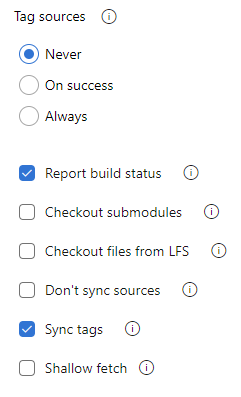
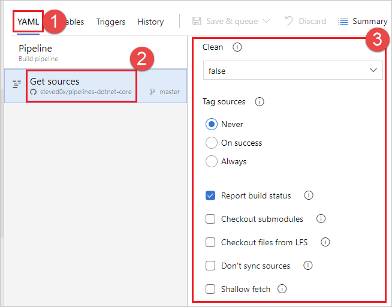

## Checkout

When a pipeline is triggered, Azure Pipelines pulls your source code from the Azure Repos Git repository. You can control various aspects of how this happens.

### Preferred version of Git

The Windows agent comes with its own copy of Git.
If you prefer to supply your own Git rather than use the included copy, set `System.PreferGitFromPath` to `true`.
This setting is always true on non-Windows agents.

### Checkout path

# [YAML](#tab/yaml/)

If you are checking out a single repository, by default, your source code will be checked out into a directory called `s`. For YAML pipelines, you can change this by specifying `checkout` with a `path`. The specified path is relative to `$(Agent.BuildDirectory)`. For example: if the checkout path value is `mycustompath` and `$(Agent.BuildDirectory)` is `C:\agent\_work\1`, then the source code will be checked out into `C:\agent\_work\1\mycustompath`.

If you are using multiple `checkout` steps and checking out multiple repositories, and not explicitly specifying the folder using `path`, each repository is placed in a subfolder of `s` named after the repository. For example if you check out two repositories named `tools` and `code`, the source code will be checked out into `C:\agent\_work\1\s\tools` and `C:\agent\_work\1\s\code`.

Please note that the checkout path value cannot be set to go up any directory levels above `$(Agent.BuildDirectory)`, so `path\..\anotherpath` will result in a valid checkout path (i.e. `C:\agent\_work\1\anotherpath`), but a value like `..\invalidpath` will not (i.e. `C:\agent\_work\invalidpath`).

You can configure the `path` setting in the [Checkout](../../yaml-schema.md#checkout) step of your pipeline.

```yaml
steps:
- checkout: self  # self represents the repo where the initial Pipelines YAML file was found
  clean: boolean  # whether to fetch clean each time
  fetchDepth: number  # the depth of commits to ask Git to fetch
  lfs: boolean  # whether to download Git-LFS files
  submodules: true | recursive  # set to 'true' for a single level of submodules or 'recursive' to get submodules of submodules
  path: string  # path to check out source code, relative to the agent's build directory (e.g. \_work\1)
  persistCredentials: boolean  # set to 'true' to leave the OAuth token in the Git config after the initial fetch
```

# [Classic](#tab/classic/)

This setting is not configurable in the classic editor. Your source code will be checked out into a directory called `s`, which is relative to `$(Agent.BuildDirectory)`. For example: if `$(Agent.BuildDirectory)` is `C:\agent\_work\1`, then the source code will be checked out into `C:\agent\_work\1\mycustompath`.

---

### Submodules

# [YAML](#tab/yaml/)

You can configure the `submodules` setting in the [Checkout](../../yaml-schema.md#checkout) step of your pipeline if you want to download files from [submodules](https://git-scm.com/book/en/v2/Git-Tools-Submodules).

```yaml
steps:
- checkout: self  # self represents the repo where the initial Pipelines YAML file was found
  clean: boolean  # whether to fetch clean each time
  fetchDepth: number  # the depth of commits to ask Git to fetch
  lfs: boolean  # whether to download Git-LFS files
  submodules: true | recursive  # set to 'true' for a single level of submodules or 'recursive' to get submodules of submodules
  path: string  # path to check out source code, relative to the agent's build directory (e.g. \_work\1)
  persistCredentials: boolean  # set to 'true' to leave the OAuth token in the Git config after the initial fetch
```

# [Classic](#tab/classic/)

You can configure the **Submodules** setting from the properties of the **Get sources** task in your pipeline if you want to download files from [submodules](https://git-scm.com/book/en/v2/Git-Tools-Submodules).



---

The build pipeline will check out your Git submodules as long as they are:

* **Unauthenticated:**  A public, unauthenticated repo with no credentials required to clone or fetch.

* **Authenticated:** 

  - Contained in the same project as the Azure Repos Git repo specified above.  The same credentials that are used by the agent to get the sources from the main repository are also used to get the sources for submodules.

  - Added by using a URL relative to the main repository. For example
    - This one would be checked out:
     `git submodule add ../../../FabrikamFiberProject/_git/FabrikamFiber FabrikamFiber` 

      In this example the submodule refers to a repo (FabrikamFiber) in the same Azure DevOps organization, but in a different project (FabrikamFiberProject).  The same credentials that are used by the agent to get the sources from the main repository are also used to get the sources for submodules. This requires that the job access token has access to the repository in the second project. If you restricted the job access token as explained in the section above, then you won't be able to do this. You can allow the job access token to access the repo in the second project by either (a) explicitly granting access to the project build service account in the second project or (b) using collection-scoped access tokens instead of project-scoped tokens for the entire organization. For more information about these options and their security implications, see [Access repositories, artifacts, and other resources](../../process/access-tokens.md).

    - This one would not be checked out:
     `git submodule add https://fabrikam-fiber@dev.azure.com/fabrikam-fiber/FabrikamFiberProject/_git/FabrikamFiber FabrikamFiber`

#### Alternative to using the Checkout submodules option

In some cases you can't use the **Checkout submodules** option.
You might have a scenario where a different set of credentials are needed to access the submodules.
This can happen, for example, if your main repository and submodule repositories aren't stored in the same Azure DevOps organization, or if your job access token does not have access to the repository in a different project.

If you can't use the **Checkout submodules** option, then you can instead use a custom script step to fetch submodules.
First, get a personal access token (PAT) and prefix it with `pat:`.
Next, [base64-encode](https://www.base64encode.org/) this prefixed string to create a basic auth token.
Finally, add this script to your pipeline:

```
git -c http.https://<url of submodule repository>.extraheader="AUTHORIZATION: Basic <BASE64_ENCODED_STRING>" submodule update --init --recursive
```

Be sure to replace "<BASE64_ENCODED_STRING>" with your Base64-encoded "pat:token" string.

Use a secret variable in your project or build pipeline to store the basic auth token that you generated.
Use that variable to populate the secret in the above Git command.

> [!NOTE]
> **Q: Why can't I use a Git credential manager on the agent?** **A:** Storing the submodule credentials in a Git credential manager installed on your private build agent is usually not effective as the credential manager may prompt you to re-enter the credentials whenever the submodule is updated. This isn't desirable during automated builds when user interaction isn't possible.

### Shallow fetch

You may want to limit how far back in history to download. Effectively this results in `git fetch --depth=n`. If your repository is large, this option might make your build pipeline more efficient. Your repository might be large if it has been in use for a long time and has sizeable history. It also might be large if you added and later deleted large files.

# [YAML](#tab/yaml/)

You can configure the `fetchDepth` setting in the [Checkout](../../yaml-schema.md#checkout) step of your pipeline.

```yaml
steps:
- checkout: self  # self represents the repo where the initial Pipelines YAML file was found
  clean: boolean  # whether to fetch clean each time
  fetchDepth: number  # the depth of commits to ask Git to fetch
  lfs: boolean  # whether to download Git-LFS files
  submodules: true | recursive  # set to 'true' for a single level of submodules or 'recursive' to get submodules of submodules
  path: string  # path to check out source code, relative to the agent's build directory (e.g. \_work\1)
  persistCredentials: boolean  # set to 'true' to leave the OAuth token in the Git config after the initial fetch
```

# [Classic](#tab/classic/)

You can configure the **Shallow fetch** setting from the properties of the **Get sources** task in your pipeline.


---

In these cases this option can help you conserve network and storage resources. It might also save time. The reason it doesn't always save time is because in some situations the server might need to spend time calculating the commits to download for the depth you specify.

> [!NOTE]
> When the pipeline is started, the branch to build is resolved to a commit ID. Then, the agent
> fetches the branch and checks out the desired commit. There is a small window between when a branch
> is resolved to a commit ID and when the agent performs the checkout. If the branch updates rapidly
> and you set a very small value for shallow fetch, the commit may not exist when the agent attempts
> to check it out. If that happens, increase the shallow fetch depth setting.

### Don't sync sources

You may want to skip fetching new commits. This option can be useful in cases when you want to:

* Git init, config, and fetch using your own custom options.

* Use a build pipeline to just run automation (for example some scripts) that do not depend on code in version control.

# [YAML](#tab/yaml/)

You can configure the **Don't sync sources** setting in the [Checkout](../../yaml-schema.md#checkout) step of your pipeline, by setting `checkout: none`.

```yaml
steps:
- checkout: none  # Don't sync sources
```

# [Classic](#tab/classic/)

Select the **Don't sync sources** setting from the properties of the **Get sources** task in your pipeline.


---

> [!NOTE]
> When you use this option, the agent also skips running Git commands that clean the repo.

### Clean build

[!INCLUDE [include](build-clean-intro.md)]

> [!NOTE]
> Cleaning is not effective if you're using a [Microsoft-hosted agent](../../agents/hosted.md) because you'll get a new agent every time.

# [YAML](#tab/yaml/)

You can configure the `clean` setting in the [Checkout](../../yaml-schema.md#checkout) step of your pipeline.

```yaml
steps:
- checkout: self  # self represents the repo where the initial Pipelines YAML file was found
  clean: boolean  # whether to fetch clean each time
  fetchDepth: number  # the depth of commits to ask Git to fetch
  lfs: boolean  # whether to download Git-LFS files
  submodules: true | recursive  # set to 'true' for a single level of submodules or 'recursive' to get submodules of submodules
  path: string  # path to check out source code, relative to the agent's build directory (e.g. \_work\1)
  persistCredentials: boolean  # set to 'true' to leave the OAuth token in the Git config after the initial fetch
```

When `clean` is set to `true` the build pipeline performs an undo of any changes in `$(Build.SourcesDirectory)`. More specifically, the following Git commands are executed prior to fetching the source.

 ```
 git clean -ffdx
 git reset --hard HEAD
 ```

For more options, you can configure the `workspace` setting of a [Job](../../yaml-schema.md#job). 

```yaml
jobs:
- job: string  # name of the job, A-Z, a-z, 0-9, and underscore
  ...
  workspace:
    clean: outputs | resources | all # what to clean up before the job runs
```

This gives the following clean options.

* **outputs**: Same operation as the clean setting described in the previous the checkout task, plus: Deletes and recreates `$(Build.BinariesDirectory)`. Note that the `$(Build.ArtifactStagingDirectory)` and `$(Common.TestResultsDirectory)` are always deleted and recreated prior to every build regardless of any of these settings.

* **resources**: Deletes and recreates `$(Build.SourcesDirectory)`. This results in initializing a new, local Git repository for every build.

* **all**: Deletes and recreates `$(Agent.BuildDirectory)`. This results in initializing a new, local Git repository for every build.

# [Classic](#tab/classic/)

Select the **Clean** setting from the properties of the **Get sources** task in your pipeline and select one of the following options.


* **Sources**: The build pipeline performs an undo of any changes in `$(Build.SourcesDirectory)`. More specifically, the following Git commands are executed prior to fetching the source.
  ```
  git clean -ffdx
  git reset --hard HEAD
  ```

* **Sources and output directory**: Same operation as **Sources** option above, plus: Deletes and recreates `$(Build.BinariesDirectory)`. Note that the `$(Build.ArtifactStagingDirectory)` and `$(Common.TestResultsDirectory)` are always deleted and recreated prior to every build regardless of any of these settings.

* **Sources directory**: Deletes and recreates `$(Build.SourcesDirectory)`. This results in initializing a new, local Git repository for every build.

* **All build directories**: Deletes and recreates `$(Agent.BuildDirectory)`. This results in initializing a new, local Git repository for every build.

---

### Label sources

You may want to label your source code files to enable your team to easily identify which version of each file is included in the completed build. You also have the option to specify whether the source code should be labeled for all builds or only for successful builds.

# [YAML](#tab/yaml)

You can't currently configure this setting in YAML but you can in the classic editor. When editing a YAML pipeline, you can access the classic editor by choosing either **Triggers** from the YAML editor menu.


From the classic editor, choose **YAML**, choose the **Get sources** task, and then configure the desired properties there.



# [Classic](#tab/classic)

You can configure the **Tag sources** setting from the properties of the **Get sources** task in your pipeline.


---

In the **Tag format** you can use user-defined and predefined variables that have a scope of "All." For example:

```
$(Build.DefinitionName)_$(Build.DefinitionVersion)_$(Build.BuildId)_$(Build.BuildNumber)_$(My.Variable)
```

The first four variables are predefined. `My.Variable` can be defined by you on the [variables tab](../../build/variables.md).

The build pipeline labels your sources with a [Git tag](https://git-scm.com/book/en/v2/Git-Basics-Tagging).

Some build variables might yield a value that is not a valid label. For example, variables such as `$(Build.RequestedFor)` and `$(Build.DefinitionName)` can contain white space. If the value contains white space, the tag is not created.

After the sources are tagged by your build pipeline, an artifact with the Git ref `refs/tags/{tag}` is automatically added to the completed build. This gives your team additional traceability and a more user-friendly way to navigate from the build to the code that was built. The tag is considered a build artifact since it is produced by the build. When the build is deleted either manually or through a retention policy, the tag is also deleted.
