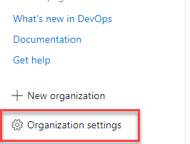
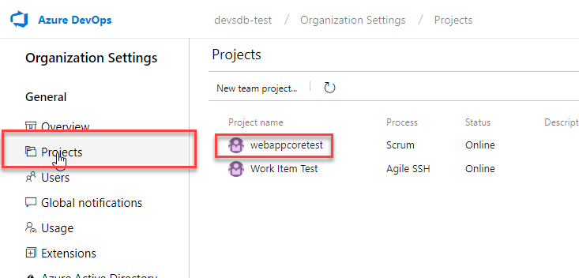

# Run Git commands in a script

[!INCLUDE [temp](../_shared/version.md)]

::: moniker range="<= tfs-2018"
[!INCLUDE [temp](../_shared/concept-rename-note.md)]
::: moniker-end

For some workflows you need your build pipeline to run Git commands. For example, after a CI build on a feature branch is done, the team might want to merge the branch to master.

Git is available on [Microsoft-hosted agents](../agents/hosted.md) and on [on-premises agents](../agents/agents.md).


<a name="enable"></a>
## Enable scripts to run Git commands

### Grant version control permissions to the build service

Go to the <a data-toggle="collapse" href="#expando-version-control-permissions">Version Control control panel tab &#x25BC;</a>

<div class="collapse" id="expando-version-control-permissions">

<ul>
<li>Azure Repos: <code>https:&#x2F;&#x2F;dev.azure.com/{your-organization}/DefaultCollection/{your-project}/_admin/_versioncontrol</code></li>

<li>On-premises: <code>https:&#x2F;&#x2F;{your-server}:8080/tfs/DefaultCollection/{your-project}/_admin/_versioncontrol</code></li>
</ul>

<p></p>

<p>If you see this page, select the repo, and then click the link:</p>

<p></p>

<p></p>

</div>

On the **Version Control** tab, select the repository in which you want to run Git commands, and then select **Project Collection Build Service**. By default, this identity can read from the repo but cannot push any changes back to it.


Grant permissions needed for the Git commands you want to run. Typically you'll want to grant:

* **Branch creation:**  Allow
* **Contribute:**  Allow
* **Read:**  Inherited allow
* **Tag creation:**  Inherited allow

When you're done granting the permissions, make sure to click **Save changes**.

::: moniker range="< tfs-2018"

### Enable your pipeline to run command-line Git

On the [variables tab](../build/variables.md) set this variable:

| Name | Value |
|---|---|
| ```system.prefergit``` | ```true``` |

::: moniker-end

::: moniker range=">= tfs-2018"

### Allow scripts to access the system token

::: moniker-end

::: moniker range="azure-devops"

# [YAML](#tab/yaml)

Add a `checkout` section with `persistCredentials` set to `true`.

```yaml
steps:
- checkout: self
  persistCredentials: true
```

Learn more about [`checkout`](../yaml-schema.md#checkout).

# [Designer](#tab/designer)

On the [options tab](../build/options.md) select **Allow scripts to access OAuth token**.

---

::: moniker-end

::: moniker range="< azure-devops"

On the [options tab](../build/options.md) select **Allow scripts to access OAuth token**.

::: moniker-end

## Make sure to clean up the local repo

Certain kinds of changes to the local repository are not automatically cleaned up by the build pipeline. So make sure to:

* Delete local branches you create.
* Undo git config changes.

If you run into problems using an on-premises agent, make sure the repo is clean:

::: moniker range="azure-devops"

# [YAML](#tab/yaml)

Make sure `checkout` has `clean` set to `true`.

```yaml
steps:
- checkout: self
  clean: true
```

# [Designer](#tab/designer)

* On the [repository tab](../repos/pipeline-options-for-git.md#clean-the-local-repo-on-the-agent) set **Clean** to true.

---

::: moniker-end

::: moniker range="< azure-devops"

* On the [repository tab](../repos/pipeline-options-for-git.md#clean-the-local-repo-on-the-agent) set **Clean** to true.

* On the [variables tab](../build/variables.md) create or modify the ```Build.Clean``` variable and set it to ```source```

::: moniker-end

## Examples


### List the files in your repo

::: moniker range="< tfs-2018"
Make sure to follow the above steps to [enable Git](#enable).
::: moniker-end

On the [build tab](../tasks/index.md) add this task:

| Task | Arguments |
| ---- | --------- |
| <br/>[Utility: Command Line](../tasks/utility/command-line.md)<br />List the files in the Git repo. | **Tool**: `git`<br /><br />**Arguments**: `ls-files` |

### Merge a feature branch to master

You want a CI build to merge to master if the build succeeds.

::: moniker range="< tfs-2018"
Make sure to follow the above steps to [enable Git](#enable).
::: moniker-end

On the [Triggers tab](../build/triggers.md) select **Continuous integration (CI)** and include the branches you want to build.

Create ```merge.bat``` at the root of your repo:

```bat
@echo off
ECHO SOURCE BRANCH IS %BUILD_SOURCEBRANCH%
IF %BUILD_SOURCEBRANCH% == refs/heads/master (
   ECHO Building master branch so no merge is needed.
   EXIT
)
SET sourceBranch=origin/%BUILD_SOURCEBRANCH:refs/heads/=%
ECHO GIT CHECKOUT MASTER
git checkout master
ECHO GIT STATUS
git status
ECHO GIT MERGE
git merge %sourceBranch% -m "Merge to master"
ECHO GIT STATUS
git status
ECHO GIT PUSH
git push origin
ECHO GIT STATUS
git status
```

On the [build tab](../tasks/index.md) add this as the last task:

| Task | Arguments |
| ---- | --------- |
| <br/>[Utility: Batch Script](../tasks/utility/batch-script.md)<br />Run merge.bat. | **Path**: `merge.bat` |

## Q & A

<!-- BEGINSECTION class="md-qanda" -->

### Can I run Git commands if my remote repo is in GitHub or another Git service such as Bitbucket Cloud?

Yes

### Which tasks can I use to run Git commands?

[Batch Script](../tasks/utility/batch-script.md)

[Command Line](../tasks/utility/command-line.md)

[PowerShell](../tasks/utility/powershell.md)

[Shell Script](../tasks/utility/shell-script.md)


### How do I avoid triggering a CI build when the script pushes?

::: moniker range="<= azure-devops-2019"

Add ```***NO_CI***``` to your commit message. Here are examples:
* ```git commit -m "This is a commit message ***NO_CI***"```
* ```git merge origin/features/hello-world -m "Merge to master ***NO_CI***"```

::: moniker-end

::: moniker range="> azure-devops-2019"

Add `[skip ci]` to your commit message or description. Here are examples:
* ```git commit -m "This is a commit message [skip ci]"```
* ```git merge origin/features/hello-world -m "Merge to master [skip ci]"```

You can also use any of the variations below. This is supported for commits to Azure Repos Git, Bitbucket Cloud, GitHub, and GitHub Enterprise Server.

- `[skip ci]` or `[ci skip]`
- `skip-checks: true` or `skip-checks:true`
- `[skip azurepipelines]` or `[azurepipelines skip]`
- `[skip azpipelines]` or `[azpipelines skip]`
- `[skip azp]` or `[azp skip]`
- `***NO_CI***`

::: moniker-end

::: moniker range="< tfs-2018"

### How does enabling scripts to run Git commands affect how the build pipeline gets build sources?

When you set ```system.prefergit``` to ```true```, the build pipeline uses command-line Git instead of LibGit2Sharp to clone or fetch the source files.

::: moniker-end

[!INCLUDE [temp](../_shared/qa-agents.md)]

::: moniker range="< azure-devops"
[!INCLUDE [temp](../_shared/qa-versions.md)]
::: moniker-end

<!-- ENDSECTION -->
