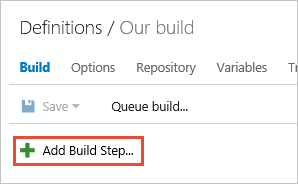
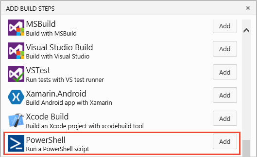
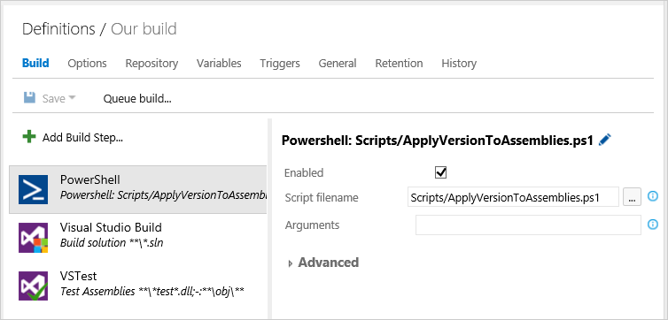
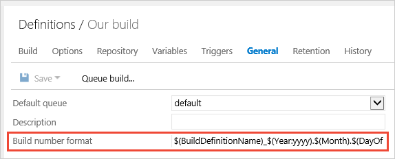

# Use a PowerShell script to customize your build pipeline

**Azure Pipelines | TFS 2018 | TFS 2017 | TFS 2015 | [Previous versions (XAML builds)](https://msdn.microsoft.com/library/dn376353%28v=vs.120%29.aspx)**

::: moniker range="<= tfs-2018"
[!INCLUDE [temp](../_shared/concept-rename-note.md)]
::: moniker-end

When you are ready to move beyond the basics of compiling and testing your code, use a PowerShell script to add your team's business logic to your build pipeline.

You can run a PowerShell Script on a [Windows build agent](../agents/v2-windows.md).

0. Push your script into your repo.

0. Add a PowerShell build task.

 

 

0. Drag the build task where you want it to run.

0. Specify the name of the script.

## Example: Version your assemblies

For example, to version to your assemblies, copy and upload this script to your project:

```ps
##-----------------------------------------------------------------------
## <copyright file="ApplyVersionToAssemblies.ps1">(c) Microsoft Corporation. This source is subject to the Microsoft Permissive License. See http://www.microsoft.com/resources/sharedsource/licensingbasics/sharedsourcelicenses.mspx. All other rights reserved.</copyright>
##-----------------------------------------------------------------------
# Look for a 0.0.0.0 pattern in the build number.
# If found use it to version the assemblies.
#
# For example, if the 'Build number format' build pipeline parameter 
# $(BuildDefinitionName)_$(Year:yyyy).$(Month).$(DayOfMonth)$(Rev:.r)
# then your build numbers come out like this:
# "Build HelloWorld_2013.07.19.1"
# This script would then apply version 2013.07.19.1 to your assemblies.
	
# Enable -Verbose option
[CmdletBinding()]
	
# Regular expression pattern to find the version in the build number 
# and then apply it to the assemblies
$VersionRegex = "\d+\.\d+\.\d+\.\d+"
	
# If this script is not running on a build server, remind user to 
# set environment variables so that this script can be debugged
if(-not ($Env:BUILD_SOURCESDIRECTORY -and $Env:BUILD_BUILDNUMBER))
{
	Write-Error "You must set the following environment variables"
	Write-Error "to test this script interactively."
	Write-Host '$Env:BUILD_SOURCESDIRECTORY - For example, enter something like:'
	Write-Host '$Env:BUILD_SOURCESDIRECTORY = "C:\code\FabrikamTFVC\HelloWorld"'
	Write-Host '$Env:BUILD_BUILDNUMBER - For example, enter something like:'
	Write-Host '$Env:BUILD_BUILDNUMBER = "Build HelloWorld_0000.00.00.0"'
	exit 1
}
	
# Make sure path to source code directory is available
if (-not $Env:BUILD_SOURCESDIRECTORY)
{
	Write-Error ("BUILD_SOURCESDIRECTORY environment variable is missing.")
	exit 1
}
elseif (-not (Test-Path $Env:BUILD_SOURCESDIRECTORY))
{
	Write-Error "BUILD_SOURCESDIRECTORY does not exist: $Env:BUILD_SOURCESDIRECTORY"
	exit 1
}
Write-Verbose "BUILD_SOURCESDIRECTORY: $Env:BUILD_SOURCESDIRECTORY"
	
# Make sure there is a build number
if (-not $Env:BUILD_BUILDNUMBER)
{
	Write-Error ("BUILD_BUILDNUMBER environment variable is missing.")
	exit 1
}
Write-Verbose "BUILD_BUILDNUMBER: $Env:BUILD_BUILDNUMBER"
	
# Get and validate the version data
$VersionData = [regex]::matches($Env:BUILD_BUILDNUMBER,$VersionRegex)
switch($VersionData.Count)
{
   0		
      { 
         Write-Error "Could not find version number data in BUILD_BUILDNUMBER."
         exit 1
      }
   1 {}
   default 
      { 
         Write-Warning "Found more than instance of version data in BUILD_BUILDNUMBER." 
         Write-Warning "Will assume first instance is version."
      }
}
$NewVersion = $VersionData[0]
Write-Verbose "Version: $NewVersion"
	
# Apply the version to the assembly property files
$files = gci $Env:BUILD_SOURCESDIRECTORY -recurse -include "*Properties*","My Project" | 
	?{ $_.PSIsContainer } | 
	foreach { gci -Path $_.FullName -Recurse -include AssemblyInfo.* }
if($files)
{
	Write-Verbose "Will apply $NewVersion to $($files.count) files."
	
	foreach ($file in $files) {
		$filecontent = Get-Content($file)
		attrib $file -r
		$filecontent -replace $VersionRegex, $NewVersion | Out-File $file
		Write-Verbose "$file.FullName - version applied"
	}
}
else
{
	Write-Warning "Found no files."
}
```

Add the build task to your build pipeline.



Specify your build number with something like this:



```
$(BuildDefinitionName)_$(Year:yyyy).$(Month).$(DayOfMonth)$(Rev:.r)
```

<a name="oauth"></a>
## Use the OAuth token to access the REST API

To enable your script to use the build pipeline OAuth token, go to the **Options** tab of the build pipeline and select **Allow Scripts to Access OAuth Token**.

After you've done that, your script can use to SYSTEM_ACCESSTOKEN environment variable to access the [Azure Pipelines REST API](../../integrate/index.md). For example:

```ps
$url = "$($env:SYSTEM_TEAMFOUNDATIONCOLLECTIONURI)$env:SYSTEM_TEAMPROJECTID/_apis/build/definitions/$($env:SYSTEM_DEFINITIONID)?api-version=5.0"
Write-Host "URL: $url"
$pipeline = Invoke-RestMethod -Uri $url -Headers @{
    Authorization = "Bearer $env:SYSTEM_ACCESSTOKEN"
}
Write-Host "Pipeline = $($pipeline | ConvertTo-Json -Depth 100)"
```


## Q&A
<!-- BEGINSECTION class="md-qanda" -->


### What variables are available for me to use in my scripts?

[Use variables](../build/variables.md)

[!INCLUDE [include](../_shared/variable-set-in-script-qa.md)]

### Which branch of the script does the build run?

The build runs the script same branch of the code you are building.

### What kinds of parameters can I use?

You can use named parameters. Other kinds of parameters, such as switch parameters, are not yet supported and will cause errors.

::: moniker range="< azure-devops"
[!INCLUDE [temp](../_shared/qa-versions.md)]
::: moniker-end

<!-- ENDSECTION -->
