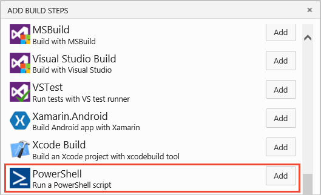
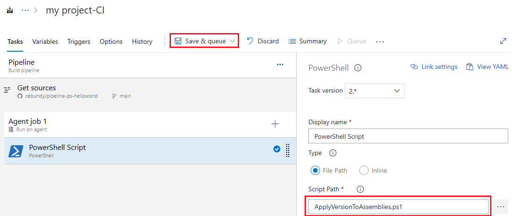

---
title: Use PowerShell scripts to customize pipelines
ms.custom: seodec18
description: Learn how you can use a script to customize your pipeline
ms.topic: conceptual
ms.assetid: 7D184F55-18BC-40E5-8BE7-283A0DB8E823
ms.date: 02/11/2021
monikerRange: '>= tfs-2015'
---

# Use a PowerShell script to customize your pipeline

**Azure Pipelines | TFS 2018 | TFS 2017 | TFS 2015 | [Previous versions (XAML builds)](/previous-versions/visualstudio/visual-studio-2013/dn376353(v=vs.120))**

::: moniker range="<= tfs-2018"
[!INCLUDE [temp](../includes/concept-rename-note.md)]
::: moniker-end

When you are ready to move beyond the basics of compiling and testing your code, use a PowerShell script to add your team's business logic to your build pipeline.

::: moniker range=">= azure-devops-2019"
## Add a PowerShell script
### [YAML](#tab/yaml)

The syntax for including PowerShell Core is slightly different from the syntax for Windows PowerShell. You can run Windows PowerShell on a [Windows build agent](../agents/v2-windows.md).
PowerShell Core runs on any platform. 

1. Push your PowerShell script to your repo.

2. Add a `pwsh` or `powershell` step. The `pwsh` keyword is a shortcut for the [PowerShell task](../tasks/utility/powershell.md) for PowerShell Core. The `powershell` keyword is another shortcut for the [PowerShell task](../tasks/utility/powershell.md) but Windows PowerShell and will only work on a Windows agent.

```yaml
# for PowerShell Core
steps:
- pwsh: ./my-script.ps1

# for Windows PowerShell
steps:
- powershell: .\my-script.ps1
```

### [Classic](#tab/classic)

1. Add the PowerShell Script task to your pipeline. The same [PowerShell task](../tasks/utility/powershell.md) works for PowerShell Core and Windows PowerShell. 

    :::image type="content" source="media/powershell-script.png" alt-text="Add the PowerShell task.":::

2. Add your file to the **Script Path**. 
    
    :::image type="content" source="media/powershell-update-script-path.png" alt-text="Add the script path.":::

---
::: moniker-end

::: moniker range="< azure-devops-2019"

You can run Windows PowerShell Script on a [Windows build agent](../agents/v2-windows.md).

1. Push your script into your repo.

2. Add a PowerShell build task.

   

   

3. Drag the build task where you want it to run.

4. Specify the name of the script.

::: moniker-end

## Example PowerShell script: version assemblies

Here's an example script to version your assemblies. For the script to run successfully, you'll need to update your build number to use a format with four periods (example: `$(BuildDefinitionName)_$(Year:yyyy).$(Month).$(DayOfMonth)$(Rev:.r)`). Build number can also be referred to as run number.

### [YAML](#tab/yaml)

You can [customize your build number](../process/run-number.md) within a YAML pipeline with the `name` property. 

```yaml
name: $(BuildDefinitionName)_$(Year:yyyy).$(Month).$(DayOfMonth)$(Rev:.r)

pool:
  vmImage: windows-latest

steps:
- script: echo $(Build.BuildNumber) //output updated build number
```
#### [Classic](#tab/classic)

1. To customize your build number in a classic pipeline, first add the build task to your pipeline. 

    

2. Next, specify your build number.

    

---

```ps
# If found use it to version the assemblies.
#
# For example, if the 'Build number format' build pipeline parameter 
# $(BuildDefinitionName)_$(Year:yyyy).$(Month).$(DayOfMonth)$(Rev:.r)
# then your build numbers come out like this:
# "Build HelloWorld_2013.07.19.1"
# This script would then apply version 2013.07.19.1 to your assemblies.
	
# Enable -Verbose option
[CmdletBinding()]
	
# Regular expression pattern to find the version in the build number 
# and then apply it to the assemblies
$VersionRegex = "\d+\.\d+\.\d+\.\d+"
	
# If this script is not running on a build server, remind user to 
# set environment variables so that this script can be debugged
if(-not ($Env:BUILD_SOURCESDIRECTORY -and $Env:BUILD_BUILDNUMBER))
{
	Write-Error "You must set the following environment variables"
	Write-Error "to test this script interactively."
	Write-Host '$Env:BUILD_SOURCESDIRECTORY - For example, enter something like:'
	Write-Host '$Env:BUILD_SOURCESDIRECTORY = "C:\code\FabrikamTFVC\HelloWorld"'
	Write-Host '$Env:BUILD_BUILDNUMBER - For example, enter something like:'
	Write-Host '$Env:BUILD_BUILDNUMBER = "Build HelloWorld_0000.00.00.0"'
	exit 1
}
	
# Make sure path to source code directory is available
if (-not $Env:BUILD_SOURCESDIRECTORY)
{
	Write-Error ("BUILD_SOURCESDIRECTORY environment variable is missing.")
	exit 1
}
elseif (-not (Test-Path $Env:BUILD_SOURCESDIRECTORY))
{
	Write-Error "BUILD_SOURCESDIRECTORY does not exist: $Env:BUILD_SOURCESDIRECTORY"
	exit 1
}
Write-Verbose "BUILD_SOURCESDIRECTORY: $Env:BUILD_SOURCESDIRECTORY"
	
# Make sure there is a build number
if (-not $Env:BUILD_BUILDNUMBER)
{
	Write-Error ("BUILD_BUILDNUMBER environment variable is missing.")
	exit 1
}
Write-Verbose "BUILD_BUILDNUMBER: $Env:BUILD_BUILDNUMBER"
	
# Get and validate the version data
$VersionData = [regex]::matches($Env:BUILD_BUILDNUMBER,$VersionRegex)
switch($VersionData.Count)
{
   0		
      { 
         Write-Error "Could not find version number data in BUILD_BUILDNUMBER."
         exit 1
      }
   1 {}
   default 
      { 
         Write-Warning "Found more than instance of version data in BUILD_BUILDNUMBER." 
         Write-Warning "Will assume first instance is version."
      }
}
$NewVersion = $VersionData[0]
Write-Verbose "Version: $NewVersion"
	
# Apply the version to the assembly property files
$files = gci $Env:BUILD_SOURCESDIRECTORY -recurse -include "*Properties*","My Project" | 
	?{ $_.PSIsContainer } | 
	foreach { gci -Path $_.FullName -Recurse -include AssemblyInfo.* }
if($files)
{
	Write-Verbose "Will apply $NewVersion to $($files.count) files."
	
	foreach ($file in $files) {
		$filecontent = Get-Content($file)
		attrib $file -r
		$filecontent -replace $VersionRegex, $NewVersion | Out-File $file
		Write-Verbose "$file.FullName - version applied"
	}
}
else
{
	Write-Warning "Found no files."
}
```

<a name="oauth"></a>

## Example PowerShell script: access REST API

In this example, you'll use the `SYSTEM_ACCESSTOKEN` variable to access the [Azure Pipelines REST API](../../integrate/index.md). 

#### [YAML](#tab/yaml)

You can use `$env:SYSTEM_ACCESSTOKEN` in your script in a YAML pipeline to access the OAuth token. 

```yaml
- task: PowerShell@2
  inputs:
    targetType: 'inline'
    script: |
      $url = "$($env:SYSTEM_TEAMFOUNDATIONCOLLECTIONURI)$env:SYSTEM_TEAMPROJECTID/_apis/build/definitions/$($env:SYSTEM_DEFINITIONID)?api-version=5.0"
              Write-Host "URL: $url"
              $pipeline = Invoke-RestMethod -Uri $url -Headers @{
                  Authorization = "Bearer $env:SYSTEM_ACCESSTOKEN"
              }
              Write-Host "Pipeline = $($pipeline | ConvertTo-Json -Depth 100)"
  env:
     SYSTEM_ACCESSTOKEN: $(System.AccessToken)
```


#### [Classic](#tab/classic)

To enable your script to use the build process OAuth token, go to the **Tasks** tab of the build definition and within your build phase, select **Allow Scripts to Access OAuth Token**, which is located in the **Additional options** section.

After you've done that, your script can use to SYSTEM_ACCESSTOKEN environment variable to access the [Azure Pipelines REST API](../../integrate/index.md). For example:

```ps
$url = "$($env:SYSTEM_TEAMFOUNDATIONCOLLECTIONURI)$env:SYSTEM_TEAMPROJECTID/_apis/build/definitions/$($env:SYSTEM_DEFINITIONID)?api-version=5.0"
Write-Host "URL: $url"
$pipeline = Invoke-RestMethod -Uri $url -Headers @{
    Authorization = "Bearer $env:SYSTEM_ACCESSTOKEN"
}
Write-Host "Pipeline = $($pipeline | ConvertTo-Json -Depth 100)"
```


--- 


## FAQ
<!-- BEGINSECTION class="md-qanda" -->


### What variables are available for me to use in my scripts?

You can use [predefined variables](../build/variables.md) in your scripts. For more information on available variables and how to use them, see [Use predefined variables](../build/variables.md).

[!INCLUDE [include](../includes/variable-set-in-script-qa.md)]

### Which branch of the script does the build run?

The build will use the active branch of your code. If your pipeline run uses the `main` branch, your script will also use the `main` branch. 
### What kinds of parameters can I use?

You can use named parameters. Other kinds of parameters, such as switch parameters, aren't supported. You'll see errors if you try to use switch parameters. 

::: moniker range="< azure-devops"
[!INCLUDE [temp](../includes/qa-versions.md)]
::: moniker-end

<!-- ENDSECTION -->