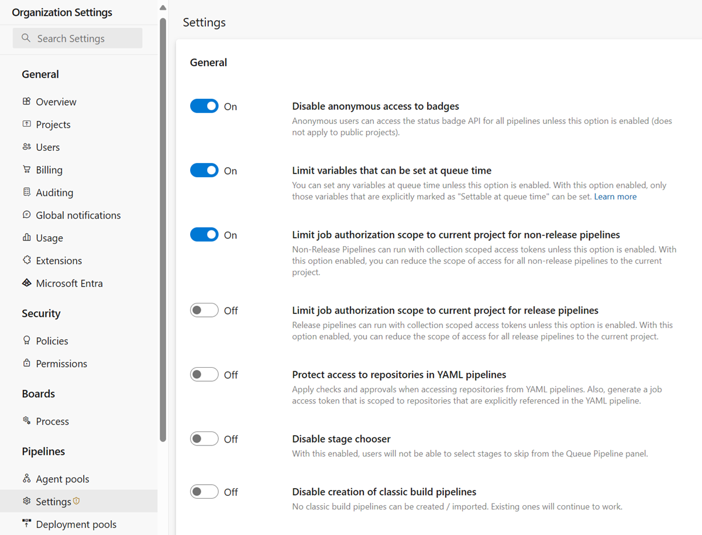

# Recommendations to securely structure projects in your pipeline

Beyond the scale of individual resources, you should also consider groups of resources.
In Azure DevOps, resources are grouped by team projects.
It's important to understand what resources your pipeline can access based on project settings and containment.

Every job in your pipeline receives an access token. This token has permissions to read open resources.
In some cases, pipelines might also update those resources.
In other words, your user account might not have access to a certain resource, but scripts and tasks that run in your pipeline might have access to that resource.
The security model in Azure DevOps also allows access to these resources from other projects in the organization.
If you choose to shut off pipeline access to some of these resources, then your decision applies to all pipelines in a project.
A specific pipeline can't be granted access to an open resource.

## Separate projects

Given the nature of open resources, you should consider managing each product and team in a separate project.
This practice ensures that a pipeline from one product can't access open resources from another product. 
In this way, you prevent lateral exposure.
When multiple teams or products share a project, you can't granularly isolate their resources from one another.

If your Azure DevOps organization was created before August 2019, then runs might be able to access open resources in all of your organization's projects.
Your organization administrator must review a key security setting in Azure Pipelines that enables project isolation for pipelines.
You can find this setting at **Azure DevOps** > **Organization settings** > **Pipelines** > **Settings**. Or go directly to this Azure DevOps location: *https:\//dev.azure.com/ORG-NAME/_settings/pipelinessettings*.

## Next steps

After you've set up the right project structure, enhance runtime security by using [templates](templates.md).
