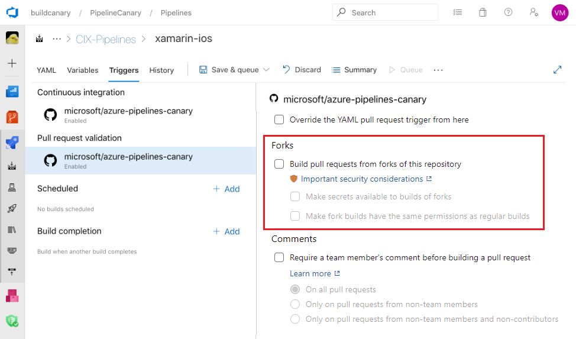

# Repository protection

Source code, the pipeline's YAML file, and necessary scripts & tools are all stored in a version control repository.
Permissions and branch policies must be employed to ensure changes to the code and pipeline are safe. You can also [add pipeline permissions and checks to repositories](../process/repository-resource.md).  

Also, you should review [default access control](../../organizations/security/default-git-permissions.md) for repositories.

Because of Git's design, protection at a branch level will only carry you so far.
Users with push access to a repo can usually create new branches.
If you use GitHub open-source projects, anyone with a GitHub account can fork your repository and propose contributions back.
Since pipelines are associated with a repository and not with specific branches, you must assume the code and YAML files are untrusted. 

## Forks

If you build public repositories from GitHub, you must consider your stance on fork builds.
Forks are especially dangerous since they come from outside your organization.
To protect your products from contributed code, consider the following recommendations.

> [!NOTE]
> The following recommendations apply primarily to building public repos from GitHub.

### Don't provide secrets to fork builds

By default, your pipelines do not build forks.
If you decide to build forks, secrets and protected resources are not made available to the jobs in those pipelines by default.
Don't turn off this latter protection.

> [!NOTE]
> Even if you enable fork builds to access secrets, Azure Pipelines restricts the access token used for fork builds.
> It has more limited access to open resources than a normal access token.
> You cannot disable this protection.

### Consider manually triggering fork builds

You can turn off automatic fork builds and instead use pull request comments as a way to manually building these contributions.
This setting will give you an opportunity to review the code before triggering a build.

### Use Microsoft-hosted agents for fork builds

Don't run builds from forks on self-hosted agents.
By doing so, you are effectively providing a path to external organizations to run outside code on machines inside your corporate network.
Use Microsoft-hosted agents or some form of network isolation for your self-hosted agents.

## User branches

Users in your organization with the right permissions can create new branches containing new or updated code.
That code can run through the same pipeline as your protected branches.
Further, if the YAML file in the new branch is changed, then the updated YAML will be used to run the pipeline.
While this design allows for great flexibility and self-service, not all changes are safe (whether made maliciously or not).

If your pipeline consumes source code or is defined in Azure Repos, you must fully understand the [Azure Repos permissions model](../../organizations/security/permissions.md#git-repository-object-level).
In particular, a user with **Create Branch** permission at the repository level can introduce code to the repo even if that user lacks **Contribute** permission.

<!-- Coming Q1 CY20
One way to solve this problem is by keeping the YAML file for your pipeline in a different repository than your source code.
By keeping the YAML file in a separate repository, you can prevent unapproved contributors from making changes to the YAML file.
This can apply to a public project (with a separate private repo) as well as a non-public project.
-->

## Next steps

Next, learn about the more protection offered by checks on [protected resources](resources.md).
