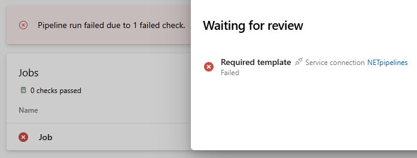
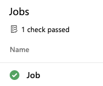

# Security through templates

[Checks on protected resources](resources.md) are the basic building block of security for Azure Pipelines.
Checks work no matter the structure - the stages and jobs - of your pipeline.
If several pipelines in your team or organization have the same structure, you can further simplify security using [templates](../process/templates.md).

Azure Pipelines offers two kinds of templates: **includes** and **extends**.
Included templates behave like `#include` in C++: it's as if you paste the template's code right into the outer file, which references it.
To continue the C++ metaphor, `extends` templates are more like inheritance: the template provides the outer structure of the pipeline and a set of places where the template consumer can make targeted alterations.

## Use extends templates

For the most secure pipelines, we recommend starting with `extends` templates.
By providing the outer structure, a template can prevent malicious code from getting into your pipeline.
You can still use `includes`, both in the template and in the final pipeline, to factor out common pieces of configuration.
To use an extends template, your pipeline might look like the below example.

```yaml
# template.yml
parameters:
- name: usersteps
  type: stepList
  default: []
steps:
- ${{ each step in parameters.usersteps }}:
  - ${{ step }}
```

```yaml
# azure-pipelines.yml
resources:
  repositories:
  - repository: templates
    type: git
    name: MyProject/MyTemplates
    ref: refs/tags/v1

extends:
  template: template.yml@templates
  parameters:
    usersteps:
    - script: echo This is my first step
    - script: echo This is my second step
```

When you set up `extends` templates, consider anchoring them to a particular Git branch or tag.
That way, if breaking changes need to be made, existing pipelines won't be affected.
The examples above use this feature. 

## Security features enforced through YAML

There are several protections built into the YAML syntax, and an extends template can enforce the usage of any or all of them.

### Step targets
Restrict some steps to run in a container instead of the host.
Without access to the agent's host, user steps can't modify agent configuration or leave malicious code for later execution.
Run code on the host first to make the container more secure.
For instance, we recommend limiting access to network.
Without open access to the network, user steps will be unable to access packages from unauthorized sources, or upload code and secrets to a network location.

```yaml
resources:
  containers:
  - container: builder
    image: mysecurebuildcontainer:latest
steps:
- script: echo This step runs on the agent host, and it could use docker commands to tear down or limit the container's network
- script: echo This step runs inside the builder container
  target: builder
```

### Agent logging command restrictions

Restrict what services the Azure Pipelines agent will provide to user steps.
Steps request services using "logging commands" (specially formatted strings printed to stdout).
In restricted mode, most of the agent's services such as uploading artifacts and attaching test results are unavailable.

```yaml
# this task will fail because its `target` property instructs the agent not to allow publishing artifacts
- task: PublishBuildArtifacts@1
  inputs:
    artifactName: myartifacts
  target:
    commands: restricted
```

One of the commands still allowed in restricted mode is the `setvariable` command. Because pipeline variables are exported as environment variables to subsequent tasks, tasks that output user-provided data (for example, the contents of open issues retrieved from a REST API) can be vulnerable to injection attacks. Such user content can set environment variables that can in turn be used to exploit the agent host. To disallow this, pipeline authors can explicitly declare which variables are settable via the `setvariable` logging command. Specifying an empty list disallows setting all variables. 

```yaml
# this task will fail because the task is only allowed to set the 'expectedVar' variable, or a variable prefixed with "ok"
- task: PowerShell@2
  target:
    commands: restricted
    settableVariables:
    - expectedVar
    - ok*
  inputs:
    targetType: 'inline'
    script: |
      Write-Host "##vso[task.setvariable variable=BadVar]myValue"
```

### Conditional insertion of stages or jobs

Restrict stages and jobs to run under specific conditions.
Conditions can help, for example, to ensure that you are only building certain branches.

```yaml
jobs:
- job: buildNormal
  steps:
  - script: echo Building the normal, unsensitive part
- ${{ if eq(variables['Build.SourceBranchName'], 'refs/heads/main') }}:
  - job: buildMainOnly
    steps:
    - script: echo Building the restricted part that only builds for main branch
```

### Require certain syntax with extends templates

Templates can iterate over and alter/disallow any YAML syntax.
Iteration can force the use of particular YAML syntax including the above features.

A template can rewrite user steps and only allow certain approved tasks to run.
You can, for example, prevent inline script execution.

> [!WARNING]
> In the example below, only the literal step type "script" is prevented.
> For full lockdown of ad-hoc scripts, you would also need to block "bash", "pwsh", "powershell", and the tasks which back these steps.

```yaml
# template.yml
parameters:
- name: usersteps
  type: stepList
  default: []
steps:
- ${{ each step in parameters.usersteps }}:
  - ${{ each pair in step }}:
    ${{ if ne(pair.key, 'script') }}:
      ${{ pair.key }}: ${{ pair.value }}
```

```yaml
# azure-pipelines.yml
extends:
  template: template.yml
  parameters:
    usersteps:
    - task: MyTask@1
    - script: echo This step will be stripped out and not run!
    - task: MyOtherTask@2
```

### Type-safe parameters

Templates and their parameters are turned into constants before the pipeline runs.
Template parameters provide type safety to input parameters.
For instance, it can restrict which pools can be used in a pipeline by offering an enumeration of possible options rather than a freeform string.

```yaml
# template.yml
parameters:
- name: userpool
  type: string
  default: Azure Pipelines
  values:
  - Azure Pipelines
  - private-pool-1
  - private-pool-2

pool: ${{ parameters.userpool }}
steps:
- script: # ... removed for clarity
```

```yaml
# azure-pipelines.yml
extends:
  template: template.yml
  parameters:
    userpool: private-pool-1
```

### Set required templates

To require that a specific template gets used, you can set the [required template check](../process/approvals.md#required-template) for a resource or environment. The required template check can be used when extending from a template. 

You can check on the status of a check when viewing a pipeline job. When a pipeline doesn't extend from the require template, the check will fail and the run will stop. You will see that your check failed. 

   > [!div class="mx-imgBorder"]
   > 

When the required template is used, you'll see that your check passed.

   > [!div class="mx-imgBorder"]
   > 


Here the template `params.yml` is required with an approval on the resource. To trigger the pipeline to fail, comment out the reference to `params.yml`. 

```yaml
# params.yml
parameters:
- name: yesNo 
  type: boolean
  default: false
- name: image
  displayName: Pool Image
  type: string
  default: ubuntu-latest
  values:
  - windows-latest
  - vs2017-win2016
  - ubuntu-latest
  - ubuntu-16.04
  - macOS-latest
  - macOS-10.14

steps:
- script: echo ${{ parameters.yesNo }}
- script: echo ${{ parameters.image }}
```

```yaml
# azure-pipeline.yml

resources:
 containers:
     - container: my-container
       endpoint: my-service-connection
       image: mycontainerimages

extends:
    template: params.yml
    parameters:
        yesNo: true
        image: 'windows-latest'

```

### Additional steps

A template can add steps without the pipeline author having to include them.
These steps can be used to run credential scanning or static code checks.

```yaml
# template to insert a step before and after user steps in every job
parameters:
  jobs: []

jobs:
- ${{ each job in parameters.jobs }}: # Each job
  - ${{ each pair in job }}:  # Insert all properties other than "steps"
      ${{ if ne(pair.key, 'steps') }}:
        ${{ pair.key }}: ${{ pair.value }}
    steps:                            # Wrap the steps
    - task: CredScan@1                # Pre steps
    - ${{ job.steps }}                # Users steps
    - task: PublishMyTelemetry@1      # Post steps
      condition: always()
```

<!-- Coming Q1 CY20
## Template enforcement
A template is only a security mechanism if you can enforce it.
The control point to enforce use of templates is once again a protected resource.
Configure a template check on your agent pool or other protected resource.
This check will fail if your pipeline does not extend the required template and will prevent access to that resource.
-->

## Next steps

Next, learn about taking inputs safely through [variables and parameters](inputs.md).
