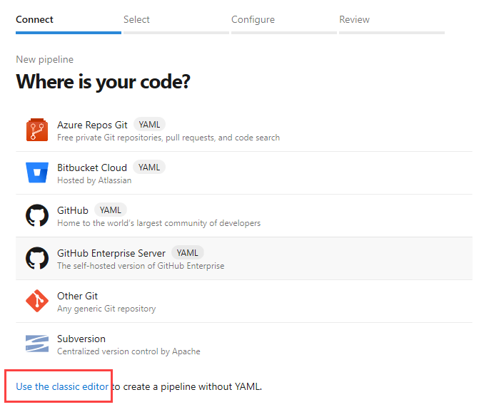

# Prepare data, train, deploy, and monitor machine learning models with Azure Pipelines

[!INCLUDE [include](../includes/version-team-services.md)]

You can use a pipeline to automate the machine learning lifecycle. Some of the operations you can automate are:

* Data preparation (extract, transform, load operations)
* Training machine learning models with on-demand scale-out and scale-up
* Deployment of machine learning models as public or private web services
* Monitoring deployed machine learning models (such as for performance or data-drift analysis)

This article will teach you how to create an Azure Pipeline that builds and deploys a machine learning model as a web service.

## Prerequisites

Before you read this topic, you should understand [how the Azure Machine Learning service works](/azure/machine-learning/service/concept-azure-machine-learning-architecture).

Follow the steps in [Azure Machine Learning quickstart: portal](/azure/machine-learning/service/setup-create-workspace) to create a workspace.

## Get the code

[!INCLUDE [include](../ecosystems/includes/get-code-before-sample-repo.md)]

```
https://github.com/MicrosoftDocs/pipelines-azureml
```

This sample includes a file _diabetes-train-and-deploy.yml_ in the directory _pipelines/_.

## Sign in to Azure Pipelines

[!INCLUDE [include](../ecosystems/includes/sign-in-azure-pipelines.md)]

[!INCLUDE [include](../ecosystems/includes/create-project.md)]

## Create the pipeline

You can use 1 of the following approach to create a new pipeline.

#### [YAML](#tab/yaml/)

[!INCLUDE [include](../ecosystems/includes/create-pipeline-before-template-selected.md)]

When your new pipeline appears:

1. Replace `myresourcegroup` with the name of the Azure resource group that contains your Azure Machine Learning service workspace.

2. Replace `myworkspace` with the name of your Azure Machine Learning service workspace.

3. When you're ready, select **Save and run**.

4. You're prompted to commit your changes to the _diabetes-train-and-deploy.yml_ file in your repository. After you're happy with the message, select **Save and run** again.

   If you want to watch your pipeline in action, select the build job.

You now have a YAML pipeline in your repository that's ready to train your model!

#### [Classic](#tab/classic/)
To create a pipeline in the classic editor, use our template so that you automatically get all the tasks and variables you need.

1. Go to **Pipelines**, and then select **New Pipeline**.

1. Select **Use the classic editor** to create a pipeline without YAML.

   

1. Walk through the steps of the wizard by first selecting **GitHub** as the location of your source code.

1. Select the **Machine Learning Model** template and then select **Apply**.

1. On the **Tasks** tab, under **Parameters**, select your Azure subscription.

1. Select the **Variables** tab, and then set the following variables:

   |Variables  |Description  |
   |---------|---------|
   |resourceGroupName     | Name of an existing resource group|
   |workspaceName     | Name of the workspace (will be created if it doesn't already exist) |
   |runConfig     | Name of the runconfig file (the text before *.runconfig if you're looking at your file system). Sample [here](https://github.com/MicrosoftDocs/pipelines-azureml/blob/master/examples/runconfigs/sklearn.runconfig)|
   |modelAssetPath     | The cloud path where the experiment run stores the model file. This path is the directory from which the score.py file loads the model. This path may either be the root folder of all model files or the full path of the model file itself, depending on how score.py loads it|
   |modelName     | Name of model to register. This name must be the same one used in score.py to load models|
   |serviceName     | Name of the service to be deployed (will be overwritten if already present)|
   |inferenceConfigFile      | Path to a JSON or YAML file containing inference configuration. Sample [here](https://github.com/MicrosoftDocs/pipelines-azureml/blob/master/models/diabetes/config/inference-config.yml)|
   |deploymentConfigFile     |  Path to a JSON or YAML file containing deployment metadata. Sample [here](https://nam06.safelinks.protection.outlook.com/?url=https%3A%2F%2Fmsdata.visualstudio.com%2FVienna%2F_git%2FAzureMlCli%3Fpath%3D%252Fsrc%252Fazure-cli-ml%252Ftests%252Fo16n_unit_tests%252Fdata%252FAksDeployConfig.yml%26version%3DGBmaster&data=01%7C01%7Cv-srmar%40microsoft.com%7C73ff3ab12e664f0c9e8a08d6cf9d4ecc%7C72f988bf86f141af91ab2d7cd011db47%7C1&sdata=AQS2lpDU97igwSw7zRO%2FAqJLalVhvHvHxBogByRsgoE%3D&reserved=0)|
   |aksComputeName     | Name of the existing AKS|

1. Select **Save & queue**. If you want to watch your pipeline in action, select the build job.

You now have a pipeline that's ready to train your model!

* * *
## Azure Machine Learning service automation

There are two primary ways to use automation with the Azure Machine Learning service:

* The [Machine Learning CLI](/azure/machine-learning/service/reference-azure-machine-learning-cli) is an extension to the Azure CLI. It provides commands for working with the Azure Machine Learning service.
* The [Azure Machine Learning SDK](/python/api/overview/azure/ml/intro?view=azure-ml-py&preserve-view=true) is Python package that provides programmatic access to the Azure Machine Learning service.
   * The Python SDK includes [automated machine learning](/azure/machine-learning/service/concept-automated-ml) to help automating the time consuming, iterative tasks of machine learning model development. 

The example with this document uses the Machine Learning CLI.

## Planning

Before you use Azure Pipelines to automate model training and deployment, you must understand the files needed by the model and what indicates a "good" trained model.

### Machine learning files

In most cases, your data science team will provide the files and resources needed to train the machine learning model. In the example project, data scientists would provide these files:

* __Training script__ (`train.py`): The training script contains logic specific to the model that you're training.
* __Scoring file__ (`score.py`): When the model is deployed as a web service, the scoring file receives data from clients and scores it against the model. The output is then returned to the client.
* __RunConfig settings__ (`sklearn.runconfig`): Defines how the training script is run on the compute target that is used for training.
* __Training environment__ (`myenv.yml`): Defines the packages needed to run the training script.
* __Deployment environment__ (`deploymentConfig.yml`): Defines the resources and compute needed for the deployment environment.
* __Deployment environment__ (`inferenceConfig.yml`): Defines the packages needed to run and score the model in the deployment environment.


Some of these files are directly used when developing a model. For example, the `train.py` and `score.py` files. However the data scientist may be programmatically creating the run configuration and environment settings. If so, they can create the `.runconfig` and training environment files, by using [RunConfiguration.save()](/python/api/azureml-core/azureml.core.runconfiguration?preserve-view=true&view=azure-ml-py#save-path-none--name-none--separate-environment-yaml-false-). Or, default run configuration files can be created for all compute targets already in the workspace by running the following command:

```azurecli
az ml folder attach --experiment-name myexp -w myws -g mygroup
```

The files created by this command are stored in the `.azureml` directory.

### Determine the best model

The example pipeline deploys the trained model without doing any performance checks. In a production scenario, you may want to log metrics so that you can determine the "best" model.

For example, you have a model that is already deployed and has an accuracy of 90. You train a new model based on new checkins to the repo, and the accuracy is only 80, so you don't want to deploy it. You can use a metric such as this to build automation logic, as you can directly rank different models. In other cases, you may have several metrics that are used to indicate the "best" model. In this case, choosing the best model requires human judgment. 

Depending on what "best" looks like for your scenario, you may need to create a [release pipeline](../release/index.md) where someone must inspect the metrics to determine if the model should be deployed.

To log metrics during training, use the [Run](/python/api/azureml-core/azureml.core.run.run?view=azure-ml-py&preserve-view=true) class.

## Azure CLI Deploy task

The __Azure CLI Deploy task__ is used to run Azure CLI commands. In the example, it installs the Azure Machine Learning CLI extension and then uses individual CLI commands to train and deploy the model.

## Azure Service Connection

The __Azure CLI Deploy task__ requires an Azure service connection. The Azure service connection stores the credentials needed to connect from Azure Pipelines to Azure. 

The name of the connection used by the example is `azmldemows`

To create a service connection, see [Create an Azure service connection](../library/connect-to-azure.md).

## Machine Learning CLI

The following Azure Machine Learning service CLI commands are used in the example for this document:

| Command | Purpose |
| ----- | -----| 
| :::no-loc text="az ml folder attach"::: | Associates the files in the project with your Azure Machine Learning service workspace. |
| :::no-loc text="az ml computetarget create"::: | Creates a compute target that is used to train the model. |
| :::no-loc text="az ml experiment list"::: | Lists experiments for your workspace. |
| :::no-loc text="az ml run submit-script"::: | Submits the model for training. |
| :::no-loc text="az ml model register"::: | Registers a trained model with your workspace. |
| :::no-loc text="az ml model deploy"::: | Deploys the model as a web service. |
| :::no-loc text="az ml service list ":::| Lists deployed services. |
| :::no-loc text="az ml service delete"::: | Deletes a deployed service. |
| :::no-loc text="az ml pipeline list"::: | Lists Azure Machine Learning pipelines. |
| :::no-loc text="az ml computetarget delete"::: | Deletes a compute target. |

For more information on these commands, see the [CLI extension reference](/cli/azure/ml?preserve-view=true&view=azure-cli-latest).

## Next steps

Learn how you can further integrate machine learning into your pipelines with the [Machine Learning extension](https://marketplace.visualstudio.com/items?itemName=ms-air-aiagility.vss-services-azureml).

For more examples of using Azure Pipelines with Azure Machine Learning service, see the following repos:

* [MLOps (CLI focused)](https://github.com/Microsoft/MLOps)
* [MLOps (Python focused)](https://github.com/Microsoft/MLOpsPython)