# Deploy to Azure App Service using Visual Studio Code

This tutorial walks you through setting up a CI/CD pipeline for deploying Node.js application to Azure App Service using [Deploy to Azure](https://marketplace.visualstudio.com/items?itemName=ms-vscode-deploy-azure.azure-deploy) extension.

## Prerequisites

- An Azure account. If you don't have one, you can [create for free](https://azure.microsoft.com/free/?utm_source=campaign&utm_campaign=vscode-tutorial-app-service-extension&mktingSource=vscode-tutorial-app-service-extension).

- You need [Visual Studio Code](https://code.visualstudio.com/)  installed along with the [Node.js and npm the Node.js package manager](https://nodejs.org/download) and the below extensions:

- You need [Azure Account extension](https://marketplace.visualstudio.com/items?itemName=ms-vscode.azure-account) and [Deploy to Azure extension](https://marketplace.visualstudio.com/items?itemName=ms-vscode-deploy-azure.azure-deploy)

- A GitHub account, where you can create a repository. If you don't have one, you can [create one for free](https://github.com/).

> [!IMPORTANT]
> Ensure that you have all the prerequisites installed and configured. 
> In VS Code, you should see your Azure email address in the Status Bar.

## Create Node.js application

Create a Node.js application that can be deployed to the Cloud. This tutorial uses an application generator to quickly scaffold the application from a terminal.

> [!TIP]
> If you have already completed the [Node.js](https://code.visualstudio.com/docs/nodejs/nodejs-tutorial) tutorial, you can skip ahead to [Setup CI/CD Pipeline](#setup-cicd-pipeline).
> 

### Install the Express Generator 

[Express](https://www.expressjs.com/) is a popular framework for building and running Node.js applications. You can scaffold (create) a new Express application using the [Express Generator](https://expressjs.com/en/starter/generator.html) tool. The Express Generator is shipped as an npm module and installed by using the npm command-line tool `npm`.

> [!TIP]
> To test that you've got `npm` correctly installed on your computer, type npm --help from a terminal and you should see the usage documentation.
> 

Install the Express Generator by running the following from a terminal:

`npm install -g express-generator`

The `-g` switch installs the Express Generator globally on your machine so you can run it from anywhere.

### Scaffold a new application

We can now scaffold a new Express application called `myExpressApp` by running:

`express myExpressApp --view pug --git`

This creates a new folder called `myExpressApp` with the contents of your application. The `--view pug` parameters tell the generator to use the [pug](https://pugjs.org/api/getting-started.html) template engine (formerly known as jade).

To install all of the application's dependencies (again shipped as npm modules), go to the new folder and execute `npm install`:

```
cd myExpressApp
npm install
```

At this point, we should test that our application runs. The generated Express application has a `package.json` file, that includes a start script to run `node ./bin/www`. This will start the Node.js application running.

### Run the application

1. From a terminal in the Express application folder, run:

    `npm start`

    The Node.js web server will start and you can browse to http://localhost:3000 to see the running application.

1. Follow [this link](https://help.github.com/articles/adding-an-existing-project-to-github-using-the-command-line) to push this project to GitHub using the command line. 

1. Open your application folder in VS Code and get ready to deploy to Azure.

## Install the extension

1. Bring up the **Extensions** view by clicking on the Extensions icon in the Activity Bar on the side of VS Code or the **View: Extensions** command `(Ctrl+Shift+X)`.

1. Search for **Deploy to Azure** extension and install.

    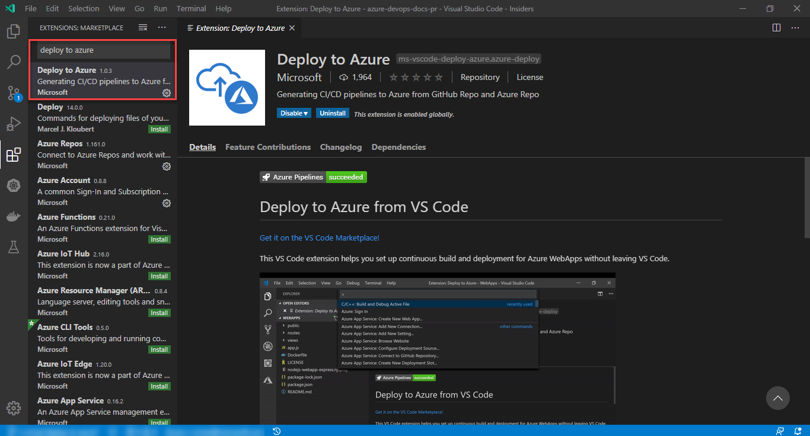

1. After the installation is complete, the extension will be located in enabled extension space.

    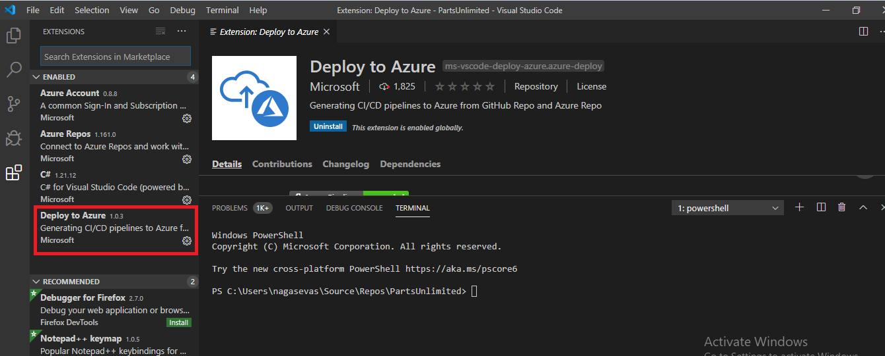

## Setup CI/CD Pipeline

Now you can deploy to Azure App Services, Azure Function App and AKS using VS code. This VS Code extension helps you set up continuous build and deployment for Azure App Services without leaving VS Code.

To use this service, you need to install the extension on VS Code. You can browse and install extensions from within VS Code. 

### Combination of workflows

We support GitHub Actions and Azure Pipelines for GitHub & Azure Repos correspondingly. We also allow you to create Azure Pipelines if you still manage the code in GitHub.

### GitHub + GitHub Actions

1. To set up a pipeline, choose `Deploy to Azure: Configure CI/CD Pipeline` from the command palette (Ctrl/Cmd + Shift + P) or right-click on the file explorer.

    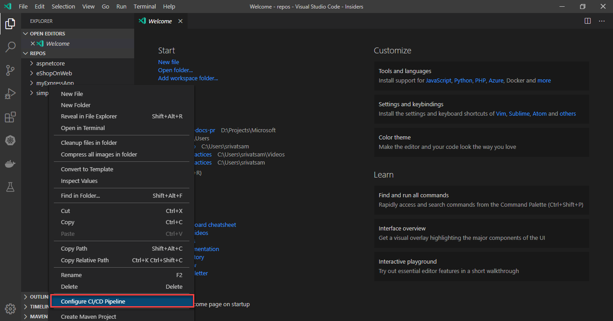

    > [!NOTE]
    > If the code is not opened in the workspace, it will ask for folder location. Similarly, if the code in the workspace has more than one folder, it will ask for folder.

1. Select a pipeline template you want to create from the list. Since we're targeting `Node.js`, select `Node.js with npm to App Service.`

    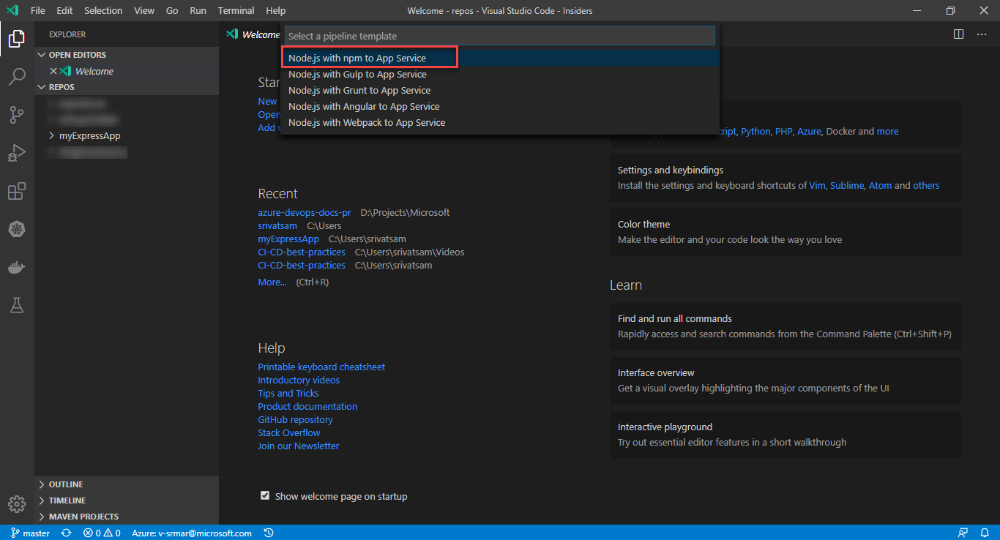

1. Select the target Azure Subscription to deploy your application.

    

1. Select the target Azure resource to deploy your application.

    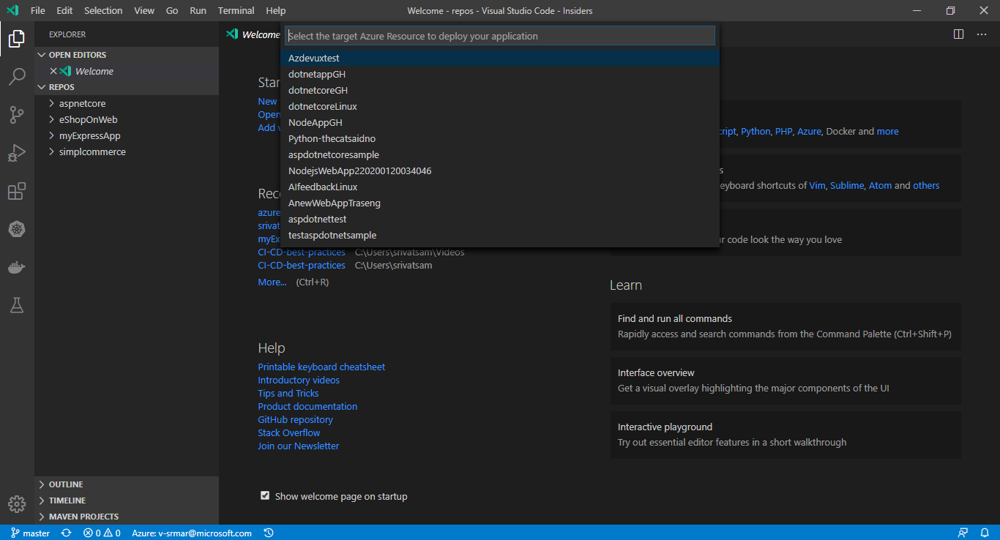

1. Enter GitHub personal access token (PAT), required to populate secrets that are used in GitHub workflows. Set the scope to `repo` and `admin:repo_hook`.

    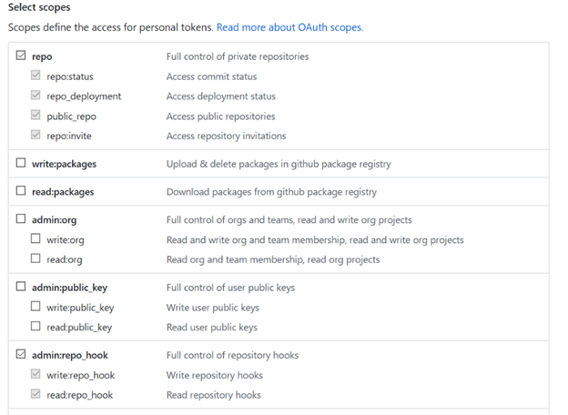

    > [!TIP]
    >If the code is in Azure Repos, you need different permissions.

1. The configuration of GitHub workflow or Azure Pipeline happens based on the extension setting. The guided workflow will generate a starter YAML file defining the build and deploy process. **Commit & push** the YAML file to proceed with the deployment.

    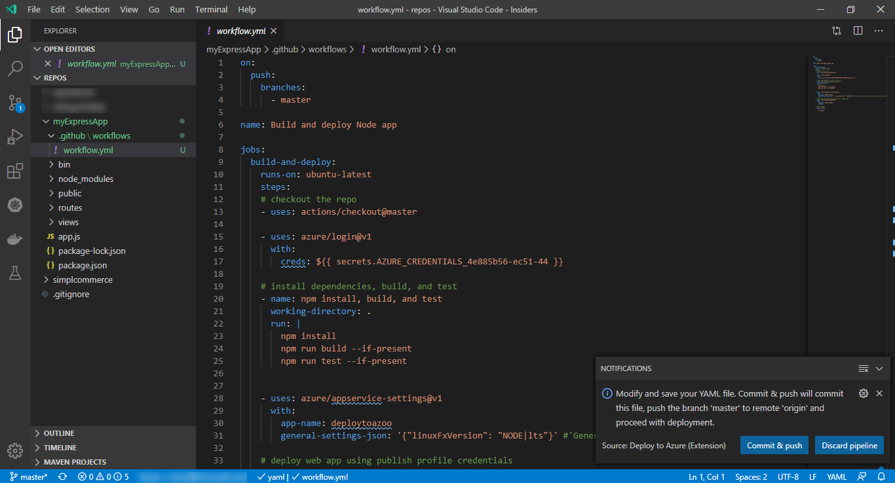

    > [!TIP]
    > You can customize the pipeline using all the features offered by [Azure Pipelines](https://azure.microsoft.com/services/devops/pipelines/) and [GitHub Actions](https://github.com/features/actions/).

1. Navigate to your GitHub repo to see the actions in progress.

    

1. Navigate to your site running in Azure using the Web App URL `http://{web_app_name}.azurewebsites.net`, and verify its contents.

### GitHub + Azure Pipelines

> [!IMPORTANT]
> To setup CI/CD in Azure Pipelines for Github Repository, you need to enable `Use Azure Pipelines for GitHub` in the extension.

To open your user and workspace settings, use the following VS Code menu command:

- On Windows/Linux - **File > Preferences > Settings**
- On macOS - **Code > Preferences > Settings**

You can also open the Settings editor from the Command Palette (`Ctrl+Shift+P`) with Preferences: Open Settings or use the keyboard shortcut (`Ctrl+,`).

When you open the settings editor, you can search and discover settings you are looking for. Search for the name `deployToAzure.UseAzurePipelinesForGithub` and enable as shown below.


1. To set up a pipeline, choose `Deploy to Azure: Configure CI/CD Pipeline` from the command palette (Ctrl/Cmd + Shift + P) or right-click on the file explorer.

    

    > [!NOTE]
    > If the code is not opened in the workspace, it will ask for folder location. Similarly, if the code in the workspace has more than one folder, it will ask for folder.

1. Select a pipeline template you want to create from the list. Since we're targeting `Node.js`, select `Node.js with npm to App Service.`

    

1. Select the target Azure Subscription to deploy your application.

    

1. Select the target Azure resource to deploy your application.

    

1. Enter GitHub personal access token (PAT), required to populate secrets that are used in GitHub workflows. Set the scope to `repo` and `admin:repo_hook`.

    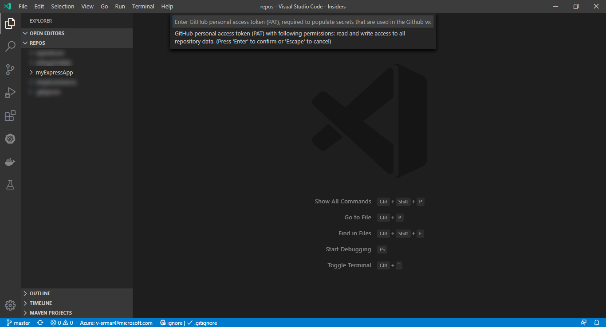

    

1. Select an Azure DevOps organization.

    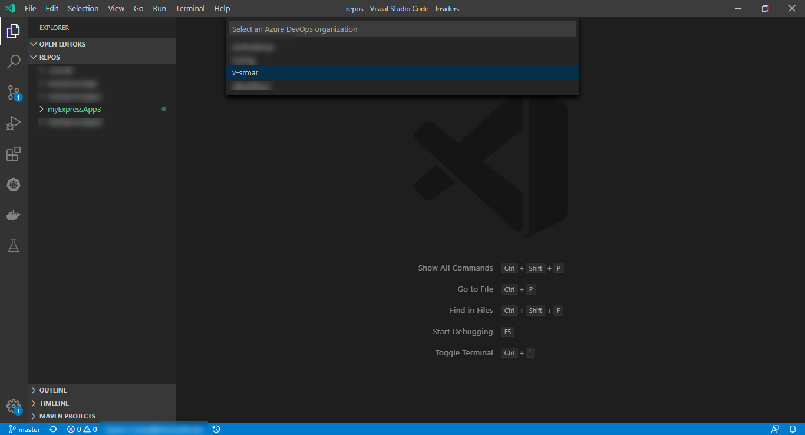

1. Select an Azure DevOps project.

    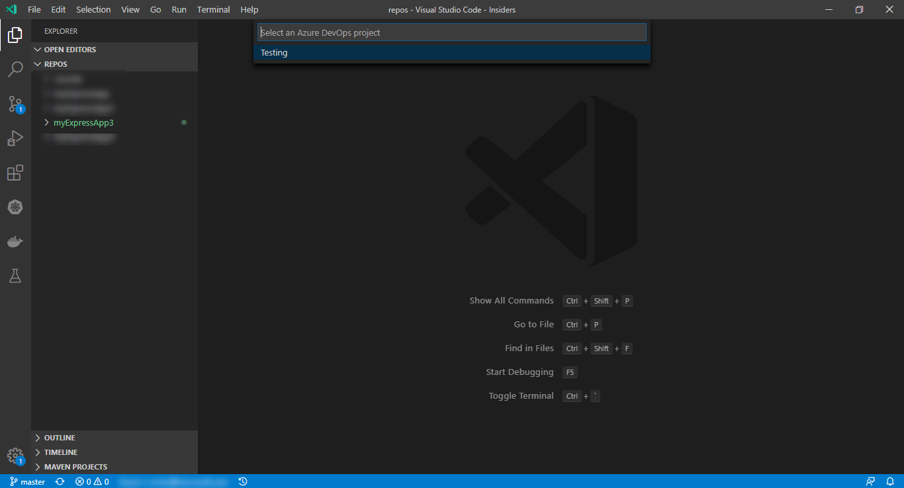

1. The configuration of GitHub workflow or Azure Pipeline happens based on the extension setting. The guided workflow will generate a starter YAML file defining the build and deploy process. **Commit & push** the YAML file to proceed with the deployment.

    

    > [!TIP]
    > You can customize the pipeline using all the features offered by [Azure Pipelines](https://azure.microsoft.com/services/devops/pipelines/) and [GitHub Actions](https://github.com/features/actions/).

1. Navigate to your Azure DevOps project to see the pipeline in progress.

    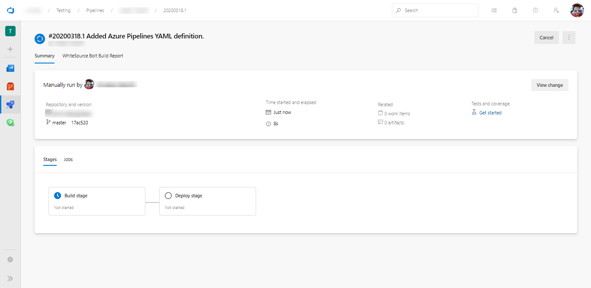

1. Navigate to your site running in Azure using the Web App URL `http://{web_app_name}.azurewebsites.net`, and verify its contents.

### Azure Repos + Azure Pipelines

1. To set up a pipeline, choose `Deploy to Azure: Configure CI/CD Pipeline` from the command palette (Ctrl/Cmd + Shift + P) or right-click on the file explorer.

    

    > [!NOTE]
    > If the code is not opened in the workspace, it will ask for folder location. Similarly, if the code in the workspace has more than one folder, it will ask for folder.

1. Select a pipeline template you want to create from the list. Since we're targeting `Node.js`, select `Node.js with npm to App Service.`

    

1. Select the target Azure Subscription to deploy your application.

    

1. Select the target Azure resource to deploy your application.

    

1. The configuration of GitHub workflow or Azure Pipeline happens based on the extension setting. The guided workflow will generate a starter YAML file defining the build and deploy process. **Commit & push** the YAML file to proceed with the deployment.

    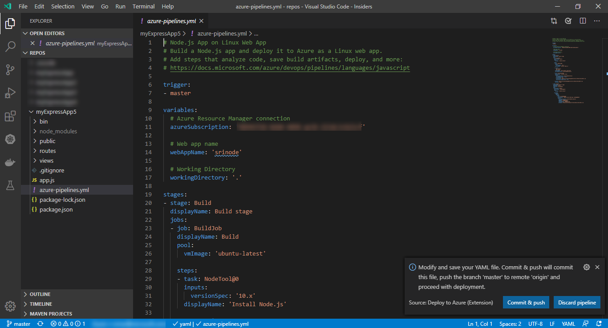

    > [!TIP]
    > You can customize the pipeline using all the features offered by [Azure Pipelines](https://azure.microsoft.com/services/devops/pipelines/) and [GitHub Actions](https://github.com/features/actions/).

1. Navigate to your Azure DevOps project to see the pipeline in progress.

    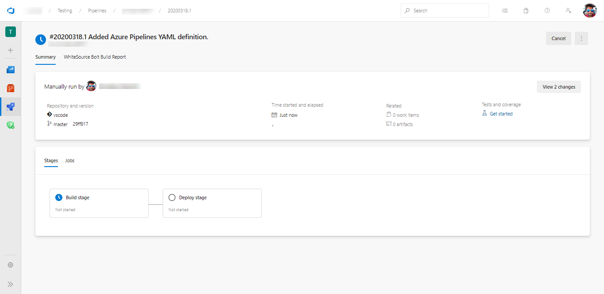

1. Navigate to your site running in Azure using the Web App URL `http://{web_app_name}.azurewebsites.net`, and verify its contents.

## Troubleshoot

Learn how to troubleshoot common issues.

**Issue**: Failed to deploy web package to App Service. Conflict (CODE: 409)

**Resolution**: Restart App Service, and then deploy the package to App Service again.
    
## Next steps

Try the workflow with a Docker file in a repo.

[!INCLUDE [rm-help-support-shared](../includes/rm-help-support-shared.md)]

