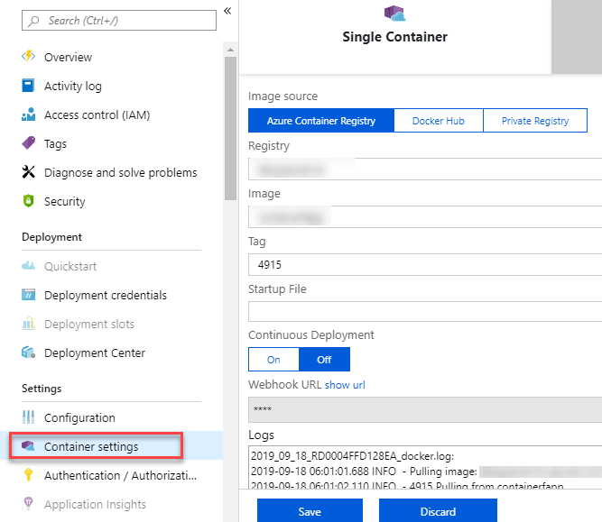

# Deploy a Function App Container

You can automatically deploy an Azure Functions function app using a custom container after every successful build.

Azure Functions is a serverless solution that allows you to write less code, maintain less infrastructure, and save on costs. You can use Azure Pipelines to deploy to Azure Functions and quickly get your code up-and-running.  

## Prerequisites

[!INCLUDE [include](../includes/prerequisites.md)]

Deploying your function code in a custom Linux container requires [Premium plan](https://docs.microsoft.com/en-us/azure/azure-functions/functions-premium-plan) or a [Dedicated (App Service) plan hosting](https://docs.microsoft.com/en-us/azure/azure-functions/dedicated-plan).

## Create your Function App for Containers

If you already have an app in GitHub that you want to deploy, you can try creating a pipeline for that code.

To use sample code instead, fork this GitHub repo:

```
    https://github.com/azooinmyluggage/GHFunctionAppContainer
```

## Build your app

#### [YAML](#tab/yaml/)

::: moniker range="azure-devops"

Follow the [Build, test, and push Docker container apps](../ecosystems/containers/build-image.md) to set up the build pipeline. When you're done, you'll have a YAML pipeline to build, test, and push the image to container registry.

::: moniker-end

::: moniker range="azure-devops-2019"

We aren't yet advising new users to use YAML pipelines to deploy from Azure DevOps Server 2019.
If you're an experienced pipeline user and already have a YAML pipeline to build your .NET Core app, then you might find the examples below useful.

::: moniker-end

::: moniker range="< azure-devops-2019"

YAML pipelines aren't available on TFS.

::: moniker-end

#### [Classic](#tab/classic/)

::: moniker range="< azure-devops"

> [!TIP] 
> If you're new to Azure DevOps Server or TFS, then see [Create your first pipeline](../create-first-pipeline.md) before you start.

::: moniker-end

To get started: 

1. Fork this repo in GitHub, or import it into Azure Repos:

   ```
   https://github.com/azooinmyluggage/GHFunctionAppContainer
   ```

2. Create a pipeline and select the **Docker** template. This selection automatically adds the tasks required to build the code in the sample repository.

3. Save the pipeline and queue a build to see it in action.

4. Create a release pipeline and select the **Deploy a function app to Azure Functions** template for your stage. This automatically adds the necessary tasks.

5. Link the build pipeline to this release pipeline as an artifact. Save the release pipeline and create a release to see it in action.

* * *

Now that the build pipeline is in place, you will learn a few more common configurations to customize the deployment of the Azure Function App Container.

<a name="endpoint"></a>

## Add a service connection

The **[Azure Function App on Container Deploy](https://github.com/microsoft/azure-pipelines-tasks/blob/master/Tasks/AzureFunctionAppContainerV1/README.md)** task, similar to other built-in Azure tasks, requires an Azure service connection as an
input. The Azure service connection stores the credentials to connect from Azure Pipelines or Azure DevOps Server to Azure.

#### [YAML](#tab/yaml/)

::: moniker range=">= azure-devops-2019"

You must supply an Azure service connection to the `AzureFunctionAppContainer` task. Add the following YAML snippet to your existing **azure-pipelines.yaml** file. Make sure you add the service connection details in the variables section as shown below.

```yaml
variables: 
  ## Add this under variables section in the pipeline
  azureSubscription: <Name of the Azure subscription>
  appName: <Name of the function App>
  containerRegistry: <Name of the Azure container registry>
```    

::: moniker-end

::: moniker range="< azure-devops-2019"

YAML pipelines aren't available on TFS.

::: moniker-end

#### [Classic](#tab/classic/)

::: moniker range="azure-devops"

The easiest way to get started with this task is to be signed in as a user who owns both the Azure DevOps Services organization and the Azure subscription.
In this case, you won't have to manually create the service connection.
Otherwise, to learn how to create an Azure service connection, see [Create an Azure service connection](../library/connect-to-azure.md).

::: moniker-end

::: moniker range="< azure-devops"

To learn how to create an Azure service connection, see [Create an Azure service connection](../library/connect-to-azure.md).

::: moniker-end

* * *

## Configure registry credentials in Function App

App Service needs information about your registry and image to pull the private image. In the [Azure portal](https://portal.azure.com), go to your **Function App --> Platform features --> All settings**. Select **Container settings** from the app service and update the **Image source, Registry** and save.



## Deploy with the Azure Function App for Container task

#### [YAML](#tab/yaml/)

::: moniker range=">= azure-devops-2019"

The simplest way to deploy to an Azure Function App Container is to use the **[Azure Function App on Container Deploy](https://github.com/microsoft/azure-pipelines-tasks/blob/master/Tasks/AzureFunctionAppContainerV1/README.md)** task.

To deploy to an Azure Function App container, add the following snippet at the end of your **azure-pipelines.yml** file:

```yaml
trigger:
- main

variables:
  # Container registry service connection established during pipeline creation
  dockerRegistryServiceConnection: <Docker registry service connection>
  imageRepository: <Name of your image repository>
  containerRegistry: <Name of the Azure container registry>
  dockerfilePath: '$(Build.SourcesDirectory)/Dockerfile'
  tag: '$(Build.BuildId)'
  
  # Agent VM image name
  vmImageName: 'ubuntu-latest'

- task: AzureFunctionAppContainer@1 # Add this at the end of your file
  inputs:
    azureSubscription: '<Azure service connection>'
    appName: '<Name of the function app>'
    imageName: $(containerRegistry)/$(imageRepository):$(tag)
```

The snippet assumes that the build steps in your YAML file build and push the docker image to your Azure container registry. The **Azure Function App on Container Deploy** task will pull the appropriate docker image corresponding to the BuildId from the repository specified, and then deploys the image to the Azure Function App Container.

::: moniker-end

::: moniker range="< azure-devops-2019"

YAML pipelines aren't available on TFS.

::: moniker-end

#### [Classic](#tab/classic/)

The simplest way to deploy to an Azure Function App Container is to use the **Azure Function App on Container Deploy** task.
This task is added to the release pipeline when you select the deployment task for Azure Function App on Container deployment.
Templates exist for apps developed in various programming languages. If you can't find a template for your language, select the generic **Azure App Service Deployment** template.

* * *

## Deploy to a slot

#### [YAML](#tab/yaml/)

::: moniker range=">= azure-devops"

You can configure the Azure Function App container to have multiple slots. Slots allow you to safely deploy your app and test it before making it available to your customers.

The following YAML snippet shows how to deploy to a staging slot, and then swap to a production slot:

```yaml
- task: AzureFunctionAppContainer@1
  inputs:
    azureSubscription: <Azure service connection>
    appName: <Name of the function app>
    imageName: $(containerRegistry)/$(imageRepository):$(tag)
    deployToSlotOrASE: true
    resourceGroupName: <Name of the resource group>
    slotName: staging

- task: AzureAppServiceManage@0
  inputs:
    azureSubscription: <Azure service connection>
    WebAppName: <name of the function app>
    ResourceGroupName: <name of resource group>
    SourceSlot: staging
    SwapWithProduction: true
```

::: moniker-end

::: moniker range="< azure-devops-2019"

YAML pipelines aren't available on TFS.

::: moniker-end

#### [Classic](#tab/classic/)

You can configure the Azure Function App for container to have multiple slots. Slots allow you to safely deploy your app and test it before making it available to your customers.
Use the option **Deploy to Slot** in the **Azure Function App Container** task to specify the slot to deploy to. You can swap the slots by using the **Azure App Service Manage** task.

* * *
