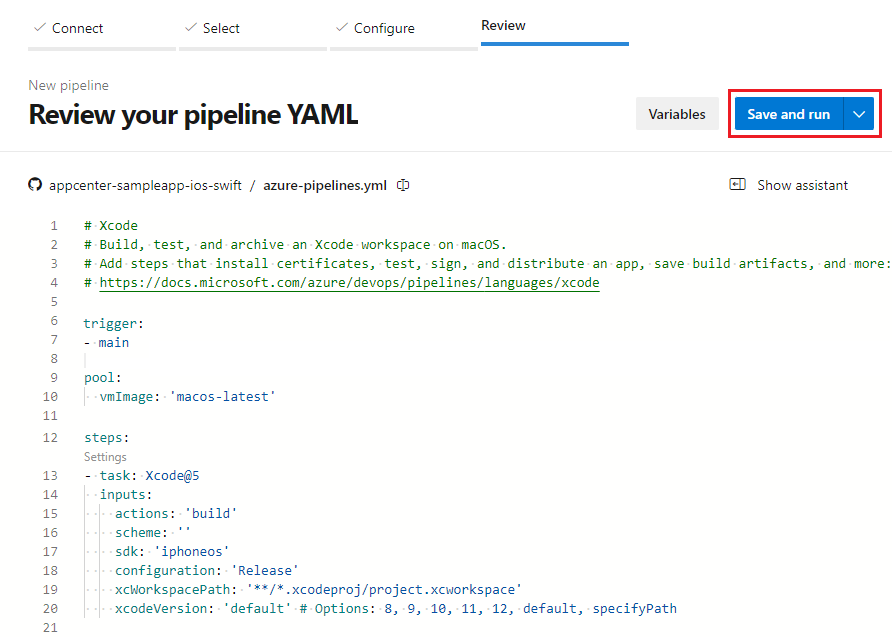

# Deploy an Azure Web App (Linux)

[!INCLUDE [version-Azure DevOps Services-rtm](../includes/version-tfs-2017-rtm.md)]

[!INCLUDE [temp](../includes/concept-rename-note.md)]

You can use Azure Pipelines to continuously deploy your web app to [Azure App Service](/azure/app-service/overview) on every successful build. This article focuses on deploying a Linux web app. 

Azure App Service is a managed environment for hosting web applications, REST APIs, and mobile back ends. You can develop in your favorite languages, including .NET, Python, and JavaScript. 

To learn how to deploy to an Azure Web App for Linux Containers, see [Deploy an Azure Web App Container](webapp-on-container-linux.md). To learn how to deploy to a Windows environment, see[ Deploy an Azure Web App for Windows](webapp.md).

You'll use the [Azure Web App task](../tasks/deploy/azure-rm-web-app.md) to deploy to Azure App Service in your pipeline. 


## Get the code

Get started with a sample project. Based on your desired runtime, fork the code in .NET Core, Java, Node.js.

#### [.NET Core](#tab/dotnet-core/)

If you already have an app in GitHub that you want to deploy, you can try creating a pipeline for that code.

However, if you are a new user, then you might get a better start by using our sample code. In that case, fork this repo in GitHub:

```
    https://github.com/MicrosoftDocs/pipelines-dotnet-core
```

#### [Java](#tab/java)

If you already have an app in GitHub that you want to deploy, you can try creating a pipeline for that code.

However, if you are a new user, then you might get a better start by using our sample code. In that case, fork this repo in GitHub:

```
    https://github.com/MicrosoftDocs/pipelines-java
```

#### [Nodejs](#tab/nodejs)

If you already have an app in GitHub that you want to deploy, you can try creating a pipeline for that code.

However, if you are a new user, then you might get a better start by using our sample code. In that case, fork this repo in GitHub:

```
    https://github.com/MicrosoftDocs/pipelines-javascript
```

* * *


## Create your pipeline

::: moniker range=">= azure-devops-2019"

#### [YAML](#tab/yaml/)

### Sign in to Azure Pipelines

[!INCLUDE [include](../ecosystems/includes/sign-in-azure-pipelines.md)]

[!INCLUDE [include](../ecosystems/includes/create-project.md)]


### Build the pipeline

[!INCLUDE [include](../ecosystems/includes/create-pipeline-before-template-selected.md)]

> When the **Configure** tab appears, select **ASP.NET Core**, **Maven package Java project Web App to Linux on Azure**, or **Node.js**.

1. When your new pipeline appears, take a look at the YAML to see what it does. When you're ready, select **Save and run**.

   > [!div class="mx-imgBorder"] 
   > 

2. You're prompted to commit a new _azure-pipelines.yml_ file to your repository. After you're happy with the message, select **Save and run** again.

   You now have a working YAML pipeline (`azure-pipelines.yml`) in your repository that's ready for you to customize!

3. When you're ready to make changes to your pipeline, select it in the **Pipelines** page, and then **Edit** the `azure-pipelines.yml` file.

4. See the sections below to learn some of the more common ways to customize your pipeline.

::: moniker-end

::: moniker range="= azure-devops-2019"

We advise new users to use Classic Editor and not use YAML pipelines to deploy from Azure DevOps Services.
If you're an experienced pipeline user and already have a YAML pipeline to build your .NET Core app, then you might find the examples below useful.

::: moniker-end

::: moniker range="< azure-devops-2019"

YAML pipelines aren't available on TFS.

::: moniker-end

#### [Classic](#tab/classic/)

::: moniker range="< azure-devops"

> [!TIP] 
> If you're new to Azure DevOps Server or TFS, then see [Create your first pipeline](../create-first-pipeline.md) before you start.

::: moniker-end

To get started: 

1. Fork this repo in GitHub, or import it into Azure Repos:

   ```
   https://github.com/MicrosoftDocs/pipelines-dotnet-core
   ```

1. Create a pipeline and select the **ASP.NET Core** template. This selection automatically adds the tasks required to build the code in the sample repository.

1. Save the pipeline and queue a build to see it in action.

1. Create a release pipeline and select the **Empty job** for your stage.Search for the **AzureWebAppDeploy** task and configure accordingly. 

1. Link the build pipeline as an artifact for this release pipeline. Save the release pipeline and create a release to see it in action.

* * *

Now you're ready to read through the rest of this topic to learn some of the more common configurations to customize the deployment of an Azure Web App.

<a name="endpoint"></a>

## Azure service connection

The [Azure Web App task](../tasks/deploy//azure-rm-web-app.md), similar to other built-in Azure tasks, requires an Azure service connection as an
input. The Azure service connection stores the credentials to connect from Azure Pipelines or Azure DevOps Server to Azure.

#### [YAML](#tab/yaml/)

::: moniker range=">= azure-devops-2019"

You must supply an Azure service connection to the `AzureWebApp` task. Add the following YAML snippet to your existing **azure-pipelines.yaml** file. Make sure you add the service connection details in the variables section as shown below.

```yaml
variables: 
  ## Add this under variables section in the pipeline
  azureSubscription: <Name of the Azure subscription>
  appName: <Name of the Web App>

## Add the below snippet at the end of your pipeline
- task: AzureWebApp@1
  displayName: 'Azure Web App Deploy'
  inputs:
    azureSubscription: $(azureSubscription)
    appType: webAppLinux
    appName: $(appName)
    package: $(System.ArtifactsDirectory)/**/*.zip
```    

::: moniker-end

::: moniker range="< azure-devops-2019"

YAML pipelines aren't available on TFS.

::: moniker-end

#### [Classic](#tab/classic/)

::: moniker range="azure-devops"

The easiest way to get started with this task is to be signed in as a user who owns both the Azure DevOps Services organization and the Azure subscription.
In this case, you won't have to manually create the service connection.
Otherwise, to learn how to create an Azure service connection, see [Create an Azure service connection](../library/connect-to-azure.md).

::: moniker-end

::: moniker range="< azure-devops"

To learn how to create an Azure service connection, see [Create an Azure service connection](../library/connect-to-azure.md).

::: moniker-end

* * *

## Deploy with Azure Web App

#### [YAML](#tab/yaml/)

::: moniker range=">= azure-devops-2019"

The simplest way to deploy to an Azure Web App is to use the [**Azure Web App**](https://github.com/Microsoft/azure-pipelines-tasks/blob/master/Tasks/AzureWebAppV1/README.md) task.

To deploy to an Azure Web App, add the following snippet at the end of your **azure-pipelines.yml** file:

```yaml
trigger:
- main

variables:
  # Azure service connection established during pipeline creation
  azureSubscription: <Name of your Azure subscription>
  appName: <Name of the web app>
  # Agent VM image name
  vmImageName: 'ubuntu-latest'

- task: AzureWebApp@1 # Add this at the end of your file
  inputs:
    azureSubscription: <Azure service connection>
    appType: webAppLinux
    appName: $(appName)
    package: $(System.ArtifactsDirectory)/**/*.zip
```

The snippet assumes that the build steps in your YAML file build and publishes the source as an artifact. The **Azure Web App Deploy** task will pull the artifact corresponding to the BuildId from the **Source type** specified, and then deploys the artifact to the Linux App Service.

::: moniker-end

::: moniker range="< azure-devops-2019"

YAML pipelines aren't available on TFS.

::: moniker-end

#### [Classic](#tab/classic/)

The simplest way to deploy to an Azure Web App on Linux is to use the **Azure Web App Deploy** task.
This task is added to the release pipeline when you select the deployment task for Azure Web App deployment.
Templates exist for apps developed in various programming languages. If you can't find a template for your language, select the generic **Azure App Service Deployment** template.

When you link the artifact in your release pipeline to a build that compiles and publishes the web package,
it's automatically downloaded and placed into the `$(System.ArtifactsDirectory)` folder on the agent as part of the release.
This is where the task picks up the web package for deployment.

* * *

## Deploy to a slot

#### [YAML](#tab/yaml/)

::: moniker range=">= azure-devops"

You can configure the Azure Web App to have multiple slots. Slots allow you to safely deploy your app and test it before making it available to your customers.

The following YAML snippet shows how to deploy to a staging slot, and then swap to a production slot:

```yaml
- task: AzureWebApp@1
  inputs:
    azureSubscription: '<Azure service connection>'
    appType: webAppLinux
    appName: '<name of web app>'
    deployToSlotOrASE: true
    resourceGroupName: '<name of resource group>'
    slotName: staging

- task: AzureAppServiceManage@0
  inputs:
    azureSubscription: '<Azure service connection>'
    appType: webAppLinux
    WebAppName: '<name of web app>'
    ResourceGroupName: '<name of resource group>'
    SourceSlot: staging
    SwapWithProduction: true
```

::: moniker-end

::: moniker range="< azure-devops-2019"

YAML pipelines aren't available on TFS.

::: moniker-end

#### [Classic](#tab/classic/)

You can configure the Azure Web App on Linux to have multiple slots. Slots allow you to safely deploy your app and test it before making it available to your customers.
Use the option **Deploy to Slot** in the **Azure Web App** task to specify the slot to deploy to. You can swap the slots by using the **Azure App Service Manage** task.

* * *

