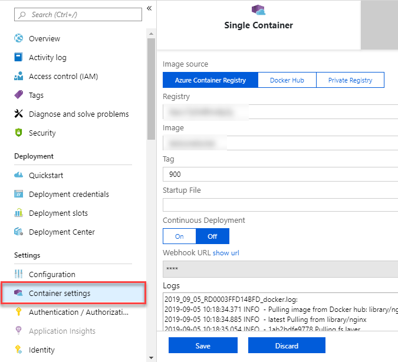

# Deploy an Azure Web App Container

You can automatically deploy your web app to an [Azure Web App for Linux Containers](https://docs.microsoft.com/en-gb/azure/app-service/containers/quickstart-docker-go) after every successful build.

## Before you begin

Based on the desired runtime, [import](../../repos/git/import-git-repository.md) (into Azure DevOps) or fork (into GitHub) the following repository.

#### [.NET Core](#tab/dotnet-core/)

If you already have an app in GitHub that you want to deploy, you can try creating a pipeline for that code.

However, if you are a new user, then you might get a better start by using our sample code. In that case, fork this repo in GitHub:

```
    https://github.com/MicrosoftDocs/pipelines-dotnet-core-docker
```

#### [Java](#tab/java)

If you already have an app in GitHub that you want to deploy, you can try creating a pipeline for that code.

However, if you are a new user, then you might get a better start by using our sample code. In that case, fork this repo in GitHub:

```
    https://github.com/spring-guides/gs-spring-boot-docker.git
```

#### [Nodejs](#tab/nodejs)

If you already have an app in GitHub that you want to deploy, you can try creating a pipeline for that code.

However, if you are a new user, then you might get a better start by using our sample code. In that case, fork this repo in GitHub:

```
    https://github.com/MicrosoftDocs/pipelines-javascript-docker
```

* * *

## Build your app

#### [YAML](#tab/yaml/)
::: moniker range="azure-devops"

#### [.NET Core](#tab/dotnet-core/)

Follow the [Build, test, and push Docker container apps](../languages/docker.md) till **push an image** section to set up the build pipeline. When you're done, you'll have a YAML pipeline to build, test, and push the image to container registry.

#### [Java](#tab/java)

Set up a CI pipeline for [building an image](https://docs.microsoft.com/en-us/azure/devops/pipelines/ecosystems/containers/build-image?view=azure-devops) and [pushing it to a container registry](https://docs.microsoft.com/en-us/azure/devops/pipelines/ecosystems/containers/push-image?view=azure-devops).

#### [Nodejs](#tab/nodejs)

Set up a CI pipeline for [building an image](https://docs.microsoft.com/en-us/azure/devops/pipelines/ecosystems/containers/build-image?view=azure-devops) and [pushing it to a container registry](https://docs.microsoft.com/en-us/azure/devops/pipelines/ecosystems/containers/push-image?view=azure-devops).

::: moniker-end

::: moniker range="azure-devops-2019"

We aren't yet advising new users to use YAML pipelines to deploy from Azure DevOps Server 2019.
If you're an experienced pipeline user and already have a YAML pipeline to build your .NET Core app, then you might find the examples below useful.

::: moniker-end

::: moniker range="< azure-devops-2019"

YAML pipelines aren't available on TFS.

::: moniker-end

#### [Classic](#tab/classic/)
::: moniker range="< azure-devops"

> [!TIP] 
> If you're new to Azure DevOps Server or TFS, then see [Create your first pipeline](../create-first-pipeline.md) before you start.

::: moniker-end

To get started: 

1. Fork this repo in GitHub, or import it into Azure Repos:

   ```
   https://github.com/Microsoft/devops-project-samples/tree/master/dotnet/aspnetcore/container/Application
   ```
2. Create a pipeline and select the **Docker** template. This selection automatically adds the tasks required to build the code in the sample repository.

3. Save the pipeline and queue a build to see it in action.

4. Create a release pipeline and select the **Empty job** for your stage. Search for the **AzureWebAppContainer** task and configure accordingly.

5. Link the build pipeline to this release pipeline as an artifact. Save the release pipeline and create a release to see it in action.

* * *

Now that the build pipeline is in place, you will learn a few more common configurations to customize the deployment of the Azure Container Web App.

<a name="endpoint"></a>

## Azure service connection

The **Azure WebApp Container** task similar to other built-in Azure tasks, requires an Azure service connection as an
input. The Azure service connection stores the credentials to connect from Azure Pipelines or Azure DevOps Server to Azure.

#### [YAML](#tab/yaml/)
::: moniker range=">= azure-devops-2019"

You must supply an Azure service connection to the `AzureWebAppContainer` task. Add the following YAML snippet to your existing **azure-pipelines.yaml** file. Make sure you add the service connection details in the variables section as shown below-

```yaml
variables: 
    ## Add this under variables section in the pipeline
    azureSubscription: <Name of the Azure subscription>
    appName: <Name of the Web App>
    containerRegistry: <Name of the Azure container registry>

## Add the below snippet at the end of your pipeline
- task: AzureWebAppContainer@1
  displayName: 'Azure Web App on Container Deploy'
  inputs:
    azureSubscription: $(azureSubscription)
    appName: $(appName)
    containers: $(containerRegistry)/$(imageRepository):$(tag)
```    

::: moniker-end

::: moniker range="< azure-devops-2019"

YAML pipelines aren't available on TFS.

::: moniker-end

#### [Classic](#tab/classic/)
::: moniker range="azure-devops"

The easiest way to get started with this task is to be signed in as a user who owns both the Azure DevOps Services organization and the Azure subscription.
In this case, you won't have to manually create the service connection.
Otherwise, to learn how to create an Azure service connection, see [Create an Azure service connection](../library/connect-to-azure.md).

::: moniker-end

::: moniker range="< azure-devops"

To learn how to create an Azure service connection, see [Create an Azure service connection](../library/connect-to-azure.md).

::: moniker-end

* * *

## Configure registry credentials in web app

App Service needs information about your registry and image to pull the private image. In the [Azure portal](https://portal.azure.com), go to **Container settings** from the web app and update the **Image source, Registry** and save.



## Deploy with Azure Web App for Container

#### [YAML](#tab/yaml/)
::: moniker range=">= azure-devops-2019"

The simplest way to deploy to an Azure Web App Container is to use the **[Azure Web App for Containers](https://github.com/microsoft/azure-pipelines-tasks/tree/master/Tasks/AzureWebAppContainerV1)** task.

To deploy to an Azure Web App container, add the following snippet at the end of your **azure-pipelines.yml** file:

```yaml
trigger:
- master

variables:
  # Container registry service connection established during pipeline creation
  dockerRegistryServiceConnection: <Docker registry service connection>
  imageRepository: <Name of your image repository>
  containerRegistry: <Name of the Azure container registry>
  dockerfilePath: '$(Build.SourcesDirectory)/Dockerfile'
  tag: '$(Build.BuildId)'
  
  # Agent VM image name
  vmImageName: 'ubuntu-latest'

- task: AzureWebAppContainer@1 # Add this at the end of your file
  inputs:
    azureSubscription: '<Azure service connection>'
    appName: '<Name of the container web app>'
    containers: $(containerRegistry)/$(imageRepository):$(tag)
```

The snippet assumes that the build steps in your YAML file build and push the docker image to your Azure container registry. The **Azure Web App on Container** task will pull the appropriate docker image corresponding to the BuildId from the repository specified, and then deploys the image to the Linux App Service.

::: moniker range="< azure-devops-2019"

YAML pipelines aren't available on TFS.

::: moniker-end

#### [Classic](#tab/classic/)
The simplest way to deploy to an Azure Web App Container is to use the **Azure Web App On Container Deploy** task.
This task is added to the release pipeline when you select the deployment task for Azure Web App on Container deployment.
Templates exist for apps developed in various programming languages. If you can't find a template for your language, select the generic **Azure App Service Deployment** template.

* * *

## Deploy to a slot

#### [YAML](#tab/yaml/)
::: moniker range=">= azure-devops"

You can configure the Azure Web App container to have multiple slots. Slots allow you to safely deploy your app and test it before making it available to your customers.

The following YAML snippet shows how to deploy to a staging slot, and then swap to a production slot:

```yaml
- task: AzureWebAppContainer@1
  inputs:
    azureSubscription: '<Azure service connection>'
    appName: '<Name of the web app>'
    containers: $(containerRegistry)/$(imageRepository):$(tag)
    deployToSlotOrASE: true
    resourceGroupName: '<Name of the resource group>'
    slotName: staging

- task: AzureAppServiceManage@0
  inputs:
    azureSubscription: '<Azure service connection>'
    WebAppName: '<name of web app>'
    ResourceGroupName: '<name of resource group>'
    SourceSlot: staging
    SwapWithProduction: true
```
::: moniker-end

::: moniker range="< azure-devops-2019"

YAML pipelines aren't available on TFS.

::: moniker-end

#### [Classic](#tab/classic/)

You can configure the Azure Web App for container to have multiple slots. Slots allow you to safely deploy your app and test it before making it available to your customers.
Use the option **Deploy to Slot** in the **Azure Web App Container** task to specify the slot to deploy to. You can swap the slots by using the **Azure App Service Manage** task.

* * *