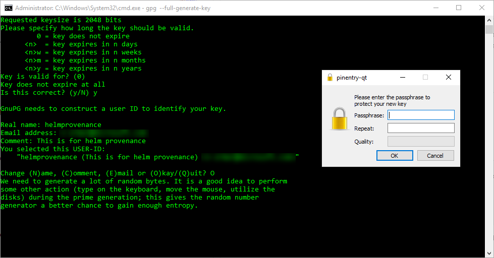
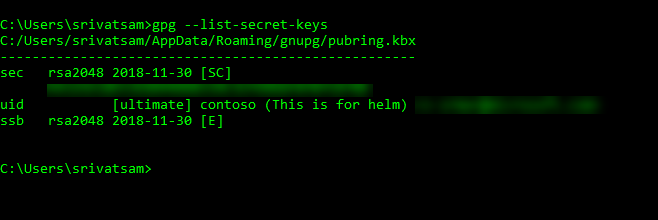
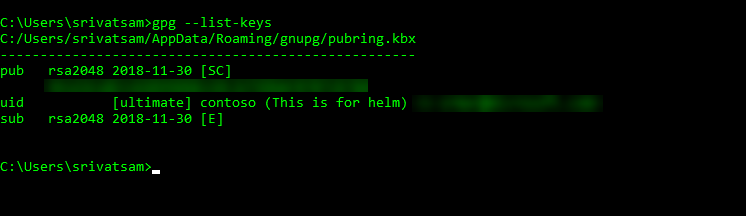

# Package and Deploy Helm Charts task

**Azure Pipelines**

Use this task to deploy, configure, or update a Kubernetes cluster in Azure Container Service by running Helm commands.
Helm is a tool that streamlines deploying and managing Kubernetes apps using a packaging format called
charts.

You can define, version, share, install, and upgrade even the most complex Kubernetes app by using Helm. 

* Helm helps you combine multiple Kubernetes manifests (yaml) such as service, deployments, configmaps, and more into a single unit called Helm Charts.
  You don't need to either invent or use a tokenization or a templating tool.
* Helm Charts help you manage application dependencies and deploy as well as rollback as a unit.
  They are also easy to create, version, publish, and share with other partner teams.

Azure Pipelines has built-in support for Helm charts:

* The [Helm Tool installer task](../tool/helm-installer.md) can be used to install the correct version of Helm onto the agents.
* The Helm package and deploy task can be used to package the app and deploy it to a Kubernetes cluster. 
  You can use the task to install or update Tiller to a Kubernetes namespace, to securely connect to Tiller over TLS for deploying charts,
  or to run any Helm command such as **lint**.
* The Helm task supports connecting to an Azure Kubernetes Service by using an Azure service connection.
  You can connect to any Kubernetes cluster by using **kubeconfig** or a service account.
* Helm deployments can be supplemented by using the **Kubectl** task; for example, create/update, imagepullsecret, and others.

::: moniker range="> tfs-2018"

## Service Connection

The task works with two service connection types: **Azure Resource Manager** and **Kubernetes Service Connection**.<br/>

> [!NOTE]
> A service connection isn't required if an environment resource that points to a Kubernetes cluster has already been specified in the pipeline's stage.

### Azure Resource Manager

<table><thead><tr><th>Parameters</th><th>Description</th></tr></thead>
<tr><td><code>connectionType</code><br/>(Service connection type)</td><td>(Required unless an environment resource is already present) <b>Azure Resource Manager</b> to use Azure Kubernetes Service. <b>Kubernetes Service Connection</b> for any other cluster.<br/>Default value: Azure Resource Manager</td></tr>
<tr><td><code>azureSubscriptionEndpoint</code><br/>(Azure subscription)</td><td>(Required) Name of the Azure service connection.</td></tr>
<tr><td><code>azureResourceGroup</code><br/>(Resource group)</td><td>(Required) Name of the resource group within the subscription.</td></tr>
<tr><td><code>kubernetesCluster</code><br/>(Kubernetes cluster)</td><td>(Required) Name of the AKS cluster.</td></tr>
<tr><td><code>namespace</code><br/>(Namespace)</td><td>(Optional) The namespace on which the <strong>kubectl</strong> commands are run. If not specified, the default namespace is used.</td></tr>
</table>

This YAML example YAML shows how Azure Resource Manager is used to refer to the Kubernetes cluster.
This is used with one of the helm [commands](#commands) and the appropriate values required for the command:

```YAML
variables:
  azureSubscriptionEndpoint: Contoso
  azureContainerRegistry: contoso.azurecr.io
  azureResourceGroup: Contoso
  kubernetesCluster: Contoso

- task: HelmDeploy@0
  displayName: Helm deploy
  inputs:
    connectionType: Azure Resource Manager
    azureSubscriptionEndpoint: $(azureSubscriptionEndpoint)
    azureResourceGroup: $(azureResourceGroup)
    kubernetesCluster: $(kubernetesCluster)
```

### Kubernetes Service Connection

<table><thead><tr><th>Parameters</th><th>Description</th></tr></thead>
<tr><td><code>kubernetesServiceEndpoint</code><br/>(Kubernetes service connection)</td><td>(Required unless an environment resource is already present) Select a Kubernetes service connection.</td></tr>
<tr><td><code>namespace</code><br/>(Namespace)</td><td>(Optional) The namespace on which the <strong>kubectl</strong> commands are run. If not specified, the default namespace is used.</td></tr>
</table>

This YAML example YAML shows how Kubernetes service connection is used to refer to the Kubernetes cluster.
This is used with one of the helm [commands](#commands) and the appropriate values required for the command:

```YAML
- task: HelmDeploy@0
  displayName: Helm deploy
  inputs:
    connectionType: Kubernetes Service Connection
    kubernetesServiceEndpoint: Contoso
```

<a name="commands"></a>
## Command values

The command input accepts one of the following [helm commands](https://v2-14-0.helm.sh/docs/helm/): create/delete/expose/get/init/install/login/logout/ls/package/rollback/upgrade.

<table><thead><tr><th>Parameters</th><th>Description</th></tr></thead>
<tr><td><code>command</code><br/>(Command)</td><td>(Required) Select a helm command.<br/>Default value: ls</td></tr>
<tr><td><code>arguments</code><br/>(Arguments)</td><td>Helm command options.</td></tr>
</table>

This YAML example demonstrates the **ls** command:

```YAML
- task: HelmDeploy@0
  displayName: Helm list
  inputs:
    azureSubscriptionEndpoint: $(azureSubscriptionEndpoint)
    azureResourceGroup: $(azureResourceGroup)
    kubernetesCluster: $(kubernetesCluster)
    command: ls
    arguments: --all
```

## init command

<table><thead><tr><th>Parameters</th><th>Description</th></tr></thead>
<tr><td><code>command</code><br/>(Command)</td><td>(Required) Select a helm command.<br/>Default value: ls</td></tr>
<tr><td><code>canaryimage</code><br/>(Use canary image version)</td><td>Use the canary Tiller image, the latest pre-release version of Tiller.<br/>Default value: false</td></tr>
<tr><td><code>upgradetiller</code><br/>(Upgrade Tiller)</td><td>Upgrade if Tiller is already installed.<br/>Default value: true</td></tr>
<tr><td><code>waitForExecution</code><br/>(Wait)</td><td>Block until the command execution completes.<br/>Default value: true</td></tr>
<tr><td><code>arguments</code><br/>(Arguments)</td><td>Helm command options.</td></tr>
</table>

This YAML example demonstrates the **init** command:

```YAML
- task: HelmDeploy@0
  displayName: Helm init
  inputs:
    azureSubscriptionEndpoint: $(azureSubscriptionEndpoint)
    azureResourceGroup: $(azureResourceGroup)
    kubernetesCluster: $(kubernetesCluster)
    command: init
    upgradetiller: true
    waitForExecution: true
    arguments: --client-only
```

## install command

<table><thead><tr><th>Parameters</th><th>Description</th></tr></thead>
<tr><td><code>command</code><br/>(Command)</td><td>(Required) Select a helm command.<br/>Default value: ls</td></tr>
<tr><td><code>chartType</code><br/>(Chart Type)</td><td>(Required) Select how you want to enter chart information. You can provide either the name of the chart or the folder/file path to the chart.<br/>Available options: Name, FilePath. Default value: Name</td></tr>
<tr><td><code>chartName</code><br/>(Chart Name)</td><td>(Required) Chart reference to install, this can be a url or a chart name. For example, if chart name is <b>stable/mysql</b>, the task will run <b>helm install stable/mysql</b></td></tr>
<tr><td><code>releaseName</code><br/>(Release Name)</td><td>(Optional) Release name. If not specified, it will be autogenerated. releaseName input is only valid for 'install' and 'upgrade' commands</td></tr>
<tr><td><code>overrideValues</code><br/>(Set Values)</td><td>(Optional) Set values on the command line. You can specify multiple values by separating values with commas. For example, <b>key1=val1,key2=val2</b>. You can also specify multiple values by delimiting them with newline as so: <br/><b>key1=val1<br/>key2=val2</b><br/>Please note that if you have a value which itself contains newlines, use the <code>valueFile</code> option, else the task will treat the newline as a delimiter. The task will construct the helm command by using these set values. For example, <b>helm install --set key1=val1 ./redis</b></td></tr>
<tr><td><code>valueFile</code><br/>(Value File)</td><td>(Optional) Specify values in a YAML file or a URL. For example, specifying <b>myvalues.yaml</b> will result in <b>helm install --values=myvalues.yaml</b></td></tr>
<tr><td><code>updatedependency</code><br/>(Update Dependency)</td><td>(Optional) Run helm dependency update before installing the chart. Update dependencies from <b>requirements.yaml</b> to the <b>charts/</b> directory before packaging.<br/>Default value: false</td></tr>
<tr><td><code>waitForExecution</code><br/>(Wait)</td><td>(Optional) Block until command execution completes.<br/>Default value: true</td></tr>
<tr><td><code>arguments</code><br/>(Arguments)</td><td>Helm command options</td></tr>
</table>

This YAML example demonstrates the **install** command:

```YAML
- task: HelmDeploy@0
  displayName: Helm install
  inputs:
    azureSubscriptionEndpoint: $(azureSubscriptionEndpoint)
    azureResourceGroup: $(azureResourceGroup)
    kubernetesCluster: $(kubernetesCluster)
    command: install
    chartType: FilePath
    chartPath: Application/charts/sampleapp
```

## package command

<table><thead><tr><th>Parameters</th><th>Description</th></tr></thead>
<tr><td><code>command</code><br/>(Command)</td><td>(Required) Select a helm command.<br/>Default value: ls</td></tr>
<tr><td><code>chartPath</code><br/>(Chart Path)</td><td>(Required) Path to the chart to install. This can be a path to a packaged chart or a path to an unpacked chart directory. For example, if <b>./redis</b> is specified the task will run <b>helm install ./redis</b>. If you are consuming a chart which is published as an artifact then the path will be <b>$(System.DefaultWorkingDirectory)/ARTIFACT-NAME/Charts/CHART-NAME</b></td></tr>
<tr><td><code>version</code><br/>(Version)</td><td>(Optional) Specify the exact chart version to install. If this is not specified, the latest version is installed. Set the version on the chart to this semver version.</td></tr>
<tr><td><code>destination</code><br/>(Destination)</td><td>(Optional) Specify values in a YAML file or a URL.<br/>Default value: $(Build.ArtifactStagingDirectory)</td></tr>
<tr><td><code>updatedependency</code><br/>(Update Dependency)</td><td>(Optional) Run helm dependency update before installing the chart. Update dependencies from <b>requirements.yaml</b> to the <b>charts/</b> directory before packaging.<br/>Default value: false</td></tr>
<tr><td><code>save</code><br/>(Save)</td><td>(Optional) Save packaged chart to local chart repository.<br/>Default value: true</td></tr>
<tr><td><code>arguments</code><br/>(Arguments)</td><td>Helm command options.</td></tr>
</table>

This YAML example demonstrates the **package** command:

```YAML
- task: HelmDeploy@0
  displayName: Helm package
  inputs:
    command: package
    chartPath: Application/charts/sampleapp
    destination: $(Build.ArtifactStagingDirectory)
```

## upgrade command

<table><thead><tr><th>Parameters</th><th>Description</th></tr></thead>
<tr><td><code>command</code><br/>(Command)</td><td>(Required) Select a helm command.<br/>Default value: ls</td></tr>
<tr><td><code>chartType</code><br/>(Chart Type)</td><td>(Required) Select how you want to enter chart information. You can provide either the name of the chart or the folder/file path to the chart.<br/>Available options: Name, FilePath. Default value: Name</td></tr>
<tr><td><code>chartName</code><br/>(Chart Name)</td><td>(Required) Chart reference to install, this can be a url or a chart name. For example, if chart name is <b>stable/mysql</b>, the task will run <b>helm install stable/mysql</b></td></tr>
<tr><td><code>releaseName</code><br/>(Release Name)</td><td>(Optional) Release name. If not specified, it will be autogenerated.</td></tr>
<tr><td><code>overrideValues</code><br/>(Set Values)</td><td>(Optional) Set values on the command line. You can specify multiple values by separating values with commas. For example, <b>key1=val1,key2=val2</b>. You can also specify multiple values by delimiting them with newline as so: <br/><b>key1=val1<br/>key2=val2</b><br/>Please note that if you have a value which itself contains newlines, use the <code>valueFile</code> option, else the task will treat the newline as a delimiter. The task will construct the helm command by using these set values. For example, <b>helm install --set key1=val1 ./redis</b></td></tr>
<tr><td><code>valueFile</code><br/>(Value File)</td><td>(Optional) Specify values in a YAML file or a URL. For example, specifying <b>myvalues.yaml</b> will result in <b>helm install --values=myvalues.yaml</b></td></tr>
<tr><td><code>install</code><br/>(Install if release not present)</td><td>(Optional) If a release by this name does not already exist, start an installation.<br/>Default value: true</td></tr>
<tr><td><code>recreate</code><br/>(Recreate Pods)</td><td>(Optional) Performs pods restart for the resource if applicable.<br/>Default value: false</td></tr>
<tr><td><code>resetValues</code><br/>(Reset Values)</td><td>(Optional) Reset the values to the ones built into the chart.<br/>Default value: false</td></tr>
<tr><td><code>force</code><br/>(Force)</td><td>(Optional) Force resource update through delete/recreate if required.<br/>Default value: false</td></tr>
<tr><td><code>waitForExecution</code><br/>(Wait)</td><td>(Optional) Block until command execution completes.<br/>Default value: true​</td></tr>
<tr><td><code>arguments</code><br/>(Arguments)</td><td>Helm command options</td></tr>
</table>

This YAML example demonstrates the **upgrade** command:

```YAML
- task: HelmDeploy@0
  displayName: Helm upgrade
  inputs:
    azureSubscriptionEndpoint: $(azureSubscriptionEndpoint)
    azureResourceGroup: $(azureResourceGroup)
    kubernetesCluster: $(kubernetesCluster)
    command: upgrade
    chartType: filepath
    chartPath: $(Build.ArtifactStagingDirectory)/sampleapp-v0.2.0.tgz
    releaseName: azuredevopsdemo
    install: true
    waitForExecution: false
```

## save command

<table><thead><tr><th>Parameters</th><th>Description</th></tr></thead>
<tr><td><code>command</code><br/>(Command)</td><td>(Required) Select a helm command.<br/>Default value: ls</td></tr>
<tr><td><code>chartNameForACR</code><br/>(Chart Name For Azure Container Registry)</td><td>(Required) Chart name with which the chart will be stored in Azure Container Registry.<br/></td></tr>
<tr><td><code>chartPathForACR</code><br/>(Chart Path for Azure Container Registry)</td><td>(Required) Path to the chart directory.</td></tr>
<tr><td><code>azureSubscriptionEndpointForACR</code><br/>(Azure subscription for Container Registry)</td><td>(Required) Select an Azure subscription, which has your Azure Container Registry.</td></tr>
<tr><td><code>azureResourceGroupForACR</code><br/>(Resource group)</td><td>(Required) Select an Azure Resource Group, which has your Container Registry.</td></tr>
<tr><td><code>azureContainerRegistry</code><br/>(Azure Container Registry)</td><td>(Required) Select an Azure Container Registry which will be used for pushing helm charts.</td></tr>
<tr><td><code>arguments</code><br/>(Arguments)</td><td>Helm command options</td></tr>
</table>

This YAML example demonstrates the **save** command:

```YAML
- task: HelmDeploy@0
  displayName: Helm save
  inputs:
    command: save
    chartNameForACR: mycontainerregistry.azurecr.io/helm/hello-world:v1
    chartPathForACR: Application/charts/sampleapp
    azureSubscriptionEndpointForACR: $(azureSubscriptionEndpointForACR)
    azureResourceGroupForACR: $(azureResourceGroupForACR)
    azureContainerRegistry: $(azureContainerRegistry)
```

::: moniker-end

::: moniker range="azure-devops"

## Package and sign Helm charts

In this section you'll learn how to package and sign Helm charts in a pipeline.

### Generate a private-public key pair to sign the helm chart using GPG

1. Download [GPG](https://www.gnupg.org/download/index.html).

2. Launch the command prompt in an administrator mode. Run the following command to generate a private-public key pair to sign the helm chart using gpg. While creating the key, you'll be prompted for the username and email address. The "name email address" is later used to name the private-public key pair that is created.

   ```cmd
   gpg --full-generate-key
   ```
   
   

3. You'll be prompted for the passphrase. Give the value and click ok.

   

4. After creating the key, you can see the list of keys which contains both private and public using the following command.

   - To see list of private keys

     ```cmd
     gpg --list-secret-keys
     ```

     

   - To see the list of public keys

     ```cmd
     gpg --list-keys
     ```

       

5. Store the private and public keys in 2 different files with the extension **gpg** as shown below.

   * For a private key

   ```cmd
   gpg --export-secret-key 94325E18E53EDD99DD8339C3CFD9DAF0707CB788 contoso@microsoft.com > C:/somepath/privatekeys.gpg
   ```

   You'll see the **privatekeys.gpg** file exported to the path which was mentioned above.

   * For a public key

   ```cmd
   gpg --export-key 94325E18E53EDD99DD8339C3CFD9DAF0707CB788 contoso@microsoft.com > C:/somepath/publickey.gpg
   ```

   You'll see the **publickey.gpg** file exported to the path which was mentioned above.

In Azure DevOps, save the **privatekey.gpg** file in the library **secure files** section.

### Example

```YAML
pool:
  name: Hosted Ubuntu 1604

variables:
  # The below variable should be secure
  HelmKeyPassphrase: contoso@123
  keyName: contoso contoso@microsoft.com
  azureSubscriptionEndpoint: contoso
  azureResourceGroup: contoso
  kubernetesCluster: contoso

steps:
- task: DownloadSecureFile@1
  displayName: Download Secure file
  inputs:
    secureFile: privatekey.gpg
  name: privateKeyRing

- task: HelmInstaller@0
  displayName: Install Helm 2.12.0
  inputs:
    helmVersion: 2.12.0

- task: HelmDeploy@0
  displayName: helm init
  inputs:
    azureSubscriptionEndpoint: $(azureSubscriptionEndpoint)
    azureResourceGroup: $(azureResourceGroup)
    kubernetesCluster: $(kubernetesCluster)
    command: init
    arguments: --client-only

- task: HelmDeploy@0
  displayName: helm package
  inputs:
    azureSubscriptionEndpoint: $(azureSubscriptionEndpoint)
    azureResourceGroup: $(azureResourceGroup)
    kubernetesCluster: $(kubernetesCluster)
    command: package
    chartPath: Application/charts/sampleapp
    arguments: --sign --key "$(keyName)" --keyring $(privateKeyRing.secureFilePath)
  env:
    HelmKeyPassphrase: $(HelmKeyPassphrase)
```

::: moniker-end

## Troubleshooting

### HelmDeploy task throws error 'unknown flag: --wait' while running 'helm init --wait --client-only' on Helm 3.0.2 version.

There are some breaking changes between Helm 2 and Helm 3. One of them includes removal of tiller, and hence `helm init` command is no longer supported. Remove command: init when you use Helm 3.0+ versions.

### When using Helm 3, if System.debug is set to true and Helm upgrade is the command being used, the pipeline fails even though the upgrade was successful.

This is a known issue with Helm 3, as it writes some logs to stderr. Helm Deploy Task is marked as failed if there are logs to stderr or exit code is non-zero. Set the task input failOnStderr: false to ignore the logs printed to stderr.

## Open source

This task is open source [on GitHub](https://github.com/Microsoft/azure-pipelines-tasks). Feedback and contributions are welcome.
